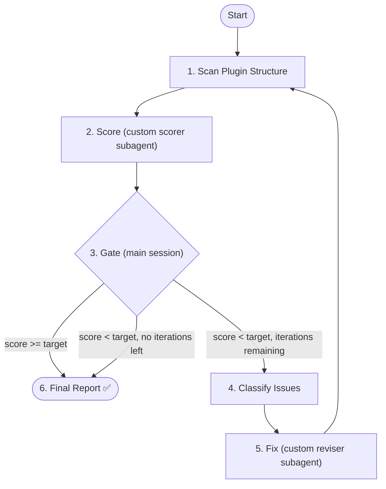

<HARD-RULE>
This skill MUST NOT be auto-triggered by the agent. It is only invoked when the user explicitly requests a plugin audit (e.g., "audit the forge plugin", "run eval-forge", "check forge consistency"). If you are about to invoke this skill without the user explicitly asking, STOP.
</HARD-RULE>

# Eval Forge

Audit the forge plugin's internal consistency — skills, commands, agents, templates, cross-references, and task CLI alignment. Detect issues via 1000-point scoring, auto-fix via dedicated reviser, verify via re-scoring.

## When to Use

**Trigger (explicit user request only):**

- User explicitly asks to "audit forge plugin", "eval forge", "check forge consistency"
- User says "run eval-forge"

**Never auto-trigger:**

- Do not invoke during normal skill development
- Do not invoke as a post-edit check
- Do not invoke proactively

## Parameters

| Parameter      | Default | Description                                                                         |
| -------------- | ------- | ----------------------------------------------------------------------------------- |
| `--target`     | 950     | Target score (0-1000). Loop continues until score >= target or iterations exhausted |
| `--iterations` | 3       | Max audit→fix→verify cycles                                                         |

## Architecture



## Orchestrator Iron Laws

<EXTREMELY-IMPORTANT>
1. Main session controls the loop — NEVER delegate the entire audit to a single agent
2. Only 3 actions per iteration: scan → score → gate → fix
3. Gate (Step 3) runs in main session — never inside a subagent
4. Scorer and reviser use `general-purpose` agent type with specialized prompts — do NOT use `forge:doc-scorer` or `forge:doc-reviser`
5. The scorer receives NO hints about what was fixed. It audits the plugin as-is.

❌ Wrong: `Agent(forge:doc-scorer, "evaluate this plugin")`
✅ Right: `Agent(general-purpose, <specialized scorer prompt>)`
</EXTREMELY-IMPORTANT>

## Output Directory

All audit artifacts are written to `docs/self-evolution/{seq}/`, where `{seq}` is a zero-padded sequence number representing how many times the plugin has been audited (not iteration count).

Determine `{seq}` at start:

1. List existing directories under `docs/self-evolution/`
2. Find the highest numeric directory name (e.g., `003`)
3. Increment by 1 → `{seq}` = `004`
4. If no directories exist → `{seq}` = `001`

Create `docs/self-evolution/{seq}/` at the start of execution. All iteration reports, final report, and fix logs go here.

## Step 1: Scan Plugin Structure (Main Session)

Gather the full plugin structure for the scorer:

1. List `plugins/forge/skills/` directories
2. List `plugins/forge/commands/` files
3. List `plugins/forge/agents/` files
4. Read `plugins/forge/.claude-plugin/plugin.json`
5. Run `task -h` to capture available CLI commands
6. For each `task <cmd>`, run `task <cmd> -h` to capture flags
7. Read `plugins/forge/hooks/guide.md`
8. Scan all template files under `plugins/forge/skills/*/templates/*`

## Step 2: Invoke Scorer (Custom Subagent)

Dispatch a single `general-purpose` subagent with precisely crafted audit context — never your session history. The scorer reads the plugin structure fresh and evaluates against the rubric independently.

**Agent tool configuration:**

- `subagent_type`: `general-purpose`
- `description`: `plugin consistency scorer iteration {{N}}`

**Prompt** — read `templates/scorer-prompt.md`, then craft the prompt with these injected values:

- `{{SEQ}}` → the audit sequence number (determined in Output Directory section)
- `{{ITERATION}}` → current iteration number
- `{{PREV}}` → previous iteration number (omit if iteration 1)

After the scorer returns, parse its output:

1. Extract `SCORE: X/1000`
2. Extract per-dimension scores
3. Extract attack points

## Step 3: Decision Gate (Main Session)

<HARD-GATE>
This decision is made in the MAIN SESSION. This gate fires unconditionally after every scorer run.
</HARD-GATE>

| Condition                                  | Action                          |
| ------------------------------------------ | ------------------------------- |
| Score >= target                            | Skip to Step 6 (final report)   |
| Score < target AND iterations remaining    | Proceed to Step 4               |
| Score < target AND no iterations remaining | Skip to Step 6 (report failure) |

Report to user:

```
Iteration {{N}}/{{MAX}}: scored {{SCORE}}/1000 (target: {{TARGET}}). {{COUNT}} issues found.
```

## Step 4: Classify Issues (Main Session)

For each attack point, classify fixability:

| Type                              | Pattern                                | Auto-Fixable?                       |
| --------------------------------- | -------------------------------------- | ----------------------------------- |
| Missing frontmatter `name`        | Command file has no `name` field       | Yes — add `name: <stem>`            |
| Missing frontmatter `description` | File has no `description` field        | Yes — generate from content         |
| Dangling agent reference          | Skill references non-existent agent    | No — requires agent creation        |
| Dangling template reference       | Skill references non-existent template | No — requires template creation     |
| Dangling cross-skill reference    | Skill references non-existent skill    | No — requires skill creation        |
| Name-directory mismatch           | `name` field ≠ directory name          | Yes — fix the `name` field          |
| Invalid CLI flag                  | Skill uses non-existent CLI flag       | Yes — fix the flag                  |
| Invalid status value              | Skill uses wrong status value          | Yes — fix the status                |
| Schema-code mismatch              | Schema field missing from Go code      | Partial — depends on direction      |
| Missing eval template             | eval-\* missing rubric.md or report.md | No — requires content creation      |
| Missing Iron Laws                 | eval-\* missing orchestrator section   | Partial — requires domain knowledge |
| Dangling guide reference          | guide.md references non-existent skill | Yes — remove or update reference    |

## Step 5: Invoke Reviser (Custom Subagent)

Dispatch a single `general-purpose` subagent with precisely crafted fix context — never your session history. The reviser reads the audit report fresh and applies surgical fixes.

**Agent tool configuration:**

- `subagent_type`: `general-purpose`
- `description`: `plugin consistency fixer iteration {{N}}`

**Prompt** — read `templates/reviser-prompt.md`, then craft the prompt with these injected values:

- `{{SEQ}}` → the audit sequence number
- `{{ITERATION}}` → current iteration number
- `{{ATTACK_POINTS}}` → only the auto-fixable attack points from Step 4

After the reviser completes:

1. Increment iteration counter
2. Return to Step 1 (re-scan) → Step 2 (re-score)

## Step 6: Final Report (Main Session)

```
## Eval-Forge Complete

**Final Score**: {{SCORE}}/1000 (target: {{TARGET}})
**Plugin Version**: {{from plugin.json}}
**Iterations Used**: {{N}}/{{MAX}}

### Score Progression
| Iteration | Score | Delta |
|-----------|-------|-------|
| 1 | {{s1}} | - |
| 2 | {{s2}} | +{{d2}} |

### Dimension Breakdown (final)
| Dimension | Score | Max |
|-----------|-------|-----|
| 1. Directory-Name Alignment | {{d1}} | 40 |
| 2. Agent Reference Integrity | {{d2}} | 100 |
| 3. Reference Integrity | {{d3}} | 80 |
| 4. Frontmatter Completeness | {{d4}} | 110 |
| 5. Eval Template Convention | {{d5}} | 100 |
| 6. Orchestrator Convention | {{d6}} | 40 |
| 7. Task CLI Alignment | {{d7}} | 240 |
| 8. Hook Wiring Integrity | {{d8}} | 70 |
| 9. Guide Coverage+Conciseness | {{d9}} | 70 |
| 10. Command Metadata | {{d10}} | 60 |
| 11. Plugin Metadata | {{d11}} | 40 |
| 12. Safety Marker Consistency | {{d12}} | 50 |

### Files Modified
| File | Changes |
|------|---------|
| <!-- path --> | <!-- summary --> |

### Residual Issues
{{List unfixed issues that require human judgment}}

### Outcome
{{"All issues fixed — target reached" / "N issues remain — iterations exhausted"}}
```

Save the final report to `docs/self-evolution/{seq}/report.md`.
