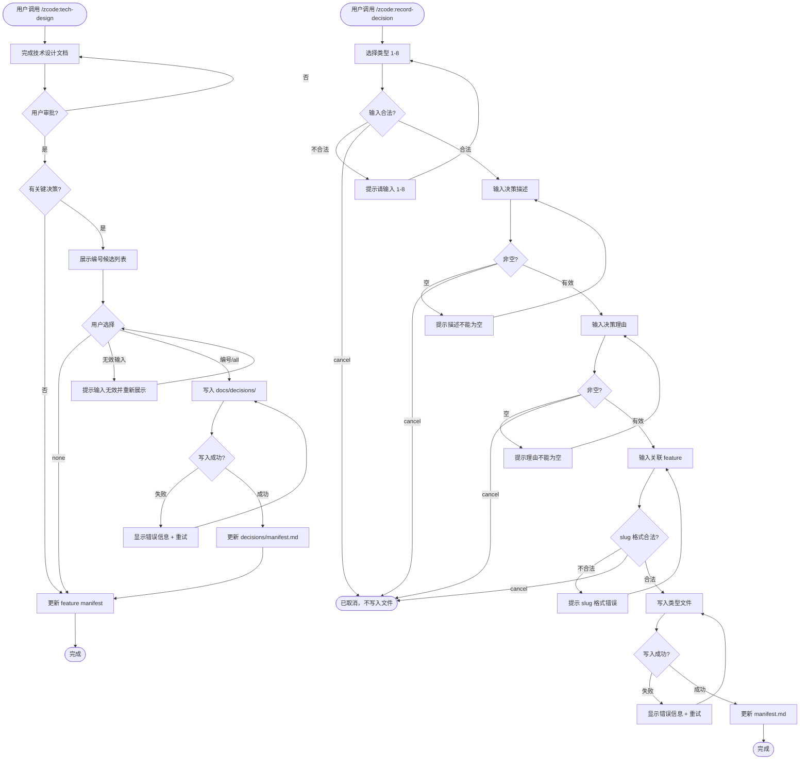

# feat-log-decisions — PRD Spec

> PRD Spec: defines WHAT the feature is and why it exists.

## 需求背景

### 为什么做（原因）

当前 `design-tech` skill 存在两个问题：

1. **命名不一致**：skill 名称 `design-tech` 与输出文件 `tech-design.md` 方向相反。其他 skill 命名与输出一致（`write-prd` → `prd-spec.md`，`ui-design` → `ui-design.md`），导致记忆成本和调用错误。
2. **决策分散**：技术设计中的关键决策仅存在于各 feature 的 `tech-design.md` 中，无法跨 feature 追溯。当多个 feature 涉及相同领域时，难以快速定位历史决策依据。

### 要做什么（对象）

1. 将 `design-tech` skill 重命名为 `tech-design`，统一命名风格。
2. 在 `docs/decisions/` 下建立按类型分类的决策归档体系（8 类），tech-design 流程结束后可选地将关键决策归档。
3. 新增 `/zcode:record-decision` 命令，允许用户在任意阶段主动记录技术决策。
4. 清理对不存在的 `docs/DECISIONS.md` 的引用，统一使用 `docs/decisions/`。

### 用户是谁（人员）

- **Skill 开发者**：维护 zcode plugin 中的 skill 文件，需要修改 SKILL.md、references、templates。
- **Skill 使用者**：通过 Claude Code 调用 `/zcode:tech-design` 和 `/zcode:record-decision` 完成设计工作流和决策记录。

## 需求目标

| 目标 | 量化指标 | 说明 |
|------|----------|------|
| 统一 skill 命名风格 | 命名方向与输出文件一致 | 调用 `/zcode:tech-design` 输出 `tech-design.md` |
| 建立决策归档能力 | 100% 的 design 阶段可产生归档 | 归档为可选步骤，有决策时归档，无决策时跳过 |
| 支持主动记录决策 | `/zcode:record-decision` 4 轮交互完成 | 类型选择 + 决策描述 + 理由 + feature 关联 |
| 集中管理决策索引 | `docs/decisions/manifest.md` 实时反映所有决策 | Categories 表 + Recent Decisions 表 |

## Scope

### In Scope

- [ ] 重命名 skill 目录 `design-tech/` → `tech-design/`，更新注册名和所有引用
- [ ] 创建 `docs/decisions/manifest.md` 索引文件和 8 个类型模板文件
- [ ] 创建 `references/decision-logging.md` 独立决策记录逻辑
- [ ] 创建 `templates/decision-entry.md` 决策条目模板
- [ ] tech-design 流程新增可选"决策归档"步骤
- [ ] 新增 `/zcode:record-decision` slash command skill
- [ ] 更新 hooks guide 和 exploration 示例中的引用
- [ ] 更新 `zcode/CLAUDE.md` 中的 skill 列表

### Out of Scope

- `docs/DECISIONS.md` 的创建（该文件不再需要）
- 下游 skill（eval-design、breakdown-tasks）的变更
- tech-design.md 模板的 "Alternatives Considered" 部分的修改
- 自动合并冲突决策的检测机制
- 决策版本管理（撤销、修订历史）

## 流程说明

### 业务流程说明

**流程 A：tech-design 中的决策归档**

1. 用户调用 `/zcode:tech-design`，完成技术设计文档编写和审批
2. AI 识别技术设计中的关键决策，生成编号候选列表
3. 用户选择要归档的决策（可输入编号 / `all` / `none`）
4. 系统将选中的决策写入对应 `docs/decisions/<type>.md`，更新 `manifest.md`
5. 若无关键决策，跳过步骤 2-4，直接进入 manifest 更新

**流程 B：主动记录决策**

1. 用户调用 `/zcode:record-decision`
2. 系统通过 4 轮交互收集决策信息
3. 系统写入对应类型文件，更新 manifest.md

### 业务流程图



### 数据流说明

此功能为单系统（zcode plugin），无跨系统数据流。

| 数据流编号 | 源 | 目标 | 数据内容 | 方式 | 说明 |
|-----------|-----|------|----------|------|------|
| DF001 | tech-design 流程 | `docs/decisions/<type>.md` | 决策记录行 | 文件写入 | 5 字段：Date, Feature, Decision, Rationale, Source |
| DF002 | 决策写入操作 | `docs/decisions/manifest.md` | 索引更新 | 文件修改 | 计数 +1, Last Updated 更新, Recent Decisions 追加行 |

## 功能描述

### 5.1 决策归档（tech-design 集成）

**触发时机**：tech-design 文档获用户批准后、更新 feature manifest 之前。

**候选决策展示**：AI 在 draft design 阶段识别关键决策，在归档步骤展示编号列表：

```
以下决策被标记为关键决策，建议归档：

  [1] 采用事件驱动架构（Architecture）
  [2] 使用 SQLite 作为本地缓存存储（Data Model）
  [3] 选择 Vitest 而非 Jest 作为测试框架（Dependencies）

输入要归档的编号（逗号分隔），或 all / none：
```

**用户交互规则**：

| 输入 | 行为 |
|------|------|
| `1,3` | 归档编号 1 和 3 的决策 |
| `all` | 归档全部候选决策 |
| `none` | 跳过归档，进入下一步 |
| `edit:<N>` | 重新编辑第 N 条决策的 Description 或 Rationale 字段后再归档 |

**输入校验规则**：

| 字段 | 合法值 | 非法处理 |
|------|--------|----------|
| 编号选择 | 逗号分隔的正整数，范围 1-N（N 为候选列表长度）；或 `all` / `none` | 非数字、超出范围、空输入：显示 "输入无效，请输入编号（如 1,3）或 all/none" 并重新提示 |
| `edit:<N>` | N 必须为正整数且 ≤ 候选列表长度 | N 超出范围：显示 "第 N 条不存在，请输入 1-{N} 之间的编号" 并重新提示 |
| 编辑后的 Description / Rationale | 非空字符串（去除首尾空格后长度 ≥ 1） | 空输入：显示 "描述不能为空，请重新输入" 并重新提示 |

**跳过条件**：AI 未识别到任何关键决策时，直接跳过归档步骤，无需用户确认。

### 5.2 决策记录格式

每条决策记录为 markdown 表格行，追加到对应类型文件末尾：

| 字段 | 类型 | 说明 |
|------|------|------|
| Date | string | 归档日期，格式 YYYY-MM-DD，自动取当前日期 |
| Feature | string | 关联的 feature slug，格式 `^[a-z0-9][a-z0-9-]*$` |
| Decision | string | 决策内容，一句话，非空 |
| Rationale | string | 决策理由，一句话，非空 |
| Source | string | 来源文件和章节，格式 `<文件路径>#<章节>`，如 `tech-design.md#架构设计` |

### 5.3 决策索引（manifest.md）

`docs/decisions/manifest.md` 包含两个表：

**Categories 表**：

| 字段 | 说明 |
|------|------|
| Category | 8 种类型之一 |
| File | 对应类型文件名 |
| Decisions | 该类型文件的决策条数 |
| Last Updated | 最近更新日期 |

**Recent Decisions 表**（最近 5 条）：

| 字段 | 说明 |
|------|------|
| Date | 决策日期 |
| Feature | 关联 feature |
| Category | 决策类型 |
| Decision | 决策内容 |
| Source | 来源 |

每次写入决策时同步更新两个表。

### 5.4 `/zcode:record-decision` 命令

独立的 slash command，允许用户主动记录技术决策。

**交互流程**（4 轮 AskUserQuestion）：

| 轮次 | 收集信息 | 输入方式 | 校验规则 |
|------|----------|----------|----------|
| 1 | 决策类型 | 编号选择 1-8 | 必须为 1-8 的整数；非法值（非数字、空、超出范围）重新提示 "请输入 1-8 之间的数字" |
| 2 | 决策描述 | 单行文本 | 非空字符串（去除首尾空格后长度 ≥ 1）；空输入重新提示 "决策描述不能为空" |
| 3 | 决策理由 | 单行文本 | 非空字符串（去除首尾空格后长度 ≥ 1）；空输入重新提示 "决策理由不能为空" |
| 4 | 关联 feature | feature slug 文本 | 格式 `^[a-z0-9][a-z0-9-]*$`；目录 `docs/features/<slug>/` 不存在时警告 "未找到 feature 目录，确认继续？"（允许用户确认继续） |

**执行结果**：写入对应类型文件 + 更新 manifest.md。

**取消规则**：用户在任意轮次输入 `cancel` 或 `取消` 即可终止流程，不写入任何文件。

### 5.5 关联性需求改动

| 序号 | 涉及位置 | 改动点 | 更改后逻辑 |
|------|----------|--------|------------|
| 1 | `plugins/zcode/skills/` | 目录重命名 | `design-tech/` → `tech-design/` |
| 2 | `plugins/zcode/skills/tech-design/SKILL.md` | frontmatter name | `name: tech-design` |
| 3 | `plugins/zcode/hooks/guide.md` | 引用更新 | `DECISIONS.md` → `docs/decisions/` |
| 4 | `plugins/zcode/skills/tech-design/examples/exploration.md` | 引用更新 | `DECISIONS.md` → `docs/decisions/` |
| 5 | `zcode/CLAUDE.md` | skill 索引 | 添加 `tech-design` 和 `record-decision` |

### 5.6 决策记录逻辑独立为 reference

决策提取和记录的共享逻辑放在 `plugins/zcode/skills/tech-design/references/decision-logging.md`，tech-design 和 record-decision 两个 skill 共同引用，避免逻辑重复。

## 其他说明

### 性能需求

- 决策归档步骤响应时间 < 5 秒（文件写入 + manifest 更新）
- `record-decision` 4 轮交互总耗时 < 30 秒

### 数据需求

- 决策文件初始为空表格（仅表头），按需追加行
- manifest.md 初始 Decisions 计数均为 0
- 每个类型文件预期控制在 10-30 条决策

### 监控需求

- 无独立监控需求；manifest 同步一致性通过 `validate-manifest` 验证命令保障

### 安全性需求

- 不涉及（均为本地文件操作，无网络传输或敏感数据）

---

## 质量检查

- [x] 需求标题是否概括准确
- [x] 需求背景是否包含原因、对象、人员三要素
- [x] 需求目标是否量化
- [x] 流程说明是否完整
- [x] 业务流程图是否包含（Mermaid 格式）
- [x] 功能描述是否完整
- [x] 关联性需求是否全面分析
- [x] 非功能性需求（性能/数据/监控/安全）是否考虑
- [x] 所有表格是否填写完整
- [x] 是否有歧义或模糊表述
- [x] 是否可执行、可验收
