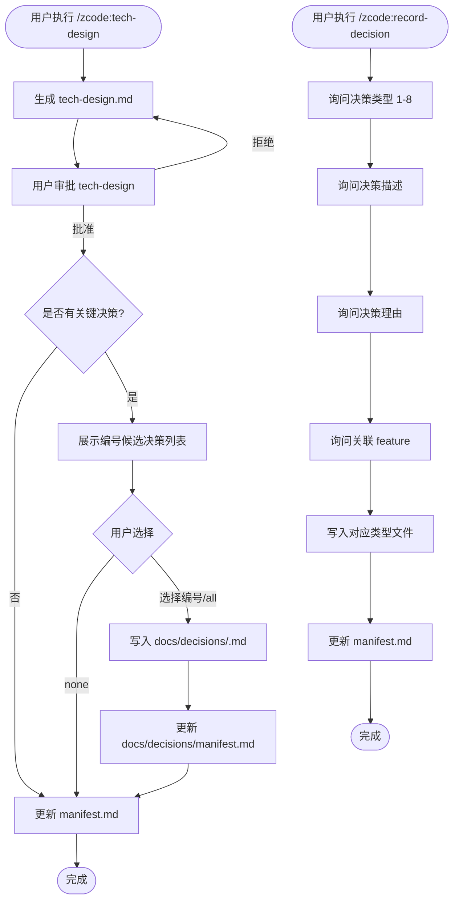

# Tech Design Skill 改进：重命名与决策归档 — PRD Spec

> PRD Spec: defines WHAT the feature is and why it exists.

## 需求背景

### 为什么做（原因）

当前工具链存在两个独立但相关的问题：

1. **命名不一致**：skill 名称 `design-tech` 与其输出文件 `tech-design.md` 方向相反，与其他 skill 的命名惯例（`write-prd` → `prd-spec.md`，`ui-design` → `ui-design.md`）不一致，造成认知负担。
2. **决策分散**：技术设计中的关键决策仅存在于各 feature 的 `tech-design.md` 中，无法跨 feature 追溯。随着 feature 数量增长，定位历史决策依据的成本持续上升。

### 要做什么（对象）

- 将 skill `design-tech` 重命名为 `tech-design`，统一命名方向
- 建立集中的决策归档目录 `docs/decisions/`，按类型分类存储
- 在 tech-design 流程末尾增加可选的决策归档步骤
- 新增独立的 `/zcode:record-decision` 命令，支持在任意阶段主动记录决策

### 用户是谁（人员）

使用 zcode 工具链进行 feature 开发的开发者（个人或小团队），需要在多个 feature 之间追溯技术决策历史。

## 需求目标

| 目标 | 量化指标 | 说明 |
|------|----------|------|
| 消除命名混淆 | 0 处 `design-tech` 残留引用 | 全局搜索验证 |
| 建立决策归档基础设施 | 8 个类型文件 + manifest.md 就绪 | 支持立即开始归档 |
| 降低决策追溯成本 | 单次查询定位历史决策 < 30 秒 | 打开对应类型文件即可检索 |
| 提供独立归档入口 | `/zcode:record-decision` 4 轮交互完成归档 | 无需进入 tech-design 流程 |

## Scope

### In Scope

- [x] 重命名 skill 目录 `design-tech/` → `tech-design/`，更新注册名和所有引用
- [x] 创建 `docs/decisions/manifest.md` 索引文件和 8 个类型模板文件
- [x] 创建 `references/decision-logging.md` 独立决策记录逻辑
- [x] 创建 `templates/decision-entry.md` 决策条目模板
- [x] tech-design 流程新增可选"决策归档"步骤
- [x] 新增 `/zcode:record-decision` slash command skill
- [x] 更新 hooks guide 和 exploration 示例中的引用
- [x] 更新 `zcode/CLAUDE.md` 和 `plugins/zcode/SKILLS.md` 中的 skill 注册信息

### Out of Scope

- `docs/DECISIONS.md` 文件的创建（被新目录结构替代）
- 下游 skill（eval-design、breakdown-tasks）的变更
- tech-design.md 模板的 "Alternatives Considered" 部分修改
- 自动合并冲突决策的检测机制
- 决策版本管理（撤销、修订历史）

## 流程说明

### 业务流程说明

**流程 A：tech-design 流程中的决策归档**

用户执行 `/zcode:tech-design` 后，在 tech-design 文档获用户批准后，skill 自动识别文档中的关键决策并展示候选列表。用户选择要归档的条目（或全选/跳过），确认后写入对应 `docs/decisions/<type>.md` 并更新 manifest。

**流程 B：独立决策记录**

用户在任意阶段执行 `/zcode:record-decision`，通过 4 轮 AskUserQuestion 交互（类型、描述、理由、关联 feature）完成单条决策的归档。

**决策归档判定标准**：AI 在 draft design 阶段识别并标记为"关键决策"的条目才进入归档候选。

### 业务流程图



## 功能描述

### 5.1 决策归档目录结构

**目录布局**：

```
docs/decisions/
├── manifest.md              # 决策索引
├── architecture.md          # 架构决策
├── interface.md             # 接口设计决策
├── data-model.md            # 数据模型决策
├── dependencies.md          # 依赖选择决策
├── error-handling.md        # 错误处理决策
├── testing.md               # 测试策略决策
├── security.md              # 安全考量决策
└── local-dev-deployment.md  # 本地开发与线上部署决策
```

**manifest.md 结构**：

| 字段 | 说明 |
|------|------|
| Categories 表 | 8 个类型的文件路径、决策数量、最后更新时间 |
| Recent Decisions 表 | 最近归档的决策（Date、Feature、Category、Decision、Source） |

**单条决策记录格式**（追加到对应类型文件末尾）：

| 字段 | 说明 |
|------|------|
| Date | 归档日期 |
| Feature | 关联 feature slug |
| Decision | 决策描述（一句话） |
| Rationale | 决策理由（一句话） |
| Source | 来源文件及章节 |

### 5.2 tech-design 流程决策归档步骤

**触发条件**：tech-design 文档获用户批准后自动触发。

**有决策时的交互**：

```
以下决策被标记为关键决策，建议归档：

  [1] 采用事件驱动架构（Architecture）
  [2] 使用 SQLite 作为本地缓存存储（Data Model）
  [3] 选择 Vitest 而非 Jest 作为测试框架（Dependencies）

输入要归档的编号（逗号分隔），或 all / none：
```

用户可输入 `edit:<编号>` 重新编辑该条决策的 Decision 或 Rationale 字段后再归档。

**无决策时**：跳过归档步骤，直接进入 manifest 更新。

### 5.3 `/zcode:record-decision` 命令

**4 轮交互流程**：

| 轮次 | 问题 | 输入方式 |
|------|------|----------|
| 1 | 选择决策类型（1-8） | 编号选择 |
| 2 | 决策描述（一句话） | 文本输入 |
| 3 | 决策理由（一句话） | 文本输入 |
| 4 | 关联 feature | 文本输入 |

**自动补充字段**：Date（当前日期）、Source（`<feature>/tech-design.md` 或 `manual`）。

**适用场景**：实现过程中发现的非 design 阶段决策、历史决策补充或修正、brainstorm/PRD 阶段产生的重要技术约束。

### 5.4 关联性需求改动

| 序号 | 涉及项目 | 功能模块 | 关联改动点 | 更改后逻辑说明 |
|------|----------|----------|------------|----------------|
| 1 | zcode plugin | hooks guide | `docs/DECISIONS.md` 引用 | 改为 `docs/decisions/` 目录 |
| 2 | zcode plugin | tech-design exploration 示例 | `docs/DECISIONS.md` 引用 | 改为 `docs/decisions/` 目录 |
| 3 | zcode/CLAUDE.md | skill 索引表 | `design-tech` 条目 | 更新为 `tech-design`，新增 `record-decision` |
| 4 | plugins/zcode/SKILLS.md | skill 注册 | `design-tech` 注册 | 更新为 `tech-design`，新增 `record-decision` |

## 其他说明

### 性能需求

- 响应时间：单次决策归档操作（写文件 + 更新 manifest）< 2 秒
- 数据存储量：单个类型文件预期 10-30 条记录，超过 50 条时按年份自动分割子文件

### 数据需求

- 数据初始化：首次使用前需创建 `docs/decisions/` 目录结构和 8 个类型模板文件
- 数据迁移：无（`docs/DECISIONS.md` 不存在，无需迁移）

### 监控需求

- `validate-manifest` CI 脚本：解析所有类型文件的实际条目数，与 manifest.md 中 Decisions 列的计数比对，不一致则报错

### 安全性需求

- 无特殊安全要求（本地文件操作）

---

## 质量检查

- [x] 需求标题是否概括准确
- [x] 需求背景是否包含原因、对象、人员三要素
- [x] 需求目标是否量化
- [x] 流程说明是否完整
- [x] 业务流程图是否包含（Mermaid 格式）
- [x] 关联性需求是否全面分析
- [x] 非功能性需求（性能/数据/监控/安全）是否考虑
- [x] 所有表格是否填写完整
- [x] 是否可执行、可验收
