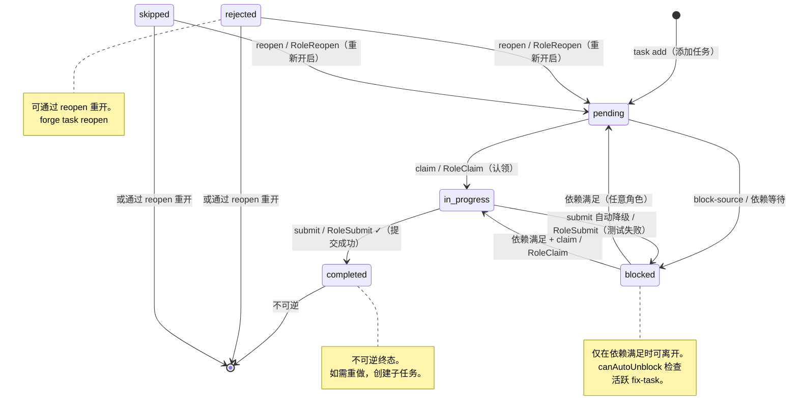

# 状态流转图：Forge 任务生命周期

## 状态定义

| 状态 | 说明 | 是否终态 |
|------|------|----------|
| `pending` | 任务已创建，等待认领 | 否 |
| `in_progress` | 任务已被认领，工作中 | 否 |
| `blocked` | 任务被依赖阻塞或自动降级 | 否 |
| `completed` | 任务已完成 | 是 |
| `rejected` | 任务被拒绝/放弃 | 是 |
| `skipped` | 任务已跳过（不适用） | 是 |

## 转换规则表

| # | 源状态 | 目标状态 | 角色 | 是否允许 | 守卫条件 |
|---|--------|----------|------|----------|----------|
| 1 | `completed` | `*` | `*`（除 RoleReopen 外） | **否** | "task already completed"（不可逆） |
| 2 | `rejected` | `pending` | `reopen` | **是** | RoleReopen 专属 |
| 3 | `rejected` | `*`（非 pending） | `*`（非 reopen） | **否** | "task already rejected" |
| 4 | `skipped` | `pending` | `reopen` | **是** | RoleReopen 专属 |
| 5 | `skipped` | `*`（非 pending） | `*`（非 reopen） | **否** | "task already skipped" |
| 6 | `*` | `completed` | `非 submit` | **否** | "use forge task submit" |
| 7 | `in_progress` | `completed` | `submit` | **是** | — |
| 8 | `in_progress` | `blocked` | `submit` | **是** | 设置 BlockedReason "auto-downgrade: ..." |
| 9 | `blocked` | `pending` | `*` | 依赖检查 | `canAutoUnblock` → `CheckTransitionDeps` |
| 10 | `blocked` | `in_progress` | `*` | 依赖检查 | `canAutoUnblock` → `CheckTransitionDeps` |
| 11 | `pending` | `blocked` | `*` | **是** | block-source、依赖等待 |
| 12 | `*` | `*`（相同状态） | `*` | **是** | 空操作 |

## 可视化状态图



## 按角色分类的规则

### RoleSubmit（forge task submit）
- `in_progress → completed` ✓（唯一到达 completed 的路径）
- `in_progress → blocked` ✓（测试失败时自动降级）
- 终态任务 → **被阻止**（不可逆，无 --force）

### RoleClaim（forge task claim）
- `pending → in_progress` ✓
- `blocked → in_progress` ✓（需通过 `CheckTransitionDeps` 检查依赖）
- 终态任务 → **被阻止**（不可逆，无 --force）

### RoleReopen（forge task reopen）[新增]
- `rejected → pending` ✓
- `skipped → pending` ✓
- `completed → pending` → **被阻止**（已完成不可重开）
- 非终态 → **被阻止**（仅处理 rejected/skipped）

### RoleAuto（自动降级、自动解除阻塞）
- 规则同 RoleSubmit，但用于内部自动化
- 无逃逸机制（自动化不应绕过守卫）

## 终态离开机制（无 --force）

`--force` 标志已被移除。终态保护是绝对的——没有逃逸舱口。

| 终态 | 可否离开 | 机制 |
|------|----------|------|
| `completed` | **不可逆** | 已完成的任务不可重开。如需重做，创建新子任务。 |
| `rejected` | 可通过 `reopen` 离开 | `forge task reopen <id>` → pending |
| `skipped` | 可通过 `reopen` 离开 | `forge task reopen <id>` → pending |

### `task reopen` 子命令

```bash
forge task reopen ABC-1    # rejected/skipped → pending
```

**规则：**
- 只能对 `rejected` 或 `skipped` 状态的任务执行
- 目标状态固定为 `pending`（不可指定其他状态）
- 对 `completed` 任务执行时报错："task already completed, create a subtask if re-work needed"
- 对非终态任务执行时报错："task is not rejected or skipped"

**为什么 completed 不可逆：** 已完成的任务有 record.json 和下游依赖。允许重做会破坏审计链和依赖图。正确的做法是新建子任务继承原始任务上下文。

### `task status` 只读化

```bash
# Before (当前):
forge task status ABC-1 completed     # 直接修改状态

# After (目标):
forge task status ABC-1               # 仅查询，显示任务详情
forge task status ABC-1 completed     # 报错："task status is read-only. Use forge task submit to complete a task."
```

## 当前行为 vs 目标行为

| 场景 | 当前行为 | 目标行为 |
|------|----------|----------|
| 对已完成任务执行 `submit` | 静默覆盖 | 报错 "task already completed, create a subtask if re-work needed"（不可逆） |
| 对已完成任务执行 `add --block-source` | 改为 blocked | 报错 "task already completed"（不可逆） |
| 对进行中任务执行 `status completed` | 设置为 completed | 报错 "task status is read-only, use forge task submit" |
| 对被拒绝任务执行 `reopen` | 不存在此命令 | `forge task reopen <id>` → rejected → pending |
| 对有活跃 fix-task 的 blocked 任务执行 `claim` | 解除阻塞 | 保持 blocked（fix-task 活跃中） |
| 自动降级（测试失败） | 设置 blocked，无原因 | 设置 blocked + BlockedReason "auto-downgrade: testsFailed=N" |
