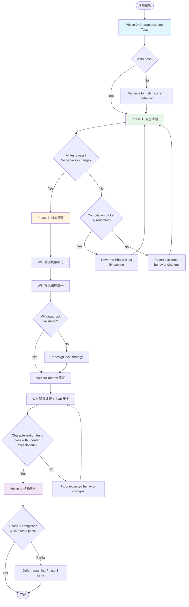

# Forge Architecture Simplification — PRD Spec

> PRD Spec: defines WHAT the feature is and why it exists.

## Background

### Why (Reason)

Forge v3.0.0-rc.1 的 CLI 存在 19 个系统性缺陷模式（84 个具体缺陷），根本原因是**结构和逻辑层面的不清晰**而非个别 bug。具体表现为：

1. **数据可靠性危机**：5 个 index 写入者无文件锁（可并发损坏）、3 个 state 写入者无原子写入（崩溃可截断数据）、状态机允许终态任务被随意覆盖
2. **行为正确性缺失**：quality gate 使用 sentinel ID 导致 auto-restore 完全失效、fix-task cap 统计生命周期而非活跃数（永久锁死）、submit 不检查当前状态允许重复提交
3. **用户体验混乱**：35 个命令用 `Run` + 8 个用 `RunE` 产生两种错误输出格式、两套 config init 产出不同配置、error 信息有的是结构化 AIError 有的是裸文本

每个新 PR 在不清晰的结构上叠加代码，引入新的同类缺陷——#112 引入 3 个、#113 引入 3 个，趋势是每个 PR 引入 3-5 个新缺陷。

### What (Target)

系统性重构 Forge CLI，使每个决策只在一个地方做出：状态转换验证集中到一个函数、index 写入只经过一个路径、错误输出只有一个格式。分 4 个阶段渐进式实施，每阶段独立可验证。

### Who (Users)

| 角色 | 使用场景 | 受影响程度 |
|------|----------|-----------|
| **CLI 开发者** | 维护 forge-cli 代码，添加新命令或修改现有命令 | 直接——代码结构清晰度、错误处理模式、状态机 API |
| **Plugin 开发者** | 创建 skill/command/agent，调用 forge CLI 命令 | 直接——CLI 输出格式一致性、config 管理、eval pipeline 安全性 |
| **Forge 终端用户** | 使用 `forge task`/`forge feature`/`forge test` 等命令管理工作流 | 间接——更可靠的行为、更清晰的错误信息、更完善的配置控制 |

## Goals

| Goal | Metric | Notes |
|------|--------|-------|
| 消除数据损坏风险 | 0 个无锁/非原子写入路径 | MA-1~MA-4: 5 个无锁写入者 + 3 个无原子 state 写入者 |
| 状态机行为正确 | 所有状态转换经过唯一验证入口 | SM-1~SM-7: 4 条路径 4 套规则 → 1 个函数 |
| 错误信息可操作 | 100% 命令使用 AIError 结构化输出 | EH-1~EH-7: worktree/submit/quality_gate 绕过 AIError |
| 配置管理完整 | `config get/set` 覆盖所有 7 个 auto 字段 | CF-1~CF-6: 当前只暴露 1/7 |
| Eval pipeline 安全 | 解析失败不崩溃 + 失败可回滚 | EP-1~EP-4: 当前无错误恢复无回滚 |
| 代码可维护性 | 13 个命名修正 + 9 个死代码删除（grep 确认零引用） | NM-1~13: TestTaskDef→AutoGenTaskDef, testgen.go→autogen.go 等 |
| 每个 Phase 独立可验证 | 每个 Phase 结束后 126+ 现有 e2e 测试全部通过 | 回归安全网 |

## Scope

### In Scope

- [ ] Phase 0: 为 claim/submit/status/add/quality_gate/build 编写 characterization tests 锁定当前行为
- [ ] Phase 1: 死代码删除、13 项命名修正、魔法值常量化、小修复（NI-1~5）
- [ ] Phase 2: 状态机集中化、写入路径统一、BuildIndex 修正、错误处理统一、eval 安全性、test 命令健壮性
- [ ] Phase 3: CLI UX 一致性、Pipeline 契约修正、Config CRUD、Skill 接口标准化、包拆分

### Out of Scope

- Agent subagent 调用计数编程式强制（需 Claude Code API 支持）
- Forge CLI 未安装时的 hook 恢复（需 Claude Code hook runner 改进）
- 跨功能质量门禁污染（需 feature isolation 机制）
- Eval JSON 格式化 + 双层解析（留后续迭代）
- W12 包拆分的详细设计方案（独立提案）
- Slug 传播机制的具体方案（独立设计）
- `eval-forge-runtime-audit` 6 维度重组（独立提案）

## Flow Description

### Business Flow Description

**核心重构流程**（4 Phase 渐进式）：

1. **Phase 0 — Characterization Tests**：为当前行为（含"不合法但被允许"的行为）编写集成测试，建立回归安全网
2. **Phase 1 — 卫生清理**：删除死代码、重命名反映当前职责、提取魔法值为常量、修复小问题。零运行时行为变更
3. **Phase 2 — 核心修复**：集中状态机验证、统一原子写入路径、修正 BuildIndex orphan 处理、统一错误处理、增加 eval 回滚和 test 命令输入校验。行为变更由 characterization tests 保护。终态保护绝对（`--force` 已移除），`task reopen` 用于重新激活 rejected/skipped 任务
4. **Phase 3 — 结构优化**：统一 RunE、合并 config init、完善 config CRUD、标准化 skill 接口、按职责拆分子包

**状态机验证流程**（Phase 2 W4）：

当前 4 条路径各有不同规则。重构后所有状态转换请求经过唯一入口 `ValidateTransition`：
- 终态保护：completed 不可逆（需重做则创建子任务），rejected/skipped 只能通过 `task reopen` 离开
- Submit-only 路径：in_progress → completed/blocked 必须经 submit
- 依赖检查：统一 claim 的逻辑，含 fix-task awareness。`task status` 变为只读

**原子写入流程**（Phase 2 W5）：

当前仅 submit 用锁+原子写入。重构后所有 index 写入：
- 获取 advisory lock（5s timeout）
- 写入 temp file
- rename 覆盖（原子操作）
- 释放锁

### End-to-End User Scenarios (Post-Refactoring)

**场景 A: 开发者完成一个任务**

```bash
# 重构前 vs 后行为变化：
forge task claim                    # 前: 无锁，并发可双claim  |  后: 加锁，并发安全
forge task submit --result success  # 前: completed 任务可重复提交  |  后: 返回错误 "task already completed"
forge task reopen ABC-1                 # 后: 允许重新打开 rejected/skipped 任务（completed 不可重开）
forge task submit --result success  # 测试失败时 auto-downgrade
                                    # 前: blocked 但无 BlockedReason  |  后: 设置 BlockedReason "auto-downgrade: testsFailed=2"
```

**场景 B: 开发者配置项目**

```bash
# 重构前 vs 后能力变化：
forge config init                   # 前: 两套向导(bufio/huh)产出不同  |  后: 统一 huh TUI
forge config set auto.cleanCode true  # 前: 不存在  |  后: 直接设置
forge config get auto.e2eTest       # 前: 仅 auto.gitPush 可查  |  后: 所有 7 个字段可查
```

**场景 C: Quality gate 触发 fix-task**

```bash
# 重构前后行为变化：
forge task submit --result success  # testsFailed=2 触发 auto-downgrade
                                    # fix-task 创建
                                    # 前: SourceTaskID="quality-gate:2.1"(sentinel，auto-restore失效)
                                    # 后: SourceTaskID="2.1"(真实任务 ID，auto-restore 可追踪)
forge task claim                    # 前: cap=3 包含已完成 fix-task，永久锁死
                                    # 后: cap=3 仅统计活跃 fix-task
```

### Failure Recovery Scenarios

| Failure | System Response | User Action |
|---------|----------------|-------------|
| Lock timeout (5s) | AIError: "lock timeout acquiring index.json, retry in a few seconds" | Wait and retry |
| BuildIndex mid-crash | Temp file left on disk; next run detects stale temp and cleans up | Re-run `forge task index` |
| Phase 1 renaming breaks compilation | All changes on isolated branch; `git revert` to Phase 0 tag | Fix renaming and re-commit |
| Phase 2 characterization test fails | Test output shows expected vs actual behavior diff | Update expected behavior or fix the implementation |
| Eval parse failure | Pipeline halts with error; Step 1 backup preserved | Re-run eval or manually review |
| `task reopen` 重开机制 | rejected/skipped 任务可通过 `forge task reopen <id>` 重新激活为 pending | 当拒绝为时过早或需重试时使用 |
| completed 任务不可逆 | completed 状态不可重开，需重做时创建新子任务 | 创建子任务继承原始上下文 |

### Business Flow Diagram



### Data Flow Description

本重构不涉及跨系统数据流。所有变更在 Forge CLI 进程内完成。

## Functional Specs

> 本功能为 CLI 重构，无 UI 界面，不适用 prd-ui-functions.md。

### Value Domain 1: Data Reliability

| # | Capability | Current Behavior | Target Behavior |
|---|-----------|-----------------|-----------------|
| DR-1 | Index 写入原子性 | 5/6 个写入者用 `os.WriteFile`（崩溃可截断） | 所有写入者用 temp+rename 原子写入 |
| DR-2 | Index 写入并发安全 | 仅 submit 有文件锁，claim/status/add/build/migrate 无锁 | 所有写入者获取 advisory lock 后操作 |
| DR-3 | State 写入原子性 | `SaveState` 用 `os.WriteFile` | 改为 temp+rename |
| DR-4 | State 一致性 | `ClearForgeState` 删除文件，后续读取失败 | 改为写 `false` 而非删除 |

### Value Domain 2: Behavioral Correctness

| # | Capability | Current Behavior | Target Behavior |
|---|-----------|-----------------|-----------------|
| BC-1 | Submit 状态检查 | completed/rejected 任务可被重复提交 | 返回错误（不可绕过；completed 不可逆，rejected/skipped 用 `task reopen`） |
| BC-2 | Block-source 终态保护 | completed 任务可被改为 blocked | 返回错误（不可绕过；终态保护绝对） |
| BC-3 | 依赖检查一致性 | claim 有 fix-task awareness，status 无 | `task status` 变为只读（无状态变更）。claim 使用 `CheckTransitionDeps` |
| BC-4 | Auto-downgrade 追踪 | 设置 blocked 但不设 BlockedReason | 设置 BlockedReason 记录原因 |
| BC-5 | Quality gate SourceTaskID | 使用 sentinel `"quality-gate:" + step` | 使用真实被阻塞任务 ID |
| BC-6 | Fix-task cap | 统计所有状态（含 completed） | 仅统计活跃 fix-task |
| BC-7 | No-feature 处理 | 无 feature 时 exit 0（掩盖配置错误） | 返回非零 exit code |
| BC-8 | Orphan 清理 | 仅 emit warning，永不清理 | 默认清理，打印警告 |
| BC-9 | Fix-task orphan | fix-task 误报 orphan | fix-task 排除 |
| BC-11 | Reopen 命令 | 无 reopen 子命令 | `forge task reopen <id>`：rejected/skipped → pending，completed → 报错 |
| BC-10 | Preserve 扩展性 | 仅 3 字段，新字段需手动添加 4 处 | 提取为 `PreserveRuntimeFields` 函数 |

### Value Domain 3: Error Clarity

| # | Capability | Current Behavior | Target Behavior |
|---|-----------|-----------------|-----------------|
| EC-1 | Worktree 错误 | 全部 `fmt.Errorf`，无 Code/Cause/Hint | 统一 AIError + Exit() |
| EC-2 | Submit 锁冲突 | `fmt.Fprintln(os.Stderr) + os.Exit(1)` | AIError + Exit() |
| EC-3 | Quality gate 错误 | 返回 nil 吞掉基础设施错误 | 返回 error |
| EC-4 | Add 配置错误 | `_` 丢弃 config/profile 读取错误 | 警告日志 |
| EC-5 | Test 命令错误 | `os.Exit(1)` 绕过结构化输出 | AIError + Exit() |
| EC-6 | Test promote 输入 | 无路径遍历校验 | 拒绝 `../` |
| EC-7 | Test verify 解析 | 解析失败静默返回零值 | 返回错误 |
| EC-8 | Test verify 验证 | 无 Fact Table 时标记 OK | 标记 unverifiable |

### Value Domain 4: Eval Safety

| # | Capability | Current Behavior | Target Behavior |
|---|-----------|-----------------|-----------------|
| ES-1 | Parse failure recovery | 解析失败无处理（崩溃或忽略） | 中止并输出错误 |
| ES-2 | Iteration rollback | 达到最大迭代时文档停留在最后修订状态 | 恢复 Step 1 备份 |
| ES-3 | Reviser context | Reviser 看不到项目 conventions | 注入与 Scorer 相同的 CONTEXT_CONTENT |
| ES-4 | Reviser scope | 可编辑 DOC_DIR 外文件 | 编程式 scope 验证 |

### Value Domain 5: Configuration Empowerment

| # | Capability | Current Behavior | Target Behavior |
|---|-----------|-----------------|-----------------|
| CE-1 | Config set | 不存在——需手改 YAML 或重跑 init | `forge config set <key> <value>` |
| CE-2 | Config get 覆盖 | 仅暴露 auto.gitPush（1/4） | 支持所有 4 个 auto 字段 |
| CE-3 | Config init 完整性 | 不暴露 auto block | 暴露所有 auto 字段 |
| CE-4 | Schema 版本 | 无——字段重命名时静默丢失数据 | 添加版本字段 |
| CE-5 | Schema enum | schema 有 fullstack/mobile/library 但 CLI 不认识；CLI 有 mixed 但 schema 不认识 | 完全一致 |

### Value Domain 6: CLI Consistency

| # | Capability | Current Behavior | Target Behavior |
|---|-----------|-----------------|-----------------|
| CC-1 | Run/RunE 混用 | 35 Run + 8 RunE = 两种错误输出 | 统一 RunE |
| CC-2 | Config init 路径 | 两套（huh TUI vs bufio），产出不同 | 合并为 huh TUI |
| CC-3 | Args 验证 | 12 个命令缺 `.Args` | 补全 |
| CC-4 | 输出格式 | 部分命令无 PrintBlock 包装 | 统一 PrintBlock |

### Value Domain 7: Code Health

| # | Capability | Current Behavior | Target Behavior |
|---|-----------|-----------------|-----------------|
| CH-1 | 命名准确性 | TestTaskDef/testgen.go 命名反映旧职责 | AutoGenTaskDef/autogen.go |
| CH-2 | 死代码 | 9 个从未调用的导出函数 | 删除 |
| CH-3 | 魔法值 | 10 个影响运行时行为的硬编码值 | 提取为常量或 config |
| CH-4 | 代码重复 | isBusinessTask 重复定义、addFixTask 与 add.go 重叠 | 统一到 pkg 层 |

### Related Changes

| # | Component | Change Point | Impact |
|---|-----------|-------------|--------|
| 1 | eval/SKILL.md | 添加备份步骤 + reviser context 注入 + 解析失败处理 | Skill 行为变更 |
| 2 | doc-reviser.md | 添加 CONTEXT_CONTENT 输入 + scope 验证 | Agent 行为变更 |
| 3 | 所有 skill SKILL.md | "流程描述" section 统一为 `## Process Flow` | 文档结构变更 |
| 4 | task-executor.md | 添加 inputs frontmatter | Agent 元数据变更 |
| 5 | fix.md 模板 | 添加 `{{SOURCE_TASK_ID}}` | 模板变更 |
| 6 | clean-code SKILL.md | scope detection 改用 forge task 命令 | Skill 行为变更 |

## Other Notes

### Performance Requirements

- `forge task index` 在 50+ 任务项目上延迟 ≤ 基线 120%（加锁后对比）
- Advisory lock 获取超时 5s，重试间隔 50ms
- `forge test verify` 对 20+ Contract 扫描时间 ≤ 10s

### Compatibility Requirements

- Windows/WSL advisory lock 行为需验证（W5 Go/No-Go checkpoint）
- 已有项目 BuildIndex orphan 清理时仅打印警告，不删除 .md 文件
- `forge task reopen` 作为 rejected/skipped 任务重新激活的唯一机制（completed 不可重开）

### Security Requirements

- `forge test promote` 必须拒绝路径遍历输入（`../`）
- Config 文件写入保持文件权限 0644

### Monitoring Requirements

- Phase 1 结束后设 git tag 标记重命名基线
- 每个 Phase 结束后运行完整 e2e 测试套件验证

---

## Quality Checklist

- [x] Is the requirement title accurate and descriptive
- [x] Does the background include all three elements: reason, target, users
- [x] Are the goals quantified
- [x] Is the flow description complete
- [x] Does the business flow diagram exist (Mermaid format)
- [x] Is prd-ui-functions.md referenced and UI specs complete (N/A — CLI-only feature)
- [x] Are related changes thoroughly analyzed
- [x] Are non-functional requirements considered (performance / data / monitoring / security)
- [x] Are all tables filled completely
- [x] Is there any ambiguous or vague wording
- [x] Is the spec actionable and verifiable
