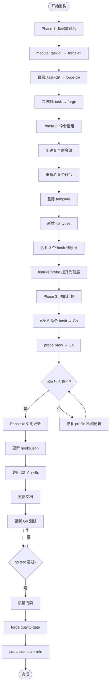
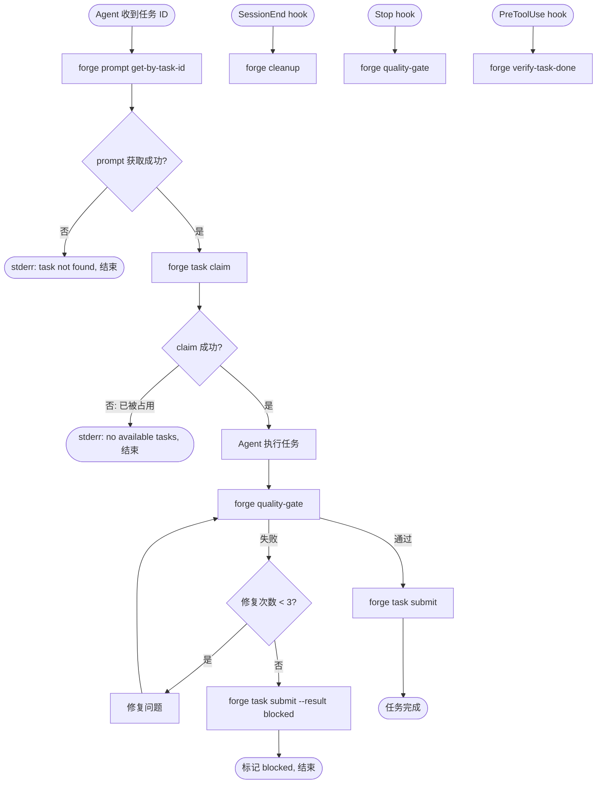

# Forge CLI v3 — PRD Spec

> PRD Spec: defines WHAT the feature is and why it exists.

## Background

### Why (Reason)

当前 CLI 二进制名为 `task`，与 Forge 插件品牌不一致。19 个子命令平铺在根级别，AI agent（主要用户）难以从 `task check`、`task validate`、`task verify-completion` 等语义重叠的命令名中快速选择正确命令。justfile 中 5 个 e2e 命令各自重复了 ~6 行 profile 检测 bash 代码，维护成本高。

### What (Target)

将 `task` CLI 重构为 `forge` CLI：按业务域分组子命令（task/e2e/forensic/profile/prompt），优化命令命名使其自解释，将 justfile 中的 e2e 和 probe 命令迁移到 CLI 内部。v3.0.0 主版本升级，clean break，无向后兼容要求。

### Who (Users)

| 角色 | 使用频率 | 典型场景 |
|------|----------|----------|
| AI agent（主要） | 每次 task 执行 | `forge task claim` → 执行任务 → `forge task submit`；`forge prompt get-by-task-id` 获取执行指令 |
| 开发者（次要） | 开发/调试时 | `forge e2e run` 运行测试；`forge task list-types` 查看类型；`forge forensic search` 排查问题 |
| Hooks/CI（自动化） | 每次会话/提交 | `forge cleanup`、`forge quality-gate`、`forge verify-task-done` |

## Goals

| Goal | Metric | Notes |
|------|--------|-------|
| AI agent 命令选择正确率提升 | 新命名 >= 9/10（旧 <= 7/10），通过 LLM 命令选择测试度量 | 10 个任务场景，新旧命令列表分别测试 |
| 命令可发现性 | `forge --help` 入口 <= 10 个（5 组 + 5 顶层） | 参照 gh CLI 的 10 入口阈值 |
| E2E 编排代码去重 | 消除 5 处重复的 profile 检测 bash 代码 | 迁移为共享 Go 函数 |
| 品牌一致性 | 所有对外命令统一使用 `forge` 前缀 | 二进制名、文档、hooks、skills 全部更新 |

## Scope

### In Scope

- [ ] 二进制 `task` → `forge` 重命名
- [ ] Go module `task-cli` → `forge-cli` 重命名
- [ ] 目录 `task-cli/` → `forge-cli/` 重命名
- [ ] Cobra 命令分组（task/e2e/forensic/profile/prompt）
- [ ] 命令重命名：record→submit, check→check-deps, validate→validate-index, verify-completion→verify-task-done, all-completed→quality-gate, prompt→prompt get-by-task-id
- [ ] 删除 `template` 命令
- [ ] 新增 `forge task list-types` 命令
- [ ] e2e 命令从 justfile 迁移到 CLI（run/setup/verify/compile/discover）
- [ ] `probe` 从 justfile 迁移到 CLI
- [ ] 更新 hooks.json 中的命令引用
- [ ] 更新 justfile（移除迁移的 recipe）
- [ ] 更新 23 个 skills 中的命令引用
- [ ] 更新文档（OVERVIEW.md, WORKFLOW.md, 中文版）
- [ ] 更新 pkg/version/version.go 中的 Name 常量
- [ ] 更新所有 Go 测试中的命令引用

### Out of Scope

- 新增业务功能（仅重构，不改行为）
- 改变命令的执行逻辑或输出格式（仅 `--help` 因分组结构变化）
- prompt 组的扩展命令（如 list、validate）
- `forge feature` 的子命令拆分（保持当前的 get/set 双行为）
- justfile 中 build/dev/lint/test 等 Go 语言 recipe 的迁移
- 向后兼容 shim 或 `task` 别名

## Flow Description

### Business Flow Description

**命令迁移流程**：对每个现有命令，执行"重命名 → 分组 → 验证"三步。整体流程按依赖顺序分四个阶段执行：

1. **基础重命名**：Go module、目录、二进制名从 task 变为 forge
2. **命令重组**：Cobra 命令分组 + 重命名 + 删除 template + 新增 list-types
3. **功能迁移**：e2e 和 probe 命令从 bash 转写为 Go
4. **引用更新**：hooks、skills、文档、测试中的旧命令引用全部替换

**Agent 使用流程**（重构后的典型交互）：
1. Agent 收到任务执行指令
2. 调用 `forge prompt get-by-task-id <id>` 获取执行 prompt
3. 执行任务（编码、测试等）
4. 调用 `forge task submit <id>` 提交结果

**开发者使用流程**（重构后的典型交互）：
1. 开发者在开发/调试时需要运行 e2e 测试
2. 调用 `forge e2e run --feature <name>`，CLI 从 `.forge/config.yaml` 读取 profile 字段
3. CLI 根据 profile 选择对应测试套件（如 web-playwright → 运行 Playwright 测试），执行并返回退出码
4. 开发者也可调用 `forge task list-types` 查看所有可用任务类型，或在排查问题时调用 `forge forensic search` 搜索历史记录

**CI/Hook 使用流程**（自动化触发）：
1. **SessionEnd hook** 触发 → 调用 `forge cleanup`：扫描 index.json 中所有处于终态（completed/blocked/rejected）的任务，删除对应状态文件，保留 .forge/state.json 不变
2. **Stop hook** 触发 → 调用 `forge quality-gate`：依次执行 compile → fmt → lint → test，首个失败步骤终止链式执行并以退出码 1 返回，同时创建 P0 fix-task；全部通过则退出码 0
3. **PreToolUse hook** 触发 → 调用 `forge verify-task-done`：检查当前 feature 下所有非终态任务，若存在未完成任务则以退出码 1 阻断后续操作

### Error Handling

**命令级失败行为：**

| 命令 | 失败场景 | 退出码 | stderr 输出 | 恢复动作 |
|------|----------|--------|-------------|----------|
| `forge prompt get-by-task-id` | 任务 ID 不存在 | 1 | `task not found: <id>` | 无 |
| `forge prompt get-by-task-id` | 任务缺少 type 字段 | 1 | `missing task type for: <id>` | 检查任务 markdown 文件 |
| `forge task submit` | 任务已处于终态 | 1 | `task already in terminal state: <status>` | 无 |
| `forge task submit` | 缺少 --result 参数 | 1 | `required flag(s) not set: result` | 补充参数重试 |
| `forge e2e run` | 未配置 profile | 1 | `no e2e profile configured` | 在 config.yaml 中设置 profile |
| `forge e2e run` | profile 值无效 | 1 | `unknown profile: <value>` | 使用支持列表中的 profile |
| `forge quality-gate` | compile 失败 | 1 | 编译错误详情 | 修复编译错误后重试 |
| `forge cleanup` | 无终态任务 | 0 | `no tasks to clean up` | 无（正常情况） |
| `forge task claim` | 无可用任务（全部已 claim/终态） | 1 | `no available tasks to claim` | 无 |
| `forge task claim` | index.json 不存在或格式损坏 | 1 | `failed to load index: <reason>` | 检查 index.json 完整性 |
| `forge task check-deps` | 依赖任务未完成 | 1 | `dependency not met: <dep-id> is <status>` | 等待依赖任务完成 |
| `forge task validate-index` | index.json schema 校验失败 | 1 | `index validation failed: 
` | 按提示修复 index.json |
| `forge task status` | 任务 ID 不存在 | 1 | `task not found: <id>` | 检查任务 ID 是否正确 |
| `forge forensic search` | 无匹配结果 | 0 | `no results found` | 调整搜索关键词 |
| `forge forensic search` | records/ 目录不存在 | 1 | `records directory not found` | 确认任务执行记录存在 |
| `forge verify-task-done` | 存在未完成的非终态任务 | 1 | `incomplete tasks found: <count>` | 完成或 reject 剩余任务 |
| `forge task submit` | 并发提交冲突（lock 竞争失败） | 1 | `concurrent write conflict, retry` | 自动或手动重试 |
| `forge task submit` | index.json 不存在 | 1 | `index not found for feature: <slug>` | 运行 `forge task index` 生成 |
| `forge profile set` | profile 名称无效 | 1 | `unknown profile: <value>` | 使用 `forge profile detect` 查看可用 profile |
| `forge profile get` | profile 名称无效 | 1 | `unknown profile: <value>` | 使用 `forge profile detect` 查看可用 profile |
| `forge e2e run` | feature 目录不存在 | 1 | `feature not found: <slug>` | 确认 feature slug 正确 |

**任务状态转换约束（非法转换拒绝）：**

| 当前状态 | 终态? | 允许的目标状态 | 非法转换行为 |
|----------|-------|---------------|-------------|
| pending | 否 | in_progress, rejected | 退出码 1，stderr "invalid state transition: pending → <target>" |
| in_progress | 否 | completed, blocked, rejected | 退出码 1，stderr "invalid state transition: in_progress → <target>" |
| completed | **是** | （无） | 退出码 1，stderr "task already in terminal state: completed" |
| blocked | 否 | in_progress | 退出码 1，stderr "invalid state transition: blocked → <target>" |
| rejected | **是** | （无） | 退出码 1，stderr "task already in terminal state: rejected" |

> 注：`blocked` 不是终态——阻塞解除后可转回 `in_progress`。终态仅 `completed` 和 `rejected`。

**迁移过程失败策略：**

- **Phase 1-2 失败**（重命名/分组）：Go 编译失败 → 修复后重新编译，无回滚需求（未提交即可重置）
- **Phase 3 失败**（功能迁移）：e2e 行为等价测试失败 → 修复 profile 检测 Go 逻辑，重新运行等价测试，bash 原始 recipe 在迁移完成前保留。**中止条件**：同一 profile 检测 bug 连续修复 3 次仍失败 → 暂停迁移，人工审查 e2e 行为差异根因
- **Phase 4 失败**（引用更新）：`just check-stale-refs` 检测到残留引用 → 定位并替换遗漏的旧命令引用，重新验证。**中止条件**：全量 `grep -r "task "` 扫描后仍发现新增残留引用 2 次以上 → 暂停批量替换，人工逐文件审查
- **质量门禁失败**：lint/test 不通过 → 修复问题后重新运行 `just lint && just test`，不合并

### Business Flow Diagram

### Agent Task Execution Flow

## Functional Specs

> 本功能为 CLI-only，无 UI 组件。

### 命令结构规格

**5 个命令组：**

| 组 | 子命令数 | 子命令列表 |
|----|---------|-----------|
| `forge task` | 11 | claim, submit, status, query, check-deps, validate-index, verify-task-done, add, index, migrate, list-types |
| `forge e2e` | 5 | run, setup, verify, compile, discover |
| `forge forensic` | 3 | search, extract, subagents |
| `forge profile` | 3 | set, detect, get |
| `forge prompt` | 1 | get-by-task-id |

**5 个顶层命令：**

| 命令 | 用途 | 调用方 |
|------|------|--------|
| `forge feature` | 设置/显示当前 feature 上下文 | Agent, 开发者 |
| `forge probe` | HTTP 健康检查 | 开发者, CI |
| `forge cleanup` | 清理已完成任务状态 | Hook (SessionEnd) |
| `forge quality-gate` | 质量门禁（编译+lint+测试+e2e） | Hook (Stop) |
| `forge verify-task-done` | pre-commit 校验 | Hook (PreToolUse) |
| `forge version` | 版本信息 | 开发者 |

### 命名变更规格

| 旧命令 | 新命令 | 变更理由 |
|--------|--------|----------|
| `task` | `forge` | 品牌统一 |
| `task record` | `forge task submit` | 消除名词/动词歧义 |
| `task check` | `forge task check-deps` | 明确检查对象是依赖 |
| `task validate` | `forge task validate-index` | 明确校验对象是 index.json |
| `task verify-completion` | `forge task verify-task-done` | 明确校验对象是任务完成状态 |
| `task all-completed` | `forge quality-gate` | 实际动作是质量门禁 |
| `task prompt` | `forge prompt get-by-task-id` | AI 语境下 "prompt" 太泛 |
| `task template` | **删除** | 无直接使用者 |
| (justfile) `e2e-*` | `forge e2e *` | 消除 profile 检测代码重复 |
| (justfile) `probe` | `forge probe` | 迁移到 CLI |
| (新增) | `forge task list-types` | 列出所有任务类型 |

### Related Changes

| # | Project | Module | Change Point | Updated Logic |
|------|----------|----------|------------|----------------|
| 1 | forge | hooks.json | 所有 hook 命令引用 | `task cleanup` → `forge cleanup` 等 |
| 2 | forge | justfile | 移除 e2e-* 和 probe recipe | 迁移到 CLI Go 代码 |
| 3 | forge | 23 个 skills | 命令引用替换 | 所有 `task xxx` → `forge xxx` |
| 4 | forge | docs/ | 文档命令引用更新 | OVERVIEW.md, WORKFLOW.md 及中文版 |
| 5 | forge | Go tests | 测试命令引用更新 | `exec.Command("task"...)` → `exec.Command("forge"...)` |

## Other Notes

### Performance Requirements

- **启动延迟**：`forge --help` 响应时间 <= 基线 + 50ms（基线：迁移前 `task --help` 三次中位数）
- **行为等价**：所有已迁移命令退出码一致（0/1/2）；stdout 格式不变（`--help` 除外）
- **二进制体积**：增量 <= 500KB
- **构建时间**：增量 <= 10 秒

### Data Requirements

- **无数据迁移**：`.forge/` 目录结构不变，state.json 和 config.yaml 格式不变
- **向后兼容提示**：v2 最后版本的 `task --help` 添加 "请使用 forge 替代" 迁移提示

### Monitoring Requirements

- 新增 `just check-stale-refs` CI target：自动扫描残留的 `task` 命令引用，集成到 `just lint`

### Security Requirements

- 无新增安全需求。文件锁机制（index.json.lock）保持不变，仅验证重命名未破坏并发安全

---

## Quality Checklist

- [x] Is the requirement title accurate and descriptive
- [x] Does the background include all three elements: reason, target, users
- [x] Are the goals quantified
- [x] Is the flow description complete
- [x] Does the business flow diagram exist (Mermaid format)
- [x] ~~Is prd-ui-functions.md referenced and UI specs complete~~ (CLI-only, no UI)
- [x] Are related changes thoroughly analyzed
- [x] Are non-functional requirements considered (performance / data / monitoring / security)
- [x] Are all tables filled completely
- [x] Is there any ambiguous or vague wording
- [x] Is the spec actionable and verifiable
