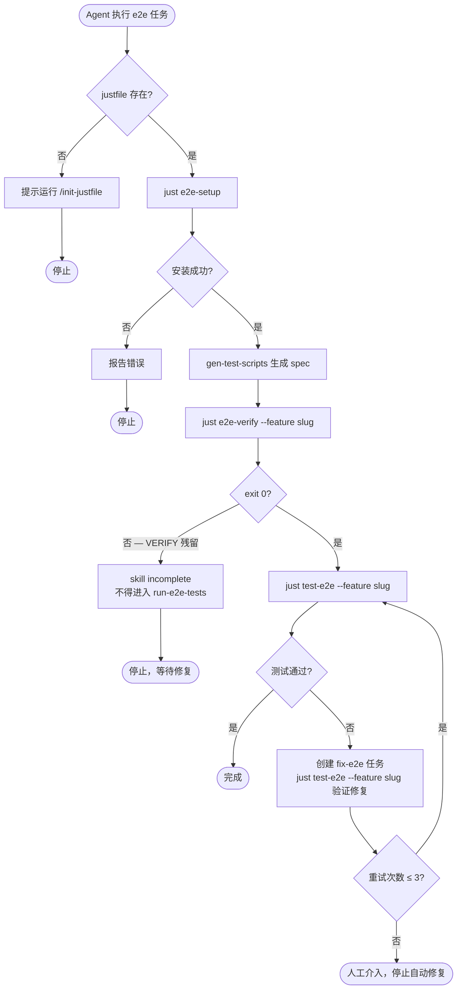
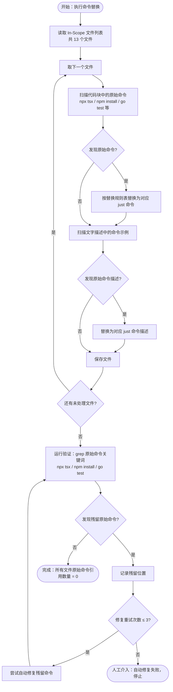

# Justfile E2E Integration — PRD Spec

> PRD Spec: defines WHAT the feature is and why it exists.

## 需求背景

### 为什么做（原因）

Skills、agents 和 task 模板中散落着大量原始 shell 命令（`npx tsx`、`npm install`、`npx playwright install`、`go test ./...`、`npm test`、`pytest` 等），既有代码块中的可执行命令，也有文字描述中的命令示例。`init-justfile` 已定义标准目标契约（`just test`、`just build`、`just test-e2e`），但没有任何 skill 或 agent 引用它们，justfile 作为抽象层的价值完全未被利用。

### 要做什么（对象）

1. 扩展 `init-justfile` 标准目标契约，新增 `just e2e-setup`（幂等安装 e2e 依赖）和 `just e2e-verify --feature <slug>`（检查 `// VERIFY:` 残留标记）两个目标
2. 将 13 个 skill/agent/template 文件中的所有原始命令（代码块 + 文字描述）统一替换为对应的 just 命令

### 用户是谁（人员）

- **Skill 维护者**：编写和维护 SKILL.md 文件的开发者，需要在文档中引用稳定的命令接口
- **AI Agent**：执行 skill 指令的 AI，需要明确、无歧义的命令来完成 e2e 测试和构建验证任务

## 需求目标

| 目标 | 量化指标 | 说明 |
|------|----------|------|
| 消除原始命令散落 | 13 个文件中原始命令引用数量降至 0 | 代码块和文字描述均计入 |
| 建立统一命令入口 | `just e2e-setup`、`just e2e-verify` 各在 init-justfile 中有 1 个权威定义 | 工具链变化只需修改 justfile |
| 强制 VERIFY 标记检查 | `just e2e-verify` exit 1 时 gen-test-scripts 不得进入 run-e2e-tests | 硬门控，不可绕过 |

## Scope

### In Scope

- [ ] `init-justfile` command：新增 `e2e-setup` 和 `e2e-verify` 目标及 recipe 模板
- [ ] `gen-test-scripts` SKILL.md：Step 4 VERIFY 检查 + Step 5 deps install → just 命令（代码块 + 文字描述）
- [ ] `run-e2e-tests` SKILL.md：Step 1 setup + Step 2 run specs + Error table → just 命令（代码块 + 文字描述）
- [ ] `fix-bug` command：`<project-test-command>` → `just test`；`npx tsx` → `just test-e2e --feature <slug>`（代码块 + 文字描述）
- [ ] `run-tasks` command：Breaking Gate → `just test`（代码块注释 + 文字描述）
- [ ] `task-executor` agent：Step 3 → `just build && just test`（代码块注释 + 文字描述）
- [ ] `error-fixer` agent：Step 4 → `just build && just test`（代码块注释 + 文字描述）
- [ ] `execute-task` command：Step 3 文字描述 → `just build && just test`
- [ ] `record-task` SKILL.md：Metrics Collection 语言示例 → `just test`
- [ ] `improve-harness` SKILL.md：Step 4.3 文字描述 → `just test`
- [ ] `breakdown-tasks` 模板 `run-e2e-tests.md`：Implementation Notes → `just test-e2e --feature <slug>`
- [ ] `breakdown-tasks` 模板 `gen-test-scripts.md`：Implementation Notes → `just e2e-verify --feature <slug>`
- [ ] `breakdown-tasks` 模板 `fix-e2e.md`：新增修复后验证步骤 → `just test-e2e --feature <slug>`

### Out of Scope

- 项目级 justfile（forge 自身的 `justfile`）：只有 `claude`/`claude-c`，不是应用项目的 justfile
- `gen-test-cases` SKILL.md：不涉及命令执行
- `graduate-tests` SKILL.md：毕业流程不涉及 e2e 执行命令
- `gen-sitemap` command：`npx agent-browser` 是专用工具，不属于标准 just 目标范畴
- 现有已生成的 spec 文件：不回溯修改

## 流程说明

### 业务流程说明

**新增目标流程**（init-justfile 扩展）：
1. 用户在应用项目中运行 `/init-justfile`
2. 生成的 justfile 包含 `e2e-setup` 和 `e2e-verify` 两个新目标
3. Agent 在执行 e2e 相关任务时调用这些目标，无需推断工具链

**命令替换流程**（skill 文件更新）：
1. 每个 skill/agent 文件中的原始命令（代码块 + 文字描述）被替换为对应 just 命令
2. Agent 读取 skill 指令时，看到的是 `just e2e-setup` 而非 `cd tests/e2e && npm install`
3. 工具链变化时，只需修改 justfile recipe，所有 skill 自动受益

**VERIFY 硬门控流程**：
1. `gen-test-scripts` 生成 spec 文件后，运行 `just e2e-verify --feature <slug>`
2. 若有残留 `// VERIFY:` 标记 → exit 1 → skill 标记为 incomplete，不得进入 `run-e2e-tests`
3. 若无残留 → exit 0 → 继续执行 `run-e2e-tests`

### 业务流程图

**命令替换流程图**（13 个 skill/agent/template 文件批量更新）：

## 功能描述

### 5.1 新增 just 目标（init-justfile 扩展）

**`just e2e-setup`**

| 属性 | 说明 |
|------|------|
| 功能 | 幂等安装 e2e 依赖：npm install（仅当 node_modules 不存在时）+ playwright install chromium |
| 调用方 | `gen-test-scripts` Step 5、`run-e2e-tests` Step 1 |
| 幂等性 | 多次调用结果相同，不重复安装已存在的依赖 |
| 前置条件 | `tests/e2e/package.json` 存在 |
| 失败条件 | `tests/e2e/package.json` 不存在 → exit 1，输出 `"Error: tests/e2e/package.json not found"` |
| 输出格式 | 成功 → `"OK: e2e dependencies ready"`（exit 0）；失败 → 错误原因（exit 1） |

**`just e2e-verify --feature <slug>`**

| 属性 | 说明 |
|------|------|
| 功能 | 检查 `tests/e2e/<slug>/` 下所有 spec 文件中是否有残留 `// VERIFY:` 标记 |
| 调用方 | `gen-test-scripts` Step 4 post-generation check |
| 成功条件 | 无残留标记 → exit 0，输出 "OK: no unresolved // VERIFY: markers" |
| 失败条件 | 有残留标记 → exit 1，输出残留标记的文件名和行号 |
| 参数 | `--feature <slug>`（必填，缺省时 exit 1 并提示用法） |
| 参数格式 | `<slug>` 为 `tests/e2e/` 下的子目录名，格式：小写字母和连字符（如 `user-auth`）；Agent 通过 `task feature` 命令获取当前 feature 的 slug |

### 5.2 命令替换规则

**E2E 命令替换**：

| 原始命令/描述 | 替换为 | 影响文件 |
|-------------|--------|---------|
| `cd tests/e2e && npm install` | `just e2e-setup` | gen-test-scripts, run-e2e-tests |
| `npx playwright install chromium` | （合并到 `just e2e-setup`） | run-e2e-tests |
| `npx tsx <slug>/*.spec.ts 2>&1 \| tee ...` | `just test-e2e --feature <slug>` | run-e2e-tests |
| `npx tsx <spec-file> 2>&1` | `just test-e2e --feature <slug>` | fix-bug |
| `grep -r '// VERIFY:' tests/e2e/<feature>/` | `just e2e-verify --feature <slug>` | gen-test-scripts |
| "Install dependencies..." / "Install Playwright..." | "Run `just e2e-setup`" | run-e2e-tests（文字描述） |
| "Run `npx playwright install chromium`, retry" | "Run `just e2e-setup`, retry" | run-e2e-tests（Error table） |

**breakdown-tasks 模板命令替换**：

| 原始命令/描述 | 替换为 | 影响文件 |
|-------------|--------|---------|
| `npx tsx tests/e2e/<slug>/*.spec.ts` / "run e2e tests" 文字描述 | `just test-e2e --feature <slug>` | breakdown-tasks 模板 `run-e2e-tests.md`（Implementation Notes） |
| `grep -r '// VERIFY:' tests/e2e/<slug>/` / "verify markers" 文字描述 | `just e2e-verify --feature <slug>` | breakdown-tasks 模板 `gen-test-scripts.md`（Implementation Notes） |
| 修复后验证步骤（原无此步骤，新增） | `just test-e2e --feature <slug>` | breakdown-tasks 模板 `fix-e2e.md`（新增 post-fix verification step） |

**单元测试 / 构建命令替换**：

| 原始命令/描述 | 替换为 | 影响文件 |
|-------------|--------|---------|
| `go build ./... && go vet ./... && go test -race -cover ./...` | `just build && just test` | task-executor, error-fixer |
| `npm run build && npm test` | `just build && just test` | task-executor, error-fixer |
| `pytest --cov` | `just build && just test` | task-executor, error-fixer |
| `<project-test-command>` | `just test` | fix-bug, run-tasks |
| `go test -cover ./...` / `npm test -- --coverage` / `pytest --cov=...` | `just test` | record-task |
| "Run project test suite to ensure nothing broke" | "Run `just test`" | improve-harness |
| "Run project-specific verification commands." | "Run `just build && just test`" | execute-task |

### 5.3 justfile 不存在时的处理

Skills 在调用 just 命令前先检查 `ls justfile`：
- 存在 → 正常执行
- 不存在 → 提示用户运行 `/init-justfile`，停止当前流程

## 其他说明

### 性能需求

- `just e2e-setup` 幂等检查（`node_modules` 是否存在）：< 1s
- `just e2e-verify` grep 扫描：< 5s（典型 feature 目录 < 10 个 spec 文件）

### 安全性需求

- 无网络请求，无敏感数据处理

---

## 质量检查

- [x] 需求标题是否概括准确
- [x] 需求背景是否包含原因、对象、人员三要素
- [x] 需求目标是否量化
- [x] 流程说明是否完整
- [x] 业务流程图是否包含（Mermaid 格式）
- [x] 功能描述是否完整（新增目标 + 替换规则 + 异常处理）
- [x] 非功能性需求（性能/安全）是否考虑
- [x] 是否可执行、可验收
