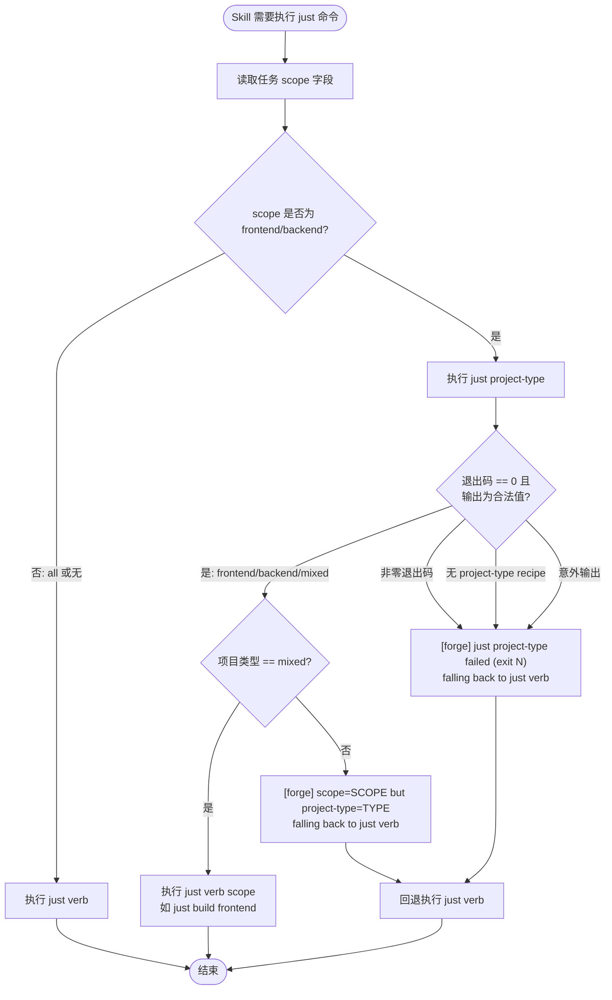
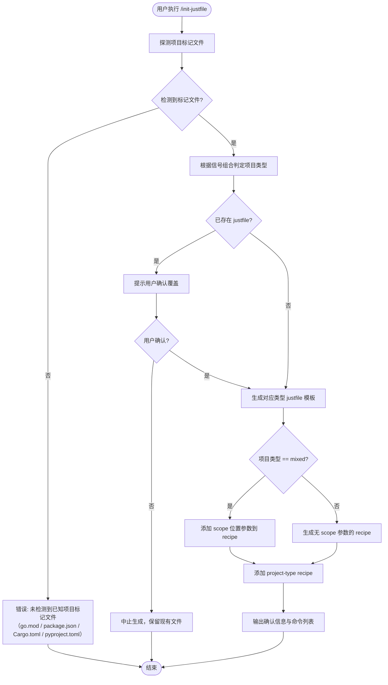

# Justfile 标准命令词汇表 — PRD Spec

> PRD Spec: defines WHAT the feature is and why it exists.

## 需求背景

### 为什么做（原因）

Forge 插件的 skill/agent/command 文件中散落着原始 shell 命令（`go test`、`npm run build`、`npx serve` 等），导致三个问题：

1. **工具链耦合**：skill 文件硬编码语言工具链命令，无法跨项目复用
2. **词汇不一致**：部分 skill 引用 `just build`，但 justfile 中该 recipe 不存在；其他 skill 直接内联原始命令
3. **不支持混合项目**：前后端混合项目（如 forge 自身：Go 后端 + React 前端）无法选择性构建/运行某个 scope

当前 `init-justfile` 命令仅定义 6 个标准目标，缺少 compile、run、dev、fmt、check、clean、install、ci 等常见操作。

### 要做什么（对象）

1. 将标准命令词汇从 6 个扩展至 15 个，覆盖开发全生命周期
2. 添加 `just project-type` 自描述机制，让 skill 感知项目结构
3. 支持混合项目通过位置参数（`frontend`/`backend`）选择性操作
4. 迁移所有 skill/agent/command 文件，消除散落的原始 shell 命令

### 用户是谁（人员）

| 角色 | 说明 |
|------|------|
| **Forge agent** | 执行 skill 的 AI agent。通过 `just <verb>` 执行操作，依赖可预测的退出码（0=成功，非0=失败）、无交互式提示、结构化错误输出 |
| **Forge skill 用户（开发者）** | 使用 forge skill 管理项目开发的开发者。通过 `just <verb>` 执行标准化操作，无需关心底层工具链 |
| **Forge skill 作者** | 编写/维护 forge skill 文件的开发者。需要清晰的命令词汇表作为 skill 编写规范 |
| **项目维护者** | 运行 `/init-justfile` 为项目生成 justfile 的开发者。需要自适应生成适配不同项目类型 |

## 需求目标

| 目标 | 量化指标 | 说明 |
|------|----------|------|
| 消除原始命令 | skill/agent/command 文件中 0 处直接调用语言工具链的可执行命令 | 当前至少 8 处散落的原始命令 |
| 统一命令接口 | 所有 forge 项目使用同一套 15 个标准命令 | 从 6 个扩展至 15 个 |
| 支持混合项目 | 11 个带 scope 参数的命令支持前端/后端选择性操作（15 个命令中 11 个接受 scope 位置参数） | 当前不支持 |
| 自适应生成 | 支持 3 种项目类型（frontend/backend/mixed）自动探测与 justfile 生成 | 当前仅按语言生成，不考虑前后端分离 |

## Scope

### In Scope

- [ ] 扩展 init-justfile 标准目标契约至 15 个命令
- [ ] 添加 `project-type` recipe 到契约，返回 `frontend`/`backend`/`mixed`
- [ ] init-justfile 自适应生成：纯前端/纯后端（无 scope 参数）、混合（有 scope 参数）
- [ ] 更新 8 个 skill 文件使用新词汇
- [ ] 更新 2 个 agent 文件使用新词汇
- [ ] 更新 4 个 task 模板使用新词汇
- [ ] 更新 breakdown-tasks skill，在 index.json 中为任务添加 scope 字段
- [ ] 更新 forge 项目 justfile 作为混合项目参考实现

### Out of Scope

- 其他项目（pm-work-tracker 等）的 justfile 更新（用户自行运行 `/init-justfile`）
- `just project-type` 在 CI 环境中的集成
- justfile recipe 的并行执行优化（just 原生支持）

## 流程说明

### 业务流程说明

**Skill 执行 just 命令的 scope 解析流程**：

1. Skill 读取当前任务的 scope 字段（来自 index.json）
2. 若任务 scope 为 `frontend` 或 `backend`：
   - 执行 `just project-type` 获取项目类型
   - 若 `mixed`：执行 `just <verb> <scope>`（如 `just build frontend`）
   - 若非 `mixed`：记录警告（scope 与项目类型不匹配），回退执行 `just <verb>`
3. 若任务 scope 为 `all` 或无 scope：直接执行 `just <verb>`

### 业务流程图



### 数据流说明

| 数据流编号 | 源 | 目标 | 数据内容 | 传输方式 | 频率 | 格式 | 备注 |
|-----------|------|------|---------|---------|------|------|------|
| DF001 | index.json | skill | 任务 scope 字段 | 文件读取 | 每次任务执行 | JSON | `frontend`/`backend`/`all` |
| DF002 | justfile | skill | `just project-type` 输出 | shell 执行 | scope 解析时 | 单行文本 | `frontend`/`backend`/`mixed` |

## 功能描述

### 5.1 标准命令词汇表

**完整命令清单**：

| 命令 | 位置参数 | 必需 | 用途 | 适用范围 |
|------|---------|------|------|---------|
| `compile [scope]` | `frontend`/`backend` | 否 | 类型检查 + 转译，快速反馈 | 所有项目 |
| `build [scope]` | `frontend`/`backend` | 否 | 完整构建（打包、编译产物） | 所有项目 |
| `run [scope]` | `frontend`/`backend` | 否 | 启动服务 | 所有项目 |
| `dev [scope]` | `frontend`/`backend` | 否 | 热重载开发模式 | 所有项目 |
| `test [scope]` | `frontend`/`backend` | 否 | 单元 + 集成测试 | 所有项目 |
| `test-e2e [--feature <slug>]` | — | 否 | E2E 测试 | 有 e2e 测试的项目 |
| `lint [scope]` | `frontend`/`backend` | 否 | 静态分析 | 所有项目 |
| `fmt [scope]` | `frontend`/`backend` | 否 | 自动格式化代码 | 所有项目 |
| `check [scope]` | `frontend`/`backend` | 否 | lint + compile（CI 门禁） | 所有项目 |
| `clean [scope]` | `frontend`/`backend` | 否 | 清理构建产物 | 所有项目 |
| `install [scope]` | `frontend`/`backend` | 否 | 安装依赖 | 所有项目 |
| `ci` | — | 否 | 完整 CI 流水线 | 有 CI 的项目 |
| `e2e-setup` | — | 否 | 安装 e2e 依赖（幂等） | 有 e2e 测试的项目 |
| `e2e-verify --feature <slug>` | — | 否 | 检查未解析的 `// VERIFY:` 标记 | 有 e2e 测试的项目 |
| `project-type` | — | 是 | 返回项目类型（单字输出） | 所有项目 |

**scope 参数规则**：

| 项目类型 | justfile 风格 | scope 行为 |
|---------|-------------|-----------|
| 纯前端 | 无 scope 参数 | `just build` 执行前端构建 |
| 纯后端 | 无 scope 参数 | `just build` 执行后端构建 |
| 混合 | 有 scope 参数 | `just build` 全部；`just build frontend` 仅前端；`just build backend` 仅后端 |

### 5.2 自适应 Justfile 生成

**项目类型探测规则**：

| 探测信号 | 判定项目类型 | scope 参数 | `project-type` 输出 |
|---------|------------|-----------|-------------------|
| 仅 `package.json` | 纯前端 | 无 | `frontend` |
| 仅 `go.mod` / `Cargo.toml` / `pyproject.toml` | 纯后端 | 无 | `backend` |
| 同时有 `package.json`（前端目录）和后端标记文件 | 混合 | `frontend`/`backend` | `mixed` |

**init-justfile 自适应生成流程**：



### 5.3 任务级 scope 标记

`breakdown-tasks` 在拆分任务时，为每个任务在 `index.json` 中添加 `scope` 字段：

| scope 值 | 含义 | 判定依据 |
|----------|------|---------|
| `frontend` | 仅涉及前端代码 | 任务涉及的文件路径在前端目录内 |
| `backend` | 仅涉及后端代码 | 任务涉及的文件路径在后端目录内 |
| `all` | 跨前后端或全栈 | 任务涉及前后端目录或无法确定归属 |

**scope 字段 JSON Schema**（index.json 中任务对象的 `scope` 属性）：

```json
{
  "scope": {
    "type": "string",
    "enum": ["frontend", "backend", "all"],
    "default": "all",
    "description": "任务作用范围：frontend=仅前端，backend=仅后端，all=跨前后端或全栈"
  }
}
```

`scope` 字段为可选；当 `breakdown-tasks` 未写入时，消费者应视为 `"all"`。

**scope 参数验证规则**：

| 场景 | 行为 | 示例 |
|------|------|------|
| 混合项目 + 合法 scope | 执行 `just <verb> <scope>` | `just build frontend` |
| 混合项目 + 非法 scope | 以退出码 1 终止，stderr 输出 `[forge] invalid scope 'foo'; expected frontend/backend` | `just build foo` |
| 纯前端/后端项目 + scope 参数 | skill 层拦截：输出 `[forge] scope=frontend but project-type=backend; falling back to just build`，回退执行无 scope 命令 | 纯后端项目执行 `just build frontend` |
| `just project-type` 在无 recipe 的 justfile 上执行 | 以非零退出码失败，skill 按流程图 error 分支回退执行 `just <verb>` | 旧 justfile 无 project-type recipe |
| `just project-type` 返回意外字符串 | 视为 error 分支：skill 输出 `[forge] just project-type returned unexpected output 'XYZ'; falling back to just verb`，回退执行 | project-type 输出 `unknown` |

### 5.4 Skill 迁移清单

| 文件 | 当前命令 | 迁移后命令 | 分类 |
|------|---------|-----------|------|
| `run-e2e-tests/SKILL.md` | `npx serve` | `just run` | 机械替换 |
| `gen-test-scripts/SKILL.md` | `just e2e-setup`、`just e2e-verify` | 保持不变 | 验证一致性 |
| `record-task/SKILL.md` | `just test` | 保持不变 | 验证一致性 |
| `execute-task.md` | `just build && just test` | `just compile && just test` | 机械替换 |
| `fix-bug.md` | `just test`、`just test-e2e` | 保持不变 | 验证一致性 |
| `run-tasks.md` | `just test` | 保持不变 | 验证一致性 |
| `improve-harness.md` | `just test` | 保持不变 | 验证一致性 |
| `graduate-tests/SKILL.md` | `just test-e2e` | 保持不变 | 验证一致性 |
| `task-executor.md` | `just build && just test` | `just compile && just test` | 机械替换 |
| `error-fixer.md` | `just build && just test` | `just compile && just test` | 机械替换 |
| 4 个 task 模板 | `just test-e2e`、`just e2e-verify` | 保持不变 | 验证一致性 |

### 5.5 关联性需求改动

| 序号 | 涉及项目 | 功能模块 | 关联改动点 | 更改后逻辑说明 |
|------|---------|---------|-----------|---------------|
| 1 | task-cli | index.json schema | 添加 `scope` 字段 | 任务对象支持 `scope` 字段（`frontend`/`backend`/`all`） |
| 2 | e2e 测试 | justfile-e2e-integration | 更新测试用例 | 验证新增命令（`compile`、`run`、`dev` 等）和 scope 参数 |
| 3 | skill 文件 | 8 个 SKILL.md | 将原始 shell 命令替换为标准词汇 | `run-e2e-tests` 等 8 个 skill 文件迁移至 `just <verb>` 调用 |
| 4 | agent 文件 | 2 个 .md agent 定义 | 同上 | `execute-task`、`task-executor` 等迁移至 `just compile` 等标准命令 |
| 5 | task 模板 | 4 个 task 模板文件 | 验证 `just test-e2e`、`just e2e-verify` 命令一致性 | 确保模板中命令与词汇表一致 |

## 其他说明

### 兼容性需求

- just >= 1.50.0（已在前置条件中要求）
- 新增 scope 参数不影响纯前端/纯后端项目（无 scope 参数的 justfile 不受影响）
- 所有新增 recipe 对现有 recipe 无破坏性变更

### 可维护性需求

- 标准 recipe 区域用 `# --- forge standard recipes ---` 标记边界，与用户自定义 recipe 隔离
- `project-type` recipe 由 init-justfile 自动生成，非人工维护

### Agent 友好性需求

- **退出码一致性**：所有 recipe 退出码 0 表示成功，非 0 表示失败，agent 据此判断命令执行结果
- **无交互式提示**：所有 recipe 不使用交互式输入（如 `read`、`select`），agent 无法处理交互
- **结构化错误输出**：错误信息输出到 stderr，正常输出到 stdout，agent 可分离处理
- **幂等性**：`e2e-setup`、`install` 等 recipe 可重复执行不产生副作用
- **`project-type` 输出确定性**：每次调用返回相同结果，无副作用，agent 可缓存结果

### 安全性需求

- init-justfile 检测已有 justfile 时提示用户确认，不静默覆盖
- scope 参数不执行动态代码，仅作为条件分支选择

---

## 质量检查

- [x] 需求标题是否概括准确
- [x] 需求背景是否包含原因、对象、人员三要素
- [x] 需求目标是否量化
- [x] 流程说明是否完整
- [x] 业务流程图是否包含（Mermaid 格式）
- [x] 功能描述是否完整（命令词汇表 + 自适应生成 + scope 标记 + 迁移清单）
- [x] 关联性需求是否全面分析
- [x] 非功能性需求是否考虑
- [x] 所有表格是否填写完整
- [x] 是否有歧义或模糊表述
- [x] 是否可执行、可验收
