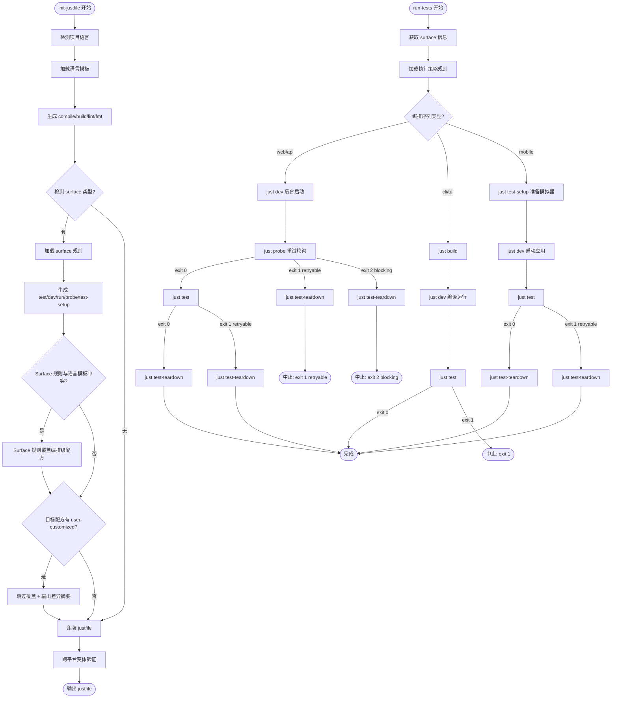

# Surface-Aware Justfile — PRD Spec

> PRD Spec: defines WHAT the feature is and why it exists.

## Background

### Why (Reason)

init-justfile 仅根据项目语言生成 just 配方，忽略了 surface 类型。不同 surface 的测试编排流程根本不同：web/api 须先启动服务→等待就绪→运行测试→关闭；cli/tui 直接构建测试；mobile 需启动模拟器。当前 `test.execution` 委托层在 config.yaml 和 justfile 之间形成了冗余间接层——75% 的实际示例已通过 just 命令调用。

### What (Target)

1. init-justfile 添加 surface 感知层，为 web/api/cli/tui/mobile 5 种 surface 生成差异化的配方组合
2. 移除 `test.execution` 委托层，run-tests 直接调用 just 配方，简化为 2 层编排
3. 将 surface-key 值域从固定枚举（frontend/backend）统一迁移为用户自定义 surface-key（用户自定义 key 名称，surface-type 保持 5 种固定类型作为编排策略映射）
4. 扩展 Task 数据模型，新增 `surface-key` 和 `surface-type` 字段

### Who (Users)

- **Forge 插件开发者**：维护 init-justfile、run-tests 等 skill
- **Forge 用户（项目开发者）**：使用 init-justfile 和 run-tests 的开发者，配置 .forge/config.yaml 的 surfaces 字段后自动获得 surface 感知的配方和编排

## Goals

| Goal | Metric | Notes |
|------|--------|-------|
| 消除 test.execution 委托层冗余 | 编排链路从 4 层降至 2 层 | run-tests 直接调用 just 配方，不再读取 config.yaml 命令模板 |
| Surface 感知配方生成 | 覆盖 5 种 surface 类型（web/api/cli/tui/mobile） | init-justfile 根据 surface 类型生成差异化的 dev/test/probe 等配方 |
| Surface-key 值域统一 | 7+ 组件的 surface-key 值域从固定枚举迁移为用户自定义 | surface-key 名称由用户在 config.yaml 中自定义（如 admin-panel、payment-service）；surface-type 保持 5 种固定类型（web/api/cli/tui/mobile），作为编排策略的映射依据。用户自定义的是 key 名称而非 type 枚举 |
| 零回归保证 | 无 surface 配置的项目输出与当前完全一致 | diff 输出对比验证 |
| Task 数据模型扩展 | Task 新增 surface-key + surface-type 双字段 | 任务模板 frontmatter 包含两个新字段，breakdown-tasks/quick-tasks 自动填充 |

## Scope

### In Scope

**init-justfile surface 感知：**
- [ ] 5 个 surface 规则文件：`skills/init-justfile/rules/surfaces/{web,api,cli,tui,mobile}.md`
- [ ] SKILL.md 新增 surface 检测步骤和 surface 感知配方生成流程
- [ ] CLI/TUI 只生成 `dev`，不生成 `run`
- [ ] 混合项目 dev 配方接受 surface-key 参数
- [ ] `# user-customized` 保护机制（差异摘要 + `--force-regenerate`）

**run-tests 编排简化：**
- [ ] SKILL.md 改为调度器模式，检测 surface type 后加载对应执行策略规则
- [ ] 5 个执行策略规则文件：`skills/run-tests/rules/surfaces/{web,api,cli,tui,mobile}.md`
- [ ] 编排序列由规则文件定义，run-tests 按规则执行

**Config schema 变更：**
- [ ] 移除 `test.execution` 节点文档（残留配置被 Go YAML 宽松解析模式静默忽略，不影响功能；无需迁移或告警）

**Surface-key 统一迁移：**
- [ ] **前置依赖：`forge surfaces` CLI 命令** — 当前状态：需新建。此命令接受文件路径参数，返回 longest-prefix-match 的 surface-key 和 surface-type。breakdown-tasks、quick-tasks、run-tests、quality-gate fix-task 均依赖此 CLI 查询 surface 信息。需在实现本特性前或同时完成开发。
- [ ] prompt.go resolveScope() 完全重写为 surfaces map 集合查询
- [ ] Task Go struct：Scope→SurfaceKey，新增 SurfaceType；AutoGenTaskDef.TestType→SurfaceType
- [ ] 任务模板 frontmatter：scope→surface-key，新增 surface-type
- [ ] breakdown-tasks/quick-tasks 生成任务时填充 surface-key 和 surface-type
- [ ] forge task add CLI：从源任务继承 surface-key/surface-type
- [ ] quality-gate fix-task：从失败文件路径推断 surface-key/type
- [ ] init-justfile 混合项目配方 case 分支更新
- [ ] 16 个 prompt 模板 SURFACE_KEY 变量值域同步
- [ ] 死代码清理：extractTestTypeArg()、genScriptBases

### Out of Scope

- 变更语言模板（`templates/*.just`）
- 变更 `forge-cli/pkg/just/` 门控序列
- 变更 `forge-cli/internal/cmd/quality_gate.go` 或 `testrunner` 的 Go 代码
- 除 `forge surfaces` 外的其他 forge CLI 新命令
- Go 代码子命令直接管理进程（长期方向）
- Feature flag 回滚基础设施

## Flow Description

### Business Flow Description

**init-justfile 生成流程：**

1. 检测语言 → 加载语言模板 → 生成 compile/build/lint/fmt
2. 检测 surface → 加载 surface 规则 → 生成 test/dev/run/probe/test-setup
3. 仲裁：Surface 规则覆盖语言模板的编排级配方（完整清单：test、dev、run、probe、test-setup、test-teardown）
4. 跨平台变体验证 + `# user-customized` 保护
5. 组装为完整 justfile

**run-tests 编排流程（调度器模式）：**

1. 获取 surface 信息（优先任务文档 frontmatter → forge surfaces CLI）
   - 两个来源均失败时：输出错误消息到 stderr（含失败原因 + 恢复提示："请在 .forge/config.yaml 的 surfaces 字段中配置 surface，或在任务 frontmatter 中指定 surface-type"），以 exit 2 退出
2. 加载对应执行策略规则文件（`rules/surfaces/<type>.md`）
   - 规则文件不存在时：输出错误消息到 stderr（"surface 类型 '<type>' 的执行策略规则文件不存在，支持的类型：web/api/cli/tui/mobile"），以 exit 2 退出
3. 按策略编排执行 just 配方序列
4. 每步检查退出码：exit 0 继续；exit 1（retryable）执行 teardown 后以 exit 1 退出；exit 2（blocking）执行 teardown 后以 exit 2 退出

**Surface 编排模式：**

| Surface | 编排序列 | 关键差异 |
|---------|---------|----------|
| web | dev(后台) → probe → test → teardown | probe 检查页面根路径 |
| api | dev(后台) → probe → test → teardown | probe 检查 /healthz |
| cli | build → dev → test | 无服务启动，无需 probe |
| tui | build → dev → test | 无服务启动，无需 probe |
| mobile | test-setup → dev → test → teardown | test-setup 准备模拟器 |

### 跨组件数据流

Surface 信息从配置到执行的完整传递链：

| 步骤 | 来源组件 | 目标组件 | 数据格式 | 传递方式 |
|------|---------|---------|---------|---------|
| 1 | `.forge/config.yaml` (surfaces 字段) | `forge surfaces` CLI | `map<string,string>`：key=surface-key, value=surface-type | 文件读取 + CLI 查询 |
| 2 | `forge surfaces` CLI | `breakdown-tasks` / `quick-tasks` skill | JSON：`{"surface-key": "admin-panel", "surface-type": "web"}` | CLI 输出 stdout，skill 解析 |
| 3 | `breakdown-tasks` / `quick-tasks` skill | 任务 frontmatter (YAML) | frontmatter 字段：`surface-key: admin-panel`，`surface-type: web` | 写入任务 .md 文件 |
| 4 | 任务 frontmatter | `index.json` (Task Go struct) | JSON 字段：`"surfaceKey": "admin-panel"`，`"surfaceType": "web"` | Go struct 序列化 |
| 5 | `index.json` | `run-tests` skill | 从 Task struct 读取 SurfaceKey + SurfaceType | Go 函数调用 |
| 6 | `run-tests` skill | 执行策略规则文件 | 规则文件路径：`rules/surfaces/{surface-type}.md` | 文件加载 |
| 7 | `forge surfaces` CLI | `init-justfile` skill | surface-key 列表及其类型 | CLI 输出 stdout，skill 生成对应配方 |

Fallback 链：任务 frontmatter → `forge surfaces <file-path>` longest-prefix-match → 错误退出（见 run-tests 编排流程步骤 1）。

### Error Handling Paths

| 错误场景 | 检测位置 | 行为 | Exit Code |
|---------|---------|------|-----------|
| 未知 surface 类型 | run-tests 加载规则文件 | stderr 错误消息（含支持的类型列表）+ exit 2 | 2 (blocking) |
| Surface 规则文件缺失 | run-tests / init-justfile | stderr 错误消息（文件路径 + 恢复提示："运行 init-justfile 重新生成规则文件"）+ exit 2 | 2 (blocking) |
| `forge surfaces` CLI 执行失败 | run-tests / breakdown-tasks | stderr 错误消息（CLI 输出 + 恢复提示："检查 forge CLI 是否已安装且版本 >= 要求版本"）+ exit 1 | 1 (retryable) |
| just 版本 < 1.4.0 | init-justfile / run-tests 首步 | stderr 错误消息（当前版本 + 要求 "just >= 1.4.0"）+ exit 2 | 2 (blocking) |
| Surface 信息两个来源均不可用 | run-tests 步骤 1 | stderr 错误消息（含恢复提示）+ exit 2 | 2 (blocking) |
| config.yaml surfaces 格式错误 | init-justfile / run-tests 读取配置 | stderr 错误消息（具体 YAML 解析错误 + 恢复提示："请检查 .forge/config.yaml 的 surfaces 字段格式，应为 map<string, string>，如 {admin-panel: web}"）+ exit 2 | 2 (blocking) |
| `forge surfaces` CLI 输出格式异常 | breakdown-tasks / run-tests 解析 CLI 输出 | stderr 错误消息（实际输出内容 + 恢复提示："forge surfaces CLI 输出格式异常，期望 JSON 格式 {surface-key, surface-type}，请确认 forge CLI 版本"）+ exit 1 | 1 (retryable) |

### Surface-key 迁移实施流程

Goal 3/4 的 surface-key 迁移涉及 9 项变更点，按依赖关系分三阶段实施：

**阶段 1 — 数据模型与查询基础设施（无外部依赖）：**
1. `task/types.go`：Scope → SurfaceKey，新增 SurfaceType 字段，保留 `GetSurfaceKey()` 兼容访问
2. `autogen.go`：TestType → SurfaceType，传播链更新
3. `prompt.go`：resolveScope() 重写为 surfaces map 集合查询
4. 开发 `forge surfaces` CLI 命令

**阶段 2 — 上游组件适配（依赖阶段 1）：**
5. breakdown-tasks / quick-tasks：任务生成时调用 `forge surfaces` CLI 填充双字段
6. forge task add CLI：从源任务继承 surface-key/surface-type
7. quality-gate fix-task：从失败文件路径推断 surface-key/type

**阶段 3 — 下游消费与清理（依赖阶段 2）：**
8. init-justfile：混合项目配方 case 分支更新
9. 16 个 prompt 模板 SURFACE_KEY 变量值域同步
10. 死代码清理：extractTestTypeArg()、genScriptBases

关键依赖链：阶段 1 → 阶段 2 → 阶段 3 严格顺序；同一阶段内可并行实施。

### 混合项目生成与编排流程

混合项目（如同时包含 web + api）的 init-justfile 生成策略：

1. **检测**：init-justfile 从 `forge surfaces` CLI 获取所有 surface-key 及其类型
2. **配方生成**：为每个 surface-key 生成独立的编排配方组，配方名带 surface-key 前缀（surface-key 仅允许 `[a-zA-Z0-9_-]` 字符，不含 `/` 和 `+`，以兼容 just 配方名语法）：
   - `dev-<surface-key>`：启动对应 surface 的 dev server（如 `dev-admin-panel`、`dev-payment-service`）
   - `probe-<surface-key>`：对应的就绪检查
   - `test-<surface-key>`：对应的测试执行
   - `teardown-<surface-key>`：对应的清理
3. **聚合配方**：生成无前缀的聚合配方作为默认入口：
   - `dev`：按依赖顺序串行启动所有 dev server（如 api 先于 web；just 的 `(dep1 dep2)` 语法为串行依赖列表，非并行）
   - `test`：按 surface 编排表顺序执行各 surface 的 test 序列
4. **编排表**：在生成的 justfile 头部注释中记录编排顺序，供 run-tests 解析

示例（web + api 混合项目）：
```
# 编排顺序: payment-service(api) → admin-panel(web)
dev: (dev-payment-service dev-admin-panel)
dev-payment-service:  # 后台启动 api server
dev-admin-panel:      # 后台启动 web server
probe-payment-service: # 检查 /healthz
probe-admin-panel:     # 检查页面根路径
test: (test-payment-service test-admin-panel)
test-payment-service: # 运行 api 测试
test-admin-panel:     # 运行 web 测试
```

### Probe 重试规格

Probe 统一重试参数，定义于 Flow Description 单一处：

| 参数 | 值 | 说明 |
|------|-----|------|
| 最大重试次数 | 3 | 连续失败 3 次后判定为失败 |
| 重试间隔 | 30 秒 | 每次重试间隔固定 30 秒 |
| 总超时 | 90 秒 | max-retries × interval = 3 × 30s |
| 失败后行为 | teardown + abort | 不重试 probe、不重启 dev（HARD-GATE） |

日志格式：`[probe] [retry <current>/<max>] <url> — <reason>`

### Exit Code 语义与 HARD-GATE 定义

遵循 BIZ-error-reporting-001 统一 exit code 语义：

| Exit Code | 语义 | probe 场景行为 | 后续操作 |
|-----------|------|---------------|---------|
| 0 | 成功 | 服务就绪 | 继续执行 test |
| 1 | retryable failure | 连接超时、DNS 解析失败等临时性错误 | teardown → 以 exit 1 退出（可由上层调度器重试整个编排） |
| 2 | blocking error | 配置错误、端口被占用、认证失败等非临时性错误 | teardown → 以 exit 2 退出（不可重试，需人工干预） |

**HARD-GATE 定义**：probe 失败后，禁止在同一编排周期内重试 probe 或重启 dev。这是不可违反的约束——若 probe 已判定失败，说明服务存在根本性问题，重试只会掩盖问题。上层调度器（如 CI）可以 exit code 区分 retryable(1) 和 blocking(2)，决定是否在新的编排周期中重试。

遵循 BIZ-error-reporting-002：所有错误消息包含 (1) 具体失败原因 和 (2) 恢复提示。

### Business Flow Diagram



## Functional Specs

> 本特性无 UI 表面（纯 CLI/工具链/SKILL 文档变更），跳过 prd-ui-functions.md。

### Related Changes

| # | Module | Change Point | Updated Logic |
|------|----------|----------|------------|
| 1 | init-justfile SKILL.md | 新增 surface 检测步骤 + surface 感知配方生成 | 检测 → 加载规则 → 生成编排级配方 |
| 2 | run-tests SKILL.md | 改为调度器模式，移除 test.execution 读取 | 检测 surface → 加载规则 → 按序列执行 |
| 3 | prompt.go | resolveScope() 完全重写 | 从 projectType 硬编码切换为 surfaces map 集合查询 |
| 4 | task/types.go | Scope→SurfaceKey，新增 SurfaceType | 双字段 JSON 兼容，GetSurfaceKey() 统一访问 |
| 5 | autogen.go | TestType→SurfaceType，传播链全部更新 | per-type 任务值不变，字段名统一 |
| 6 | config-schema.md | 移除 test.execution 文档 | 无 GetConfigValue 变更，残留节点保持当前行为 |
| 7 | breakdown-tasks/quick-tasks | 任务生成填充 surface-key + surface-type | 推断逻辑改为 forge surfaces CLI 动态查询 |
| 8 | forge task add CLI | 从源任务继承 surface-key/surface-type | 无源任务时单 surface 项目 surface-type 填充唯一值 |
| 9 | quality-gate fix-task | 从失败文件路径推断 surface-key/type | 复用重写后的 resolveScope() |
| 10 | 16 个 prompt 模板 | SURFACE_KEY 变量值域同步 | 模板语法不变，运行时值变化 |
| 11 | surface-key-assignment 规则 | 文件路径分类改为 CLI 动态查询 | forge surfaces <path> longest-prefix-match |

## Other Notes

### Performance Requirements

- Surface 规则文件加载不增加 init-justfile 超过 1 秒的额外耗时
- just >= 1.4.0（`[linux]`/`[windows]` recipe attribute 在 1.4.0 引入），init-justfile 和 run-tests 首步检查版本

### Compatibility

- Windows/macOS/Linux 三平台均可用（just 配方通过 `[linux]`/`[windows]` 原生属性分支）
- 无 surface 配置的项目输出与当前完全一致（零回归）

### Reliability

- Dev server 崩溃时 probe 超时后执行 teardown，不遗留孤儿进程
- 会话中断后利用现有 run-tests 的 `.forge/test-state.json` 恢复机制清理残留进程
- teardown 幂等（PID 不存在时跳过）
- teardown 自身失败处理：PID 不存在时跳过（幂等保证）；kill 失败时重试一次，若仍失败则日志记录进程信息并继续后续清理步骤；最终确保 `.forge/test-state.json` 状态文件被清理（删除或标记为 completed）

### Observability

- 编排过程中每个步骤输出状态（格式见 Probe 重试规格的日志格式定义）

### Rollback

- 回滚方式：git revert（无 feature flag）
- per-surface 测试配置（`tests/{surface-key}/config.yaml`）由 testkit 解析，与 run-tests 编排层独立

---

## Quality Checklist

- [x] Is the requirement title accurate and descriptive
- [x] Does the background include all three elements: reason, target, users
- [x] Are the goals quantified
- [x] Is the flow description complete
- [x] Does the business flow diagram exist (Mermaid format)
- [x] Is prd-ui-functions.md referenced and UI specs complete (skipped: no UI surface)
- [x] Are related changes thoroughly analyzed
- [x] Are non-functional requirements considered (performance / data / monitoring / security)
- [x] Are all tables filled completely
- [x] Is there any ambiguous or vague wording (exit code 语义已对齐 BIZ 规范，probe 参数已统一，surface-key/type 语义已澄清)
- [x] Is the spec actionable and verifiable
