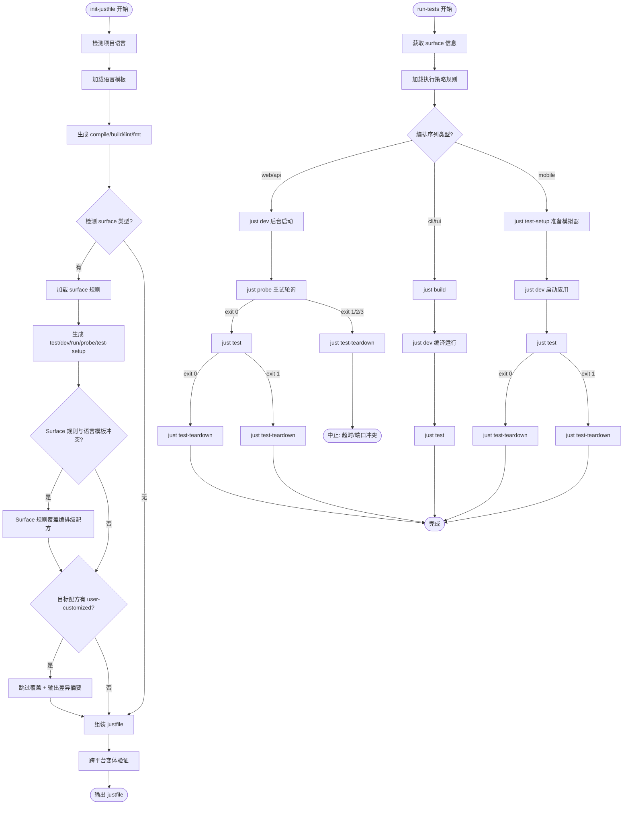

# Surface-Aware Justfile — PRD Spec

> PRD Spec: defines WHAT the feature is and why it exists.

## Background

### Why (Reason)

init-justfile 仅根据项目语言生成 just 配方，忽略了 surface 类型。不同 surface 的测试编排流程根本不同：web/api 须先启动服务→等待就绪→运行测试→关闭；cli/tui 直接构建测试；mobile 需启动模拟器。当前 `test.execution` 委托层在 config.yaml 和 justfile 之间形成了冗余间接层——75% 的实际示例已通过 just 命令调用。

### What (Target)

1. init-justfile 添加 surface 感知层，为 web/api/cli/tui/mobile 5 种 surface 生成差异化的配方组合
2. 移除 `test.execution` 委托层，run-tests 直接调用 just 配方，简化为 2 层编排
3. 将 surface-key 值域从固定枚举（frontend/backend）统一迁移为用户自定义 surface-key
4. 扩展 Task 数据模型，新增 `surface-key` 和 `surface-type` 字段

### Who (Users)

- **Forge 插件开发者**：维护 init-justfile、run-tests 等 skill
- **Forge 用户（项目开发者）**：使用 init-justfile 和 run-tests 的开发者，配置 .forge/config.yaml 的 surfaces 字段后自动获得 surface 感知的配方和编排

## Goals

| Goal | Metric | Notes |
|------|--------|-------|
| 消除 test.execution 委托层冗余 | 编排链路从 4 层降至 2 层 | run-tests 直接调用 just 配方，不再读取 config.yaml 命令模板 |
| Surface 感知配方生成 | 覆盖 5 种 surface 类型（web/api/cli/tui/mobile） | init-justfile 根据 surface 类型生成差异化的 dev/test/probe 等配方 |
| Surface-key 值域统一 | 7+ 组件的 surface-key 值域从固定枚举迁移为用户自定义 | prompt.go resolveScope() 完全重写，surface-key-assignment 改为 CLI 动态查询 |
| 零回归保证 | 无 surface 配置的项目输出与当前完全一致 | diff 输出对比验证 |
| Task 数据模型扩展 | Task 新增 surface-key + surface-type 双字段 | 任务模板 frontmatter 包含两个新字段，breakdown-tasks/quick-tasks 自动填充 |

## Scope

### In Scope

**init-justfile surface 感知：**
- [ ] 5 个 surface 规则文件：`skills/init-justfile/rules/surfaces/{web,api,cli,tui,mobile}.md`
- [ ] SKILL.md 新增 surface 检测步骤和 surface 感知配方生成流程
- [ ] CLI/TUI 只生成 `dev`，不生成 `run`
- [ ] 混合项目 dev 配方接受 surface-key 参数
- [ ] `# user-customized` 保护机制（差异摘要 + `--force-regenerate`）

**run-tests 编排简化：**
- [ ] SKILL.md 改为调度器模式，检测 surface type 后加载对应执行策略规则
- [ ] 5 个执行策略规则文件：`skills/run-tests/rules/surfaces/{web,api,cli,tui,mobile}.md`
- [ ] 编排序列由规则文件定义，run-tests 按规则执行

**Config schema 变更：**
- [ ] 移除 `test.execution` 节点文档

**Surface-key 统一迁移：**
- [ ] prompt.go resolveScope() 完全重写为 surfaces map 集合查询
- [ ] Task Go struct：Scope→SurfaceKey，新增 SurfaceType；AutoGenTaskDef.TestType→SurfaceType
- [ ] 任务模板 frontmatter：scope→surface-key，新增 surface-type
- [ ] breakdown-tasks/quick-tasks 生成任务时填充 surface-key 和 surface-type
- [ ] forge task add CLI：从源任务继承 surface-key/surface-type
- [ ] quality-gate fix-task：从失败文件路径推断 surface-key/type
- [ ] init-justfile 混合项目配方 case 分支更新
- [ ] 16 个 prompt 模板 SURFACE_KEY 变量值域同步
- [ ] 死代码清理：extractTestTypeArg()、genScriptBases

### Out of Scope

- 变更语言模板（`templates/*.just`）
- 变更 `forge-cli/pkg/just/` 门控序列
- 变更 `forge-cli/internal/cmd/quality_gate.go` 或 `testrunner` 的 Go 代码
- 新增 forge CLI 命令
- Go 代码子命令直接管理进程（长期方向）
- Feature flag 回滚基础设施

## Flow Description

### Business Flow Description

**init-justfile 生成流程：**

1. 检测语言 → 加载语言模板 → 生成 compile/build/lint/fmt
2. 检测 surface → 加载 surface 规则 → 生成 test/dev/run/probe/test-setup
3. 仲裁：Surface 规则覆盖语言模板的编排级配方（test/dev/run/probe）
4. 跨平台变体验证 + `# user-customized` 保护
5. 组装为完整 justfile

**run-tests 编排流程（调度器模式）：**

1. 获取 surface 信息（优先任务文档 frontmatter → forge surfaces CLI）
2. 加载对应执行策略规则文件（`rules/surfaces/<type>.md`）
3. 按策略编排执行 just 配方序列
4. 每步检查退出码，非零触发 abort 或 teardown

**Surface 编排模式：**

| Surface | 编排序列 | 关键差异 |
|---------|---------|----------|
| web | dev(后台) → probe → test → teardown | probe 检查页面根路径 |
| api | dev(后台) → probe → test → teardown | probe 检查 /healthz |
| cli | build → dev → test | 无服务启动，无需 probe |
| tui | build → dev → test | 无服务启动，无需 probe |
| mobile | test-setup → dev → test → teardown | test-setup 准备模拟器 |

### Business Flow Diagram

## Functional Specs

> 本特性无 UI 表面（纯 CLI/工具链/SKILL 文档变更），跳过 prd-ui-functions.md。

### Related Changes

| # | Module | Change Point | Updated Logic |
|------|----------|----------|------------|
| 1 | init-justfile SKILL.md | 新增 surface 检测步骤 + surface 感知配方生成 | 检测 → 加载规则 → 生成编排级配方 |
| 2 | run-tests SKILL.md | 改为调度器模式，移除 test.execution 读取 | 检测 surface → 加载规则 → 按序列执行 |
| 3 | prompt.go | resolveScope() 完全重写 | 从 projectType 硬编码切换为 surfaces map 集合查询 |
| 4 | task/types.go | Scope→SurfaceKey，新增 SurfaceType | 双字段 JSON 兼容，GetSurfaceKey() 统一访问 |
| 5 | autogen.go | TestType→SurfaceType，传播链全部更新 | per-type 任务值不变，字段名统一 |
| 6 | config-schema.md | 移除 test.execution 文档 | 无 GetConfigValue 变更，残留节点保持当前行为 |
| 7 | breakdown-tasks/quick-tasks | 任务生成填充 surface-key + surface-type | 推断逻辑改为 forge surfaces CLI 动态查询 |
| 8 | forge task add CLI | 从源任务继承 surface-key/surface-type | 无源任务时单 surface 项目 surface-type 填充唯一值 |
| 9 | quality-gate fix-task | 从失败文件路径推断 surface-key/type | 复用重写后的 resolveScope() |
| 10 | 16 个 prompt 模板 | SURFACE_KEY 变量值域同步 | 模板语法不变，运行时值变化 |
| 11 | surface-key-assignment 规则 | 文件路径分类改为 CLI 动态查询 | forge surfaces <path> longest-prefix-match |

## Other Notes

### Performance Requirements

- Surface 规则文件加载不增加 init-justfile 超过 1 秒的额外耗时
- just >= 1.4.0（`[linux]`/`[windows]` recipe attribute 在 1.4.0 引入），init-justfile 和 run-tests 首步检查版本

### Compatibility

- Windows/macOS/Linux 三平台均可用（just 配方通过 `[linux]`/`[windows]` 原生属性分支）
- 无 surface 配置的项目输出与当前完全一致（零回归）

### Reliability

- Dev server 崩溃时 probe 超时后执行 teardown，不遗留孤儿进程
- 会话中断后可通过 `.forge/test-state.json` 恢复清理
- teardown 幂等（PID 不存在时跳过）

### Observability

- 编排过程中每个步骤输出状态（如 `[probe] [retry 3/30] http://localhost:3000 — 连接被拒绝`）

### Rollback

- 回滚方式：git revert（无 feature flag）
- per-surface 测试配置（`tests/{surface-key}/config.yaml`）由 testkit 解析，与 run-tests 编排层独立

---

## Quality Checklist

- [x] Is the requirement title accurate and descriptive
- [x] Does the background include all three elements: reason, target, users
- [x] Are the goals quantified
- [x] Is the flow description complete
- [x] Does the business flow diagram exist (Mermaid format)
- [x] Is prd-ui-functions.md referenced and UI specs complete (skipped: no UI surface)
- [x] Are related changes thoroughly analyzed
- [x] Are non-functional requirements considered (performance / data / monitoring / security)
- [x] Are all tables filled completely
- [x] Is there any ambiguous or vague wording
- [x] Is the spec actionable and verifiable
