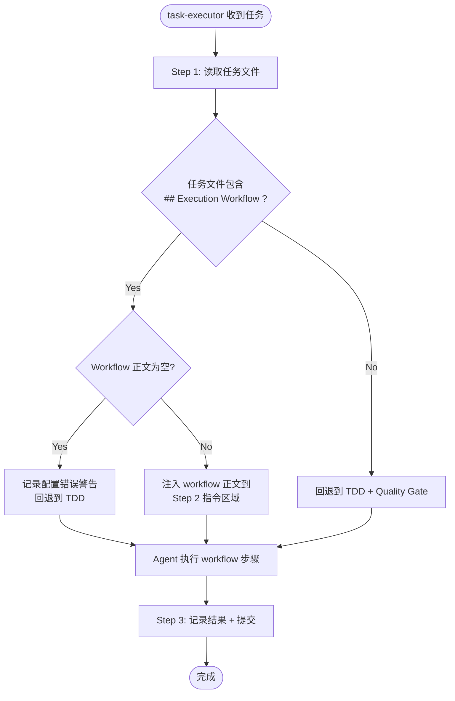

# task-executor-skeleton — PRD Spec

> PRD Spec: defines WHAT the feature is and why it exists.

## Background

### Why (Reason)

task-executor 硬编码了 TDD 工作流（Step 2-3），所有非 MAIN_SESSION 任务走同一条路径。执行型任务（如 T-test-3 "Run e2e Tests"）被强行塞入 TDD 循环，导致 14 分钟无效重试。`noTest` 标志作为权宜之计混入模板 frontmatter，语义模糊——它不表示"不需要测试"，而是"不走 TDD 循环"，导致新模板配置频繁出错。

### What (Target)

引入 `## Execution Workflow` 机制：每个任务模板声明自己的执行步骤，task-executor 读取并执行。同时完全移除 `noTest`，消除歧义。task-executor 变成纯骨架：读任务 → 执行 workflow → 记录 → 提交。

### Who (Users)

- **Template Author** — 编写任务模板的开发者，需要在模板中添加 Execution Workflow 段落
- **Task-executor Agent** — 读取并执行 workflow 的 AI agent，从硬编码 TDD 变为通用骨架
- **Forge Maintainer** — 维护 harness 的开发者，需要从代码中清理 noTest/NO_TEST

## Goals

| Goal | Metric | Notes |
|------|--------|-------|
| 消除执行型任务的无效重试 | T-test-3 执行时间 < 5 min（当前 ~14 min） | 核心收益 |
| 消除 noTest 歧义 | grep `noTest` / `NO_TEST` 零匹配 + 语义审查无残留分支 | 完全移除 |
| 统一任务执行机制 | 所有 16 个模板包含 `## Execution Workflow` | 10 breakdown + 6 quick |
| 向后兼容 | 无 Execution Workflow 的旧任务回退到 TDD，行为不变 | fallback 保障 |

## Scope

### In Scope

- [ ] `agents/task-executor.md`: Step 2-3 合并为"执行 workflow"（从任务文件读取），删除 NO_TEST input
- [ ] 所有 breakdown-tasks 模板（10 个，不含 manifest-update-tasks.md 和 eval-test-cases.md）: 添加 `## Execution Workflow`，删除 `noTest`
- [ ] 所有 quick-tasks 模板（6 个，不含 manifest-quick.md）: 添加 `## Execution Workflow`，删除 `noTest`
- [ ] `index.schema.json` (breakdown + quick): 删除 `noTest` 字段定义
- [ ] `commands/run-tasks.md`: 删除 NO_TEST 从 claim 解析和 dispatch
- [ ] `commands/execute-task.md`: 删除 NO_TEST 相关内容
- [ ] `task-cli`: 删除 noTest 字段和相关逻辑（types.go, record.go, claim 输出）
- [ ] `skills/record-task/SKILL.md`: 删除 noTest 引用
- [ ] `skills/quick-tasks/SKILL.md`: 删除 `--no-test` 标志
- [ ] `skills/consolidate-specs/SKILL.md`: 删除 noTest 引用

### Out of Scope

- 模板内容重写（仅添加 Execution Workflow 段落，不改动现有 Implementation Notes）
- mainSession 任务的路由逻辑（已由 dispatcher 处理，不涉及 task-executor）
- `## Execution Workflow` 的模板化/标准化（未来优化，将常用 workflow 提取为可引用片段）
- `task add --template` 自动注入 Execution Workflow（未来优化）

## Flow Description

### Business Flow Description

task-executor 收到任务后，读取任务文件并检测是否包含 `## Execution Workflow` 标题。若存在且正文非空，将其注入到 agent prompt 的 Step 2 指令区域，替换硬编码的 TDD 步骤。若不存在，回退到当前 TDD + Quality Gate 步骤。若标题存在但正文为空，视为配置错误，记录警告并回退到 TDD。执行完成后统一进入 Step 3（记录 + 提交）。

### Business Flow Diagram

## Functional Specs

> This feature has no UI surface. All changes are internal to the forge harness (agent prompts, task templates, CLI code, skill docs).

### Related Changes

| # | Component | Change Point | Updated Logic |
|---|-----------|-------------|---------------|
| 1 | task-executor.md | Step 2-3 硬编码 TDD → 读取 Execution Workflow | 段落检测 + 注入 + fallback |
| 2 | task-cli (Go) | noTest 字段及相关逻辑 | types.go 删除字段、record.go 删除逻辑、claim 输出移除 NO_TEST |
| 3 | run-tasks.md / execute-task.md | NO_TEST 解析和传递 | 删除 claim 输出解析和 dispatch prompt 中的 NO_TEST |
| 4 | 16 任务模板 | 添加 Execution Workflow + 删除 noTest frontmatter | 每个模板声明自己的执行步骤 |
| 5 | index.schema.json × 2 | noTest 字段定义 | 删除字段定义，验证模板合规 |
| 6 | 3 个 skill 文档 | noTest / --no-test 引用 | record-task, quick-tasks, consolidate-specs |

## Other Notes

### Compatibility Requirements

- 无 `## Execution Workflow` 的旧任务文件自动 fallback 到 TDD + Quality Gate，行为不变
- 回退逻辑是 task-executor 的内置行为，无需模板声明

### Quality Requirements

- task-executor 须严格遵循 workflow 指令，使用 `<EXTREMELY-IMPORTANT>` / `<HARD-RULE>` 标签保障（与 "ONE TASK PER INVOCATION" 规则机制一致，该规则自部署以来零违规）
- noTest 移除后须 grep 确认零匹配 + 逐文件审查条件分支无残留
- 每个 Execution Workflow 模板须包含明确的结束条件，不允许开放式指令

---

## Quality Checklist

- [x] Is the requirement title accurate and descriptive
- [x] Does the background include all three elements: reason, target, users
- [x] Are the goals quantified
- [x] Is the flow description complete
- [x] Does the business flow diagram exist (Mermaid format)
- [x] Is there any ambiguous or vague wording — none
- [x] Is the spec actionable and verifiable
