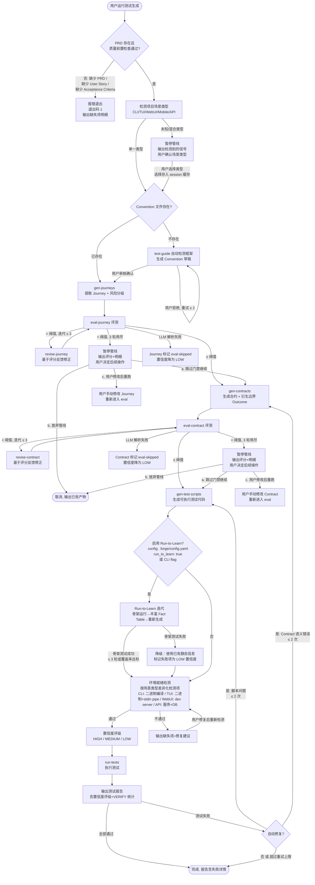

# Test Capability 2.0 — PRD Spec

> PRD Spec: defines WHAT the feature is and why it exists.

## Background

### Why (Reason)

Forge 测试管线存在三大结构性缺陷：

1. **双路径并存**：`gen-test-cases`（旧路径）与 `gen-journeys → gen-contracts → gen-test-scripts`（Journey-Contract 新路径）并行存在，都汇入 `gen-test-scripts`，用户不知道该走哪条
2. **测试深度不足**：合约规范和测试脚本生成主要覆盖 happy path，边界值、异常输入、错误恢复、集成交互等场景需要手动补充
3. **通用性有限**：Convention 文件仅覆盖 3 个框架（Go testing、Vitest、Ginkgo），Python/Java/Rust 等主流生态无内置支持；Journey-Contract 路径上缺少评测门禁；Mobile 场景无任何测试生成支持（无 Maestro 集成、无 deep link 覆盖），接入成本极高

v3.0.0 是重构的最佳窗口 — 正处于大版本分支上，可以做大范围变更而不破坏已发布版本。

### What (Target)

将 Forge 测试能力升级为 2.0 架构：
- 管线统一：退休旧路径，Journey-Contract 成为唯一测试生成路径
- 深度增强：边界/异常场景自动衍生、风险驱动测试密度、场景差异化测试策略
- 通用扩展：扩充内置 Convention 库、test-guide 自动生成 Convention 草稿
- 评测补全：新增 eval-journey 和 eval-contract 评测技能
- 信息增强：Run-to-Learn 机制填补运行时信息缺口

**定位**：管线只生成开发者手动编写成本高的复杂测试（Contract 测试 + Journey 烟测试）。单元测试由开发者在 feature 开发中自行编写，不在管线范围内。

### Who (Users)

- **Forge 用户（项目开发者）**：使用 Forge 的 /quick 或 full pipeline 创建功能，期望管线自动生成高质量测试
- **Forge 维护者**：维护 Forge 插件技能，需要清晰的管线架构和可扩展的场景类型系统

## Goals

| Goal | Metric | Notes |
|------|--------|-------|
| 消除双路径困惑 | gen-test-cases 及所有相关文件完全删除 | 用户只有一条清晰的测试生成路径 |
| 提升测试深度 | 高风险 Journey 平均测试数 ≥ 13，且高风险旅程测试数 ≥ 低风险旅程 × 1.5 | 风险驱动密度差异化；绝对下限防止低基数合规 |
| 提升测试信息质量 | Run-to-Learn 迭代后 Fact Table 覆盖率提升 ≥ 20 个百分点 | 解决信息缺口根本问题 |
| 提升通用性 | 内置 ≥ 3 个新 Convention 文件（pytest、JUnit、Rust） | 新项目接入成本降低 |
| 建立评测门禁 | eval-journey/eval-contract 评分 ≥ 850/1000（基于 gold standard 评分集校准） | 管线关键节点质量可控；阈值通过人工标注的 gold standard Journey/Contract 文档集验证 |
| 降低 Mobile 接入成本 | 新 Mobile 项目从零到可运行 Maestro 测试 ≤ 30 分钟（含 Convention 草稿审核）；生成 Maestro YAML 骨架 + deep link 测试覆盖 ≥ 2 个核心 Journey | 尽力而为，不追求高覆盖；对照度量：接入耗时（分钟）+ 自动生成 Journey 覆盖数 |

## Scope

### In Scope

- [ ] 退休 gen-test-cases 技能及相关评测能力（eval-test-cases 命令、test-cases 评测 rubric、类型子 rubric）
- [ ] 删除 test.graduate 任务类型和相关任务文件
- [ ] 新增 eval-journey 评测技能（含 rubric）
- [ ] 新增 eval-contract 评测技能（含 rubric）

**Eval Rubric 评分维度框架：**

eval-journey 和 eval-contract 的 rubric 共享以下评分维度（总分 1000）：

| 维度 | 分值范围 | 评价内容 |
|------|---------|---------|
| 完整性（Completeness） | 0–200 | 所有必需字段/section 是否齐全，Outcome 是否覆盖 happy path + 必须衍生场景 |
| 语义纯度（Semantic Purity） | 0–200 | 维度值是否为自然语言描述，无 regex/框架断言混入 |
| 前置条件互斥性（Precondition Exclusivity） | 0–150 | 同一 Step 内 Outcome 的 Preconditions 是否可区分且互斥 |
| 事实依据（Fact Alignment） | 0–150 | 区分两类声明：**事实声明**（基于 Fact Table 已知事实，需可追溯到具体 fact_id；未知来源标注 `UNKNOWN`）和**合理推理声明**（LLM 衍生的边界 Outcome 不在 Fact Table 中，但基于场景类型 `required_outcomes` 规则衍生，需标注推理依据和 `source: inferred`）。评分标准：事实声明需有 fact_id 对应；推理声明需有 `required_outcomes` 规则支撑 |
| 场景适配（Scenario Fitness） | 0–150 | 是否遵循场景类型的 `required_outcomes` 规则和测试策略比例 |
| 一致性（Internal Consistency） | 0–150 | Journey Invariants 是否在所有 Step 中成立，跨 Step 引用是否一致 |
- [ ] 边界/异常场景自动衍生引擎：基于场景类型 `required_outcomes` 规则 + 项目 Fact Table 自动生成边界和异常 Outcome
- [ ] 风险驱动测试密度：基于 Journey 的 risk_level 字段差异化衍生 Outcome 数量
- [ ] Contract 测试（集成层）+ Journey 烟测试（E2E 层）生成，按场景类型差异化侧重比例
- [ ] 场景差异化：CLI/TUI/WebUI/API 核心支持 + Mobile 尽力而为
- [ ] 可扩展场景类型系统：场景类型配置文件（`scenarios/` 目录）定义检测规则、测试策略、环境检测项、必须 Outcome，eval rubric 根据配置动态适配评分
- [ ] 内置 Convention 文件扩充（pytest、JUnit、Rust/cargo test）
- [ ] test-guide 增强：自动扫描项目信号检测测试框架并生成 Convention 草稿
- [ ] gen-test-scripts 适配增强后的合约规范和场景差异化
- [ ] Run-to-Learn 机制：骨架测试 → 运行捕获输出 → 丰富 Fact Table → 重新生成
- [ ] 场景特定执行环境就绪检测（CLI/TUI/WebUI/API）
- [ ] 置信度评级系统（HIGH/MEDIUM/LOW）
- [ ] 质量门禁更新以反映新管线：将现有单一门禁（gen-test-cases 评分）替换为多阶段门禁（eval-journey → eval-contract → 置信度评级），每阶段独立 pass/fail 判定，门禁结果汇入统一质量报告

**与 BIZ-quality-gate-001 的集成关系**：
- BIZ-quality-gate-001 管线（compile → fmt → lint → unit/integration → e2e）验证的是**项目源代码质量**，属于开发阶段门禁
- 新 eval 门禁（eval-journey → eval-contract）验证的是**测试管线产物的文档质量**，属于测试生成阶段门禁
- 两者**串行执行、独立判定**：BIZ-quality-gate-001 在开发阶段完成；新 eval 门禁在测试生成阶段执行
- 置信度评级是两者的交汇点：BIZ-quality-gate-001 的 e2e 测试结果作为 Fact Table 的 runtime 来源，影响置信度评级

### Out of Scope

- 单元测试生成（开发者已在 feature 开发中编写）
- 性能/负载测试
- 安全测试
- 视觉回归测试
- CI/CD 集成或测试环境管理
- 合约 6 维度模型（schema）修改（注：`required_outcomes` 是按场景类型配置的实例数据，不属于 schema 变更）
- 已使用 gen-test-cases 项目的迁移工具
- gen-test-scripts 的编译/lint 执行器核心逻辑变更（注：为 Maestro 新增 YAML 输出格式属于场景差异化适配，不涉及编译/lint 逻辑本身）
- 跨场景组合编排
- 执行环境自动准备与配置（仅做就绪检测）
- 失败诊断场景特定策略
- 测试数据管理场景特定策略

## Core Concepts

- **Journey**：描述用户完成某个目标的真实工作流，是测试的主要组织单元。包含 Name（kebab-case）、Risk（High/Medium/Low）、Steps（有序动作序列）、Invariants（跨步骤不变量）。（详见 `docs/conventions/testing-journey-contract.md`）
- **Step**：Journey 中的单个用户动作，映射到一个 Contract，包含一个或多个 Outcome。
- **Outcome**：特定场景（成功、错误变体、边界情况）下完整的 Contract 六维声明集合。同一 Step 内的 Outcome 通过 Preconditions 区分且必须互斥。
- **骨架测试（Skeleton Test）**：gen-test-scripts 生成的特殊测试产物——包含 setup、执行、输出捕获逻辑，但不含断言。其唯一目的是通过实际运行捕获被测系统的运行时行为，将结果写入 Fact Table 以提升后续生成测试的精确度。

## Flow Description

### Business Flow Description

用户通过 Forge 管线生成复杂测试的完整流程：

**前置条件**：项目必须已有 PRD 文档（`docs/features/<slug>/prd/`）。PRD 质量前置检查：PRD 必须包含至少 1 个 User Story（含 As a / I want / So that 结构），且每个 Story 至少包含 1 条 Acceptance Criteria。若 PRD 不存在或质量前置检查未通过，管线在步骤 1 报错并输出缺失项明细（缺少 PRD / 缺少 User Story / 缺少 Acceptance Criteria），提示用户先完善 PRD。

**阶段一：管线准备**
1. 用户在项目中运行测试生成技能（如 `/gen-journeys`）
2. 系统检测项目的场景类型（CLI/TUI/WebUI/Mobile/API），检测规则见下表：

| 信号组合 | 场景类型 |
|---------|---------|
| `main.go` + `cobra.Command` / `urfave/cli` | CLI |
| `main.go` + `tea.Program` / `tview.Application` | TUI |
| `package.json` + `React` / `Vue` / `Svelte` + 浏览器 DOM 入口 | WebUI |
| `AndroidManifest.xml` 或 `*.xcodeproj` + UI 框架依赖 | Mobile |
| `main.go` + `http.Handler` / `gin` / `echo` 且无前端入口 | API |
| `package.json` + `express` / `fastify` / `koa` 且无前端框架 | API |
| `pyproject.toml`/`setup.py` + `pytest`/`unittest` 且无前端入口 | API |
| `pom.xml`/`build.gradle` + `JUnit`/`TestNG` 且无前端入口 | API |
| `Cargo.toml` + `#[cfg(test)]`/`cargo test` 且无前端入口 | CLI |
| `package.json` + `commander` / `yargs` / `oclif` / `inquirer` 且无前端框架 | CLI |
| `package.json` + `blessed` / `ink` / `neo-blessed` 且无前端框架 | TUI |
| `pyproject.toml`/`setup.py` + `click`/`typer`/`argparse` 且无前端入口 | CLI |
| `pyproject.toml`/`setup.py` + `rich`/`textual`/`prompt_toolkit` 且无前端入口 | TUI |
| `Cargo.toml` + `clap`/`structopt`/`gum` 且无前端入口 | CLI |
| `Cargo.toml` + `ratatui`/`cursive` 且无前端入口 | TUI |
| 无法匹配或匹配到多个类型 | 暂停管线，输出检测到的信号供用户确认 |

3. 系统检查 Convention 文件是否存在；若不存在，test-guide 自动检测框架并生成 Convention 草稿供用户审核

**阶段二：Journey-Contract 生成（含评测门禁）**
4. gen-journeys 从 PRD 用户故事提取 Journey 叙事（含风险分级）。风险分级判定规则：
  - **High**：PRD 涉及安全/合规/数据丢失/不可逆状态变更关键词
  - **Low**：只读操作/纯展示/查询类功能
  - **Medium**：不属于上述两类的所有功能
5. eval-journey 按 Scope 中 Eval Rubric 评分维度框架评估 Journey 质量（6 维度，总分 1000，每维度最低阈值：完整性 ≥ 120、语义纯度 ≥ 120）；未达阈值则自动迭代修正（最多 3 轮）。若 eval 评分因 LLM 输出无法解析而失败，记录错误日志并重试评分一次；重试仍失败则跳过门禁，标记该 Journey/Contract 为 `eval-skipped`，置信度自动降为 LOW。eval-skipped 降级策略：（1）下游步骤正常执行，不做阻断；（2）生成的测试文件头部标记 `eval-skipped: true` + `confidence: LOW`；（3）测试报告中单独列出 eval-skipped 项，提示用户人工审核 Journey/Contract 内容正确性；（4）用户审核后可手动清除 eval-skipped 标记，清除后置信度由 Fact Table 覆盖率重新计算
6. gen-contracts 从 Journey 生成 6 维度合约规范，自动衍生边界/异常 Outcome。合约生成后执行 schema 验证（6 维度结构完整性 + Outcome Preconditions 互斥性检查）；验证失败则记录不符合项明细，自动重新生成一次（将 schema 错误作为反馈注入 prompt），重试仍失败则暂停管线，输出不符合项供人工修正
7. eval-contract 按 Scope 中 Eval Rubric 评分维度框架评估 Contract 质量（同样的维度、阈值和失败处理逻辑）

**PAUSE_J / PAUSE_C 恢复路径**（eval 3 轮迭代用尽后，用户可选择）：
- **a. 跳过门禁继续**：忽略评分不足，下游正常执行。产物标记 `eval-bypassed: true`，置信度降为 LOW
- **b. 放弃管线**：终止执行，输出已生成的中间产物（Journey/Contract 文档）供人工参考
- **c. 修改后重跑**：用户手动修改 Journey/Contract 文档后，重新进入对应 eval 步骤（不计入自动迭代轮次）

**阶段三：测试生成与增强**
8. gen-test-scripts 根据 Contract + Convention 生成可执行测试代码，生成后执行语法/可执行性验证：检查（a）测试文件语法正确（通过框架 dry-run 或 `--list-tests` 模式验证可发现性）；（b）导入路径可解析（无 missing module 错误）。验证失败则自动重试生成一次，重试仍失败则标记该测试文件为 `gen-failed` 并跳过，不阻塞其余测试执行
9. 可选：Run-to-Learn 迭代 — 运行骨架测试捕获实际输出，丰富 Fact Table，重新生成更精确的测试。退出条件：≤ 3 轮，或 Fact Table 覆盖率 ≥ 80%（即"覆盖率达标"的绝对阈值）。骨架测试执行依赖环境就绪（步骤 10 的检测项），若环境不满足则跳过 R2L 直接使用静态信息
10. 场景特定环境就绪检测：验证执行环境是否准备好
11. 为每个生成的测试标注置信度评级（HIGH/MEDIUM/LOW）

**阶段四：执行与报告**
12. run-tests 执行生成的测试
13. 输出测试报告（含置信度评级、VERIFY/REVIEW 标记统计）
14. 若测试失败且用户选择自动修复（FIX_DECIDE）：区分失败类型——**脚本问题**（语法错误、导入缺失）回退到 gen-test-scripts 重新生成；**Contract 语义错误**（断言与实际行为不符）回退到 gen-contracts 重新生成合约。自动修复不超过 2 次，且修复后的测试不得降低断言严格度（如移除断言、放宽阈值）（**human-verified**：此约束由人工在 code review 中验证，无自动化检测机制）。修复耗尽后输出失败报告供人工处理

### Data Flow Table

各步骤之间关键数据的传递路径：

| 源步骤 | 产出数据 | 消费步骤 | 传递方式 |
|--------|---------|---------|---------|
| SCENE_DETECT | 场景类型（CLI/TUI/WebUI/Mobile/API） | gen-contracts, gen-test-scripts, ENV_CHECK, eval-journey/eval-contract（场景适配维度） | 写入 `.forge/session.yaml` 的 `scene_type` 字段 |
| TEST_GUIDE | Convention 文件（4 个必需 section） | gen-test-scripts（读取断言风格、测试结构、发现规则） | 写入 `conventions/` 目录，文件名含框架标识 |
| GEN_JOURNEY | Journey 文档（含 risk_level） | gen-contracts（衍生策略依据）, eval-journey（评测对象） | 写入 `docs/testing/journeys/<journey-name>.md` |
| GEN_CONTRACT | Contract 文档（6 维度 + Outcome） | gen-test-scripts（生成代码依据）, eval-contract（评测对象） | 写入 `docs/testing/contracts/<contract-name>.md` |
| GEN_CONTRACT | 静态 Fact Table（代码侦察结果） | Run-to-Learn（对比覆盖率基线） | 写入 `.forge/fact-table.json`，`source: static` |
| R2L | 运行时 Fact Table（骨架测试捕获） | gen-test-scripts（重新生成时引用） | 追加/更新 `.forge/fact-table.json`，`source: runtime`，覆盖相同 `subject`+`kind` 的 static 条目 |
| CONFIDENCE | 置信度评级（HIGH/MEDIUM/LOW） | run-tests（标记报告中测试项）, 测试报告（VERIFY/REVIEW 标记） | 嵌入生成的测试文件头部注释（`// confidence: HIGH`） |
| EVAL_J / EVAL_C | 评分结果（总分 + 各维度得分 + 不通过项明细） | revise-journey / revise-contract（修正依据） | 写入 `.forge/session.yaml` 的 `eval_result` 字段，格式：`{total: int, dimensions: [{name: str, score: int, threshold: int}], failed_dims: [str]}` |
| GEN_SCRIPTS | 可执行测试代码（测试函数 + 断言 + 辅助模块） | RUN_TESTS（执行对象） | 写入 `tests/<journey>/` 目录，按 Convention discovery 规则可被发现 |

### Business Flow Diagram



### Per-Scenario Strategy

各场景类型的支持级别和策略差异：

| 维度 | CLI | TUI | WebUI | Mobile | API |
|------|-----|-----|-------|--------|-----|
| **支持级别** | 核心 | 核心 | 核心 | 尽力而为 | 核心 |
| **AI 优先侧重** | Contract 80% | Contract 80% | 平衡 50/50 | Journey 骨架 + deep link | 平衡 50/50 |
| **必须衍生的边界 Outcome** | `not-found` + `already-exists` | `timeout`(每个异步 Cmd) | `validation-error` + `session-expired` | — | `unauthorized`(每个认证端点) |

**风险驱动测试密度（3-5 步 Journey）**：

| 风险等级 | Contract 测试(每 Step) | Journey 烟测试 | 总测试数估算 |
|---------|----------------------|---------------|------------|
| High | 3-5 个 Outcome(含必须边界) | 1 个 happy path + 1 个失败路径 | 13-20 |
| Medium | 2-3 个 Outcome | 1 个 happy path | 8-12 |
| Low | 1-2 个 Outcome | 1 个 happy path | 4-7 |

**Mobile "尽力而为"策略**：只生成 Maestro YAML 骨架 + deep link 测试，复杂场景标记 `manual-only`。

### Run-to-Learn Failure Handling

Run-to-Learn 骨架测试在执行过程中可能遭遇以下失败场景，每种场景有对应处理策略：

| 失败场景 | 检测方式 | 处理策略 |
|---------|---------|---------|
| 骨架测试编译失败 | 编译器返回非零退出码 | 记录编译错误到 Fact Table（`kind: compilation_error`），跳过本轮运行，使用已有静态信息生成测试 |
| 骨架测试运行时崩溃 | 进程被信号终止（SIGSEGV/SIGKILL）或超时 | 记录崩溃点到 Fact Table（`kind: runtime_crash`），标记相关 Outcome 为 `LOW` 置信度，不重试该用例 |
| 骨架测试产生脏数据输出 | 输出格式与预期 schema 不匹配 | 丢弃本轮运行时数据，保留上一轮 Fact Table 状态，日志记录不匹配详情 |
| API 写操作副作用 | Write 端点（POST/PUT/DELETE）返回成功 | 骨架测试只发送 GET 请求；对必须测试的写操作，生成回滚语句（DELETE created resource），并在 Fact Table 标记 `side_effect: requires_cleanup` |

**兜底原则**：任何 Run-to-Learn 失败都不应阻塞管线。失败时使用已有静态信息继续生成，并在最终报告中标注因运行失败而降低置信度的测试项。

## Functional Specs

> 本功能无 UI 界面，不涉及 prd-ui-functions.md。

### Related Changes

**Convention Schema 必需 Section 定义：**

每个 Convention 文件必须包含以下 4 个 section，缺少任一视为无效：

| Section | 用途 | 关键字段 |
|---------|------|----------|
| `framework` | 测试框架标识与版本 | `name`, `version`, `language`, `runner_command` |
| `discovery` | 测试文件发现规则 | `test_dir`, `file_pattern`, `exclude_pattern` |
| `structure` | 测试代码组织结构 | `suite_pattern`, `case_pattern`, `hook_pattern` |
| `assertions` | 断言风格与可用匹配器 | `style`（assert/expect/should）, `custom_matchers` |

| # | Module | Change Point | Updated Logic |
|------|----------|------------|----------------|
| 1 | gen-test-cases | 完全删除 | Journey-Contract 管线完全覆盖其能力 |
| 2 | test.graduate | 完全删除 | 与 Journey-Contract 按 journey 组织模型不兼容 |
| 3 | eval-test-cases 命令 | 完全删除 | 被 eval-journey + eval-contract 替代 |
| 4 | gen-contracts | 增加边界衍生能力 | LLM prompt 增强 + required_outcomes 规则 |
| 5 | gen-test-scripts | 适配场景差异化 | 按场景类型差异化生成策略和测试层级 |
| 6 | run-tests | 增加环境就绪检测 + 置信度评级 | 测试执行前检测环境，输出含置信度的报告 |
| 7 | test-guide | 增加自动检测 + 草稿生成 | 从项目文件信号检测框架并生成 Convention 草稿 |
| 8 | run-tasks | 清理 test.graduate 引用 | 移除 post-completion 中的 graduate 提示 |

## Other Notes

### Fact Table Core Model & Coverage

**Fact Table** 记录被测系统的已知事实（签名、类型、行为约束），供测试生成时引用。更新策略：runtime facts 替换相同 `subject`+`kind` 的 static facts；不同 `kind` 值的事实共存。**替换时保留 static 条目作为 fallback**：runtime 条目与 static 条目并存于 Fact Table 中，通过 `source` 字段区分；覆盖率计算优先使用 runtime 条目，若 runtime 条目的 `confidence` 不是 `confirmed`（如骨架测试运行时崩溃导致数据不完整），则回退使用对应的 static 条目计算覆盖率。

**核心结构：**

| 字段 | 说明 |
|------|------|
| `fact_id` | 唯一标识 |
| `source` | 来源类型：`static`（代码侦察）/ `runtime`（Run-to-Learn）/ `manual`（用户补充） |
| `subject` | 事实主体（函数名、API 端点、CLI 命令等） |
| `kind` | 事实类型：`signature` / `output_format` / `error_code` / `side_effect` / `precondition` |
| `value` | 事实内容（JSON 自由格式） |
| `confidence` | 置信度：`confirmed`（运行验证）/ `inferred`（静态推断）/ `assumed`（LLM 生成） |

**覆盖率计算公式：**

```
Fact Table 覆盖率 = (Contract 中引用 confirmed/runtime 事实的 Outcome 数) / (Contract 总 Outcome 数) × 100%
```

即：只有 `source = runtime` 且 `confidence = confirmed` 的事实才算有效覆盖。静态推断和 LLM 假定的事实不计入覆盖率分子。

### Compatibility Requirements
- Convention 文件扩展不应破坏已有 Convention（Go/Vitest/Ginkgo）的加载逻辑
- Convention 文件 schema 需保持向后兼容
- 新增评测技能需复用现有 eval 框架（scorer-gate-revise 循环）

### Delivery Phasing
分三阶段交付，每阶段设置明确门禁标准：
1. **管线统一**：退休 gen-test-cases + test.graduate — 门禁：≥ 2 个已有项目（需包含 1 个 CLI + 1 个 API 项目，各含 ≥ 3 个 PRD User Story）跑完整管线（gen-journeys → eval-journey → gen-contracts → eval-contract → gen-test-scripts → run-tests）无报错，且生成的测试代码全部可执行（退出码 0 或仅含已知的 `manual-only` 标记项）
2. **深度增强**：边界衍生 + 风险驱动 + 场景差异化 + eval-journey/eval-contract + Run-to-Learn + 环境检测 + 置信度评级 — 门禁：高风险测试数 ≥ 低风险 × 1.5，边界 Outcome 无效比例 < 20%
3. **通用扩展**：内置 Convention + test-guide 增强 — 门禁：新增 Convention 在真实项目上生成 ≥ 3 个可执行测试

每阶段门禁失败：修复时限 2 个工作日，超时回退并升级讨论。

### Eval Gate Calibration

**Gold Standard 校准方法**：
- **集合规模**：≥ 5 个人工标注的 Journey/Contract 文档对，覆盖 CLI/API/WebUI 三种场景类型
- **标注流程**：由 2 名以上维护者独立评分，取平均分作为 gold standard 基准
- **校准方式**：eval 技能对 gold standard 集评分，若平均偏差 > 10% 则调整 rubric 权重
- **更新频率**：每次新增场景类型或修改 rubric 维度时重新校准

**Eval Rubric 每维度最低阈值**（任一维度低于此值视为不通过，即使总分 ≥ 850）：

| 维度 | 最低阈值 | 理由 |
|------|---------|------|
| 完整性 | 120/200 | 缺少必需字段/section 的 Journey/Contract 对下游无价值 |
| 语义纯度 | 120/200 | regex/框架断言混入会导致生成不可移植的测试 |
| 前置条件互斥性 | 90/150 | Preconditions 不可区分会导致测试执行不确定性 |
| 事实依据 | 90/150 | 无事实依据的声明等同幻觉 |
| 场景适配 | 90/150 | 不遵循场景策略会产出不合适的测试形态 |
| 一致性 | 90/150 | Invariants 矛盾直接导致测试逻辑错误 |

### Pipeline Exit Codes

管线非正常终止点的退出码（遵循 BIZ-error-reporting-001）：

| 终止点 | 退出码 | 语义 |
|--------|--------|------|
| PRD 不存在或质量前置检查未通过（缺少 User Story / 缺少 Acceptance Criteria） | 1 | retryable — 用户完善 PRD 后可重跑 |
| SCENE_FAIL（未知/混合场景） | 1 | retryable — 用户确认后可重跑 |
| PAUSE_J / PAUSE_C（eval 3 轮耗尽） | 1 | retryable — 用户可选择：跳过门禁继续 / 放弃管线 / 修改后重跑 |
| ENV_FAIL（环境不就绪） | 1 | retryable — 用户修复环境后可重跑 |
| eval 评分解析失败（重试后仍失败） | 2 | blocking — LLM 输出无法解析为结构化评分（可能原因：rubric 配置错误或 LLM 输出格式异常），需人工检查 rubric 配置或 LLM prompt |
| FIX_DECIDE 修复耗尽 | 0 | 成功 — 报告含失败详情，由用户决定后续 |

### Risk Mitigation

| Risk | Likelihood | Impact | Mitigation |
|------|-----------|--------|------------|
| 退休 gen-test-cases 影响已有工作流 | M | H | 先全面搜索确认无外部依赖 |
| Convention 自动生成准确率不足 | M | M | 草稿需用户审核确认，不自动应用 |
| 场景差异化过于复杂 | M | M | 每种场景收敛到 1 个策略文件 |
| 风险驱动密度阈值难定义 | H | M | 初始三级分类，后续迭代 |
| 大范围变更导致管线退化 | H | H | 三阶段交付 + 门禁标准 |
| LLM 边界衍生准确性不足 | M | H | required_outcomes 硬约束兜底 + eval-contract 准确率 ≥ 80% |

---
