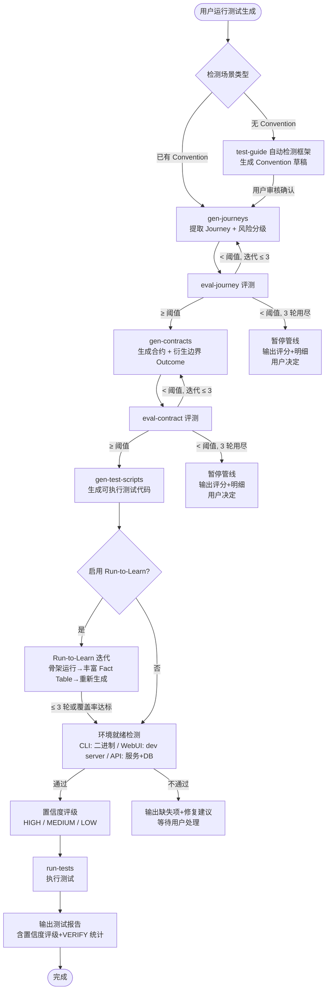

# Test Capability 2.0 — PRD Spec

> PRD Spec: defines WHAT the feature is and why it exists.

## Background

### Why (Reason)

Forge 测试管线存在三大结构性缺陷：

1. **双路径并存**：`gen-test-cases`（旧路径）与 `gen-journeys → gen-contracts → gen-test-scripts`（Journey-Contract 新路径）并行存在，都汇入 `gen-test-scripts`，用户不知道该走哪条
2. **测试深度不足**：合约规范和测试脚本生成主要覆盖 happy path，边界值、异常输入、错误恢复、集成交互等场景需要手动补充
3. **通用性有限**：Convention 文件仅覆盖 3 个框架（Go testing、Vitest、Ginkgo），Python/Java/Rust 等主流生态无内置支持；Journey-Contract 路径上缺少评测门禁

v3.0.0 是重构的最佳窗口 — 正处于大版本分支上，可以做大范围变更而不破坏已发布版本。

### What (Target)

将 Forge 测试能力升级为 2.0 架构：
- 管线统一：退休旧路径，Journey-Contract 成为唯一测试生成路径
- 深度增强：边界/异常场景自动衍生、风险驱动测试密度、场景差异化测试策略
- 通用扩展：扩充内置 Convention 库、test-guide 自动生成 Convention 草稿
- 评测补全：新增 eval-journey 和 eval-contract 评测技能
- 信息增强：Run-to-Learn 机制填补运行时信息缺口

**定位**：管线只生成开发者手动编写成本高的复杂测试（Contract 测试 + Journey 烟测试）。单元测试由开发者在 feature 开发中自行编写，不在管线范围内。

### Who (Users)

- **Forge 用户（项目开发者）**：使用 Forge 的 /quick 或 full pipeline 创建功能，期望管线自动生成高质量测试
- **Forge 维护者**：维护 Forge 插件技能，需要清晰的管线架构和可扩展的场景类型系统

## Goals

| Goal | Metric | Notes |
|------|--------|-------|
| 消除双路径困惑 | gen-test-cases 及所有相关文件完全删除 | 用户只有一条清晰的测试生成路径 |
| 提升测试深度 | 高风险旅程测试数 ≥ 低风险旅程 × 1.5 | 风险驱动密度差异化 |
| 提升测试信息质量 | Run-to-Learn 迭代后 Fact Table 覆盖率提升 ≥ 20 个百分点 | 解决信息缺口根本问题 |
| 提升通用性 | 内置 ≥ 3 个新 Convention 文件（pytest、JUnit、Rust） | 新项目接入成本降低 |
| 建立评测门禁 | eval-journey/eval-contract 评分准确率 ≥ 850/1000 | 管线关键节点质量可控 |
| 降低 Mobile 接入成本 | 生成 Maestro YAML 骨架 + deep link 测试 | 尽力而为，不追求高覆盖 |

## Scope

### In Scope

- [ ] 退休 gen-test-cases 技能及相关评测能力（eval-test-cases 命令、test-cases 评测 rubric、类型子 rubric）
- [ ] 删除 test.graduate 任务类型和相关任务文件
- [ ] 新增 eval-journey 评测技能（含 rubric）
- [ ] 新增 eval-contract 评测技能（含 rubric）
- [ ] 合约规范增强：支持边界/异常场景自动衍生描述（LLM prompt 增强策略 + 场景类型 `required_outcomes` 规则）
- [ ] 风险驱动测试密度：基于 Journey 的 risk_level 字段差异化衍生 Outcome 数量
- [ ] Contract 测试（集成层）+ Journey 烟测试（E2E 层）生成，按场景类型差异化侧重比例
- [ ] 场景差异化：CLI/TUI/WebUI/API 核心支持 + Mobile 尽力而为
- [ ] 内置 Convention 文件扩充（pytest、JUnit、Rust/cargo test）
- [ ] test-guide 增强：自动扫描项目信号检测测试框架并生成 Convention 草稿
- [ ] gen-test-scripts 适配增强后的合约规范和场景差异化
- [ ] Run-to-Learn 机制：骨架测试 → 运行捕获输出 → 丰富 Fact Table → 重新生成
- [ ] 场景特定执行环境就绪检测（CLI/WebUI/API）
- [ ] 置信度评级系统（HIGH/MEDIUM/LOW）
- [ ] 质量门禁更新以反映新管线

### Out of Scope

- 单元测试生成（开发者已在 feature 开发中编写）
- 性能/负载测试
- 安全测试
- 视觉回归测试
- CI/CD 集成或测试环境管理
- 合约 6 维度模型修改
- 已使用 gen-test-cases 项目的迁移工具
- gen-test-scripts 的编译/lint 执行器变更
- 跨场景组合编排
- 执行环境自动准备与配置（仅做就绪检测）
- 失败诊断场景特定策略
- 测试数据管理场景特定策略

## Flow Description

### Business Flow Description

用户通过 Forge 管线生成复杂测试的完整流程：

**阶段一：管线准备**
1. 用户在项目中运行测试生成技能（如 `/gen-journeys`）
2. 系统检测项目的场景类型（CLI/TUI/WebUI/Mobile/API）
3. 系统检查 Convention 文件是否存在；若不存在，test-guide 自动检测框架并生成 Convention 草稿供用户审核

**阶段二：Journey-Contract 生成（含评测门禁）**
4. gen-journeys 从 PRD 用户故事提取 Journey 叙事（含风险分级）
5. eval-journey 评估 Journey 质量；未达阈值则自动迭代修正（最多 3 轮）
6. gen-contracts 从 Journey 生成 6 维度合约规范，自动衍生边界/异常 Outcome
7. eval-contract 评估 Contract 质量；未达阈值则自动迭代修正（最多 3 轮）

**阶段三：测试生成与增强**
8. gen-test-scripts 根据 Contract + Convention 生成可执行测试代码
9. 可选：Run-to-Learn 迭代 — 运行骨架测试捕获实际输出，丰富 Fact Table，重新生成更精确的测试
10. 场景特定环境就绪检测：验证执行环境是否准备好
11. 为每个生成的测试标注置信度评级（HIGH/MEDIUM/LOW）

**阶段四：执行与报告**
12. run-tests 执行生成的测试
13. 输出测试报告（含置信度评级、VERIFY/REVIEW 标记统计）

### Business Flow Diagram

### Per-Scenario Strategy

各场景类型的支持级别和策略差异：

| 维度 | CLI | TUI | WebUI | Mobile | API |
|------|-----|-----|-------|--------|-----|
| **支持级别** | 核心 | 核心 | 核心 | 尽力而为 | 核心 |
| **AI 优先侧重** | Contract 80% | Contract 80% | 平衡 50/50 | Journey 骨架 + deep link | 平衡 50/50 |
| **必须衍生的边界 Outcome** | `not-found` + `already-exists` | `timeout`(每个异步 Cmd) | `validation-error` + `session-expired` | — | `unauthorized`(每个认证端点) |

**风险驱动测试密度（3-5 步 Journey）**：

| 风险等级 | Contract 测试(每 Step) | Journey 烟测试 | 总测试数估算 |
|---------|----------------------|---------------|------------|
| High | 3-5 个 Outcome(含必须边界) | 1 个 happy path + 1 个失败路径 | 10-20 |
| Medium | 2-3 个 Outcome | 1 个 happy path | 7-13 |
| Low | 1-2 个 Outcome | 1 个 happy path | 4-8 |

**Mobile "尽力而为"策略**：只生成 Maestro YAML 骨架 + deep link 测试，复杂场景标记 `manual-only`。

## Functional Specs

> 本功能无 UI 界面，不涉及 prd-ui-functions.md。

### Related Changes

| # | Module | Change Point | Updated Logic |
|------|----------|------------|----------------|
| 1 | gen-test-cases | 完全删除 | Journey-Contract 管线完全覆盖其能力 |
| 2 | test.graduate | 完全删除 | 与 Journey-Contract 按 journey 组织模型不兼容 |
| 3 | eval-test-cases 命令 | 完全删除 | 被 eval-journey + eval-contract 替代 |
| 4 | gen-contracts | 增加边界衍生能力 | LLM prompt 增强 + required_outcomes 规则 |
| 5 | gen-test-scripts | 适配场景差异化 | 按场景类型差异化生成策略和测试层级 |
| 6 | run-tests | 增加环境就绪检测 + 置信度评级 | 测试执行前检测环境，输出含置信度的报告 |
| 7 | test-guide | 增加自动检测 + 草稿生成 | 从项目文件信号检测框架并生成 Convention 草稿 |
| 8 | run-tasks | 清理 test.graduate 引用 | 移除 post-completion 中的 graduate 提示 |

## Other Notes

### Compatibility Requirements
- Convention 文件扩展不应破坏已有 Convention（Go/Vitest/Ginkgo）的加载逻辑
- Convention 文件 schema 需保持向后兼容
- 新增评测技能需复用现有 eval 框架（scorer-gate-revise 循环）

### Delivery Phasing
分三阶段交付，每阶段设置明确门禁标准：
1. **管线统一**：退休 gen-test-cases + test.graduate — 门禁：2+ 个已有项目跑完整管线无报错
2. **深度增强**：边界衍生 + 风险驱动 + 场景差异化 + eval-journey/eval-contract + Run-to-Learn + 环境检测 + 置信度评级 — 门禁：高风险测试数 ≥ 低风险 × 1.5，边界 Outcome 无效比例 < 20%
3. **通用扩展**：内置 Convention + test-guide 增强 — 门禁：新增 Convention 在真实项目上生成 ≥ 3 个可执行测试

每阶段门禁失败：修复时限 2 个工作日，超时回退并升级讨论。

### Risk Mitigation

| Risk | Likelihood | Impact | Mitigation |
|------|-----------|--------|------------|
| 退休 gen-test-cases 影响已有工作流 | M | H | 先全面搜索确认无外部依赖 |
| Convention 自动生成准确率不足 | M | M | 草稿需用户审核确认，不自动应用 |
| 场景差异化过于复杂 | M | M | 每种场景收敛到 1 个策略文件 |
| 风险驱动密度阈值难定义 | H | M | 初始三级分类，后续迭代 |
| 大范围变更导致管线退化 | H | H | 三阶段交付 + 门禁标准 |
| LLM 边界衍生准确性不足 | M | H | required_outcomes 硬约束兜底 + eval-contract 准确率 ≥ 80% |

---
