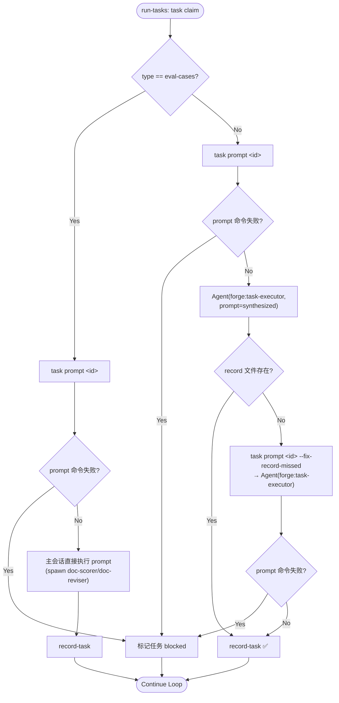
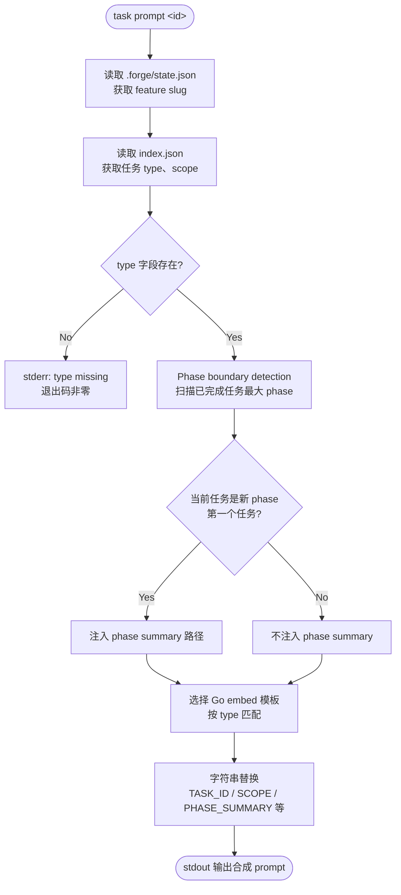

# typed-task-dispatch — PRD Spec

> PRD Spec: defines WHAT the feature is and why it exists.

## Background

### Why (Reason)

forge 的任务执行系统随着任务类型增加，出现了结构性技术债：

1. **task-executor 硬编码 TDD 流程**，无法适配文档生成、测试流水线、修复等非编码类任务。当前通过 `noTest: true`、`mainSession: true` + 任务文件内嵌指令等补丁字段绕过，导致 agent 行为取决于多个隐式字段的组合，而非显式任务类型。

2. **策略逻辑耦合在 markdown prompt 中**，无法通过单元测试验证，每次修改需人工运行完整任务链路。2026-04 的一次运营事故中，调整 eval-cases 执行逻辑需同时修改 3 处文件，单次验证耗时约 2 小时，且仍出现 record 文件未写入的静默失败，排查额外耗时 1 小时。

3. **新增任务类型的固定成本高**：每新增一种类型需触及至少 3 处文件，且无自动化回归手段，平均耗时 ~2 小时/次。

### What (Target)

将策略逻辑从 agent markdown 下沉到 CLI，通过新增 `task prompt <id>` 命令合成类型专属 agent prompt，task-executor 变为薄执行器（只保留执行约束层）。同时引入显式 `type` 字段替代 `noTest` 补丁字段，并提供 `task migrate` 命令支持旧 index.json 迁移。

### Who (Users)

- **forge 维护者**：维护和扩展 forge 插件的开发者，需要新增任务类型或修改现有任务执行逻辑
- **forge 用户**：使用 forge 构建功能的开发者，通过 run-tasks / execute-task 执行任务链路

## Goals

| Goal | Metric | Notes |
|------|--------|-------|
| 新增任务类型的改动成本降低 | 从触及 3 处文件降至 1 处（仅新增 prompt 模板文件） | 当前需改 task-executor.md + schema + 任务模板 |
| 策略逻辑可测试 | task prompt 命令 Go 单元测试覆盖率 ≥ 80% | 当前策略逻辑在 markdown 中，无法单元测试 |
| task-executor.md 体积缩减 | 从 259 行缩减至 ~40 行 | 移除所有策略块，只保留执行约束层 |
| 任务类型显式化 | 所有任务 index.json 包含 type 字段，task validate 无报错 | 废弃 noTest 补丁字段 |

## Scope

### In Scope
- [ ] task-cli 新增 `task prompt <id>` 命令：根据任务 type 合成类型专属 agent prompt（stdout 纯文本），支持 11 种业务类型，Go embed markdown 模板，标准字符串替换
- [ ] task-cli 新增 `task prompt <id> --fix-record-missed` 模式：合成 record 缺失恢复专用 prompt（内联 dispatch，不入 index）
- [ ] task-cli 新增 `task migrate` 命令：根据现有字段（ID 模式、noTest、mainSession）自动推断并填充 type 字段，保留所有现有任务状态
- [ ] task-cli 扩展 `task validate` 命令：支持 type 字段合法性验证
- [ ] index.schema.json 新增 `type` 枚举字段（必填），废弃 `noTest` 字段
- [ ] task-executor.md 精简为薄执行器：只保留执行约束层（ONE TASK PER INVOCATION、record-task 强制、无后台任务、最多 3 次 subagent 调用、STOP 规则），移除所有策略块
- [ ] run-tasks 命令更新：调用 `task prompt <id>` 合成 prompt 后 dispatch 给 task-executor；record 缺失时调用 `task prompt <id> --fix-record-missed`；eval-cases 任务在主会话中直接按 prompt 执行
- [ ] execute-task 命令同步更新：与 run-tasks 保持相同路由逻辑
- [ ] 所有任务模板（task.md、phase-summary-task.md、gate-task.md、gen-test-cases.md 等）frontmatter 加 `type` 字段，移除 `noTest`
- [ ] breakdown-tasks 和 quick-tasks skill 生成任务时自动设置 type
- [ ] error-fixer agent 废弃：编译/测试/lint 修复能力迁移到 `type: fix` prompt 模板，record 缺失恢复迁移到 `--fix-record-missed` 模式
- [ ] 旧 index.json 通过 `task migrate` 迁移（不提供兼容期，type 字段必填）

### Out of Scope
- CLI 二进制重命名（task→forge）——独立提案，后续实施
- 新增任务类型（本次只改造现有 11 种类型）
- 任务执行的并发/并行调度
- 跨 feature 的任务依赖
- e2e 测试框架选型

## Flow Description

### Business Flow Description

**当前任务执行流程**：

run-tasks 调用 `task claim` 获取任务后，根据 `mainSession` 字段决定路由：
- `mainSession: true` → 读取任务文件的 `## Main Session Instructions` 段落，在主会话中执行
- 其他 → dispatch 给 `forge:task-executor` subagent，传入 TASK_KEY、TASK_ID、TASK_FILE、SCOPE、NO_TEST 等参数

task-executor 接收后，根据 `NO_TEST` 字段决定是否跳过 TDD 和 quality gate，所有类型共用同一套流程。record 缺失时 dispatch 给 `forge:error-fixer`。

**目标任务执行流程**：

run-tasks 调用 `task claim` 获取任务后：
1. 若 `type == test-pipeline.eval-cases`（永久例外，平台限制）：调用 `task prompt <id>` 获取 prompt，在主会话中直接按 prompt 执行
2. 其他任务：调用 `task prompt <id>` 获取类型专属 prompt，dispatch 给 `forge:task-executor`（prompt 参数注入策略层，agent 定义提供约束层）
3. record 缺失时：调用 `task prompt <id> --fix-record-missed` 获取恢复 prompt，dispatch 给 `forge:task-executor`

`task prompt <id>` 内部逻辑：
1. 从 `.forge/state.json` 和 `index.json` 读取 feature、scope、task type 等上下文
2. 执行 phase boundary detection（扫描已完成任务取最大 phase 编号，判断是否需注入 phase summary）
3. 根据 type 选择对应 Go embed 模板，执行标准字符串替换（`{{TASK_ID}}`、`{{SCOPE}}` 等占位符）
4. 输出合成后的 prompt 到 stdout；失败时输出到 stderr，退出码非零

**数据流表（多组件数据契约）**：

| 数据源 | 字段 | 消费方 | 用途 |
|--------|------|--------|------|
| `.forge/state.json` | `feature`（feature slug） | `task prompt` | 定位当前 feature 目录，构造 index.json 路径 |
| `index.json` | `id`、`type`、`scope`、`phase`、`status`（所有任务） | `task prompt` | 合成 prompt 占位符替换；`status` 用于 phase boundary detection |
| `task prompt` stdout | 纯文本合成 prompt（UTF-8，无前缀/后缀标记，非零退出时为空） | `run-tasks` / `execute-task` | 作为 `prompt` 参数整体传入 `Agent(forge:task-executor)` |
| `task prompt` stderr | 错误描述（type 缺失、模板不存在、模板解析失败等） | `run-tasks` / `execute-task` | 触发任务 blocked 标记，不静默失败 |
| `Agent(forge:task-executor)` prompt 参数 | 上一步 stdout 全文 | task-executor agent | agent 执行入口，替代原 `TASK_FILE` + `NO_TEST` 参数组合 |

### Business Flow Diagram

### task prompt 内部流程

## Functional Specs

> 本功能为纯 CLI/agent 改造，无 UI 界面，不涉及 prd-ui-functions.md。

### task prompt 命令规格

| 参数 | 说明 |
|------|------|
| `<id>` | 任务 ID，从当前 feature 的 index.json 中查找 |
| `--fix-record-missed` | 切换为 record 缺失恢复模式，合成恢复专用 prompt |

**支持的 type 枚举（11 种业务类型）**：

| type | 子类型 | 描述 |
|------|--------|------|
| `implementation` | — | 编码任务，TDD 流程 + quality gate |
| `doc-generation` | `summary` | Phase summary 生成 |
| `doc-generation` | `consolidate` | 提取业务规则和技术规范 |
| `test-pipeline` | `gen-cases` | 生成测试用例文档 |
| `test-pipeline` | `eval-cases` | 对抗评估测试用例（永久例外：主会话执行） |
| `test-pipeline` | `gen-scripts` | 生成 e2e 测试脚本 |
| `test-pipeline` | `run` | 运行 e2e 测试 |
| `test-pipeline` | `graduate` | 迁移测试脚本到回归套件 |
| `test-pipeline` | `verify-regression` | 验证回归套件 |
| `fix` | — | 修复任务（编译错误、测试失败、lint 问题） |
| `gate` | — | 阶段出口验证 |

**内部操作模式（不在 type 枚举中）**：
- `fix-record-missed`：通过 `--fix-record-missed` flag 触发，不写入 index.json

### task migrate 命令规格

自动推断规则（按优先级顺序）：

| 推断规则 | 推断结果 |
|---------|---------|
| ID 以 `.summary` 结尾 | `doc-generation.summary` |
| ID 以 `.gate` 结尾 | `gate` |
| ID 为 `T-test-1` | `test-pipeline.gen-cases` |
| ID 为 `T-test-1b` | `test-pipeline.eval-cases` |
| ID 为 `T-test-2` | `test-pipeline.gen-scripts` |
| ID 为 `T-test-3` | `test-pipeline.run` |
| ID 为 `T-test-4` | `test-pipeline.graduate` |
| ID 为 `T-test-4.5` | `test-pipeline.verify-regression` |
| ID 为 `T-test-5` | `doc-generation.consolidate` |
| ID 以 `fix-` 或 `disc-` 开头 | `fix` |
| 其余 | `implementation` |

**前提条件**：所有 in_progress 任务必须先完成或手动标记为 completed/blocked，task migrate 不处理在途任务。

### Related Changes

| # | 组件 | 变更点 | 变更内容 |
|---|------|--------|---------|
| 1 | task-cli | 新增命令 | `task prompt`、`task migrate` |
| 2 | task-cli | 扩展命令 | `task validate` 支持 type 字段验证 |
| 3 | index.schema.json | 字段变更 | 新增 `type`（必填枚举），废弃 `noTest` |
| 4 | task-executor.md | agent 精简 | 移除策略块，只保留执行约束层（~40 行） |
| 5 | run-tasks.md | 路由变更 | 调用 task prompt 合成 prompt，废弃 error-fixer dispatch |
| 6 | execute-task.md | 路由变更 | 与 run-tasks 保持一致 |
| 7 | 所有任务模板 | frontmatter | 加 `type` 字段，移除 `noTest` |
| 8 | breakdown-tasks skill | 生成逻辑 | 自动设置 type 字段 |
| 9 | quick-tasks skill | 生成逻辑 | 自动设置 type 字段 |
| 10 | error-fixer.md | 废弃 | 能力迁移到 fix prompt 模板和 --fix-record-missed |

## Other Notes

### Performance Requirements
- `task prompt <id>` 命令执行时间：< 500ms（本地文件读取 + 字符串替换，无网络调用）
- 对 run-tasks dispatch 链路的延迟影响：每次任务 dispatch 增加一次 CLI 调用，预期 < 500ms，可接受

### Data Requirements
- 数据迁移：旧 index.json 通过 `task migrate` 迁移，不提供兼容期；迁移前所有 in_progress 任务需先完成
- 数据初始化：新建 feature 通过 breakdown-tasks/quick-tasks 自动生成含 type 字段的 index.json

### Blocked State Lifecycle

任务进入 `blocked` 状态的触发条件：`task prompt <id>` 或 `task prompt <id> --fix-record-missed` 退出码非零（模板不存在、模板解析失败、type 字段缺失、state.json 或 index.json 读取失败等）。

**状态转换**：

| 阶段 | 行为 |
|------|------|
| 触发 | run-tasks 检测到 task prompt 退出码非零，将 index.json 中该任务 status 置为 `blocked`，并将 stderr 内容写入任务的 `blocked_reason` 字段 |
| 暴露 | run-tasks 跳过该任务继续处理队列中其他任务；`task list` 输出中 blocked 任务以醒目标记显示，`blocked_reason` 字段可读 |
| 恢复 | blocked 状态不可自动重试（避免循环失败）；operator 需：1) 读取 `blocked_reason` 定位根因，2) 修复模板文件或 type 注册，3) 执行 `task unblock <id>` 将状态重置为 `pending`，4) 重新运行 run-tasks |

blocked 任务不阻塞其他任务的执行；同一 feature 中其他 pending 任务可继续被 run-tasks 认领。

### Monitoring Requirements
- `task prompt` 命令失败时输出到 stderr，退出码非零；run-tasks 检测到后标记任务 blocked，将 stderr 写入 `blocked_reason` 字段，不静默失败

### Security Requirements
- 无特殊安全要求（本地 CLI 工具，无网络传输）

---

## Quality Checklist

- [x] 需求标题准确描述功能
- [x] Background 包含原因、目标、用户三要素
- [x] Goals 已量化（行数、覆盖率、文件数）
- [x] Flow 描述完整，包含主流程和异常分支
- [x] 业务流程图存在（Mermaid 格式）
- [x] 无 UI 界面，不需要 prd-ui-functions.md
- [x] Related Changes 完整分析
- [x] 非功能需求已考虑（性能、数据迁移）
- [x] 无模糊表述
- [x] 规格可操作、可验证
