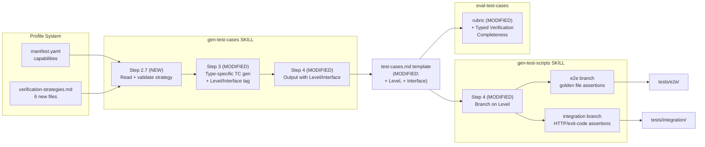

# Technical Design: Interface-Type-Specific Verification Strategies

## Overview

Add interface-type awareness to the test generation pipeline through profile-defined verification strategies. All changes are skill definitions (LLM prompt instructions) and templates — no new Go/TypeScript runtime code.

Three injection points in the pipeline:
1. **gen-test-cases** — reads profile-defined verification strategies, generates type-specific test cases with Level/Interface fields
2. **gen-test-scripts** — selects different code generation strategies based on Level (e2e vs integration)
3. **eval-test-cases** — evaluates typed verification completeness as a new scoring dimension

Each of the 6 profiles gets a new `verification-strategies.md` file defining per-capability verification dimensions, boundary scenarios, and test data requirements.

## Architecture

### Layer Placement

Skills layer only. All changes are within `plugins/forge/skills/` and `forge-cli/pkg/profile/profiles/`. No runtime code changes.

### Component Diagram



### Dependencies

| Dependency | Type | Purpose |
|------------|------|---------|
| `forge profile` CLI | Internal | Resolves active profile and manifest |
| `forge profile get <name> --manifest` | Internal | Reads profile capabilities and template paths |
| Profile `verification-strategies.md` | New file | Verification strategy definitions |
| `docs/conventions/error-handling.md` | Convention | Error message format (`<context>: <detail>`) |
| `docs/conventions/profile-system.md` | Convention | Profile registry and detection rules |

## Interfaces

### Interface 1: Verification Strategy File Format

Location: `forge-cli/pkg/profile/profiles/<profile>/verification-strategies.md`

Template:

```markdown
## <capability-key>

### Verification Dimensions
- Dimension description (>=3 required)

### Boundary Scenarios
- Scenario description (>=2 required)

### Test Data Requirements
- Requirement description
```

Concrete example (go-test profile, TUI capability):

```markdown
## tui

### Verification Dimensions
- Golden file comparison: rendered output must match reference snapshot at given terminal dimensions
- Dimensional constraint check: rendered line count <= terminal height, max line width <= terminal width
- ANSI escape sequence consistency: color/style codes in output match expected palette without stray resets
- Layout integrity: table columns align at declared widths; no content wraps outside its cell

### Boundary Scenarios
- CJK characters in table cells: double-width glyphs cause misalignment when column width is computed by byte count
- Long file paths (>50 chars) in status bars: path truncation must preserve trailing filename, not leading directory
- Multi-digit line numbers (>9) in list views: column width shifts must not cascade to adjacent columns
- Empty fields in data rows: missing values must render as placeholder (e.g., "--") without collapsing column width
- Narrow terminal (80x24): all views must render without horizontal overflow or content truncation

### Test Data Requirements
- Golden files stored in tests/e2e/golden/<feature-slug>/ with one file per terminal dimension (80x24, 140x40)
- Input fixtures must include at least one entry with CJK characters, one with paths >= 50 chars, one with empty optional fields
```

Validation rules:
- Each `## <capability-key>` section must contain `### Verification Dimensions` (>=3 items) and `### Boundary Scenarios` (>=2 items)
- `### Test Data Requirements` is optional but recommended
- Capability keys must exactly match the profile's `manifest.yaml` `capabilities` field
- Mismatch -> abort with `Strategy/manifest mismatch` error

### Interface 2: Enhanced TC Entry (test-cases.md)

Current fields: Source, Type, Target, Test ID, Pre-conditions, Route, Element, Steps, Expected, Priority

Header comment (new):
```
<!-- Applied strategy: {profile}/{cap-count} capabilities, {dim-count} dimensions -->
<!-- Strategy source: {profile-repo-path} -->
<!-- Strategy tokens: ~{token-count} (approx) -->
```

New fields added to each TC entry:

```
- **Level**: e2e | integration | (empty for generic/fallback)
- **Interface**: TUI | web-ui | mobile-ui | API | CLI | (empty for generic/fallback)
```

Auto-tagging lookup table (applied during gen-test-cases Step 3):

| Capability | Level | Interface |
|-----------|-------|-----------|
| `tui` | e2e | TUI |
| `web-ui` | e2e | web-ui |
| `mobile-ui` | e2e | mobile-ui |
| `api` | integration | API |
| `cli` | integration | CLI |

### Interface 3: Level-based Code Generation (gen-test-scripts Step 4)

For each TC with a Level field, gen-test-scripts selects output directory and code template:

| Level | Output Directory | Import Pattern | Assertion Style |
|-------|-----------------|----------------|-----------------|
| `e2e` | `tests/e2e/features/<slug>/` | `os/exec` + golden file reading | Byte comparison, dimension checks |
| `integration` | `tests/integration/features/<slug>/` | `net/http` + assert library | HTTP status/body, exit code |
| _(empty)_ | `tests/e2e/features/<slug>/` | Current default template | Current behavior |

Each level must differ in at least one of three aspects: imports, assertion method, or directory.

## Data Models

Single-layer feature, no database. Structural models only:

### VerificationStrategy

```
VerificationStrategy = {
    capabilityKey: string            // "tui", "api", "cli", etc.
    dimensions: string[]             // >=3 verification dimension descriptions
    boundaryScenarios: string[]      // >=2 boundary scenario descriptions
    testDataRequirements: string[]   // optional test data requirements
}
```

### StrategyFile

```
StrategyFile = {
    profile: string                              // profile name, e.g., "go-test"
    strategies: Map<string, VerificationStrategy>  // keyed by capability
}
```

### LevelTag

```
LevelTag = {
    level: "e2e" | "integration" | ""
    interface: "TUI" | "web-ui" | "mobile-ui" | "API" | "CLI" | ""
}
```

Derivation rule: `capability -> (level, interface)` from the static lookup table in Interface 2. **Fallback for capabilities outside the lookup table**: emit `UNKNOWN_CAPABILITY` warning, set both `level` and `interface` to empty string, and generate a generic test case without Level/Interface fields. This is the same path triggered when a capability has no corresponding strategy section. The lookup table is extensible -- future capabilities (e.g., `grpc`, `graphql`) are added by extending the table in gen-test-cases SKILL.md and creating a matching strategy section in verification-strategies.md.

### StrategyMetadata (test-cases.md header)

```
StrategyMetadata = {
    appliedStrategy: string    // "Applied strategy: {profile}/{cap-count} capabilities, {dim-count} dimensions"
    tokenCount: int            // Approximate character count of strategy file content (chars / 4 as rough token estimate)
}
```

This model captures the PRD monitoring requirement: the test-cases.md header comment includes strategy metadata showing which profile was applied, how many capabilities had strategies, and how many total verification dimensions were used. The `tokenCount` field is an approximate character-based estimate (`len(strategyContent) / 4`) for monitoring prompt context budget — it is not computed by a specific tokenizer. gen-test-cases emits this as a comment block at the top of test-cases.md.

## Error Handling

Per `docs/conventions/error-handling.md`: stderr, `<context>: <detail>` format.

### Error Propagation Strategy

gen-test-cases uses a **fail-fast on validation errors, best-effort on generation warnings** strategy. Format validation errors (malformed strategy file, key mismatch) abort execution immediately. Generation-stage issues (unknown capability, missing strategy for one capability) emit a warning and produce generic output for that capability while continuing to process others.

### Error Types and Messages

| Error Code | Error Type | Message (stderr) | Behavior |
|------------|------------|------------------|----------|
| `STRATEGY_NOT_FOUND` | Warning | `No verification strategy found for profile: {name}` | Warning, continue (generic TCs, no Level) |
| `STRATEGY_INVALID` | Abort | `Strategy file validation failed for profile: {name}. Section {key} missing required subsections (验证维度 >=3, 边界场景 >=2).` | Abort gen-test-cases |
| `KEY_MISMATCH` | Abort | `Strategy/manifest mismatch. Missing in strategy: {keys}. Extra in strategy: {keys}.` | Abort gen-test-cases |
| `UNKNOWN_CAPABILITY` | Warning | `Unknown capability in strategy: {key}` | Warning, generate generic TC (no Level) |

> **Note on GOLDEN_STALE**: Golden file staleness is a test-execution-time concern (diff between runtime output and golden file), not a generation-pipeline error. It is documented in the PRD's exception handling table but is out of scope for this design, which covers test generation only. Test execution errors belong in the run-e2e-tests or graduate-tests skill definitions.

## Cross-Layer Data Map

Single-layer feature (Skills/LLM prompts). Data flows through files between pipeline stages:

| Field | Strategy File | test-cases.md | gen-test-scripts Output |
|-------|--------------|---------------|------------------------|
| Level | _(derived from interface type)_ | `e2e` or `integration` | Determines output directory + code template |
| Interface | _(derived from capability key)_ | `TUI`/`API`/`CLI`/etc. | Determines verification approach |
| Dimensions | `### Verification Dimensions` | Embedded in TC Expected field | Reflected in assertion code |
| Boundary | `### Boundary Scenarios` | Generates additional TCs | Reflected in test data |

## Integration Specs

No existing-page integrations -- not applicable. This feature modifies skill definitions, not UI components.

## Testing Strategy

### Per-Layer Test Plan

| Layer | Test Type | Tool | What to Test | Coverage Target |
|-------|-----------|------|--------------|-----------------|
| Strategy File Format | Validation test | Shell script `tests/e2e/features/typed-verification-strategies/validate-strategy.sh` invoking `forge gen-test-cases` with crafted profile directories (valid, malformed, key-mismatched); assertion via exit code (`$?` = 0 for success, 1 for abort) + `grep` on stderr output for expected error codes (`STRATEGY_INVALID`, `KEY_MISMATCH`) | gen-test-cases accepts valid strategy files (exit 0, no stderr error codes) and rejects invalid ones with correct error codes on stderr | >= 80% of strategy file edge cases covered (missing subsections, extra subsections, empty items, malformed markdown headers, duplicate capability keys) |
| Feature E2E (gen-test-cases) | Pipeline test | `forge gen-test-cases` CLI with go-test profile (AC scenarios 1-5, 7 from PRD); assertion via `diff` comparing generated test-cases.md Level/Interface fields against golden expected output in `tests/e2e/golden/typed-verification-strategies/` | gen-test-cases produces Level/Interface fields matching expected mapping; strategy metadata header present | Level field auto-tagging accuracy >= 95% (matching PRD S2 metric: proportion of TCs with correct Level value relative to their capability type) |
| Feature E2E (gen-test-scripts) | Pipeline test | `forge gen-test-scripts` CLI with test-cases.md containing both Level=e2e and Level=integration TCs; assertion via `test -d tests/e2e/features/<slug>/` and `test -d tests/integration/features/<slug>/` verifying both directories exist, plus `grep` verifying import differences (golden file vs HTTP/assert patterns) | gen-test-scripts produces differentiated e2e/integration code in correct directories with distinct import/assertion patterns | 100%: both Level values produce files in correct directories with at least one structural difference (imports, assertions, or directory) |
| Feature E2E | Eval test | `forge eval-test-cases` CLI with rubric containing new dimension; assertion via `jq` extracting typed verification completeness score from rubric JSON output and comparing >= threshold | Typed verification completeness scoring matches S8 formula; fallback scoring >= 0.8 when no strategy file present | New dimension >= 150 pts (from rubric output) |

### Key Test Scenarios

1. Profile with valid verification-strategies.md -> TCs with Level + Interface fields (assert via `grep "Level:" test-cases.md`)
2. Profile without verification-strategies.md -> warning on stderr + generic TCs with no Level field (assert exit code 0, `grep -c "Level:" test-cases.md` = 0)
3. Strategy with invalid format (missing `### Boundary Scenarios`) -> abort with exit code 1, stderr contains `STRATEGY_INVALID`
4. Strategy with key mismatch (`## tui` + `## api` but manifest declares `tui` + `cli`) -> abort with exit code 1, stderr contains `KEY_MISMATCH` and lists `cli` as missing, `api` as extra
5. Mixed capability profile (tui+api+cli) -> generates e2e + integration code; assert `tests/e2e/` and `tests/integration/` directories both exist and contain `.test.go` files
6. eval-test-cases correctly scores the new typed verification dimension; assert score via `jq '.dimensions["typed_verification_completeness"].score'`

### Overall Coverage Target

Level field auto-tagging accuracy >= 95% across all generated test cases. Strategy file format edge case coverage >= 80%. All 8 PRD ACs passing.

## Security Considerations

### Threat Model

| Threat | Attack Vector | Impact | Likelihood |
|--------|--------------|--------|------------|
| Shell injection via strategy file content | Malicious markdown in verification-strategies.md is interpolated into a shell command or eval | Arbitrary code execution during test generation | Low: strategy content is injected into LLM prompt context only, not into shell commands or eval statements |
| LLM prompt injection via malicious strategy content | Compromised or community-sourced profile repo contains strategy content designed to manipulate LLM behavior (e.g., instructions to skip security tests, generate false-positive assertions, or include insecure code patterns in generated tests) | Generated test code silently omits security-critical test scenarios, introduces false-positive tests that mask real bugs, or contains insecure patterns (e.g., hardcoded credentials, disabled TLS checks) | Medium: profile repos may be shared, vendored, or community-sourced; no authentication on strategy file authorship |

### Mitigations

- **No shell execution path**: Strategy file content is injected exclusively as LLM prompt context; it is never passed to shell commands, eval, or template interpolation that produces executable code. This mitigates the shell injection threat entirely.
- **Format validation before use**: gen-test-cases validates strategy file structure (required subsections, key matching, item counts) before using content as generation instructions. Malformed files are rejected with abort, reducing the surface for prompt injection by constraining allowable content to structured subsections.
- **Output review for generated test code**: gen-test-scripts produces test code that a developer reviews before execution. The SKILL.md instruction set includes a checklist item requiring the reviewer to verify that generated tests do not contain hardcoded secrets, disabled security checks, or assertions that always pass. This mitigates the impact of successful prompt injection by catching insecure output at review time.
- **Strategy file provenance documentation**: gen-test-cases SKILL.md includes a documentation step requiring the generated test-cases.md header comment to record the strategy file source (`<!-- Strategy source: {profile-repo-path} -->`). For community-sourced profiles, this creates an auditable trail linking generated tests back to their strategy definition, enabling human reviewers to verify strategy file origin during code review. This is a documentation-only measure consistent with the Skills layer scope.

## Interface-to-Task Mapping

| Interface / Model | Implementation Task | Location |
|-------------------|---------------------|----------|
| Interface 1: Strategy File Format | Create verification-strategies.md for each of 6 profiles (go-test, web-playwright, maestro, pytest, rust-test, java-junit) | `forge-cli/pkg/profile/profiles/<profile>/verification-strategies.md` |
| Interface 2: Enhanced TC Entry | Add Level and Interface fields to test-cases.md template; update gen-test-cases SKILL.md Step 3 to auto-populate fields from lookup table | `plugins/forge/skills/gen-test-cases/templates/test-cases.md` + `plugins/forge/skills/gen-test-cases/SKILL.md` |
| Interface 3: Level-based Code Gen | Modify gen-test-scripts SKILL.md Step 4 to branch on Level field; add e2e and integration code templates | `plugins/forge/skills/gen-test-scripts/SKILL.md` + new template files under `plugins/forge/skills/gen-test-scripts/templates/` |
| Model: VerificationStrategy | Implement strategy file parsing and validation in gen-test-cases SKILL.md Step 2.7 | `plugins/forge/skills/gen-test-cases/SKILL.md` |
| Model: StrategyFile | Profile discovery reads verification-strategies.md alongside existing manifest.yaml | `plugins/forge/skills/gen-test-cases/SKILL.md` |
| Model: LevelTag | Static lookup table embedded in gen-test-cases SKILL.md for capability -> (level, interface) mapping; fallback: unknown capabilities emit UNKNOWN_CAPABILITY warning and produce empty Level/Interface | `plugins/forge/skills/gen-test-cases/SKILL.md` |
| Model: StrategyMetadata | Add strategy metadata header comment to test-cases.md template output; gen-test-cases SKILL.md emits header with profile name, capability count, dimension count, character-based token estimate, and strategy source path | `plugins/forge/skills/gen-test-cases/templates/test-cases.md` + `plugins/forge/skills/gen-test-cases/SKILL.md` |
| Error types (STRATEGY_NOT_FOUND, STRATEGY_INVALID, KEY_MISMATCH, UNKNOWN_CAPABILITY) | Add error handling logic to gen-test-cases SKILL.md Step 2.7 | `plugins/forge/skills/gen-test-cases/SKILL.md` |
| eval-test-cases: Typed Verification Completeness dimension | Add scoring formula and 3 check items to eval-test-cases rubric template | `plugins/forge/skills/eval-test-cases/templates/rubric.md` |

## PRD Coverage Map

| PRD Requirement / AC | Design Component | Interface / Model |
|----------------------|------------------|-------------------|
| S1: Type-specific verification conditions | gen-test-cases SKILL.md Step 2.7 + Step 3 enhancement | StrategyFile -> VerificationStrategy |
| S2: Auto Level tagging (>=95%) | gen-test-cases SKILL.md Step 3 enhancement | LevelTag.level (fallback: UNKNOWN_CAPABILITY warning + empty fields for unmapped capabilities) |
| S3: Strategy format validation | gen-test-cases SKILL.md Step 2.7 validation | VerificationStrategy validation rules |
| S4: Graceful degradation | gen-test-cases SKILL.md Step 2.7 fallback | Warning + generic TCs |
| S5: Key mismatch error | gen-test-cases SKILL.md Step 2.7 key check | KEY_MISMATCH error |
| S6: Level-based code gen | gen-test-scripts SKILL.md Step 4 branching | Level -> directory + template selection |
| S7: Level + Interface fields | test-cases.md template | LevelTag + StrategyMetadata header |
| S8: Typed verification eval | eval-test-cases rubric | New dimension: Typed Verification Completeness (150 pts). Scoring formula: `score = (covered_items / total_items) * weight`. Check items: (1) dimension coverage: all strategy-defined verification dimensions present in test cases (>=3/3 per capability), (2) boundary scenario coverage: test cases include at least 2 scenarios from strategy definition, (3) test data compliance: test data satisfies strategy's data requirements. Fallback: when no strategy file exists, dimension score rate >= 0.8 (no penalty for missing strategy) |

## Open Questions

_None._

## Appendix

### Alternatives Considered

| Approach | Pros | Cons | Why Not Chosen |
|----------|------|------|----------------|
| Same staging dir, file naming differentiation (*_e2e_test.go vs *_integration_test.go) | Simpler, no graduate-tests gap | Doesn't satisfy PRD S6 directory structure requirement | PRD explicitly requires different directories |
| Same dir, Go build tags (-tags=e2e vs -tags=integration) | Minimal disruption | Requires profile manifest change, less clear separation | Profile manifest out of scope for this feature |
| Strategy as structured YAML instead of Markdown | Machine-parseable, strict schema | Profiles already use MD for generate.md/run.md; adds parsing complexity | Consistency with existing profile conventions |

### References

- PRD: `docs/features/typed-verification-strategies/prd/prd-spec.md`
- User Stories: `docs/features/typed-verification-strategies/prd/prd-user-stories.md`
- gen-test-cases SKILL.md: `plugins/forge/skills/gen-test-cases/SKILL.md`
- gen-test-scripts SKILL.md: `plugins/forge/skills/gen-test-scripts/SKILL.md`
- eval-test-cases rubric: `plugins/forge/skills/eval-test-cases/templates/rubric.md`
- Profile system convention: `docs/conventions/profile-system.md`
- Error handling convention: `docs/conventions/error-handling.md`
