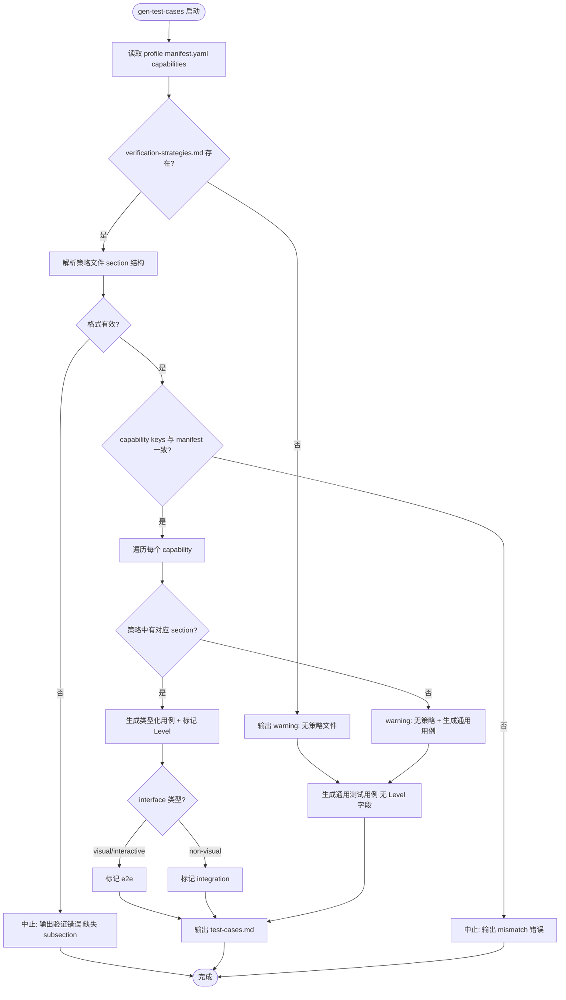

# Interface-Type-Specific Verification Strategies — PRD Spec

> PRD Spec: defines WHAT the feature is and why it exists.

## Background

### Why (Reason)

Forge 的测试生成 pipeline 不区分 interface 类型的验证策略。gen-test-cases 将所有测试用例归为同一类型（UI/API/CLI），生成相同的验证条件；gen-test-scripts 使用同一套模板逻辑生成测试代码。这导致不同 interface 类型的"正确性"定义被统一处理，无法捕获类型特有的 bug。

具体表现：TUI feature 的 11 个渲染 bug（行溢出、CJK 对齐错误、窄终端截断）全部通过了"编译 + 测试"verify gate，因为测试只检查了函数返回值（逻辑正确性），没有检查渲染输出（视觉正确性）。API/CLI 类似——当前只生成功能性测试，不生成契约测试、边界值测试、参数组合测试。

### What (Target)

为 gen-test-cases 和 gen-test-scripts 增加 interface 类型感知能力：每个 profile 定义类型化验证策略，gen-test-cases 根据策略生成不同验证条件的测试用例并自动标记测试级别（e2e / integration），gen-test-scripts 根据级别生成不同结构的测试代码。

### Who (Users)

- **Forge 用户（开发者）**：使用 forge 为其项目生成测试，期望测试能覆盖其项目特有的正确性维度
- **Profile 作者**：创建和维护测试 profile，需要为其 profile 定义类型化验证策略

## Goals

| Goal | Metric | Notes |
|------|--------|-------|
| TUI 渲染 bug 在测试生成阶段被捕获 | ≥8/11（从 0/11 提升） | 基于 lesson 中的 11 个已知 bug |
| API/CLI 集成层面测试覆盖 | 每个 API/CLI capability ≥3 个集成测试用例 | 当前为 0 |
| 测试用例自动标记级别 | Level 字段覆盖率 ≥ 95% | 允许未命中策略的用例不带 Level |
| 策略文件性能影响 | gen-test-cases 延迟增加 < 5% | 策略文件 ≤ 200 行 |

## Scope

### In Scope
- [ ] 6 个 profile 各新增 `verification-strategies.md`（go-test、web-playwright、maestro、pytest、rust-test、java-junit）
- [ ] gen-test-cases SKILL.md 增强：读取 profile 策略 → 按 interface 类型生成不同验证条件 → 自动标记 e2e/integration 级别
- [ ] gen-test-scripts SKILL.md 增强：按测试级别和 interface 类型选择代码生成策略
- [ ] test-cases.md 模板更新：新增 Level 字段、类型专属验证 section
- [ ] eval-test-cases rubric 更新：新增"类型化验证完整度"评分维度

### Out of Scope
- breakdown-tasks / execute-task / eval-design 改动
- 新 profile 或新测试框架
- 视觉回归基础设施（截图对比服务）
- run-e2e-tests / graduate-tests 改动
- CI/CD 管道改动

## Flow Description

### Business Flow Description

**主流程**：gen-test-cases 执行时，解析 profile 的 verification-strategies.md，根据每个 capability 的验证策略生成类型化测试用例，并标记 e2e/integration 级别。gen-test-scripts 根据级别选择不同的代码生成策略。

**决策点**：
1. 策略文件是否存在 → 否则回退到当前行为 + warning
2. Capability key 是否与 manifest.yaml 一致 → 否则中止 + 错误信息
3. 策略文件格式是否有效 → 否则 gen-test-cases 拒绝该 profile + 输出验证错误（列出缺失 subsection），中止执行

**异常处理**：
- Unknown capability：warning + 生成通用用例（无 Level）
- 策略文件 section 不完整（验证维度 <3 或边界场景 <2）：gen-test-cases 拒绝 + 验证错误，中止执行
- Golden file staleness：测试失败 + diff 输出 → 人工判断更新或修 bug

### Business Flow Diagram



### Data Flow Description

| Data Flow ID | Source | Target | Data Content | Transport | Notes |
|---|---|---|---|---|---|
| DF001 | profile/verification-strategies.md | gen-test-cases | 验证维度、边界场景、测试级别映射 | 文件读取（LLM prompt 上下文） | Markdown 格式，≤ 200 行 |
| DF002 | gen-test-cases | test-cases.md | 类型化测试用例 + Level 字段 | 文件写入 | 新增 Interface + Level 字段 |
| DF003 | test-cases.md | gen-test-scripts | Level + Interface 字段 | 文件读取 | 驱动代码生成策略选择 |
| DF004 | gen-test-scripts | tests/e2e/ 或 tests/integration/ | 级别化测试代码 | 文件写入 | e2e 和 integration 生成不同结构 |

## Functional Specs

### 类型验证策略矩阵

每个 profile 的 verification-strategies.md 为其各 capability 定义验证策略。以下为标准策略矩阵：

| Interface Type | Test Level | 核心验证维度 | 边界场景 |
|---|---|---|---|
| **TUI** | e2e | Golden file 对比、维度检查（行数=高度/宽度<=终端宽度）、ANSI 色码一致性 | CJK 字符、长路径(>50)、多位数字(>9)、空字段、窄终端(80x24)、宽终端(140x40) |
| **web-ui** | e2e | DOM 交互、视觉回归（截图）、响应式布局、可访问性 | 空状态、加载态、错误态、边界数据量、不同视口尺寸 |
| **mobile-ui** | e2e | 设备渲染、触摸交互、屏幕方向、平台差异 | 横竖屏切换、低网速、推送通知中断、小屏设备 |
| **API** | integration | 契约验证（请求/响应对 spec）、错误路径、边界值、真实依赖 | 无效输入、认证失败、超限、并发、空响应、大数据量 |
| **CLI** | integration | 输出 golden file、退出码、参数组合、管道兼容 | 无效参数、--help、参数互斥、空输入、管道+重定向 |

### 级别自动标记规则

gen-test-cases 根据 interface 类型自动标记测试级别，不需要人工判断：

| Level | 触发条件 | 验证方式 |
|---|---|---|
| **e2e** | interface 类型为 visual/interactive（TUI、web-ui、mobile-ui） | 渲染输出、DOM 状态、截图、设备行为 |
| **integration** | interface 类型为 non-visual（API、CLI） | HTTP 契约、退出码、输出格式、参数解析 |

### gen-test-scripts 级别化代码生成

gen-test-scripts 根据 Level 字段生成不同结构的测试代码：

| Level | 代码结构特征 | 示例差异 |
|---|---|---|
| **e2e** | 渲染截获 + golden file 比对函数 | 引用 `os/exec` + golden file 读取；测试目录为 `e2e/` |
| **integration** | HTTP 断言或子进程退出码检查函数 | 引用 `net/http` + assert 库；测试目录为 `integration/` |

差异体现在 import 列表、assertion 库选择、测试目录结构三方面，三方面均必须至少存在一处差异。

### 策略文件格式规范

verification-strategies.md 必须遵循以下 section 结构：

```markdown
## <capability-key>

### 验证维度
- 维度 1 描述
- 维度 2 描述
- 维度 3 描述（≥3 个）

### 边界场景
- 场景 1 描述
- 场景 2 描述（≥2 个）

### 测试数据要求
- 要求描述
```

**有效性规则**：每个 capability section 必须包含 ≥3 个验证维度条目和 ≥2 个边界场景条目。

### Capability Key 一致性校验

gen-test-cases 读取策略文件后，比对策略文件中的 capability 标题（`## <key>`）与 manifest.yaml 中声明的 capability 列表。不一致时中止并输出 mismatch 错误（列出缺失/多余的 key）。

### 异常场景处理

| 场景 | 行为 |
|---|---|
| 策略文件不存在 | 回退到当前行为（无 Level 字段），输出 warning |
| 策略文件格式错误（section 缺失验证维度或边界场景） | gen-test-cases 拒绝该 profile 并输出验证错误（列出缺失 subsection），中止执行 |
| Unknown capability | warning + 生成通用用例（无 Level），继续处理其他 capability |
| Capability key mismatch | 中止 + 列出不一致的 key |
| Golden file staleness | 测试失败 + diff，人工判断更新 golden 或修 bug |

### Related Changes

| # | Component | Change Point | Updated Logic |
|---|---|---|---|
| 1 | gen-test-cases SKILL.md | 策略文件读取和类型化生成 | 新增策略解析步骤 + Level 标记逻辑 |
| 2 | gen-test-scripts SKILL.md | 级别化代码生成 | 新增 Level 判断 + 分支生成策略 |
| 3 | test-cases.md 模板 | 新增 Level/Interface 字段 | 模板增加字段定义 |
| 4 | eval-test-cases rubric | 新增评分维度 | 增加"类型化验证完整度"维度 |
| 5 | 6 个 profile 目录 | 新增 verification-strategies.md | 各 profile 按框架特性定义策略 |

## Other Notes

### Performance Requirements
- 策略文件读取增加延迟 < 2s（gen-test-cases 总耗时增加 < 5%）
- 策略文件上限 200 行，gen-test-cases 读取时自动验证结构完整性

### Compatibility Requirements
- 无 verification-strategies.md 时回退到当前行为，不中断
- 解析失败时同样 graceful degradation

### Monitoring Requirements
- test-cases.md 头部注释包含策略元数据：`Applied strategy: {profile}/{cap-count} capabilities, {dim-count} dimensions`
- gen-test-cases 完成时输出 token 计数日志（策略文件占比）

### Security Requirements
- 策略内容仅作 LLM prompt 参考输入，不拼入 shell 命令或 eval

### Consistency Requirements
- 跨 profile lint：同一 capability 验证维度差异 > 50% 时 warning（不阻塞）

---

## Quality Checklist

- [x] Is the requirement title accurate and descriptive
- [x] Does the background include all three elements: reason, target, users
- [x] Are the goals quantified
- [x] Is the flow description complete
- [x] Does the business flow diagram exist (Mermaid format)
- [x] Are related changes thoroughly analyzed
- [x] Are non-functional requirements considered (performance / data / monitoring / security)
- [x] Are all tables filled completely
- [x] Is there any ambiguous or vague wording
- [x] Is the spec actionable and verifiable
