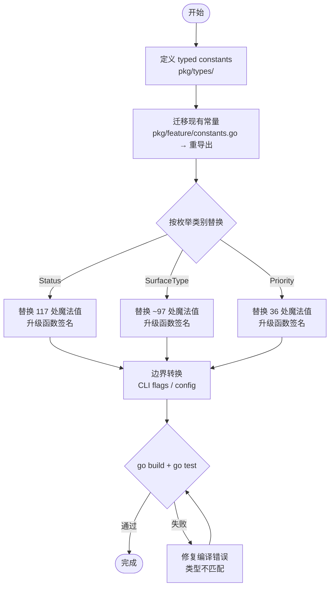

# unify-enum-constants — PRD Spec

> PRD Spec: defines WHAT the feature is and why it exists.

## Background

### Why (Reason)

forge-cli 中 Status（117 处）、Surface Type（~97 处）、Priority（36 处）共 250+ 处字符串字面量以魔法值形式直接使用。Status 和 Priority 常量虽已定义在 `pkg/feature/constants.go` 但几乎无人引用（Status 仅 5 处、Priority 0 处），Surface Type 完全无常量定义。拼写错误无法被编译器捕获，常量定义分散在多个包中缺乏统一归属。

### What (Target)

将所有枚举值统一为 typed constants（`type Status string` 等），集中到 `pkg/types/` 叶包，并修改所有相关结构体字段和函数签名，实现编译期类型安全。

### Who (Users)

- **Forge CLI 开发者**：日常修改状态、Surface Type、Priority 相关逻辑时，依赖类型系统而非字符串匹配
- **Forge CLI 维护者**：审查 PR 时通过类型签名理解函数契约，通过编译器验证枚举引用完整性

## Goals

| Goal | Metric | Notes |
|------|--------|-------|
| 消除所有枚举魔法值 | 魔法值从 250+ 降至 0 | Status 117 + Surface ~97 + Priority 36 |
| 实现编译期类型安全 | 类型不匹配的赋值产生编译错误 | typed constants 提供 `string` 无法实现的约束 |
| 集中枚举定义 | 3 种枚举类型（Status、SurfaceType、Priority）全部定义在 `pkg/types/` | 消除分散定义 |
| 零行为变更 | 所有 CLI 命令输入输出不变 | `type X string` 保持 JSON 序列化兼容 |

## Scope

### In Scope

- [ ] 新建 `pkg/types/` 包：定义 `type Status string`（7 常量）、`type SurfaceType string`（5 常量）、`type Priority string`（3 常量）
- [ ] 提供枚举辅助函数：`AllStatuses()`、`AllSurfaceTypes()`、`AllPriorities()`、`IsTerminalStatus()`
- [ ] 迁移 `pkg/feature/constants.go` 中 Status/Priority 常量，保留重导出兼容
- [ ] 替换 Status 魔法值（117 处，22 文件）并升级相关函数签名
- [ ] 替换 Surface Type 魔法值（~97 处，6 文件）并升级相关函数签名
- [ ] 替换 Priority 魔法值（36 处，7 文件）并升级相关函数签名

### Out of Scope

- Task Type 常量迁移（保留在 `pkg/task/types.go`，与 task 逻辑深度耦合）
- `pkg/forgeconfig/config.go` 中的 Coverage Config 默认键（循环依赖约束）
- 路径常量（`"prd"`、`"design"` 等）
- Config dotpath 键（`"eval.proposal"` 等）
- 测试文件中的魔法值替换（主任务完成后可单独处理）

## Flow Description

### Business Flow Description

本特性是纯代码重构，无业务流程变更。开发者工作流如下：

1. **定义类型**：在 `pkg/types/` 中创建 typed constant 定义
2. **迁移常量**：将 `pkg/feature/constants.go` 中的定义迁移至 `pkg/types/`，原位保留重导出
3. **替换引用**：逐包替换魔法值为 typed constants，同步修改函数签名和结构体字段类型
4. **边界转换**：在 CLI flags、config 解析等外部接口处添加 `types.Status(stringVal)` 转换
5. **验证**：`go build ./...` + `go test ./...` 确认零错误

### Business Flow Diagram

### Data Flow Description

无多系统交互，移除此节。

## Functional Specs

本特性无 UI 界面，不适用 prd-ui-functions.md。

### Related Changes

| # | Project | Module | Change Point | Updated Logic |
|------|----------|----------|------------|----------------|
| 1 | forge-cli | `pkg/types/` | 新建包 | 定义 Status、SurfaceType、Priority 类型及常量 |
| 2 | forge-cli | `pkg/feature/` | constants.go | 移除原始定义，添加重导出 |
| 3 | forge-cli | `pkg/task/` | 多文件 | 魔法值替换 + 签名升级（statemachine、add、state、deps、build 等） |
| 4 | forge-cli | `pkg/forgeconfig/` | 多文件 | Surface Type 魔法值替换 + 签名升级（detect_surface、detect、execution_order） |
| 5 | forge-cli | `internal/cmd/` | 多文件 | 魔法值替换 + 签名升级（submit、claim、validate_index、quality_gate 等） |

## Other Notes

### Performance Requirements

- 行为零变更：typed constants 的运行时开销与 string 常量完全一致（Go 编译器优化）
- 编译时间：新增 `pkg/types/` 包对编译时间影响可忽略

### Data Requirements

- 数据迁移：无。所有常量值与原始字符串完全相同
- 向后兼容：`pkg/feature/constants.go` 保留重导出，外部无感知

### Monitoring Requirements

- 不适用（内部代码重构，无运行时可观测性变化）

### Security Requirements

- 不适用（纯代码组织优化，无安全面影响）

---

## Quality Checklist

- [x] Is the requirement title accurate and descriptive
- [x] Does the background include all three elements: reason, target, users
- [x] Are the goals quantified
- [x] Is the flow description complete
- [x] Does the business flow diagram exist (Mermaid format)
- [x] Is prd-ui-functions.md referenced (N/A — no UI surface)
- [x] Are related changes thoroughly analyzed
- [x] Are non-functional requirements considered (performance / data / monitoring / security)
- [x] Are all tables filled completely
- [x] Is there any ambiguous or vague wording
- [x] Is the spec actionable and verifiable
