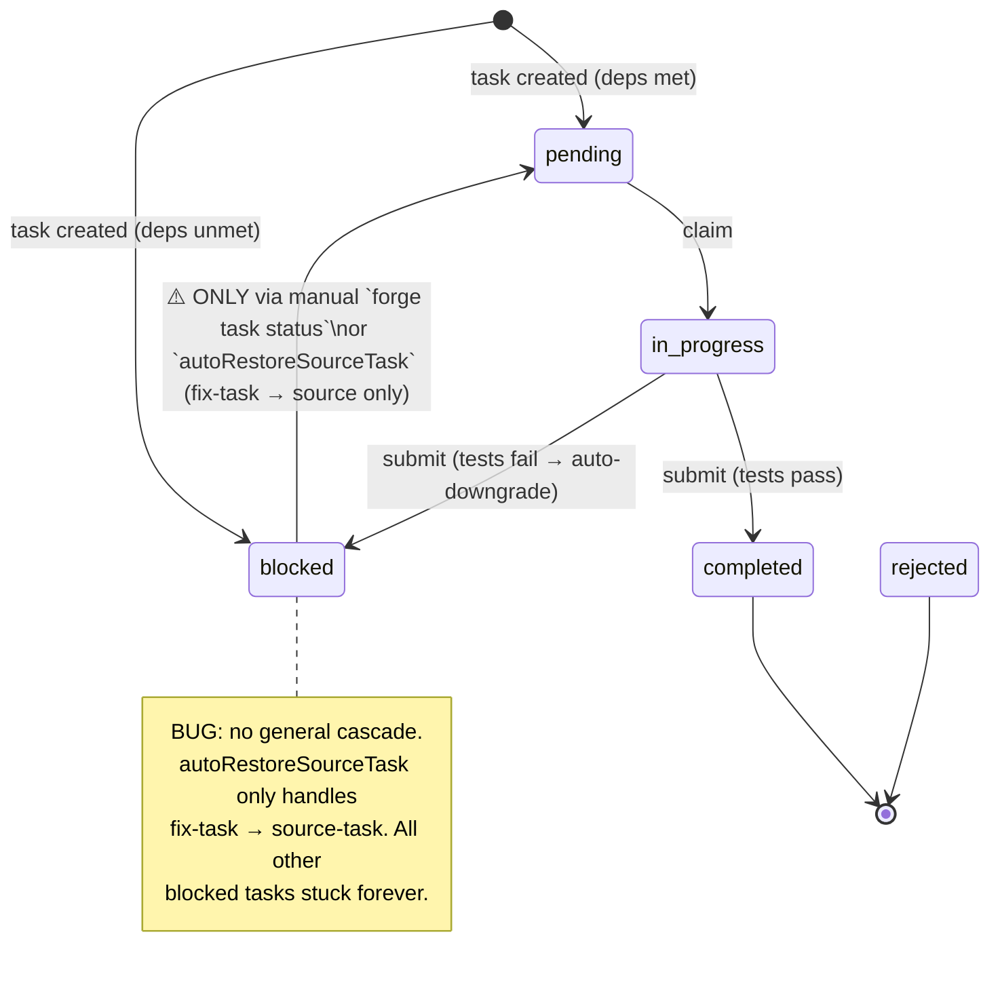
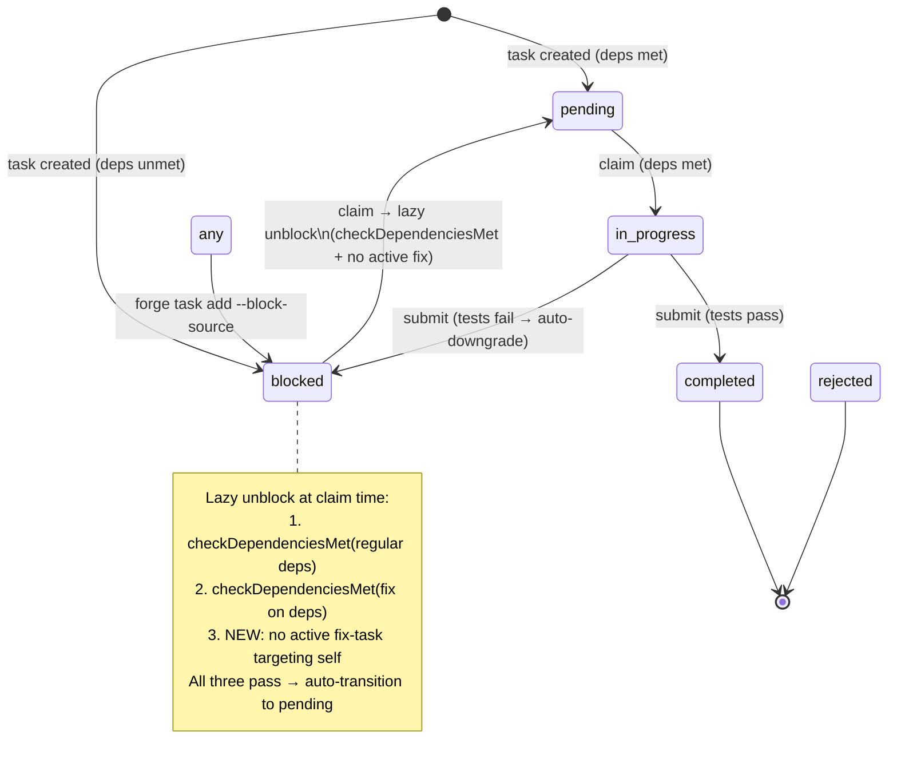
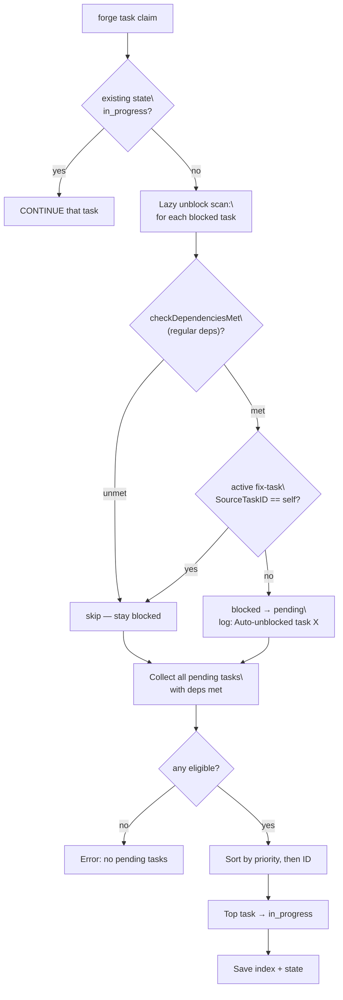
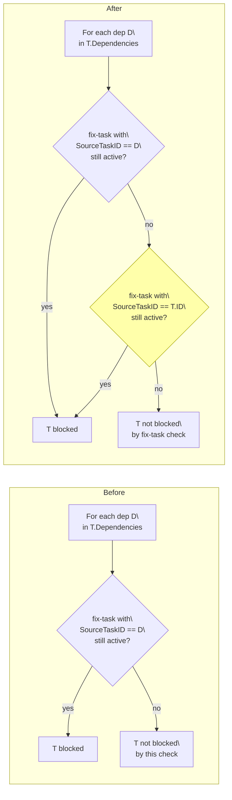

# Proposal: Task Lifecycle — Lazy Dependency Resolution

## Problem

`blocked` 状态的依赖解析采用"完成时级联"（submit.go 中扫描 blocked → pending），导致级联逻辑缺失时任务永久卡死。根本原因不是缺少级联代码，而是**依赖解析时机选错了**。

### Evidence

- T-quick-6 在 `extract-design-md-adapters` 中因级联缺失而永久 stuck（手动 `forge task status T-quick-6 pending` 恢复）
- 代码审查发现 `autoRestoreSourceTask` 仅处理 fix-task → source-task 的狭窄场景
- `claimNextTask` 已有完整依赖检查（常规依赖 + 通配符 + fix-task 阻塞），但被 `blocked` 状态提前过滤掉

### Urgency

这是一个架构缺陷：每次新增 `blocked` 产生路径都要配套级联代码，否则就会卡死。修一次不如改机制。

## Proposed Solution

**保持 `blocked` 状态**（用于可见性、`--block-source`、auto-downgrade），但将依赖解析从"提交时级联"改为"认领时惰性检查"。

核心变更：在 `claimNextTask` 开头加一个 lazy unblock 扫描——对每个 `blocked` 任务检查依赖是否满足，满足则自动转为 `pending`。单点修改，submit.go 不需要任何级联逻辑。

### Innovation Highlights

这不是新发明，而是 DAG 调度器的标准做法：消费者（claim）拉取时检查依赖，而非生产者（submit）完成后推送。Airflow、Temporal、Jenkins 都采用这个模型。

`checkDependenciesMet` 已有 fix-task 阻塞检查，但只检查任务**依赖项**上的 active fix-task，不检查**任务自身**上的 active fix-task（`--block-source` 场景）。两处修改一并修复：lazy unblock 依赖 `checkDependenciesMet` 的完整性，所以先修 `checkDependenciesMet`，再加 lazy scan。

## Requirements Analysis

### State Machine — Before (Current)

### State Machine — After (Proposed)

### Claim Flow — After (Proposed)

### `checkDependenciesMet` — Fix-Task Check (Before vs After)

### Key Scenarios

1. 任务 A 完成 → 下次 claim 时，依赖 A 的 blocked 任务 B 自动转为 pending 并被认领
2. Fix-task 仍在进行 → 即使依赖已完成，source task 仍被 fix-task 阻塞，不会过早认领
3. `--block-source` 创建 fix-task → source 进入 blocked → fix 完成 → 下次 claim 自动解除
4. Auto-downgrade（测试失败）→ 任务进入 blocked → 修复后重新 submit → 下次 claim 自动解除
5. 所有剩余任务都是 blocked 且依赖未满足 → "no pending tasks"（行为不变）

### Non-Functional Requirements

- 向后兼容：现有 index.json 无需修改
- 性能：lazy scan 是 O(n)，n = feature 内任务数（通常 <20）
- 无新 CLI 命令或 flags

### Constraints & Dependencies

- 修改 `claim.go`（`claimNextTask` + `checkDependenciesMet`）
- `checkDependenciesMet` 补充 active fix-task 检查：除检查任务依赖项上的 fix-task 外，还需检查任务**自身**上的 fix-task（`SourceTaskID == selfID`）

## Alternatives & Industry Benchmarking

### Industry Solutions

DAG 调度器标准模式：消费者拉取时检查依赖，不依赖生产者推送级联。

### Comparison Table

| Approach | Source | Pros | Cons | Verdict |
|----------|--------|------|------|---------|
| Do nothing | — | 零成本 | 任务持续卡死 | Rejected: 已在生产环境触发 |
| Submit 时级联 | 当前设计 | 主动推送 | 每个 blocked 路径都需配套级联，遗漏即卡死 | Rejected: 根本缺陷 |
| **Claim 时惰性检查** | DAG 调度标准 | 单点修改，无需级联，claim 已有完整检查 | blocked→pending 转换延后到 claim 时 | **Selected: 消除整类 bug** |

## Feasibility Assessment

### Technical Feasibility

`checkDependenciesMet` 的 fix-task 检查需扩展一个循环（检查 `SourceTaskID == selfID`）。lazy unblock 在扩展后的 `checkDependenciesMet` 之上工作，无需单独处理 `--block-source` 场景。两处修改在同一文件（claim.go），逻辑紧密耦合，一并修改降低风险。

### Resource & Timeline

单文件修改（claim.go）+ 测试更新。2 个任务。

### Dependency Readiness

所有前置函数和 helper 已存在。

## Scope

### In Scope

- 修复 `checkDependenciesMet`：增加 active fix-task 检查（`SourceTaskID == selfID`），覆盖 `--block-source` 场景
- 在 `claimNextTask` 添加 lazy unblock 扫描（blocked → pending），复用修复后的 `checkDependenciesMet`
- 更新受影响的测试用例
- 日志输出 auto-unblocked 任务 ID

### Out of Scope

- 移除 `autoRestoreSourceTask`（可作为后续 cleanup，保留为 belt-and-suspenders）
- `checkUnmetDeps`（status.go）同步修复（与 `checkDependenciesMet` 统一，独立修复）
- Submit 终态保护（BUG-2，独立修复）
- `isBusinessTask` 合并（BUG-1，独立修复）
- `.forge/state.json` TOCTOU 竞态（架构变更）
- Claim/Status advisory lock（独立关注点）

## Key Risks

| Risk | Likelihood | Impact | Mitigation |
|------|-----------|--------|------------|
| Lazy scan 过早解除 blocked fix-task source | L | H | `checkDependenciesMet` 增加 `SourceTaskID == selfID` 检查，lazy scan 复用同一函数 |
| `checkDependenciesMet` 修复影响现有 claim 行为 | M | M | 仅新增阻塞条件（不会放行原本被阻止的任务），行为变更严格收窄 |
| 测试用例需要更新（blocked→pending 行为变化） | M | L | 逐个更新测试，新行为是正确的 |
| `autoRestoreSourceTask` 与 lazy unblock 双重触发 | L | L | 两者幂等（blocked→pending 重复设置无害） |

## Success Criteria

- [ ] Blocked 任务在依赖满足后，下次 `forge task claim` 自动转为 pending 并被认领
- [ ] Fix-task 进行中时，source task 不会因 lazy unblock 过早解除
- [ ] `--block-source` 场景正常工作：fix 完成 → 下次 claim 解除 source
- [ ] Auto-downgrade 场景正常工作：测试失败 → blocked → 修复后 claim 解除
- [ ] 所有现有测试通过（含更新的测试）
- [ ] 无 submit.go 修改

## Next Steps

- Proceed to `/quick-tasks` to generate task files
