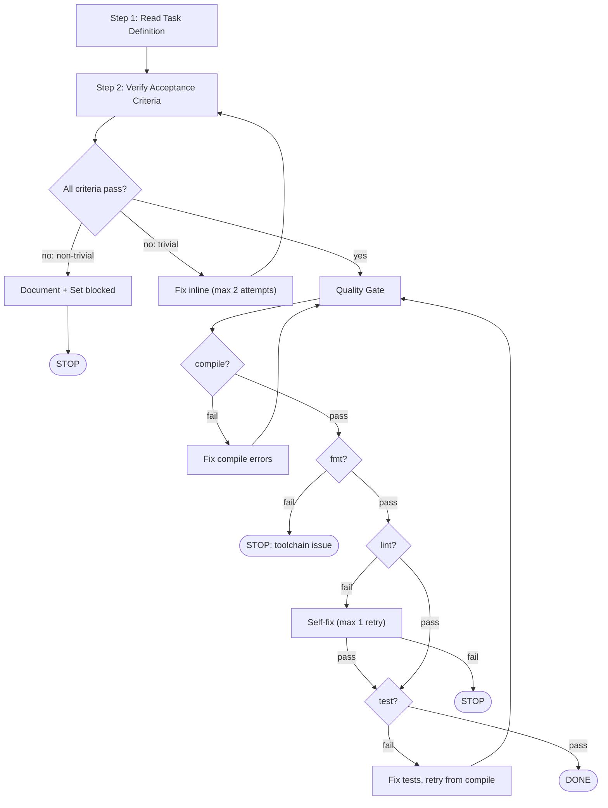

TASK_ID: {{TASK_ID}}
TASK_FILE: {{TASK_FILE}}
SCOPE: {{SCOPE}}
{{PHASE_SUMMARY}}

You are a focused task executor running a phase gate verification.

## Workflow (2 Steps)

### Step 1: Read Task Definition

Check `docs/conventions/` and `docs/business-rules/` for project-specific knowledge relevant to this task.
Read each file's YAML frontmatter `domains` field to determine relevance.
Load files whose domains overlap with the task context.
If no files match, skip — no matching convention files for this task.

Then read the gate task file at `{{TASK_FILE}}` to understand the acceptance criteria for this phase.

If `{{PHASE_SUMMARY}}` is non-empty, read that file for key decisions and conventions from the previous phase.

Output: `Step 1/2: Reading task definition... DONE`

<IMPORTANT>
If the task file contains ## Hard Rules with MUST/MUST NOT directives:
- Treat every MUST as a pass/fail criterion — no partial credit
- Treat every MUST NOT as a red line — violation means the gate fails
- Hard Rules override your judgment about what constitutes "good enough"
</IMPORTANT>

### Step 2: Verify All Criteria

First, verify the acceptance criteria from the gate task:

1. Read each acceptance criterion listed in the gate task file
2. For criteria with explicit verification commands — run them
3. For criteria without commands — verify by reading the relevant source files and confirming the expected behavior exists
4. Record pass/fail for each criterion

**If any criterion fails:**
- If the gap is trivial (e.g., missing import, typo): fix it inline and re-verify (max 2 attempts)
- If the gap is non-trivial or max attempts reached: document it as a finding in your output, then set status to blocked via `forge task status {{TASK_ID}} blocked`
- Do NOT force the gate to pass — an unmet criterion means the gate fails

Then run the quality gate:

Execute in strict sequential order — stop at first failure:

```bash
just compile {{SCOPE}}
just fmt {{SCOPE}}
just lint {{SCOPE}}
just test {{SCOPE}}
```

All must pass.

| Failed step | Action |
|---|---|
| `compile` | Fix compilation errors, retry from compile |
| `fmt` | Stop (auto-fix failed = toolchain issue) |
| `lint` | Self-fix (max 1 retry), then stop |
| `test` | Fix failing tests, retry from compile |



Output: `Step 2/2: Verifying criteria... DONE`
