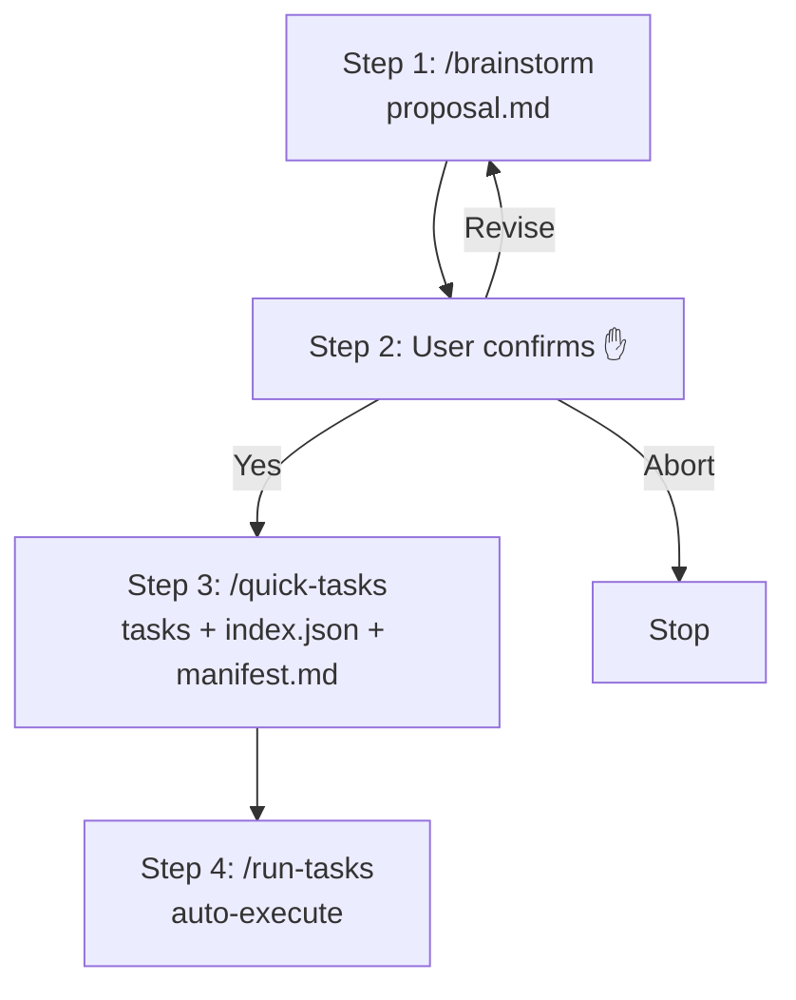

# /quick

Streamlined pipeline for small features: brainstorm → tasks → execute.

## Architecture



## Step 1: Brainstorm

Invoke the brainstorm skill:

```
Skill(skill="forge:brainstorm")
```

This produces `docs/proposals/<slug>/proposal.md` through interactive dialogue with the user. The brainstorm skill handles all user interaction and commits the proposal.

After brainstorm completes, extract the feature slug from the proposal directory path.

## Step 2: User Confirmation

Read the generated `docs/proposals/<slug>/proposal.md` and present a summary:

```
## Quick Mode: Proposal Summary

**Problem**: <one line from proposal>
**Solution**: <one line from proposal>
**Scope**:
- <In Scope bullets>
**Success Criteria**:
- <Success Criteria checkboxes>

Generate tasks from this proposal?
```

Use `AskUserQuestion` with three options:

| Option | Action |
|--------|--------|
| **Yes, generate tasks** | Proceed to Step 3 |
| **Revise proposal** | Return to Step 1 (re-run brainstorm) |
| **Abort** | Stop cleanly |

<EXTREMELY-IMPORTANT>
This confirmation is MANDATORY. The proposal is the sole input for the entire quick mode pipeline — no PRD or design will be created to correct course. A wrong direction here means all downstream tasks are wasted.
</EXTREMELY-IMPORTANT>

## Step 3: Generate Tasks

Invoke the quick-tasks skill:

```
Skill(skill="forge:quick-tasks")
```

This produces:
- `docs/features/<slug>/tasks/*.md` — task files (1-10 business + optional T-quick-1~5)
- `docs/features/<slug>/tasks/index.json` — task index (compatible with `/run-tasks`)
- `docs/features/<slug>/manifest.md` — simplified manifest

If quick-tasks reports >10 tasks needed, STOP and recommend the full pipeline:

```
"This feature requires more than 10 tasks — too large for quick mode.
Recommend using the full pipeline: /write-prd → /tech-design → /breakdown-tasks"
```

## Step 4: Execute Tasks

Invoke the run-tasks command to auto-execute all tasks:

```
Skill(skill="forge:run-tasks")
```

The existing run-tasks dispatcher will:
1. Read `index.json`
2. Claim tasks in dependency order
3. Dispatch to task-executor subagents
4. Run breaking gates (compile + fmt + lint + test)
5. Handle fix tasks on failure
6. Run all-completed hook as final safety net

## Error Handling

| Situation | Action |
|-----------|--------|
| Brainstorm fails | Stop, user can retry |
| User aborts at confirmation | Stop cleanly |
| quick-tasks exceeds 10 task limit | Stop, recommend full pipeline |
| `forge task validate-index` fails | Stop, fix index.json issues |
| run-tasks encounters failures | Handled by dispatcher (fix tasks, retries) |

## Rules

<EXTREMELY-IMPORTANT>
- Maximum 10 business tasks. If brainstorm produces a proposal that needs more, STOP and suggest the full pipeline.
- ONE feature per invocation.
- The /quick pipeline is for small, well-scoped features. If scope grows during brainstorm, recommend switching to full mode.
</EXTREMELY-IMPORTANT>
