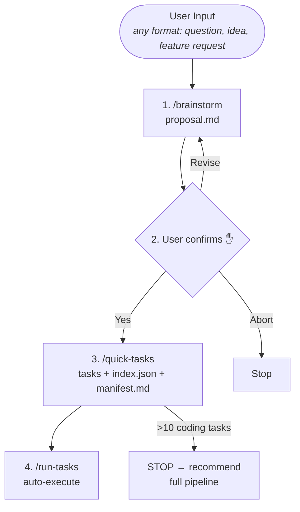

# /quick

Streamlined pipeline for small features: brainstorm → tasks → execute.

## Architecture



## Core Rules

<EXTREMELY-IMPORTANT>
1. **Execute the pipeline in order.** Always start with Step 1 (brainstorm), regardless of how the user's input is phrased. Question-like inputs ("can we simplify X?", "should we refactor Y?") are NOT discussions — they are feature requests that brainstorm exists to shape into structured proposals. Do NOT substitute ad-hoc analysis (Explore agents, grep, file reads) for the pipeline.
2. Maximum 10 coding tasks (`coding.*` type). Doc-type tasks (`doc*` type prefix) are unlimited. If brainstorm produces a proposal that needs >10 coding tasks, STOP and suggest the full pipeline.
3. ONE feature per invocation.
4. The /quick pipeline is for small, well-scoped features. If scope grows during brainstorm, recommend switching to full mode.
</EXTREMELY-IMPORTANT>

## Step 1: Brainstorm

Invoke the brainstorm skill:

```
Skill(skill="forge:brainstorm")
```

brainstorm runs its full interactive flow: structured dialogue, user commit approval, and an optional eval-proposal step. When it completes, `docs/proposals/<slug>/proposal.md` is committed.

After brainstorm completes, extract the feature slug from the proposal directory path. Each downstream skill (quick-tasks, run-tasks) derives the slug independently from the filesystem — no explicit passing needed.

## Step 2: Task Generation Gate

The user already approved and committed the proposal in Step 1. This gate confirms whether to proceed to **task generation** — not proposal approval.

<EXTREMELY-IMPORTANT>
### Auto-Skip Configuration Check (Step 2 Entry)

At the very beginning of Step 2, before presenting any summary or confirmation prompt, execute the following config check:

```bash
forge config get auto.runTasks
```

Capture stdout (trimmed) and exit code. Output format is plain text key:value pairs (e.g., `quick:true full:false`). Then:

| Exit Code | stdout contains `quick:true` | Action |
|-----------|-------------------------------|--------|
| 0 | Yes | **Skip the confirmation gate entirely.** Update proposal status `Draft → Approved` (see Status Transition below), then proceed directly to Step 3. |
| 0 | No (or `quick:false`) | Present the confirmation gate (full Step 2 flow below). |
| Non-zero (config missing/read error) | — | **Fallback: skip the confirmation gate** (same as `quick: true`). This preserves quick mode's streamlined nature. |

This check MUST happen at Step 2 entry — not during brainstorm, not after the summary is shown. The gate logic below is preserved but conditionally bypassed based on this config value.
</EXTREMELY-IMPORTANT>

### Confirmation Gate (shown only when `auto.runTasks.quick: false`)

Read `docs/proposals/<slug>/proposal.md` and present a summary:

```
## Quick Mode: Proposal Summary

**Problem**: <one line from proposal>
**Solution**: <one line from proposal>
**Scope**:
- <In Scope bullets>
**Success Criteria**:
- <Success Criteria checkboxes>

Generate tasks from this proposal?
```

Use `AskUserQuestion` with three options:

| Option | Action |
|--------|--------|
| **Yes, generate tasks** | Update proposal status, then proceed to Step 3 |
| **Revise proposal** | Return to Step 1 (re-run brainstorm) |
| **Abort** | Stop cleanly |

<EXTREMELY-IMPORTANT>
This gate is MANDATORY when `auto.runTasks.quick: false`. The proposal is the sole input for the entire quick mode pipeline — no PRD or design will be created to correct course. A wrong direction here means all downstream tasks are wasted.
</EXTREMELY-IMPORTANT>

### Status Transition: Draft → Approved

When the user selects **"Yes, generate tasks"**, OR when the confirmation gate is auto-skipped (`auto.runTasks.quick: true`), update the proposal frontmatter status:

```
Edit(file_path="docs/proposals/<slug>/proposal.md",
     old_string="status: Draft",
     new_string="status: Approved")
```

This must be an atomic frontmatter edit targeting only the `status:` line. Do NOT rewrite the entire file.

## Step 3: Generate Tasks

Invoke the quick-tasks skill:

```
Skill(skill="forge:quick-tasks")
```

This produces:
- `docs/features/<slug>/tasks/*.md` — task files (≤10 coding tasks + unlimited doc tasks + auto-generated test tasks)
- `docs/features/<slug>/tasks/index.json` — task index (compatible with `/run-tasks`)
- `docs/features/<slug>/manifest.md` — simplified manifest

If quick-tasks reports >10 coding tasks needed, STOP and recommend the full pipeline:

```
"This feature requires more than 10 coding tasks — too large for quick mode.
Recommend using the full pipeline: /write-prd → /tech-design → /breakdown-tasks"
```

## Step 3→4 Transition

<EXTREMELY-IMPORTANT>
After quick-tasks completes successfully, you MUST **immediately proceed** to Step 4 (run-tasks) with **zero intermediate output**. Specifically:

1. **Do NOT** output any summary, recap, or status message between quick-tasks and run-tasks.
2. **Do NOT** pause for user confirmation. The user already confirmed in Step 2.
3. **Do NOT** ask the user anything. Invoke run-tasks directly.
4. **Do NOT** perform any intermediate actions (file reads, git status, exploratory analysis) between the two steps.

If quick-tasks reports any failure, stop and fix the issue before proceeding. Only proceed to run-tasks after quick-tasks completes without errors.
</EXTREMELY-IMPORTANT>

## Step 4: Execute Tasks

Invoke the run-tasks command:

```
Skill(skill="forge:run-tasks")
```

`run-tasks` reads `index.json`, claims tasks in dependency order, and dispatches to task-executor subagents. Quality gates (compile + fmt + lint + test) run for breaking tasks. Failures auto-create fix tasks with retry loops. On completion, run-tasks presents extracted knowledge for user confirmation and prints a summary. See `run-tasks` command for full behavior.

## Error Handling

| Situation | Action |
|-----------|--------|
| Brainstorm fails | Stop, user can retry |
| User aborts at confirmation gate | Stop cleanly |
| quick-tasks exceeds 10 coding task limit | Stop, recommend full pipeline |
| quick-tasks fails (validation, commit, language) | Stop, fix reported issue |
| run-tasks: single task failure | Dispatcher auto-creates fix task, continues |
| run-tasks: MAIN_SESSION task fails | Follow task doc error section; if missing, fix-task + continue |
| run-tasks: agent timeout | Mark blocked, increment failure counter, continue |
| run-tasks: 3 consecutive failures | Pipeline stops, report summary |
| run-tasks: loop ends (no tasks) | Pipeline completes, knowledge extraction runs |
