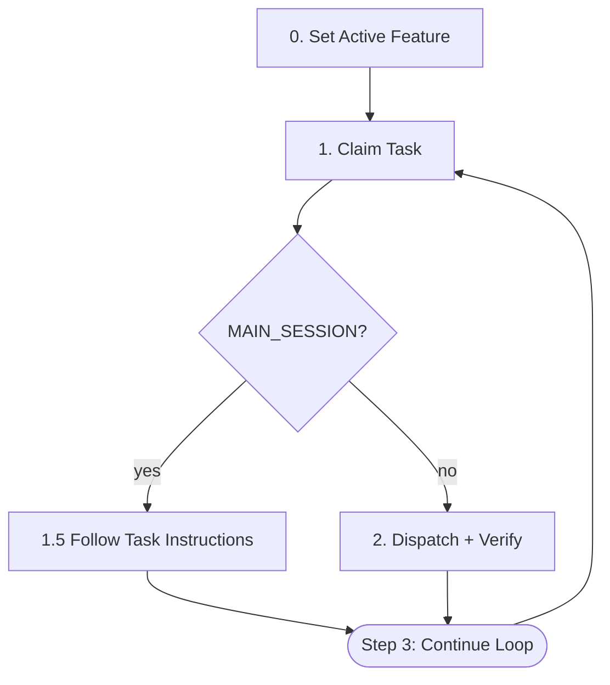

# /run-tasks

Auto-dispatch tasks. MAIN_SESSION tasks execute in main session; all others dispatch to forge:task-executor subagent.

## Architecture



## Dispatcher Iron Laws

<EXTREMELY-IMPORTANT>
1. Only 3 actions: claim → (main_session? follow task instructions : dispatch+verify) → continue loop
2. NO code reading, NO code writing — EXCEPT for MAIN_SESSION tasks (Step 1.5) where reading the task file and invoking the Skill tool are required
3. NO running tests directly — the CLI submit gate handles quality checks at task submission
4. 30-minute timeout per task
5. 3 consecutive failures → STOP (tracked by failure counter below)
6. NO `run_in_background`, NO `TaskOutput` polling — Agent call is blocking, wait for return
</EXTREMELY-IMPORTANT>

## Execution Loop

**Failure tracking**: maintain `consecutive_failures` (starts at 0). Increment on: fix-task creation, record-missing dispatch, agent timeout. Reset to 0 on successful claim→dispatch→verify cycle. At 3: print summary and STOP.

### Step 0: Set Active Feature

Runs **once** before the claim loop.

1. Determine the feature slug from the current context (proposal directory, manifest, or user input).
2. Run `forge feature set <slug>`. On success (exit code 0), the slug is printed to stdout. Proceed to Step 1.

### Step 1: Claim Task

```bash
forge task claim
```

**Output**: `ACTION: CLAIMED` (new) | `ACTION: CONTINUE` (resume) | Error (no task, end loop).

**Extract**: `TASK_ID`, `FILE`, `MAIN_SESSION`, `SCOPE` (defaults "all"), `FEATURE`.

### Step 1.5: Main Session Routing

If `MAIN_SESSION == "true"`:

1. Read task file at `FILE`, find `## Main Session Instructions` section.
2. Follow instructions exactly (task document specifies skill, outcome, record logic).
3. If section missing: run `forge task status <TASK_ID> blocked`, report error, continue to Step 3.
4. After execution, verify via `forge task status <TASK_ID>`. If STATUS != "completed", spawn fix task.
5. Skip to Step 3.

Else: proceed to Step 2.

### Step 2: Dispatch + Verify

**2a. Dispatch** — `Agent(subagent_type="forge:task-executor", prompt="Execute task <TASK_ID>")`. Subagent calls `forge prompt get-by-task-id` internally. **Timeout**: 30 min. NO `run_in_background` — wait for Agent return.

**2b. Verify Record** — Run `forge task status <TASK_ID>`:
- **STATUS == "completed"**: proceed to Step 3 (Continue Loop).
- **STATUS == "blocked"** (auto-downgraded): spawn fix task. Continue loop.
- **STATUS == "in_progress"** (no record created): proceed to 2c.

**2c. Record-Missing Recovery** — `Agent(subagent_type="forge:task-executor", prompt="Fix record for task <TASK_ID>")`. Subagent detects "Fix record for" prefix and calls `forge prompt get-by-task-id <TASK_ID> --fix-record-missed` internally. After 2c, re-verify via 2b logic.

### Step 3: Continue Loop

Return to Step 1.

## Error Handling

| Situation | Action |
|-----------|--------|
| No available task | End loop, print summary |
| Agent timeout | Mark blocked, continue |
| Record missing | Dispatch fix-record subagent (2c) |
| 3 consecutive failures | STOP |
| Main session fails | Follow task doc's error section; if missing, fix-task + continue |

## Post-Completion

After loop ends, print: "All tasks completed. T-test-3, T-test-4, and T-test-4.5 handle e2e verification, graduation, and regression automatically."

If index lacks T-test-3/T-test-4, suggest: "Run `/run-e2e-tests` then `forge test promote <journey>`."

Do NOT run e2e tests from the dispatcher.

### Knowledge Review

After the loop summary and e2e suggestion (above), run knowledge auto-extraction.

Do NOT run knowledge review if the loop ended due to 3 consecutive failures (incomplete feature).

#### Parameters

| Parameter | Value |
|-----------|-------|
| `trigger` | `run-tasks` |
| `artifacts` | task outcomes (`docs/features/<slug>/tasks/*.md`), code changes (`git diff` against feature branch base), manifest (`docs/features/<slug>/manifest.md`) |

#### Artifact Scanning Scope

Focus on outcomes and patterns that emerged during implementation. Also review `git diff` output for the feature branch to capture code-level patterns.

#### Knowledge Types

The extraction routine identifies four knowledge types:

| Type | Target | Format reference |
|------|--------|-----------------|
| Decision | `docs/decisions/<type>.md` | `decision-logging.md` Section 6 (row format), Section 7 (manifest update) |
| Lesson | `docs/lessons/<slug>.md` | `learn/templates/lesson-entry.md` |
| Convention | `docs/conventions/<topic>.md` | `/consolidate-specs` tech-specs entry format, with project-global ID |
| Business Rule | `docs/business-rules/<domain>.md` | `/consolidate-specs` biz-specs entry format, with project-global ID |

#### Extraction Flow

##### Step 1: Scan artifacts

Read all artifacts specified above. Also review `git diff` output for the feature branch to capture code-level patterns.

##### Step 2: Identify notable knowledge

Apply the "notable knowledge" heuristics below to determine if any notable knowledge exists in the scanned artifacts. Classify each candidate by knowledge type (Decision, Lesson, Convention, Business Rule).

##### Step 3: Vocabulary-assisted classification

If `/consolidate-specs` has previously generated vocabulary (from drift-detection runs), use the domain keywords from existing `docs/conventions/` and `docs/business-rules/` files to suggest which target file each extracted item belongs to. This is a suggestion — the agent makes the final classification decision based on content.

If no vocabulary exists (no prior `/consolidate-specs` run), classify unassisted using the domain-to-file mapping from `/consolidate-specs` skill Step 5.

##### Step 4: Silent exit if no notable knowledge

If no candidates pass the "notable" heuristics (below), **produce no output**. Do not ask the user anything. Return silently.

##### Step 5: Present for user confirmation

Use AskUserQuestion to present extracted candidates:

```
Knowledge extracted from run-tasks:

  [1] <Decision> → docs/decisions/<type>.md
  [2] <Lesson> → docs/lessons/<slug>.md
  [3] <Convention> → docs/conventions/<topic>.md
  [4] <Business Rule> → docs/business-rules/<domain>.md

Enter numbers to save (comma-separated), or all / none:
```

User input handling:
- `none` → discard all candidates, no output
- `all` → save all candidates
- comma-separated numbers → save only selected candidates

##### Step 6: Write confirmed knowledge

For each confirmed candidate, write to the target file using the format defined by the knowledge type. Create target files if they do not exist. When creating new convention/business-rule files, include YAML frontmatter with `title` and `domains` per `/consolidate-specs` Domain Derivation Rules.

Do NOT write to knowledge directories without explicit user confirmation from Step 5.

#### Notable Knowledge Heuristics

The heuristics determine whether a piece of knowledge is "notable" (worth extracting) vs "routine" (skip silently). The goal is a false-positive rate below 30%.

**Decisions — NOT notable when:**

- The choice is the standard/default option in the ecosystem (e.g., "used standard library", "used ORM for database access")
- No meaningful alternatives existed (e.g., "used the only available API")
- The decision is purely cosmetic or stylistic with no architectural impact
- The decision replicates an existing entry in `docs/decisions/`

**Decisions — NOTABLE when:**

- Multiple viable alternatives existed and the choice has lasting impact (e.g., "chose event-driven over polling for state sync")
- The decision involves a non-obvious tradeoff (e.g., "sacrificed consistency for availability in the cache layer")
- A constraint forced an unconventional approach (e.g., "used file-based locking because the Redis dependency was disallowed")

**Lessons — NOT notable when:**

- The root cause is a trivial mistake (e.g., typo, missing import, wrong variable name)
- The issue is standard to the framework/language (e.g., "null pointer from uninitialized field")
- The fix was obvious from the error message
- The lesson replicates an existing entry in `docs/lessons/`

**Lessons — NOTABLE when:**

- The root cause was non-obvious (e.g., race condition from hidden shared state, ordering dependency across services)
- The debugging path was indirect (e.g., "symptom appeared in module A but root cause was in module B")
- The issue would recur in similar contexts and the pattern is worth documenting (e.g., "non-thread-safe map in concurrent handler")

**Conventions — NOT notable when:**

- The pattern is already documented in `docs/conventions/`
- The pattern is a one-off choice specific to this feature
- The pattern is standard practice in the ecosystem (e.g., "used REST for HTTP API")

**Conventions — NOTABLE when:**

- The pattern should be repeated across the project (e.g., "all CLI commands use cobra with this flag structure")
- A project-specific standard was established (e.g., "config files use YAML with this schema structure")
- The pattern emerged from implementation and was not pre-designed

**Business Rules — NOT notable when:**

- The rule is feature-specific logic (e.g., "this feature's form validates email format")
- The rule is a standard CRUD constraint (e.g., "required fields must be non-empty")
- The rule replicates an existing entry in `docs/business-rules/`

**Business Rules — NOTABLE when:**

- The rule applies across features (e.g., "all monetary values use integer cents, never float")
- The rule expresses a domain invariant (e.g., "order status can only advance, never regress")
- The rule constrains user-facing behavior across the system (e.g., "all user actions require authentication except health-check endpoints")

#### Deduplication

Before presenting candidates in Step 5, check for duplicates:

1. **Decisions**: grep `docs/decisions/<type>.md` for similar Decision text
2. **Lessons**: grep `docs/lessons/*.md` for similar Root Cause content
3. **Conventions**: grep `docs/conventions/*.md` for similar rule descriptions
4. **Business Rules**: grep `docs/business-rules/*.md` for similar rule statements

If a duplicate is found, exclude the candidate and do not present it. The heuristic goal is: if it is already documented, do not re-extract it.

#### Rules

- Extraction logic must be **conservative**: only extract genuinely non-obvious knowledge
- Must not write to knowledge directories without explicit user confirmation
- Silent when no notable knowledge is detected — no output, no prompts
- All output formats must be compatible with `/learn` skill and `/consolidate-specs` overlap detection
- Deduplication runs before presentation — never present a duplicate of existing knowledge
