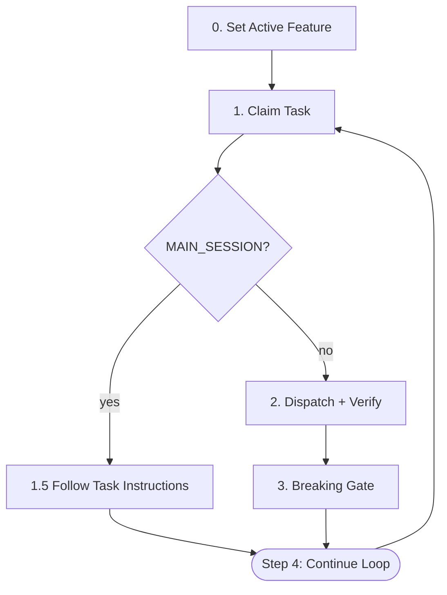

# /run-tasks

Auto-dispatch tasks. MAIN_SESSION tasks execute in main session; all others dispatch to forge:task-executor subagent.

## Architecture



## Dispatcher Iron Laws

<EXTREMELY-IMPORTANT>
1. Only 4 actions: claim → (main_session? follow task instructions : dispatch+verify) → breaking gate
2. NO code reading, NO code writing — EXCEPT for MAIN_SESSION tasks (Step 1.5) where reading the task file and invoking the Skill tool are required
3. NO running tests directly — EXCEPT in Step 3 (Breaking Task Gate) where `just test` is executed as quality gate
4. 30-minute timeout per task
5. 3 consecutive failures → STOP (tracked by failure counter below)
</EXTREMELY-IMPORTANT>

## Execution Loop

**Failure tracking**: maintain `consecutive_failures` (starts at 0). Increment on: fix-task creation, record-missing dispatch, agent timeout. Reset to 0 on successful claim→dispatch→verify→gate cycle. At 3: print summary and STOP.

### Step 0: Set Active Feature

Runs **once** before the claim loop.

1. Determine the feature slug from the current context (proposal directory, manifest, or user input).
2. Run `forge feature set <slug>`. On success (exit code 0), the slug is printed to stdout. Proceed to Step 1.

### Step 1: Claim Task

```bash
forge task claim
```

**Output**: `ACTION: CLAIMED` (new) | `ACTION: CONTINUE` (resume) | Error (no task, end loop).

**Extract**: `TASK_ID`, `FILE`, `BREAKING`, `MAIN_SESSION`, `SCOPE` (defaults "all"), `FEATURE`.

### Step 1.5: Main Session Routing

If `MAIN_SESSION == "true"`:

1. Read task file at `FILE`, find `## Main Session Instructions` section.
2. Follow instructions exactly (task document specifies skill, outcome, record logic).
3. If section missing: run `forge task status <TASK_ID> blocked`, report error, continue to Step 4.
4. After execution, verify via `forge task status <TASK_ID>`. If STATUS != "completed", spawn fix task.
5. Skip to Step 4.

Else: proceed to Step 2.

### Step 2: Dispatch + Verify

**2a. Dispatch** — `Agent(subagent_type="forge:task-executor", prompt="Execute task <TASK_ID>")`. Subagent calls `forge prompt get-by-task-id` internally. **Timeout**: 30 min.

**2b. Verify Record** — Run `forge task status <TASK_ID>`:
- **STATUS == "completed"**: proceed to Step 3.
- **STATUS == "blocked"** (auto-downgraded): spawn fix task. Continue loop.
- **STATUS == "in_progress"** (no record created): proceed to 2c.

**2c. Record-Missing Recovery** — `Agent(subagent_type="forge:task-executor", prompt="Fix record for task <TASK_ID>")`. Subagent detects "Fix record for" prefix and calls `forge prompt get-by-task-id <TASK_ID> --fix-record-missed` internally. After 2c, re-verify via 2b logic.

### Step 3: Breaking Task Gate

Only runs if `BREAKING=true`. Otherwise skip Step 3 entirely.

Pre-flight: verify justfile exists and `test` recipe present. Scope Resolution: if SCOPE is missing/empty/"all" or `forge config get project-type` returns non-"mixed" → `just test`. If project-type is "mixed" → `just test <SCOPE>`.

```bash
mkdir -p .forge/tmp
just test [scope] > .forge/tmp/test-output.txt 2>&1; TEST_EXIT=$?
if [ $TEST_EXIT -ne 0 ]; then
  tail -20 .forge/tmp/test-output.txt
  forge task add --template fix-task --title "Fix: <failure>" \
    --source-task-id <TASK_ID> --block-source \
    --var SOURCE_FILES="<affected paths>" --var TEST_SCRIPT="<failing test>" \
    --var TEST_RESULTS="<results path>" --description "<root cause>"
fi
```

`--block-source`: atomically blocks source task. `--source-task-id` auto-resolves fix-tasks to root. On failure: continue loop. On pass: continue to Step 1.

### Step 4: Continue Loop

Return to Step 1.

## Error Handling

| Situation | Action |
|-----------|--------|
| No available task | End loop, print summary |
| Agent timeout | Mark blocked, continue |
| Record missing | Dispatch fix-record subagent (2c) |
| 3 consecutive failures | STOP |
| Test failure (Step 3) | `--template fix-task --block-source`, continue |
| Main session fails | Follow task doc's error section; if missing, fix-task + continue |

## Post-Completion

After loop ends, print: "All tasks completed. T-test-3, T-test-4, and T-test-4.5 handle e2e verification, graduation, and regression automatically."

If index lacks T-test-3/T-test-4, suggest: "Run `/run-e2e-tests` then `forge test promote <journey>`."

Do NOT run e2e tests outside Step 3.

### Knowledge Review

After the loop summary and e2e suggestion (above), run knowledge auto-extraction:

1. Read `${CLAUDE_SKILL_DIR}/../references/shared/knowledge-extraction.md` and execute its extraction flow with:
   - `trigger`: `run-tasks`
   - `artifacts`: task outcomes (`docs/features/<slug>/tasks/*.md`), code changes (`git diff` against feature branch base), manifest (`docs/features/<slug>/manifest.md`)

2. The extraction flow handles:
   - Scanning artifacts for notable knowledge (decisions, lessons, conventions, business rules)
   - Silent exit when no notable knowledge detected (routine tasks)
   - Presenting extracted knowledge for user confirmation via AskUserQuestion
   - Writing confirmed knowledge to appropriate directories using shared formats

Do NOT run knowledge review if the loop ended due to 3 consecutive failures (incomplete feature).
