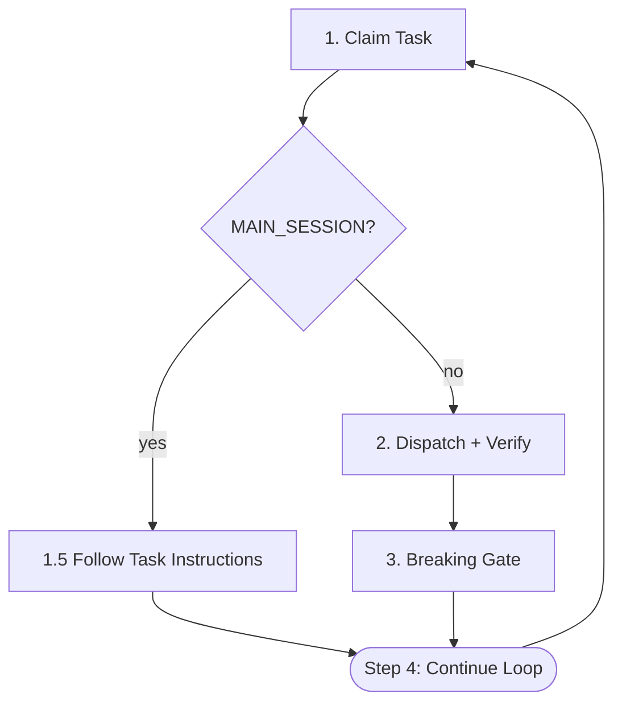

# /run-tasks

Auto-dispatch tasks. MAIN_SESSION tasks execute in main session; all others dispatch to forge:task-executor subagent.

## Architecture



## Dispatcher Iron Laws

<EXTREMELY-IMPORTANT>
1. Only 4 actions: claim → (main_session? follow task instructions : dispatch+verify) → breaking gate
2. NO code reading, NO code writing — EXCEPT for MAIN_SESSION tasks (Step 1.5) where the Skill tool is invoked in the main session
3. NO running tests directly — EXCEPT in Step 3 (Breaking Task Gate) where `just test` and `just test-e2e` are executed as quality gates
4. 30-minute timeout per task
5. 3 consecutive failures → STOP
</EXTREMELY-IMPORTANT>

## Execution Loop

### Step 1: Claim Task

```bash
forge task claim
```

**Output**: `ACTION: CLAIMED` (new) | `ACTION: CONTINUE` (resume) | Error (no task, end loop).

**Extract**: `TASK_ID`, `KEY`, `FILE`, `BREAKING`, `MAIN_SESSION`, `SCOPE` (defaults "all"), `FEATURE`.

### Step 1.5: Main Session Routing

If `MAIN_SESSION == "true"`:

1. Read task file at `FILE`, find `## Main Session Instructions` section.
2. Follow instructions exactly (task document specifies skill, outcome, record logic).
3. If section missing: mark blocked, report error.
4. After execution, verify via `forge task status <TASK_ID>`. If STATUS != "completed", spawn fix task.
5. Skip to Step 4.

Else: proceed to Step 2.

### Step 2: Dispatch + Verify

**2a. Dispatch** — `Agent(subagent_type="forge:task-executor", prompt="Execute task <TASK_ID>")`. Subagent calls `forge prompt get-by-task-id` internally. **Timeout**: 30 min.

**2b. Verify Record** — Run `forge task status <TASK_ID>`:
- **STATUS == "completed"**: proceed to Step 3.
- **STATUS != "completed"**: spawn fix task (`forge task add --template fix-task --title "Fix: <failure>" --source-task-id <TASK_ID> --block-source --description "<reason>"`). Output: `ADDED` | `SKIPPED`. Continue loop.

**2c. Record-Missing Recovery** — `Agent(subagent_type="forge:task-executor", prompt="Fix record for task <TASK_ID>")`. Subagent calls `forge prompt get-by-task-id <TASK_ID> --fix-record-missed` internally.

### Step 3: Breaking Task Gate

| BREAKING=true? | SCOPE frontend\|all + specs exist? | Run 3a? | Run 3b? |
|----------------|-------------------------------------|---------|---------|
| Yes | No | Yes | No |
| No | Yes | No | Yes |
| Yes | Yes | Yes | Yes |
| No | No | Skip Step 3 | Skip Step 3 |

If running both: 3a first, then 3b only if 3a passes.

#### 3a. Unit/Integration Gate (BREAKING: true)

Pre-flight: verify justfile exists and `test` recipe present. Apply **Scope Resolution** protocol from Forge Guide using `SCOPE` from Step 1.

```bash
mkdir -p .forge/tmp
just test [scope] > .forge/tmp/test-output.txt 2>&1; TEST_EXIT=$?
if [ $TEST_EXIT -ne 0 ]; then
  tail -20 .forge/tmp/test-output.txt
  forge task add --template fix-task --title "Fix: <failure>" \
    --source-task-id <TASK_ID> --block-source \
    --var SOURCE_FILES="<affected paths>" --var TEST_SCRIPT="<failing test>" \
    --var TEST_RESULTS="<results path>" --description "<root cause>"
fi
```

`--block-source`: atomically blocks source task. `--source-task-id` auto-resolves fix-tasks to root. On failure: continue loop. On pass: if routing says 3b, proceed; else Step 1.

#### 3b. Feature E2E Gate (SCOPE=frontend|all, specs exist)

<EXTREMELY-IMPORTANT>
The dispatcher evaluates SCOPE and FEATURE from Step 1 claim output BEFORE executing any bash commands below. If SCOPE is `backend` or FEATURE is empty, skip this entire section.
</EXTREMELY-IMPORTANT>

Pre-conditions: SCOPE `frontend`|`all`, FEATURE non-empty, `tests/e2e/features/$FEATURE/` non-empty, `test-e2e` recipe exists.

```bash
mkdir -p .forge/tmp
just --list 2>/dev/null | grep -q "test-e2e" || SKIP=true
[ -z "$SKIP" ] && { [ ! -d "tests/e2e/features/$FEATURE/" ] || [ -z "$(ls -A "tests/e2e/features/$FEATURE/" 2>/dev/null)" ]; } && SKIP=true
if [ -z "$SKIP" ]; then
  just e2e-setup
  just test-e2e --feature "$FEATURE" > .forge/tmp/e2e-output.txt 2>&1; E2E_EXIT=$?
  if [ $E2E_EXIT -ne 0 ]; then
    tail -20 .forge/tmp/e2e-output.txt
    forge task add --template fix-task --title "Fix: <failure>" \
      --source-task-id <TASK_ID> --block-source \
      --var SOURCE_FILES="<paths>" --var TEST_SCRIPT="tests/e2e/features/$FEATURE/<file>" \
      --var TEST_RESULTS="tests/e2e/features/$FEATURE/results/latest.md" \
      --description "<root cause>"
  fi
fi
```

On failure: continue loop. On pass/skip: continue to Step 1.

### Step 4: Continue Loop

Return to Step 1.

## Error Handling

| Situation | Action |
|-----------|--------|
| No available task | End loop, print summary |
| Agent timeout | Mark blocked, continue |
| Record missing | Dispatch fix-record subagent (2c) |
| 3 consecutive failures | STOP |
| Test failure (3a/3b) | `--template fix-task --block-source`, continue |
| Main session fails | Follow task doc's error section; if missing, fix-task + continue |

## Post-Completion

After loop ends, print: "All tasks completed. T-test-3, T-test-4, and T-test-4.5 handle e2e verification, graduation, and regression automatically."

If index lacks T-test-3/T-test-4, suggest: "Run `/run-e2e-tests` then `/graduate-tests`."

Do NOT run e2e tests outside Step 3.
