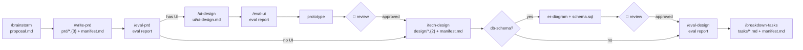
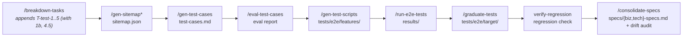
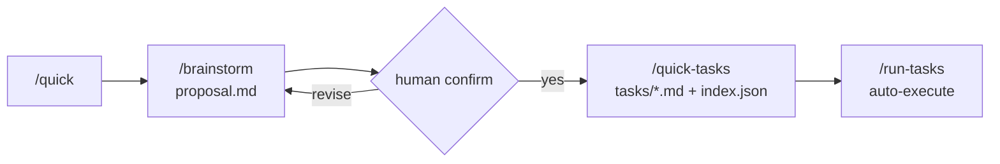

# Forge Guide

## Directory Conventions

### Rules

- `manifest.md` — Feature unique entry point. Read this first.
- `process/` — Runtime state. Do NOT commit to git.
- `testing/` — Generated by standard tasks. Do NOT hand-write.
- `tests/e2e/` — Only through `/graduate-tests`. Do NOT add manually.
- `records/` — Generated by `forge task submit`. Do NOT write directly.
- `specs/` — Extracted by `/consolidate-specs`. User confirms before integrating to project-level. Drift audit verifies existing specs against current code.

### Project-Level Documents

Non-skill documents shared across features:

```
docs/
  ARCHITECTURE.md       — System architecture
  business-rules/       — Cross-feature business rules (by domain, e.g. auth.md)
  conventions/          — Technical specs (coding standards, API conventions, naming rules)
  reference/            — System specs (environment, deployment, tech stack)
  decisions/            — Technical decisions (/record-decision)
  lessons/              — Lessons learned (/learn-lesson)
  proposals/            — Improvement proposals (docs/proposals/{slug}/proposal.md, via /brainstorm or ad-hoc)
  sitemap/sitemap.json  — Page element map (project-level, /gen-sitemap)
```

> Agents read `docs/business-rules/` and `docs/conventions/` during task execution for domain constraints and coding standards. These are populated by `/consolidate-specs`, which also performs drift verification to keep specs in sync with code.

## Skill Workflow





> * /gen-sitemap is a prerequisite command (called by T-test-1), not a standalone T-test task.

Each skill checks prerequisites with `ls` before execution; aborts and prompts user if missing.

### Quick Mode

For features (1-10 tasks), use the streamlined pipeline:



**When to use Quick Mode:**
- 1-10 tasks maximum
- No complex architecture decisions needed
- Proposal provides enough context (no PRD/design needed)

**When to use Full Mode:**
- Feature requires >10 tasks
- Requires PRD with acceptance criteria
- Needs tech design with architecture decisions
- Has UI design requirements
- Needs multi-phase execution with gates

**Quick mode differences:**
- No PRD, no design, no eval steps
- `proposal.md` is the sole input document
- Flat task list (no phases, no gates, no summaries)
- T-quick-1~6 test tasks (subset of T-test 7 tasks: skips gen-sitemap prerequisite, eval-test-cases, consolidate-specs; T-quick-6 adds drift detection as the final test step)
- Simplified manifest (no Traceability table)
- Docs-only features auto-detected: no test tasks, generates T-eval-doc instead

### Manifest

`manifest.md` is the single entry point for a Feature. An AI agent reads this file to understand the full context:
- **Documents** table: lists all document paths and auto-generated summaries
- **Traceability** table: PRD → Design → Tasks mapping
- **Status** (feature-level): prd → design → tasks → in-progress → completed
  - Not to be confused with task-level statuses in index.json: pending, in_progress, completed, blocked, skipped, rejected

## Quality Gate Protocol

All task-executing workflows (`/execute-task`, `task-executor` agent, `/fix-bug`, `type: fix` tasks) MUST pass the quality gate before recording completion.

Quality gate sequence: `just compile → just fmt → just lint → just test`. On failure: compile → fix & retry; fmt → WARNING (non-blocking, toolchain issue); lint → self-fix (1 retry) then blocked; test → fix & retry.

### Scope Resolution

Before each `just <verb>` command, resolve scope from the task's `scope` field:

1. If `scope` is missing, empty, or `"all"` → `just <verb>` (no scope argument).
2. If `scope` is `"frontend"` or `"backend"`:
   a. Run `forge config get project-type`, capture stdout (trimmed) and exit code.
   b. If exit code != 0, or output not in `frontend`/`backend`/`mixed` → fallback to `just <verb>`.
   c. If output == `"mixed"` → `just <verb> <scope>`.
   d. If output is `"frontend"` or `"backend"` (not mixed) → fallback to `just <verb>`.

### All-Completed Hook

After all tasks done, runs as final safety net (no scope — project-wide):
1. Quality gate: `just compile → just fmt → just lint`
2. Project-wide tests: `just test`
3. E2E regression: `just e2e-setup → just probe → just test-e2e`

On failure at any step, a P0 fix-task is automatically created. Run `forge task claim` to pick it up.

## Testing Lifecycle

Three layers of testing, each with distinct purpose and trigger:

| Layer | Command | Scope | When |
|---|---|---|---|
| Unit Tests | `just test [scope]` | Task-level | Every task verify step (Quality Gate) |
| Feature E2E | `just test-e2e --feature <slug>` | Feature-level | T-test-3 after scripts generated |
| Regression Suite | `tests/e2e/` | Project-level | all-completed hook; graduated via T-test-4 |

```
Unit (per task) ──→ Feature E2E (T-test-3) ──→ Regression (graduate to tests/e2e/)
       ↑ Quality Gate enforces              ↑ T-test-4 graduates
```

### Evaluation Parameter Exceptions

Most eval skills default to 900 target / 3 iterations. Exceptions:

| Skill | Target | Iterations | Reason |
|-------|--------|------------|--------|
| `/eval-ui` | 950 | 3 | UI design requires higher visual fidelity |
| `/eval-test-cases` | 900 | 6 | Test cases need more refinement cycles |
| `/eval-harness` | N/A (100-point scale) | N/A | Infrastructure health check, not adversarial |

### Auxiliary Skills

These skills operate outside the main workflow:

| Skill | Purpose |
|-------|---------|
| `/eval-consistency` | Cross-document consistency check and fix (PRD, Design, UI, Tasks) |
| `/forensic` | Analyze past session transcripts to identify root causes of agent deviations |
| `/improve-harness` | Dynamically implement harness improvements from eval-harness report |

## Task-CLI

Task CLI manages task lifecycle within feature workflows.

**Typical flow**: Before starting work, run `forge feature` → `forge task claim` to get a task → `forge task submit` to save results + update task status.

> For record workflow details, see the `/submit-task` skill. For full command reference, run `forge -h` or `forge [command] -h`.
