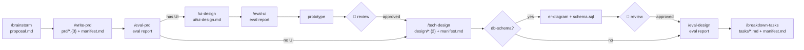

# Forge Guide

## Directory Conventions

### Rules

- `manifest.md` — Feature unique entry point. Read this first.
- `process/` — Runtime state. Do NOT commit to git.
- `testing/` — Generated by standard tasks. Do NOT hand-write.
- `tests/e2e/` — Only through `/graduate-tests`. Do NOT add manually.
- `records/` — Generated by `task record`. Do NOT write directly.
- `specs/` — Extracted by `/consolidate-specs`. User confirms before integrating to project-level.

### Project-Level Documents

Non-skill documents shared across features:

```
docs/
  ARCHITECTURE.md       — System architecture
  business-rules/       — Cross-feature business rules (by domain, e.g. auth.md)
  conventions/          — Technical specs (coding standards, API conventions, naming rules)
  reference/            — System specs (environment, deployment, tech stack)
  decisions/            — Technical decisions (/record-decision)
  lessons/              — Lessons learned (/learn-lesson)
  sitemap/sitemap.json  — Page element map (project-level, /gen-sitemap)
```

> Agents read `docs/business-rules/` and `docs/conventions/` during task execution for domain constraints and coding standards. These are populated by `/consolidate-specs`.

## Skill Workflow

```mermaid
graph LR
    F["/breakdown-tasks<br><i>appends T-test-1..5</i>"] --> T1["/gen-sitemap*<br>sitemap.json"]
    T1 --> T2["/gen-test-cases<br>test-cases.md"]
    T2 --> T2b["/eval-test-cases<br>eval report"]
    T2b --> T3["/gen-test-scripts<br>tests/e2e/features/"]
    T3 --> T4["/run-e2e-tests<br>results/"]
    T4 --> T4b["verify-regression<br>regression check"]
    T4b --> T5["/graduate-tests<br>tests/e2e/target/"]
    T5 --> T6["/consolidate-specs<br>specs/{biz,tech}-specs.md"]
```





> * /gen-sitemap is a prerequisite command (called by T-test-1), not a standalone T-test task.

Each skill checks prerequisites with `ls` before execution; aborts and prompts user if missing.

### Manifest

`manifest.md` is the single entry point for a Feature. An AI agent reads this file to understand the full context:
- **Documents** table: lists all document paths and auto-generated summaries
- **Traceability** table: PRD → Design → Tasks mapping
- **Status** (feature-level): prd → design → tasks → in-progress → completed
  - Not to be confused with task-level statuses in index.json: pending, in_progress, completed, blocked, skipped

## Quality Gate Protocol

All task-executing workflows (`/execute-task`, `task-executor` agent, `/fix-bug`, `error-fixer` agent) MUST pass the quality gate before recording completion.

### Scope Resolution

Before each `just <verb>` command, resolve scope from the task's `scope` field:

1. If `scope` is missing, empty, or `"all"` → `just <verb>` (no scope argument).
2. If `scope` is `"frontend"` or `"backend"`:
   a. Run `just project-type`, capture stdout (trimmed) and exit code.
   b. If exit code != 0, or output not in `frontend`/`backend`/`mixed` → fallback to `just <verb>`.
   c. If output == `"mixed"` → `just <verb> <scope>`.
   d. If output is `"frontend"` or `"backend"` (not mixed) → fallback to `just <verb>`.

### All-Completed Hook

After all tasks done, runs as final safety net (no scope — project-wide):
1. Quality gate: `just compile → just fmt → just lint`
2. Project-wide tests: `just test`
3. E2E regression: `just e2e-setup → just probe → just test-e2e`

## Testing Lifecycle

Three layers of testing, each with distinct purpose and trigger:

| Layer | Command | Scope | When |
|---|---|---|---|
| Unit Tests | `just test [scope]` | Task-level | Every task verify step (Quality Gate) |
| Feature E2E | `just test-e2e --feature <slug>` | Feature-level | T-test-3 after scripts generated |
| Regression Suite | `tests/e2e/` | Project-level | all-completed hook; graduated via T-test-4 |

```
Unit (per task) ──→ Feature E2E (T-test-3) ──→ Regression (graduate to tests/e2e/)
       ↑ Quality Gate enforces              ↑ T-test-4 graduates
```

## Task-CLI

Task CLI manages task lifecycle within feature workflows.

**Typical flow**: Before starting work, run `task feature` → `task claim` to get a task → `task record` to save results + update task status.

### Key Commands

| Operation | Command | Description |
|-----------|---------|-------------|
| Switch feature | `task feature <slug>` | Set current work context |
| Claim task | `task claim` | Get next available task |
| Complete task | `task record <id> --data docs/features/{slug}/tasks/process/record.json` | **One step for record + status update** |
| Add task | `task add --title "..." [flags]` | Add task to current feature |
| Apply template | `task template <name>` | View task template content |

### `task record` Workflow

```
1. task claim           → writes process/state.json
2. During execution     → write progress to process/record.json
3. task record --data docs/features/{slug}/tasks/process/record.json  → generates records/*.md + updates index.json
```

**One command does 2 things:** generates and outputs record file → updates task status.

> For full command reference, run `task -h` or `task [command] -h`
