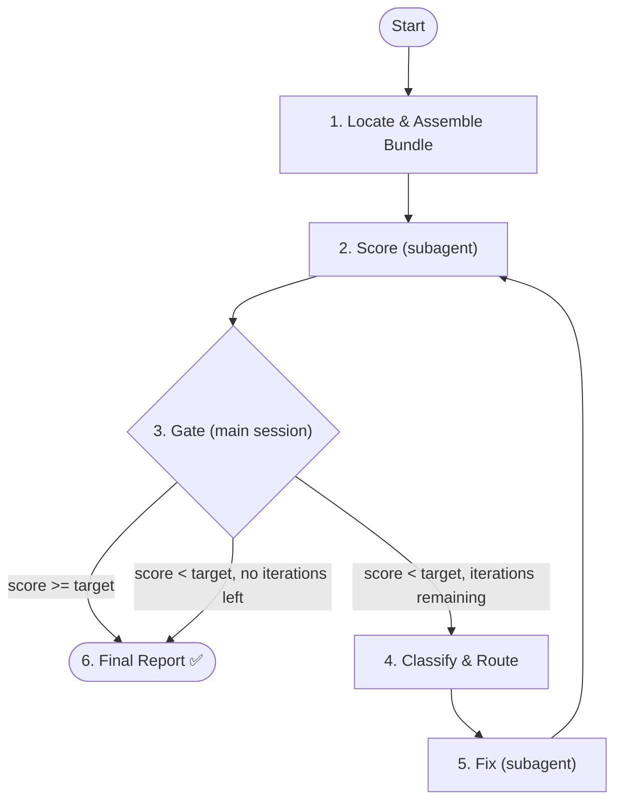

# Eval Consistency

Evaluate and fix alignment across feature documents (PRD, Design, UI, Tasks) and optionally between documents and source code.

Unlike other eval-* skills that only score individual document quality, this skill detects **cross-document inconsistencies** and **automatically fixes** downstream documents to align with the PRD (source of truth).

## Prerequisites

Check previous stage artifacts. Abort and prompt user if missing:

| Artifact | Missing prompt |
|----------|----------------|
| `manifest.md` | Run relevant document skills first |
| `prd/prd-spec.md` | Run `/write-prd` first |
| At least one of: `design/tech-design.md`, `prd/prd-user-stories.md`, `ui/ui-design.md` | Need at least 2 documents to check consistency |

For `--scope full`, additionally:

| Artifact | Missing prompt |
|----------|----------------|
| Source code files referenced in tech-design.md | Run implementation tasks first |

## When to Use

**Trigger:**
- After `/breakdown-tasks` completes (pipeline consistency gate)
- User asks to "check consistency", "verify alignment", or "sync documents"
- Before task execution to catch cross-document drift
- After any document revision that may cause misalignment

**Skip:**
- Only PRD exists (nothing to compare against)
- Feature is in early brainstorming (no design yet)

## Parameters

| Parameter | Default | Description |
|-----------|---------|-------------|
| `--target` | 900 | Target score (0-1000). Loop continues until score >= target or iterations exhausted |
| `--iterations` | 3 | Max detect→fix→verify cycles |
| `--scope` | docs | `docs` = cross-document consistency only; `full` = docs + code consistency |

## Architecture



## Orchestrator Iron Laws

<EXTREMELY-IMPORTANT>
1. Main session controls the loop — NEVER delegate the entire eval to a single agent
2. Only 3 actions per iteration: score → gate → fix
3. Gate (Step 3) runs in main session — never inside a subagent
4. Scorer and reviser are independent subagents — invoke via Agent tool, never inline
5. PRD is source of truth — the reviser MUST NEVER modify `prd/` documents. Only `design/`, `ui/`, or manifest.md traceability table may be modified.
6. If PRD is internally inconsistent, surface to user — do NOT auto-fix PRD.

❌ Wrong: `Agent(general-purpose, "check consistency and fix everything")`
✅ Right: Main session calls scorer → parses attacks → classifies → routes reviser → loops
</EXTREMELY-IMPORTANT>

## Step 1: Locate Documents & Assemble Bundle

Check in order:
1. Path provided by user
2. Read `docs/features/<current-feature>/manifest.md` → locate all documents
3. Ask user for path if not found

Determine `<feature-slug>` from the path.

**Detect available layers:**
- PRD layer: check `prd/prd-spec.md` exists
- Design layer: check `design/tech-design.md` exists
- UI layer: check `ui/ui-design.md` or `prd/prd-ui-functions.md` exists
- Task layer: check `tasks/index.json` exists

Abort if only PRD layer exists (nothing to compare against).

**Detect scope mode:**
- `--scope full`: also check that source code files exist (use `find` on project root for files matching paths mentioned in tech-design.md)
- `--scope docs` (default): no code check needed

**Assemble bundle** (main session creates flat directory):

Create `docs/features/<slug>/eval-consistency/bundle/` with:

| Source | Bundle filename |
|--------|----------------|
| `manifest.md` | `manifest.md` |
| `prd/prd-spec.md` | `prd-spec.md` |
| `prd/prd-user-stories.md` | `prd-user-stories.md` (if exists) |
| `prd/prd-ui-functions.md` | `prd-ui-functions.md` (if exists) |
| `design/tech-design.md` | `tech-design.md` (if exists) |
| `design/api-handbook.md` | `api-handbook.md` (if exists) |
| `design/er-diagram.md` | `er-diagram.md` (if exists) |
| `ui/ui-design.md` | `ui-design.md` (if exists) |
| `tasks/index.json` | `tasks-index.json` (if exists) |

**For `--scope full`**, also write `code-snapshot.md` to the bundle:
1. Read `tech-design.md` to extract interface names, data model names, file paths
2. Read `api-handbook.md` for API route definitions (if exists)
3. Use `grep` and `find` to locate corresponding source files
4. Read relevant source files (interface definitions, model definitions, route handlers)
5. Write excerpts to `code-snapshot.md` with sections: source file path → relevant code

## Step 2: Invoke Scorer Subagent

Spawn `doc-scorer` via **Agent tool** (subagent_type: `forge:doc-scorer` if registered, otherwise `general-purpose`).

<HARD-RULE>
Pass these inputs to the scorer:
- `DOC_DIR` = `docs/features/<slug>/eval-consistency/bundle/`
- `RUBRIC_PATH` = `plugins/forge/skills/eval-consistency/templates/rubric.md`
- `REPORT_PATH` = `docs/features/<slug>/eval-consistency/eval/iteration-{{N}}.md`
- `ITERATION` = current iteration number (1-based)
- `PREVIOUS_REPORT_PATH` = previous iteration report path (only if iteration > 1)

The scorer must NEVER be told what the reviser changed. It evaluates the bundle as-is.
</HARD-RULE>

After the scorer returns, parse its output in the main session:
1. Extract `SCORE: X/1000`
2. Extract per-dimension scores from `DIMENSIONS:` section
3. Extract attack points from `ATTACKS:` section

## Step 3: Decision Gate (Main Session)

<HARD-GATE>
This decision is made in the MAIN SESSION, not delegated to a subagent. This gate fires unconditionally after every scorer run.
</HARD-GATE>

| Condition | Action |
|-----------|--------|
| Score >= target | Skip to Step 6 (final report) |
| Score < target AND iterations remaining | Proceed to Step 4 (classify & fix) |
| Score < target AND no iterations remaining | Skip to Step 6 (report with unfixed issues) |

Report to user:
```
Iteration {{N}}/{{MAX}}: scored {{SCORE}}/1000 (target: {{TARGET}}). {{COUNT}} inconsistencies found.
```

## Step 4: Classify Inconsistencies (Main Session)

<HARD-RULE>
Classification determines which document the reviser targets. This step runs in the main session, NOT inside a subagent.
</HARD-RULE>

For each attack point, classify by type and determine the **fix target**:

| Type | Pattern | Fix Target | Fix Action |
|------|---------|------------|------------|
| A. Design drift | PRD says X, design says Y | `design/` | Revise design to match PRD |
| B. UI drift | PRD/UI-function says X, UI-design says Y | `ui/` | Revise UI to match PRD |
| C. Missing coverage | PRD section not in design/tasks | `design/` or surface to user | Add missing section to downstream doc |
| D. Orphan content | Design/UI has content not in PRD | `design/` or `ui/` | Remove or add to PRD (flag to user) |
| E. Terminology mismatch | Same concept, different name across docs | All downstream docs | Standardize to PRD terminology |
| F. Traceability gap | Empty cells in manifest.md table | `manifest.md` | Fill traceability links |
| G. PRD internal conflict | PRD contradicts itself | **None** | Surface to user, do NOT auto-fix |

**Routing**: Group attack points by fix target. If multiple targets, the reviser may be invoked multiple times (once per target subdirectory).

## Step 5: Invoke Reviser Subagent

<HARD-RULE>
Only enter this step when Step 3 explicitly routes here (score < target AND iterations remaining).
The reviser MUST NOT modify files in `prd/`. PRD is the source of truth.
</HARD-RULE>

For each fix target group from Step 4:

Spawn `doc-reviser` via **Agent tool** (subagent_type: `forge:doc-reviser` if registered, otherwise `general-purpose`).

<HARD-RULE>
Pass these inputs to the reviser:
- `DOC_DIR` = the target subdirectory (e.g., `docs/features/<slug>/design/` or `docs/features/<slug>/ui/`)
- `RUBRIC_PATH` = `plugins/forge/skills/eval-consistency/templates/rubric.md`
- `EVAL_REPORT_PATH` = `docs/features/<slug>/eval-consistency/eval/iteration-{{N}}.md`
- `ATTACK_POINTS` = the attack points classified for this target

For Type F (traceability), DOC_DIR is NOT a subdirectory — the reviser modifies `manifest.md` directly:
- `DOC_DIR` = `docs/features/<slug>/` (and the rubric tells the reviser to only modify manifest.md)

For Type G (PRD internal conflict), do NOT invoke the reviser. Surface to user:
```
⚠️ PRD internal inconsistency detected: [description]. This requires manual review — the PRD should not be auto-modified.
```
</HARD-RULE>

After all reviser invocations complete:
1. Re-assemble the bundle (Step 1) — re-copy the now-fixed documents
2. Increment iteration counter
3. Return to Step 2 (re-score to verify fixes)

## Step 6: Final Report (Main Session)

```
## Eval-Consistency Complete

**Final Score**: {{SCORE}}/1000 (target: {{TARGET}})
**Scope**: {{docs / full}}
**Iterations Used**: {{N}}/{{MAX}}

### Score Progression
| Iteration | Score | Delta |
|-----------|-------|-------|
| 1 | {{s1}} | - |
| 2 | {{s2}} | +{{d2}} |

### Dimension Breakdown (final)
<!-- Use docs-mode table when --scope docs (default). Use full-mode table when --scope full. -->

**Mode: docs**
| Dimension | Score | Max |
|-----------|-------|-----|
| PRD-Design Alignment | {{d1}} | 250 |
| PRD-UI Consistency | {{d2}} | 150 |
| Design-Task Coverage | {{d3}} | 200 |
| Terminology Consistency | {{d4}} | 150 |
| Data Model Consistency | {{d5}} | 150 |
| Traceability Completeness | {{d6}} | 100 |

**Mode: full**
| Dimension | Score | Max |
|-----------|-------|-----|
| PRD-Design Alignment | {{d1}} | 150 |
| PRD-UI Consistency | {{d2}} | 100 |
| Design-Task Coverage | {{d3}} | 150 |
| Terminology Consistency | {{d4}} | 150 |
| Data Model Consistency | {{d5}} | 100 |
| Traceability Completeness | {{d6}} | 100 |
| Interface-Code Alignment | {{d7}} | 150 |
| Data Model-Code Alignment | {{d8}} | 100 |

### Files Modified
| File | Changes |
|------|---------|
| <!-- path --> | <!-- summary of what was fixed --> |

### Residual Issues
{{List any unfixed issues after iterations exhausted}}

### Outcome
{{"All inconsistencies fixed — target reached" / "N inconsistencies remain — iterations exhausted"}}
```

Save the final report to `docs/features/<slug>/eval-consistency/eval/report.md`.

## Step 7: Next Step

After final report, ask via `AskUserQuestion`:

> Proceed to next phase?

- **Run Tasks** → invoke `/run-tasks` via `Skill` tool (if invoked after breakdown-tasks)
- **Re-run specific eval** → invoke relevant eval skill if fixes may have introduced quality issues
- **No** → done
