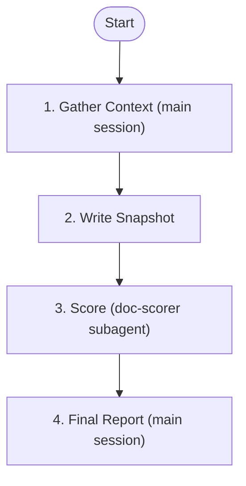

# Eval Harness

Evaluate project harness health. Uses doc-scorer with a rubric grounded in OpenAI's three principles: Progressive Disclosure, Architectural Boundaries, Golden Principles, Plan Artifacts & Feedback.

## Prerequisites

| Artifact | Missing prompt |
|----------|----------------|
| Project has a CLAUDE.md or AGENTS.md | Not applicable — evaluation will note the absence and score accordingly |

## When to Use

**Trigger:**
- User asks to "evaluate harness" or "check harness health"
- User provides `/eval-harness` command

**Skip:**
- User wants to implement improvements directly (use `/improve-harness`)

## Architecture



No adversarial iterations — the harness is not a document to revise; improvements are done via `/improve-harness`.

## Step 1: Gather Context (Main Session)

Collect project harness state. Run these checks and record findings.

<HARD-RULE>
Use `head -100` or `wc -l` instead of `cat` for large files. Keep raw output minimal — structured summaries go into the snapshot (Step 2), not the main session context.
</HARD-RULE>

### 1.1 Entry Point

```bash
wc -l CLAUDE.md 2>/dev/null || wc -l AGENTS.md 2>/dev/null
head -100 CLAUDE.md 2>/dev/null || head -100 AGENTS.md 2>/dev/null
```

Record: line count, structure (map or manual?), links to deeper docs.

### 1.2 Configuration

```bash
cat .claude/settings.json 2>/dev/null
cat .claude/settings.local.json 2>/dev/null
```

Record: hooks configured, agents registered, permissions.

### 1.3 Documentation Structure

```bash
find docs/ -type f -name "*.md" 2>/dev/null | head -50
head -50 docs/README.md 2>/dev/null
```

Record: docs exist, indexed, cross-linked.

### 1.4 Skills & Agents

```bash
ls .claude/skills/ 2>/dev/null
ls .claude/agents/ 2>/dev/null
```

Record: what reusable tools exist.

### 1.5 Scripts & CI

```bash
ls scripts/ 2>/dev/null
for f in .github/workflows/*.yml; do echo "=== $f ==="; head -30 "$f" 2>/dev/null; done
for f in .ci/*.yml; do echo "=== $f ==="; head -30 "$f" 2>/dev/null; done
head -30 Makefile 2>/dev/null || head -30 justfile 2>/dev/null
```

Record: lint scripts, CI checks, build targets.

### 1.6 Task Infrastructure

```bash
ls docs/features/*/tasks/index.json 2>/dev/null
ls docs/decisions/ 2>/dev/null
```

Record: task format, decision records, execution history.

### 1.7 Language Detection

Auto-detect and record project language(s):

| Detection Marker | Language |
|-----------------|----------|
| `go.mod` | Go |
| `package.json` | Node.js |
| `pyproject.toml` / `setup.py` | Python |
| `Cargo.toml` | Rust |
| `pom.xml` / `build.gradle` | Java |

## Step 2: Write Snapshot

Ensure output directory exists, then write the harness snapshot.

```bash
mkdir -p docs/harness-reports
date_str=$(date +%F 2>/dev/null || date +%Y-%m-%d)
```

**Path:** `docs/harness-reports/$date_str-snapshot.md`

**Lifecycle:** The snapshot is a persistent evidence artifact. It is referenced by `improve-harness` when investigating the original findings and by the improvement record for provenance. Do not delete after scoring.

**Format:**

```markdown
# Harness Snapshot — YYYY-MM-DD

## Project: [name]
## Language: [auto-detected]

## 1. Entry Point
- File: CLAUDE.md / AGENTS.md
- Line count: N
- Structure: [map / manual / mixed]
- Full content:

[PASTE ENTIRE FILE CONTENT here — this is the scorer's primary evidence]

- Links to docs: [extract all markdown links from the file, or "none"]

## 2. Configuration
[PASTE full content of settings.json and settings.local.json, or "no .claude/settings.json found"]

## 3. Documentation Structure
[File tree of docs/ or "no docs/ directory"]
[PASTE docs/README.md content if exists]

## 4. Skills & Agents
[List of available skills and agents with one-line description each, or "none registered"]

## 5. Scripts & CI
[List of enforcement scripts, CI checks, Makefile targets with key details from head -30 output]

## 6. Task Infrastructure
[Task format, decision records, execution history — or "none"]

## 7. Observations
[Any additional context relevant to harness quality]

## 8. Completeness
- [ ] Entry Point: checked
- [ ] Configuration: checked
- [ ] Documentation Structure: checked
- [ ] Skills & Agents: checked
- [ ] Scripts & CI: checked
- [ ] Task Infrastructure: checked
**Status**: COMPLETE / PARTIAL (missing: [list])
```

## Step 3: Invoke Scorer Subagent

Spawn `doc-scorer` via **Agent tool** (subagent_type: `forge:doc-scorer` if registered, otherwise `general-purpose`).

<HARD-RULE>
Pass these inputs to the scorer:
- `DOC_DIR` = `docs/harness-reports/` (contains the snapshot)
- `RUBRIC_PATH` = `plugins/forge/skills/eval-harness/templates/rubric.md`
- `REPORT_PATH` = `docs/harness-reports/YYYY-MM-DD.md`
- `ITERATION` = 1

Instruct the scorer to ONLY read the file `YYYY-MM-DD-snapshot.md` within DOC_DIR. Ignore all other files in that directory (old reports, improvements, etc.).
</HARD-RULE>

## Step 4: Final Report (Main Session)

After scorer returns:

1. Parse `SCORE: X/100` and dimension scores from scorer output.
   If the exact format is not found:
   - Read the report file at `docs/harness-reports/YYYY-MM-DD.md` and extract scores from there
   - If still not parseable, present raw scorer output to user: "Scorer output format unexpected. Review the report file directly."
2. Extract findings from `ATTACKS:` section
3. Categorize findings by priority:
   - **P0**: Score = 0 on any criterion, or critical capability missing
   - **P1**: Score < 50% of criterion max, or enforcement is manual-only
   - **P2**: Score < 80% of criterion max, or minor gaps
4. Present summary to user:

```
## Eval-Harness Complete

**Score**: X/100

| Dimension | Score | Max |
|-----------|-------|-----|
| Progressive Disclosure | X | 25 |
| Architectural Boundaries | X | 25 |
| Golden Principles | X | 25 |
| Plan Artifacts & Feedback | X | 25 |

### Priority Improvements
| Priority | Finding | Impact |
|----------|---------|--------|
| P0 | ... | ... |
| P1 | ... | ... |
| P2 | ... | ... |

Run `/improve-harness` to address these findings.
```

## Output

1. Snapshot: `docs/harness-reports/YYYY-MM-DD-snapshot.md`
2. Report: `docs/harness-reports/YYYY-MM-DD.md`

## Related

- `/improve-harness` - Implement improvements from report
