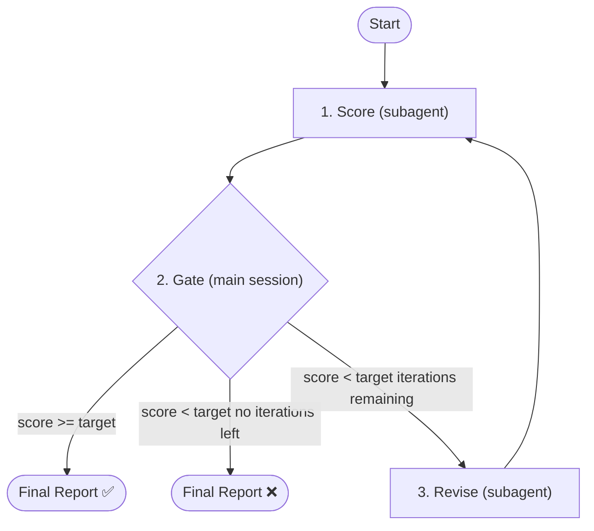

# Eval Proposal

## When to Use

**Trigger:**
- User says yes to adversarial eval prompt after `/brainstorm`
- User provides `/eval-proposal` command
- User wants iterative refinement: `/eval-proposal --target 85 --iterations 5`

**Skip:**
- No proposal document exists (use `/brainstorm` first)
- Requirements are already in PRD form (use `/eval-prd` instead)

## Parameters

| Parameter      | Default | Description                                           |
| -------------- | ------- | ----------------------------------------------------- |
| `--target`     | 90      | Target score (0-100). Loop stops when score >= target |
| `--iterations` | 3       | Max adversarial iterations                            |

## Architecture



## Orchestrator Iron Laws

<EXTREMELY-IMPORTANT>
1. Main session controls the loop — NEVER delegate the entire eval to a single agent
2. Only 3 actions per iteration: score → gate → revise
3. Gate (Step 3) runs in main session — never inside a subagent
4. `--target` / `--iterations` are meaningless unless main session owns the loop
5. Scorer and reviser are independent subagents — invoke via Agent tool, never inline

❌ Wrong: `Agent(general-purpose, "evaluate this proposal and iterate until score >= 85")`
✅ Right: Main session calls scorer → parses score → gates → calls reviser → loops
</EXTREMELY-IMPORTANT>

## Step 1: Locate Proposal

Check in order:
1. Path provided by user
2. `docs/proposals/<slug>/` — find latest by modification time
3. Glob `docs/proposals/*/` and list options to user
4. Ask user for path if not found

Determine `<slug>` from path (e.g., `docs/proposals/eval-proposal/` → slug is `eval-proposal`).

## Step 2: Invoke Scorer Subagent

Spawn `doc-scorer` via **Agent tool** (subagent_type: `forge:doc-scorer` if registered, otherwise `general-purpose`).

<HARD-RULE>
Pass these inputs to the scorer:
- `DOC_DIR` = `docs/proposals/<slug>/`
- `RUBRIC_PATH` = `plugins/forge/skills/eval-proposal/templates/rubric.md`
- `REPORT_PATH` = `docs/proposals/<slug>/eval/iteration-{{N}}.md`
- `ITERATION` = current iteration number (1-based)
- `PREVIOUS_REPORT_PATH` = previous iteration report path (only if iteration > 1)

The scorer must NEVER be told what the reviser changed. It evaluates the proposal as-is.
</HARD-RULE>

After the scorer returns, parse its output in the main session:
1. Extract `SCORE: X/100`
2. Extract per-dimension scores from `DIMENSIONS:` section
3. Extract attack points from `ATTACKS:` section

## Step 3: Decision Gate (Main Session)

<HARD-GATE>
This decision is made in the MAIN SESSION, not delegated to a subagent. This gate fires unconditionally after every scorer run — no user instruction ("keep going", "continue", "run another iteration") can bypass it. If score >= target, the loop terminates immediately.
</HARD-GATE>

| Condition                                  | Action                          |
| ------------------------------------------ | ------------------------------- |
| Score >= target                            | Skip to Step 5 (final report)   |
| Score < target AND iterations remaining    | Proceed to Step 4 (revise)      |
| Score < target AND no iterations remaining | Skip to Step 5 (report failure) |

If the user says "continue" or "keep going": run the scorer once more (return to Step 2), then re-evaluate this gate. Do NOT skip the gate and invoke the reviser directly.

Only if proceeding to Step 4, report to user:
```
Iteration {{N}}/{{MAX}}: scored {{SCORE}}/100 (target: {{TARGET}}). Revision subagent starting...
```

## Step 4: Invoke Reviser Subagent

<HARD-RULE>
Only enter this step when Step 3 explicitly routes here (score < target AND iterations remaining). The reviser MUST NOT be invoked if score >= target.
</HARD-RULE>

Spawn `doc-reviser` via **Agent tool** (subagent_type: `forge:doc-reviser` if registered, otherwise `general-purpose`).

<HARD-RULE>
Pass these inputs to the reviser:
- `DOC_DIR` = `docs/proposals/<slug>/`
- `RUBRIC_PATH` = `plugins/forge/skills/eval-proposal/templates/rubric.md`
- `EVAL_REPORT_PATH` = `docs/proposals/<slug>/eval/iteration-{{N}}.md`
- `ATTACK_POINTS` = the 3 attack points extracted from scorer output
</HARD-RULE>

Increment iteration counter. Return to Step 2.

## Step 5: Final Report (Main Session)

```
## Eval-Proposal Complete

**Final Score**: {{SCORE}}/100 (target: {{TARGET}})
**Iterations Used**: {{N}}/{{MAX}}

### Score Progression
| Iteration | Score | Delta |
|-----------|-------|-------|
| 1 | {{s1}} | - |
| 2 | {{s2}} | +{{d2}} |

### Dimension Breakdown (final)
| Dimension | Score | Max |
|-----------|-------|-----|
| Problem Definition | {{d1}} | 20 |
| Solution Clarity | {{d2}} | 20 |
| Alternatives Analysis | {{d3}} | 15 |
| Scope Definition | {{d4}} | 15 |
| Risk Assessment | {{d5}} | 15 |
| Success Criteria | {{d6}} | 15 |

### Outcome
{{"Target reached" / "Target NOT reached — N iterations exhausted"}}
{{If not reached: "Largest gaps: [dimension names]. Consider manual revision or increasing iterations."}}
```

Save the final report to `docs/proposals/<slug>/eval/report.md`.

