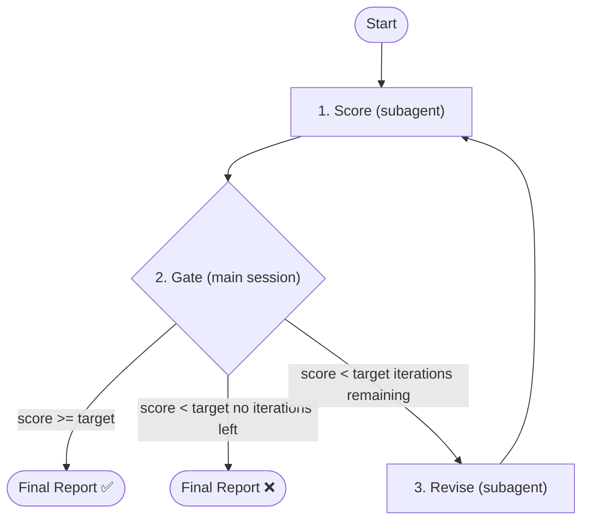

# Eval Test Cases

## Step 0: Resolve Profile

1. **Resolve profile**: Run `task profile` to get the active test profile(s). This reads `.forge/config.yaml`, falls back to project structure detection.
2. **On failure** (output shows `PROFILE: (none)`): ask the user to choose from known profiles (`web-playwright`, `go-test`, `maestro`, `java-junit`, `rust-test`, `pytest`). Run `task profile set <name>` to persist their choice.
3. **Load profile manifest**: Run `task profile get <profile-name> --manifest`.

Use the loaded profile manifest for all subsequent steps.

<HARD-RULE>
Do NOT silently default to any profile. If `task profile` returns no result and the user cannot decide, abort the skill.
</HARD-RULE>

## Prerequisites

Check previous stage artifacts. Abort and prompt user if missing:

| Artifact | Missing prompt |
|----------|----------------|
| `testing/test-cases.md` | Run `/gen-test-cases` first |
| `prd/prd-spec.md` | Run `/write-prd` first |
| `prd/prd-user-stories.md` | Run `/write-prd` first |

**Profile awareness**: The scoring rubric's "Interface Accuracy" dimension (200 pts) adapts based on the active test profile's capabilities. Use the profile manifest resolved in Step 0 to determine which capability-specific scoring criteria apply from `plugins/forge/skills/eval-test-cases/templates/rubric.md`.

## When to Use

**Trigger:**
- User asks to "evaluate test cases" or "check test case quality"
- User provides `/eval-test-cases` command
- Before handing off test-cases.md to `/gen-test-scripts`
- Automatically via T-test-1b in the task chain

**Skip:**
- test-cases.md doesn't exist yet (use `/gen-test-cases` first)

## Parameters

| Parameter      | Default | Description                                           |
| -------------- | ------- | ----------------------------------------------------- |
| `--target`     | 900      | Target score (0-1000). Loop stops when score >= target |
| `--iterations` | 6       | Max adversarial iterations                            |

## Architecture



## Orchestrator Iron Laws

<EXTREMELY-IMPORTANT>
1. Main session controls the loop — NEVER delegate the entire eval to a single agent
2. Only 3 actions per iteration: score → gate → revise
3. Gate (Step 3) runs in main session — never inside a subagent
4. `--target` / `--iterations` are meaningless unless main session owns the loop
5. Scorer and reviser are independent subagents — invoke via Agent tool, never inline

❌ Wrong: `Agent(general-purpose, "evaluate this test-cases and iterate until score >= 900")`
✅ Right: Main session calls scorer → parses score → gates → calls reviser → loops
</EXTREMELY-IMPORTANT>

## Step 1: Locate Documents

Check in order:
1. Path provided by user or args
2. Read `docs/features/<current-feature>/manifest.md` → locate test-cases.md and PRD documents
3. Fall back to `docs/features/<current-feature>/testing/test-cases.md`
4. Ask user for path if not found

Determine `<feature-slug>` from the path. The test-cases file is at `docs/features/<slug>/testing/test-cases.md`.

**Locate PRD files**: Read `docs/features/<slug>/manifest.md` or check:
- `docs/features/<slug>/prd/prd-spec.md`
- `docs/features/<slug>/prd/prd-user-stories.md`

## Step 2: Invoke Scorer Subagent

Spawn `doc-scorer` via **Agent tool** (subagent_type: `forge:doc-scorer` if registered, otherwise `general-purpose`).

<HARD-RULE>
Pass these inputs to the scorer:
- `DOC_DIR` = `docs/features/<slug>/testing/`
- `RUBRIC_PATH` = `plugins/forge/skills/eval-test-cases/templates/rubric.md`
- `REPORT_PATH` = `docs/features/<slug>/testing/eval/iteration-{{N}}.md`
- `ITERATION` = current iteration number (1-based)
- `PREVIOUS_REPORT_PATH` = previous iteration report path (only if iteration > 1)
- `PRD_FILES` = paths to prd-spec.md and prd-user-stories.md (for traceability verification)

The scorer must NEVER be told what the reviser changed. It evaluates test-cases.md as-is.
</HARD-RULE>

After the scorer returns, parse its output in the main session:
1. Extract `SCORE: X/1000`
2. Extract per-dimension scores from `DIMENSIONS:` section
3. Extract attack points from `ATTACKS:` section

**Blocking check**: If Step Actionability score < 200, the downstream is blocked regardless of total score. Report this to the user.

## Step 3: Decision Gate (Main Session)

<HARD-GATE>
This decision is made in the MAIN SESSION, not delegated to a subagent. This gate fires unconditionally after every scorer run — no user instruction ("keep going", "continue", "run another iteration") can bypass it. If score >= target, the loop terminates immediately.
</HARD-GATE>

| Condition                                  | Action                          |
| ------------------------------------------ | ------------------------------- |
| Score >= target                            | Skip to Step 5 (final report)   |
| Score < target AND iterations remaining    | Proceed to Step 4 (revise)      |
| Score < target AND no iterations remaining | Skip to Step 5 (report failure) |

If the user says "continue" or "keep going": run the scorer once more (return to Step 2), then re-evaluate this gate. Do NOT skip the gate and invoke the reviser directly.

Only if proceeding to Step 4, report to user:
```
Iteration {{N}}/{{MAX}}: scored {{SCORE}}/1000 (target: {{TARGET}}). Revision subagent starting...
```

## Step 4: Invoke Reviser Subagent

<HARD-RULE>
Only enter this step when Step 3 explicitly routes here (score < target AND iterations remaining). The reviser MUST NOT be invoked if score >= target.
</HARD-RULE>

Spawn `doc-reviser` via **Agent tool** (subagent_type: `forge:doc-reviser` if registered, otherwise `general-purpose`).

<HARD-RULE>
Pass these inputs to the reviser:
- `DOC_DIR` = `docs/features/<slug>/testing/`
- `RUBRIC_PATH` = `plugins/forge/skills/eval-test-cases/templates/rubric.md`
- `EVAL_REPORT_PATH` = `docs/features/<slug>/testing/eval/iteration-{{N}}.md`
- `ATTACK_POINTS` = the 3 attack points extracted from scorer output

**Reviser scope**: ONLY modify `test-cases.md`. Do NOT modify PRD files or any other documents.
</HARD-RULE>

Increment iteration counter. Return to Step 2.

## Step 5: Final Report (Main Session)

```
## Eval-Test-Cases Complete

**Final Score**: {{SCORE}}/1000 (target: {{TARGET}})
**Iterations Used**: {{N}}/{{MAX}}

### Score Progression
| Iteration | Score | Delta |
|-----------|-------|-------|
| 1 | {{s1}} | - |
| 2 | {{s2}} | +{{d2}} |

### Dimension Breakdown (final)
| Dimension | Score | Max |
|-----------|-------|-----|
| PRD Traceability | {{d1}} | 250 |
| Step Actionability | {{d2}} | 250 |
| Route & Element Accuracy | {{d3}} | 200 |
| Completeness | {{d4}} | 200 |
| Structure & ID Integrity | {{d5}} | 100 |

### Outcome
{{"Target reached" / "Target NOT reached — N iterations exhausted"}}
{{If Step Actionability < 200: "⚠️ Step Actionability below blocking threshold — downstream gen-test-scripts may fail"}}
{{If not reached: "Largest gaps: [dimension names]. Consider manual revision or increasing iterations."}}
```

Save the final report to `docs/features/<slug>/testing/eval/report.md`.

## Step 6: Next Step

After final report, ask via `AskUserQuestion`:

> Proceed to next phase?

- **Generate Test Scripts** → invoke `/gen-test-scripts` via `Skill` tool
- **No** → done
