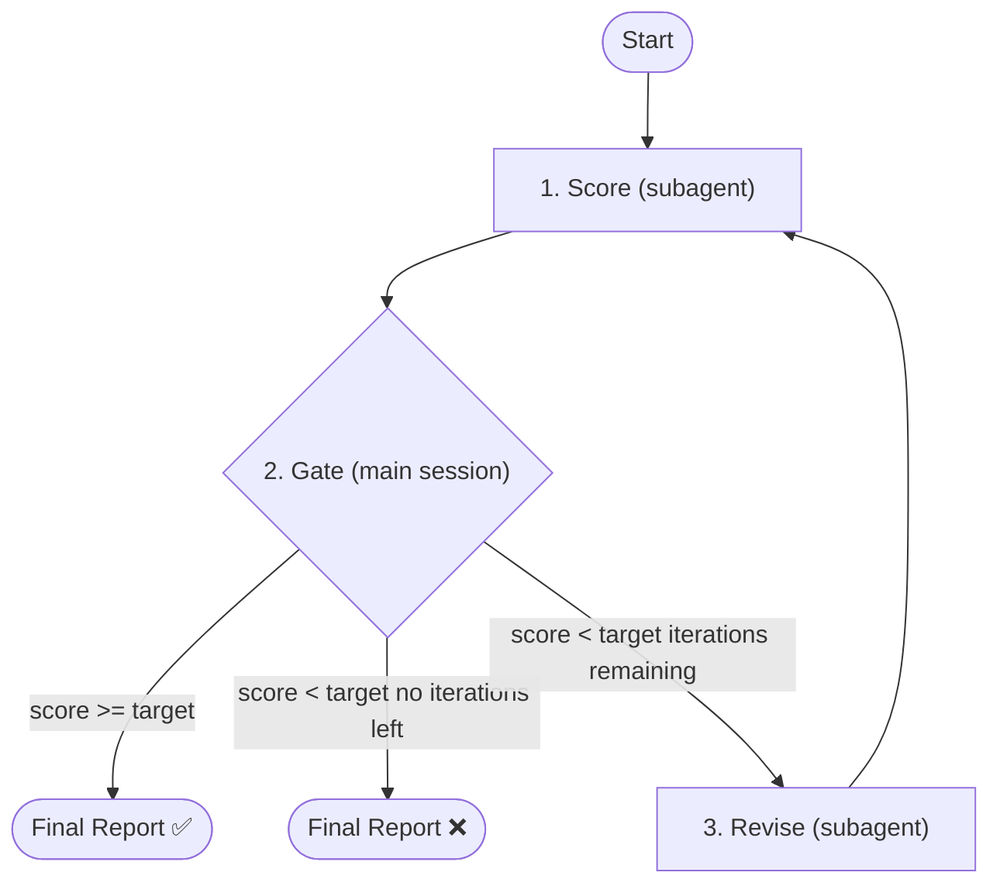

# Eval UI

Evaluates UI design from four independent stakeholder perspectives.

## Prerequisites

Check previous stage artifacts. Abort and prompt user if missing:

| Artifact | Missing prompt |
|----------|----------------|
| `ui/ui-design.md` | Run `/ui-design` first |

## When to Use

**Trigger:**
- User asks to "evaluate UI design" or "check UI quality"
- User provides `/eval-ui` command
- After `/ui-design` completes, before handing off to implementation

**Skip:**
- No UI design document exists (use `/ui-design` first)
- Feature has no UI surface (use `/eval-design` instead)

## Parameters

| Parameter      | Default | Description                                           |
| -------------- | ------- | ----------------------------------------------------- |
| `--target`     | 950     | Target score (0-1000). Loop stops when score >= target |
| `--iterations` | 3       | Max adversarial iterations                            |

## Architecture



## Orchestrator Iron Laws

<EXTREMELY-IMPORTANT>
1. Main session controls the loop — NEVER delegate the entire eval to a single agent
2. Only 3 actions per iteration: score → gate → revise
3. Gate (Step 3) runs in main session — never inside a subagent
4. `--target` / `--iterations` are meaningless unless main session owns the loop
5. Scorer and reviser are independent subagents — invoke via Agent tool, never inline

❌ Wrong: `Agent(general-purpose, "evaluate this UI design and iterate until score >= 80")`
✅ Right: Main session calls scorer → parses score → gates → calls reviser → loops
</EXTREMELY-IMPORTANT>

## Step 1: Locate UI Design Documents and Detect Platform

Check in order:
1. Path provided by user
2. Read `docs/features/<current-feature>/manifest.md` -> locate UI design documents
3. Fall back to `docs/features/<current-feature>/ui/`
4. Ask user for path if not found

Determine `<feature-slug>` from the path. The UI directory is `docs/features/<slug>/ui/`.

Also locate the PRD for Navigation Architecture reference:
- `docs/features/<slug>/prd/prd-ui-functions.md` — pass to scorer as `PRD_PATH`

### Platform Detection

Detect the platform from the UI design document(s). For each UI design file found:

1. Read the document header/frontmatter for a `platform` field
2. If no explicit field, infer from the document structure:
   - Contains ASCII mockups, terminal keybindings, or character palettes → `tui`
   - Contains touch targets, safe areas, or adaptive breakpoints → `mobile`
   - Default: `web`
3. Map platform to rubric file:

| Platform | Rubric File |
|----------|-------------|
| `web` | `plugins/forge/skills/eval-ui/templates/rubric-web.md` |
| `mobile` | `plugins/forge/skills/eval-ui/templates/rubric-mobile.md` |
| `tui` | `plugins/forge/skills/eval-ui/templates/rubric-tui.md` |

For multi-platform features (e.g., `ui-design-web.md` + `ui-design-tui.md`), evaluate each file independently with its respective rubric. Run separate score-revise loops per platform.

## Step 2: Invoke Scorer Subagent

Spawn `doc-scorer` via **Agent tool** (subagent_type: `forge:doc-scorer` if registered, otherwise `general-purpose`).

<HARD-RULE>
Pass these inputs to the scorer:
- `DOC_DIR` = `docs/features/<slug>/ui/`
- `RUBRIC_PATH` = the platform-specific rubric file detected in Step 1 (e.g., `plugins/forge/skills/eval-ui/templates/rubric-web.md`)
- `REPORT_PATH` = `docs/features/<slug>/ui/eval/iteration-{{N}}.md`
- `ITERATION` = current iteration number (1-based)
- `PREVIOUS_REPORT_PATH` = previous iteration report path (only if iteration > 1)
- `PRD_PATH` = `docs/features/<slug>/prd/prd-ui-functions.md` (if exists, for Navigation Architecture coverage check)

The scorer must NEVER be told what the reviser changed. It evaluates the design as-is.
</HARD-RULE>

After the scorer returns, parse its output in the main session:
1. Extract `SCORE: X/1000`
2. Extract per-dimension scores from `DIMENSIONS:` section
3. Extract attack points from `ATTACKS:` section

## Step 3: Decision Gate (Main Session)

<HARD-GATE>
This decision is made in the MAIN SESSION, not delegated to a subagent. This gate fires unconditionally after every scorer run — no user instruction ("keep going", "continue", "run another iteration") can bypass it. If score >= target, the loop terminates immediately.
</HARD-GATE>

| Condition                                  | Action                          |
| ------------------------------------------ | ------------------------------- |
| Score >= target                            | Skip to Step 5 (final report)   |
| Score < target AND iterations remaining    | Proceed to Step 4 (revise)      |
| Score < target AND no iterations remaining | Skip to Step 5 (report failure) |

If the user says "continue" or "keep going": run the scorer once more (return to Step 2), then re-evaluate this gate. Do NOT skip the gate and invoke the reviser directly.

Only if proceeding to Step 4, report to user:
```
Iteration {{N}}/{{MAX}}: scored {{SCORE}}/1000 (target: {{TARGET}}). Revision subagent starting...
```

## Step 4: Invoke Reviser Subagent

<HARD-RULE>
Only enter this step when Step 3 explicitly routes here (score < target AND iterations remaining). The reviser MUST NOT be invoked if score >= target.
</HARD-RULE>

Spawn `doc-reviser` via **Agent tool** (subagent_type: `forge:doc-reviser` if registered, otherwise `general-purpose`).

<HARD-RULE>
Pass these inputs to the reviser:
- `DOC_DIR` = `docs/features/<slug>/ui/`
- `RUBRIC_PATH` = the platform-specific rubric file detected in Step 1 (e.g., `plugins/forge/skills/eval-ui/templates/rubric-web.md`)
- `EVAL_REPORT_PATH` = `docs/features/<slug>/ui/eval/iteration-{{N}}.md`
- `ATTACK_POINTS` = the 3 attack points extracted from scorer output
</HARD-RULE>

Increment iteration counter. Return to Step 2.

## Step 5: Final Report (Main Session)

```
## Eval-UI Complete

**Final Score**: {{SCORE}}/1000 (target: {{TARGET}})
**Iterations Used**: {{N}}/{{MAX}}

### Score Progression
| Iteration | Score | Delta |
|-----------|-------|-------|
| 1 | {{s1}} | - |
| 2 | {{s2}} | +{{d2}} |

### Dimension Breakdown (final)
| Dimension / Perspective | Score | Max |
|------------------------|-------|-----|
| Requirement Coverage (PM) | {{d1}} | 250 |
| User Experience (User) | {{d2}} | 250 |
| Design Integrity (Designer) | {{d3}} | 250 |
| Implementability (Developer) | {{d4}} | 250 |

### Outcome
{{"Target reached" / "Target NOT reached -- N iterations exhausted"}}
{{If not reached: "Largest gaps: [perspective names]. Consider manual revision or increasing iterations."}}
```

Save the final report to `docs/features/<slug>/ui/eval/report.md`.

## Step 6: Next Step

If invoked as a sub-step of `/ui-design` (auto eval-ui), return control to ui-design — do NOT prompt for next skill.

If invoked standalone, ask via `AskUserQuestion`:

> Proceed to `/tech-design` to create technical design?

- **Yes** → invoke `/tech-design` via `Skill` tool
- **No** → done

## Integration

Works well with:
- `/ui-design` — Produces the UI design document to evaluate; auto-invokes eval-ui after design
- `/tech-design` — Next skill after UI evaluation; informed by UI decisions
