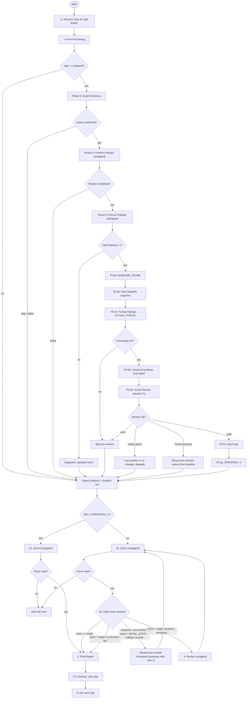

# Eval

## Prerequisites

Feature-relative paths (no prefix) resolve from `docs/features/<slug>/`. Exceptions: `proposal` uses full path `docs/proposals/<slug>/`.

| Type | Required Artifact |
|------|-------------------|
| `proposal` | `docs/proposals/<slug>/proposal.md` |
| `prd` | `prd/prd-spec.md` + `prd/prd-user-stories.md` |
| `design` | `design/tech-design.md` |
| `ui` | `ui/ui-design.md` (platform detected at runtime per Step 1.3) |
| `ui-web`, `ui-mobile`, `ui-tui` | `ui/ui-design.md` |
| `consistency` | `manifest.md` + `prd/prd-spec.md` + at least one other doc |
| `validate-code` | PRD (`prd/prd-spec.md` + `prd/prd-user-stories.md`) + git diff against base branch |
| `validate-ux` | PRD + compilable project (binary or web server); must run in git worktree or temp dir |
| `journey` | `testing/<journey>/journey.md` (generated by gen-journeys) |
| `contract` | `testing/<journey>/contracts/step-<N>-<action>.md` (generated by gen-contracts) |

If missing, tell user to create it first.

## Parameters

| Parameter | Default | Description |
|-----------|---------|-------------|
| `--type` | (required) | `proposal`, `prd`, `design`, `ui`, `ui-web`, `ui-mobile`, `ui-tui`, `consistency`, `validate-code`, `validate-ux`, `journey`, `contract` |
| `--target` | rubric frontmatter | Override target score |
| `--iterations` | rubric frontmatter | Override max iterations |
| `--scope` | `docs` | `consistency` only: `docs` or `full` |

Resolution: explicit `--type` in `<command-args>` → command name `/eval-<type>` → ask user.

Rubrics may optionally declare `context` frontmatter (see `rules/rubric-context.md`; parsed in Step 1.1).

## Architecture



## Orchestrator Iron Laws

<EXTREMELY-IMPORTANT>
- Main session owns the loop. NEVER delegate the full eval to a single agent.
- Per iteration: score (subagent) → gate (main session) → revise (subagent).
- Scorer and reviser are ALWAYS invoked via Agent tool, never inline.
</EXTREMELY-IMPORTANT>

## Step 1: Resolve Type, Rubric, and Locate Documents

### 1.1 Resolve Rubric Path

Load: `rubrics/<type>.md`
Exception: type `ui` → detect platform first (see 1.3), then load `ui-<platform>.md`.

Parse rubric frontmatter: `scale`, `target`, `iterations`, `context`. CLI `--target`/`--iterations` override frontmatter. Store `context` declaration for use in Step 1.4 and Step 2.

### 1.2 Locate Documents

1. User-provided path
2. `docs/features/<current-feature>/manifest.md`
3. Default paths:

| Type | Default Doc Dir |
|------|----------------|
| `proposal` | `docs/proposals/<slug>/` |
| `prd` | `docs/features/<slug>/prd/` |
| `design` | `docs/features/<slug>/design/` |
| `ui-*` | `docs/features/<slug>/ui/` |
| `consistency` | `docs/features/<slug>/` |
| `validate-code` | `docs/features/<slug>/prd/` |
| `validate-ux` | `docs/features/<slug>/prd/` |
| `journey` | `docs/features/<slug>/testing/<journey>/` |
| `contract` | `docs/features/<slug>/testing/<journey>/contracts/` |

4. Ask user if not found

### 1.3 UI Platform Detection (type `ui` only)

1. Check UI doc frontmatter for `platform` field
2. If absent, infer: ASCII mockups/terminal keybindings → `tui`; touch targets/safe areas → `mobile`; else → `web`
3. Load rubric `ui-<platform>.md`

Multi-platform: run independent score→gate→revise loops per platform.

### 1.4 Pre-Processing by Type

Apply type-specific pre-processing per `rules/pre-processing.md` before scoring. All types: if rubric has `context` frontmatter, load filtered context files and concatenate into `CONTEXT_CONTENT`.

**Residual tag cleanup**: Scan `DOC_DIR` for any residual `<!-- pre-revised: ... -->` HTML comments from prior eval runs. If found, strip them all. This prevents stale annotations from a previous pre-revision from misleading the current Scorer.

## Phase 0: Freeform Expert Review (proposal only)

Load: `rules/freeform-pipeline.md`

**Additional freeform rules** (loaded by freeform-pipeline.md at runtime):
- `rules/freeform-expert-persistence.md` — expert reuse matching, quality tracking, auto-deprecation (referenced by freeform-pipeline.md P0.1 and P0.5g)
- `rules/freeform-injection.md` — **DEPRECATED**: legacy injection logic inlined into `rules/scorer-composition.md` (kept for historical reference only)

Execute when the resolved type is `proposal`. For all other types, skip directly to the Expert Dispatch Table.

Phase 0 sets these variables consumed by later steps:
- `EXPERT_PROFILE` — from P0.1 reuse or P0.2 generation
- `FREEFORM_FINDINGS` — validated JSON array from P0.4
- `HIT_RATE` — extraction hit rate from P0.4
- `BASELINE_SCORE` — informational metric from P0.5a
- `PRE_REVISION_EXECUTED` — set to `true` after P0.5g
- `ITERATION` — set to `1` by P0.5g (pre-revision ran as iteration 0)

## Expert Dispatch Table

Resolve eval type to scorer expert(s) per `rules/scorer-composition.md`.

## Iteration Initialization

`MAX_ITERATIONS = resolved value from rubric or CLI`. `ITERATION` depends on execution path:

| Condition | ITERATION | Scorer loop range |
|-----------|-----------|-------------------|
| `type == proposal`, freeform review succeeded, pre-revision completed (P0.5g) | 1 (set by P0.5g, pre-revision ran as iteration 0) | 1..MAX_ITERATIONS |
| All other paths (Phase 0 degraded, P0.5 degraded/empty, non-proposal) | 1 | 1..MAX_ITERATIONS |

## Loop Variables

| Variable | Initial Value | Set By |
|----------|--------------|--------|
| `ROLLBACK_USED` | `false` | Loop start (before first Scorer invocation) |
| `INITIAL_SCORE` | (unset) | Step 2.3 on `ITERATION == 1` |

## Step 2: Invoke Scorer Subagent(s) (flowchart labels: `2a` = single-pass, `2b` = multi-iteration)

### 2.1 Compose Scorer Prompts

Compose scorer prompts per `rules/scorer-composition.md`: read scorer protocol, resolve expert(s) from dispatch table, concatenate protocol + expert + context injection + annotated blind review (if `PRE_REVISION_EXECUTED`).

### 2.2 Spawn Scorer Agents

Spawn scorer agent (model: "sonnet").

- **Single-expert types**: spawn one agent.
- **Multi-expert types** (e.g., `prd` → `[pm, qa]`): spawn multiple agents **in parallel** (multiple Agent tool calls in a single message). Each agent receives its own composed prompt and writes to its own report path.

Report paths, type-specific inputs, and type-specific report path overrides per `rules/scorer-composition.md`.

### 2.3 Collect and Merge Results

Score extraction and multi-expert merging per `rules/scorer-composition.md`.

**Parse failure handling**: If the scorer subagent output cannot be parsed (no valid `SCORE: X/SCALE` pattern found in any scorer report), halt the pipeline with a clear error. This is a retryable failure — the agent should re-run eval with different input or debug the scorer prompt. Do NOT crash, do NOT proceed with zero score, do NOT continue with silent default values.

On `ITERATION == 1`: store the merged score as `INITIAL_SCORE` (used in Step 5 report Score Progression table to compute delta from first iteration).

**Baseline drift detection** (proposal only): If `BASELINE_SCORE` is not null and `INITIAL_SCORE < BASELINE_SCORE - 50` (on 1000-point scale), annotate the eval report with "基线漂移告警" for manual review. This does not auto-trigger rollback — rollback is governed by the final score vs. INITIAL_SCORE comparison.

## Step 3a: Single-Pass (MAX_ITERATIONS ≤ 1)

Skip gate and reviser. Go directly to Step 5.

## Step 3b: Decision Gate (Main Session)

Use the averaged score (for multi-expert types) or single score (for single-expert types) from Step 2.3.

Iterations remaining = `MAX_ITERATIONS - ITERATION` (current iteration consumed). Conditions are evaluated in table order (top to bottom); the rollback condition takes priority over the "iterations remaining" condition.

| Condition | Action |
|-----------|--------|
| Score >= target | Go to Step 5 |
| `type == proposal` AND `PRE_REVISION_EXECUTED == true` AND `Score < INITIAL_SCORE` AND `ROLLBACK_USED == false` | Restore pre-revised checkpoint, set `ROLLBACK_USED = true`, retry from Step 2 |
| Score < target, ITERATION < MAX_ITERATIONS | Go to Step 4 |
| Score < target, ITERATION >= MAX_ITERATIONS | Go to Step 5 (report failure) |

If proceeding to Step 4, report: `Iteration {{N}}/{{MAX}}: scored {{SCORE}}/{{SCALE}} (target: {{TARGET}}). Revising...`

## Step 4: Invoke Reviser Subagent (only when Step 3b routes here)

### 4.1 Compose Reviser Prompt

Compose reviser prompt per `rules/reviser-composition.md`: read reviser protocol, resolve `EVAL_REPORT_PATH`, concatenate protocol + merged attacks + context injection.

### 4.2 Spawn Reviser Agent

Spawn reviser agent (model: "sonnet").

Inputs: `DOC_DIR`, `EVAL_REPORT_PATH`, `ATTACK_POINTS` (merged).

Type-specific constraints per `rules/reviser-composition.md`.

After reviser completes: increment iteration counter, return to Step 2.

## Step 5: Final Report

Generate report per `rules/report-format.md`: include final score, iteration summary, score progression table, dimension breakdown, and outcome. Apply type-specific additions as defined in the rules file.

### 5.1 Pre-Revision Section (proposal only, when pre-revision executed)

When pre-revision was executed (iteration 0), add an independent "Pre-Revision" section to the final eval report:

```
### Pre-Revision (Freeform Findings)
**Findings Triage Summary**: N findings triaged (M accepted, P partially-accepted, D deferred, K skipped)

| Finding | Severity | Status | Edit Summary |
|---------|----------|--------|-------------|
| (finding summary) | (severity) | accepted/partially-accepted/deferred/skipped | (brief edit description or classification rationale) |

**Skipped Findings Detail**:
(For each skipped finding: classification rationale + original finding summary)

**Borderline Findings**:
(For each borderline finding: original finding summary + defer rationale)

**Classification Audit**:
(Total findings by triage layer: factual correction / structural suggestion / subjective preference)
```

High-severity findings triage metrics:
- Triage rate (accepted + partially-accepted + deferred) >= 80%
- Accepted + partially-accepted >= 60%
- When partially-accepted > accepted, annotate for manual spot-check

### 5.2 Baseline Score Comparison (proposal only, when BASELINE_SCORE available)

If `BASELINE_SCORE` was recorded, add to the Score Progression table:

```
| Baseline (pre-revision) | BASELINE_SCORE | — |
```

Note: baseline and INITIAL_SCORE are not strict A/B comparison (different document states). Mark as informational.

### 5.3 Baseline Drift Alert (proposal only)

If baseline drift was detected (INITIAL_SCORE < BASELINE_SCORE - 50), include: `"⚠ 基线漂移告警: INITIAL_SCORE (X) 低于 BASELINE_SCORE (Y) 超过 50 分。建议检查 iteration-0 报告中 edits 的具体内容。"`

### 5.4 Iteration-0 Report (proposal only, when pre-revision executed)

The iteration-0 report at `<DOC_DIR>/eval/iteration-0-report.md` (generated in P0.5d) is updated with the Reviser's actual edit results. Report title: "Pre-Revision (Freeform Findings)".

### 5.5 Tag Cleanup

After the final report and rollback decision are complete, strip all `<!-- pre-revised: ... -->` HTML comments from the proposal document(s). This is a one-pass cleanup: search `DOC_DIR` for the pattern and remove all matches. This ensures the final artifact has no residual eval annotations.

### Two-Level Rollback (conceptual overview)

Pre-revision introduces two rollback levels. Operational details are defined inline:
1. **Inner level** (Scorer loop): see Step 3b rollback row. Restores to post-P0.5 state (pre-revised checkpoint). Max 1 per eval run.
2. **Outer level** (post-report): see Step 5.6. Restores to pre-P0.5 baseline snapshot. User decides.

No rollback for non-proposal types or when pre-revision was skipped.

### 5.6 Overall Rollback Decision (proposal only, when pre-revision executed)

After the final report is generated (Step 5), if the final score is below `BASELINE_SCORE` (pre-revision did not improve the document), ask the user via `AskUserQuestion`:

> Pre-revision 未能提升文档质量（最终分数 X 低于基线 Y）。是否恢复到 Pre-Revision 前的原始版本？

Options: **Restore baseline** (restore from baseline snapshot, discard all pre-revision edits) or **Keep current** (accept the eval result as-is).

If `BASELINE_SCORE = null`, skip this decision — no baseline to compare against.

## Step 6: Next Step

Ask user via `AskUserQuestion`:

| Type | Next Skill |
|------|-----------|
| `proposal` | `/write-prd` |
| `prd` | `/ui-design` or `/tech-design` |
| `design` | `/breakdown-tasks` |
| `ui-*` | `/tech-design` |
| `consistency` | `/run-tasks` or re-eval |
| `validate-code` | `/run-tasks` (proceed to test pipeline) |
| `validate-ux` | `/run-tasks` (feature complete) |
| `journey` | `/gen-contracts` (proceed to contract generation) |
| `contract` | `/gen-test-scripts` (proceed to test script generation) |

`ui-*` invoked as sub-step of `/ui-design`: return control to ui-design, do NOT prompt.

## Rubric Reference

All rubrics: `rubrics/<type>.md`. See `rules/rubric-reference.md` for the complete scale/target/iterations reference table.
