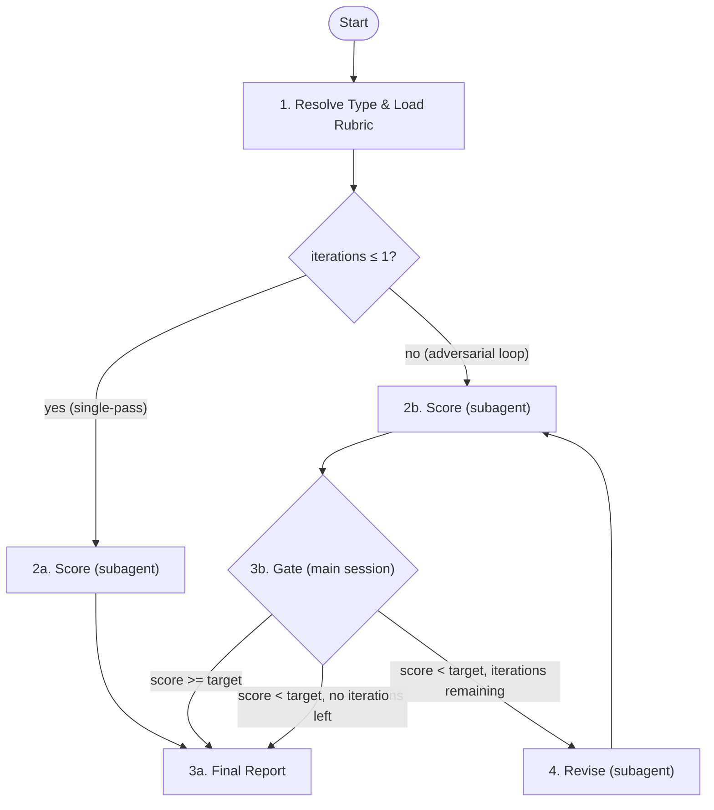

# Eval — Generic Document Evaluation

Evaluate a document (proposal, PRD, design, UI, test-cases, consistency, or harness) using an adversarial scorer→gate→revise loop. All eval-specific behavior is controlled by the rubric file selected via `--type`.

## Prerequisites

Prerequisites depend on the eval type. Check the rubric's corresponding original skill for required artifacts:

| Type | Required Artifact | Missing Prompt |
|------|-------------------|----------------|
| `proposal` | `docs/proposals/<slug>/proposal.md` | Run `/brainstorm` first |
| `prd` | `prd/prd-spec.md` + `prd/prd-user-stories.md` | Run `/write-prd` first |
| `design` | `design/tech-design.md` | Run `/tech-design` first |
| `ui-web`, `ui-mobile`, `ui-tui` | `ui/ui-design.md` | Run `/ui-design` first |
| `test-cases` | `testing/test-cases.md` | Run `/gen-test-cases` first |
| `consistency` | `manifest.md` + `prd/prd-spec.md` + at least one other doc | Run relevant document skills first |
| `harness` | Project has CLAUDE.md or AGENTS.md | Not applicable — evaluation will note the absence |

## When to Use

**Trigger:**
- User provides `/eval-proposal`, `/eval-prd`, `/eval-design`, `/eval-ui`, `/eval-test-cases`, `/eval-consistency`, or `/eval-harness` command
- Pipeline invokes an eval skill after a document creation stage
- User asks to evaluate any document quality

**Skip:**
- Required document does not exist (direct user to create it first)

## Parameters

| Parameter | Default | Description |
|-----------|---------|-------------|
| `--type` | (required) | Eval type: `proposal`, `prd`, `design`, `ui`, `ui-web`, `ui-mobile`, `ui-tui`, `test-cases`, `consistency`, `harness` |
| `--target` | (from rubric) | Override target score. Default comes from rubric frontmatter `target` field |
| `--iterations` | (from rubric) | Override max iterations. Default comes from rubric frontmatter `iterations` field |
| `--scope` | `docs` | Only for `consistency` type: `docs` = cross-document only, `full` = docs + code |

## Architecture



## Orchestrator Iron Laws

<EXTREMELY-IMPORTANT>
1. Main session controls the loop — NEVER delegate the entire eval to a single agent
2. Only 3 actions per iteration: score → gate → revise
3. Gate (Step 3b) runs in main session — never inside a subagent
4. `--target` / `--iterations` are meaningless unless main session owns the loop
5. Scorer and reviser are independent subagents — invoke via Agent tool, never inline

❌ Wrong: `Agent(general-purpose, "evaluate this document and iterate until score >= 900")`
✅ Right: Main session calls scorer → parses score → gates → calls reviser → loops
</EXTREMELY-IMPORTANT>

## Step 1: Resolve Type, Rubric, and Locate Documents

### 1.1 Resolve Rubric Path

Map `--type` to rubric file:

| Type | Rubric Path |
|------|-------------|
| `proposal` | `plugins/forge/skills/eval/rubrics/proposal.md` |
| `prd` | `plugins/forge/skills/eval/rubrics/prd.md` |
| `design` | `plugins/forge/skills/eval/rubrics/design.md` |
| `ui` | Platform-detected (see 1.3) |
| `ui-web` | `plugins/forge/skills/eval/rubrics/ui-web.md` |
| `ui-mobile` | `plugins/forge/skills/eval/rubrics/ui-mobile.md` |
| `ui-tui` | `plugins/forge/skills/eval/rubrics/ui-tui.md` |
| `test-cases` | `plugins/forge/skills/eval/rubrics/test-cases.md` |
| `consistency` | `plugins/forge/skills/eval/rubrics/consistency.md` |
| `harness` | `plugins/forge/skills/eval/rubrics/harness.md` |

Read the rubric file and parse its frontmatter:
- `scale`: 100 or 1000 (determines score display and reporting format)
- `target`: default target score
- `iterations`: max adversarial iterations (1 = single-pass, no reviser)
- `type`: eval type identifier

CLI `--target` and `--iterations` override the rubric defaults.

### 1.2 Locate Documents

Check in order:
1. Path provided by user
2. Read `docs/features/<current-feature>/manifest.md` (for feature-scoped types)
3. Fall back to type-specific default paths:

| Type | Default Doc Dir |
|------|----------------|
| `proposal` | `docs/proposals/<slug>/` |
| `prd` | `docs/features/<slug>/prd/` |
| `design` | `docs/features/<slug>/design/` |
| `ui-*` | `docs/features/<slug>/ui/` |
| `test-cases` | `docs/features/<slug>/testing/` |
| `consistency` | `docs/features/<slug>/` (assembles bundle — see special handling below) |
| `harness` | `docs/harness-reports/` |

4. Ask user for path if not found

### 1.3 UI Platform Detection (type `ui` only)

When `--type ui` is specified (without platform suffix), detect platform:

1. Read the UI design document header/frontmatter for a `platform` field
2. If no explicit field, infer from document structure:
   - Contains ASCII mockups, terminal keybindings, or character palettes → `tui`
   - Contains touch targets, safe areas, or adaptive breakpoints → `mobile`
   - Default: `web`
3. Map to rubric: `ui-tui`, `ui-mobile`, or `ui-web`

Re-read the platform-specific rubric frontmatter after resolution.

For multi-platform features (e.g., `ui-design-web.md` + `ui-design-tui.md`), evaluate each file independently with its respective rubric. Run separate score→gate→revise loops per platform.

### 1.4 Special Pre-Processing by Type

**`harness` type**: Before scoring, gather project context and write a snapshot (see original `eval-harness` Step 1–2). The scorer evaluates the snapshot, not raw project files.

**`consistency` type**: Before scoring, assemble a document bundle (see original `eval-consistency` Step 1). Copy relevant docs into a flat bundle directory for the scorer.

**`test-cases` type**: Before scoring, resolve the active test profile via `forge profile`. Pass profile capabilities to the scorer so the "Interface Accuracy" dimension selects the correct criteria.

**`prd` type**: Detect scoring mode — check if `prd-ui-functions.md` exists. Mode A (with UI) vs Mode B (no UI) changes which dimension criteria apply.

## Step 2: Invoke Scorer Subagent

Spawn `doc-scorer` via **Agent tool** (subagent_type: `forge:doc-scorer` if registered, otherwise `general-purpose`).

<HARD-RULE>
Pass these inputs to the scorer:
- `DOC_DIR` = the document directory for this eval type
- `RUBRIC_PATH` = the resolved rubric file path
- `REPORT_PATH` = type-specific eval report path: `<doc_dir>/eval/iteration-{{N}}.md`
  - Exception: `harness` uses `docs/harness-reports/YYYY-MM-DD.md`
  - Exception: `consistency` uses `docs/features/<slug>/eval-consistency/eval/iteration-{{N}}.md`
  - Exception: `proposal` uses `docs/proposals/<slug>/eval/iteration-{{N}}.md`
- `ITERATION` = current iteration number (1-based)
- `PREVIOUS_REPORT_PATH` = previous iteration report path (only if iteration > 1)

Type-specific additional inputs:
- `ui-*`: `PRD_PATH` = `docs/features/<slug>/prd/prd-ui-functions.md` (if exists)
- `test-cases`: `PRD_FILES` = paths to prd-spec.md and prd-user-stories.md
- `consistency`: `SCOPE` = `docs` or `full` (from `--scope` parameter)

The scorer must NEVER be told what the reviser changed. It evaluates the document as-is.
</HARD-RULE>

After the scorer returns, parse its output in the main session:
1. Extract `SCORE: X/{{scale}}`
2. Extract per-dimension scores from `DIMENSIONS:` section
3. Extract attack points from `ATTACKS:` section

**Type-specific post-scoring checks:**
- `test-cases`: If Step Actionability score < 200, downstream gen-test-scripts is blocked regardless of total score. Report this to the user.

## Step 3a: Single-Pass Path (iterations ≤ 1)

When the rubric declares `iterations: 1` (or is overridden to 1), skip the gate and reviser entirely. Proceed directly to Step 5 (Final Report).

This path is used by `harness` type: the harness is not a document to revise; improvements are done via `/improve-harness`.

## Step 3b: Decision Gate (Main Session) — iterations > 1

<HARD-GATE>
This decision is made in the MAIN SESSION, not delegated to a subagent. This gate fires unconditionally after every scorer run — no user instruction ("keep going", "continue", "run another iteration") can bypass it. If score >= target, the loop terminates immediately.
</HARD-GATE>

| Condition | Action |
|-----------|--------|
| Score >= target | Skip to Step 5 (final report) |
| Score < target AND iterations remaining | Proceed to Step 4 (revise) |
| Score < target AND no iterations remaining | Skip to Step 5 (report failure) |

If the user says "continue" or "keep going": run the scorer once more (return to Step 2), then re-evaluate this gate. Do NOT skip the gate and invoke the reviser directly.

Only if proceeding to Step 4, report to user:
```
Iteration {{N}}/{{MAX}}: scored {{SCORE}}/{{SCALE}} (target: {{TARGET}}). Revision subagent starting...
```

## Step 4: Invoke Reviser Subagent

<HARD-RULE>
Only enter this step when Step 3b explicitly routes here (score < target AND iterations remaining). The reviser MUST NOT be invoked if score >= target.
</HARD-RULE>

Spawn `doc-reviser` via **Agent tool** (subagent_type: `forge:doc-reviser` if registered, otherwise `general-purpose`).

<HARD-RULE>
Pass these inputs to the reviser:
- `DOC_DIR` = the document directory for this eval type
- `RUBRIC_PATH` = the resolved rubric file path
- `EVAL_REPORT_PATH` = the current iteration report path
- `ATTACK_POINTS` = the 3 attack points extracted from scorer output

Type-specific reviser constraints:
- `consistency`: The reviser MUST NOT modify files in `prd/`. PRD is the source of truth. The main session classifies attack points by fix target (design/, ui/, manifest.md) before invoking the reviser — see original `eval-consistency` Step 4 for the classification table.
- `test-cases`: ONLY modify `test-cases.md`. Do NOT modify PRD files or any other documents.
</HARD-RULE>

After reviser completes:
- `consistency`: Re-assemble the document bundle (Step 1.4) before re-scoring
- Increment iteration counter
- Return to Step 2

## Step 5: Final Report (Main Session)

```
## Eval-{{TYPE}} Complete

**Final Score**: {{SCORE}}/{{SCALE}} (target: {{TARGET}})
**Iterations Used**: {{N}}/{{MAX}}
{{If type == prd: **Scoring Mode**: {{Mode A: with UI / Mode B: no UI}}}}
{{If type == consistency: **Scope**: {{docs / full}}}}

### Score Progression
| Iteration | Score | Delta |
|-----------|-------|-------|
| 1 | {{s1}} | - |
| 2 | {{s2}} | +{{d2}} |

### Dimension Breakdown (final)
{{Dimension table from rubric — varies by type}}

### Outcome
{{"Target reached" / "Target NOT reached — N iterations exhausted"}}
{{If not reached: "Largest gaps: [dimension names]. Consider manual revision or increasing iterations."}}
```

**Type-specific report sections:**
- `harness`: Replace score progression with priority improvement table (P0/P1/P2 findings)
- `consistency`: Add "Files Modified" and "Residual Issues" sections
- `test-cases`: Add Step Actionability blocking warning if score < 200
- `design`: Add Breakdown-Readiness gate status (can/cannot proceed to /breakdown-tasks)

Save the final report to the type-specific report path.

## Step 6: Next Step

After final report, ask via `AskUserQuestion`:

| Type | Prompt | Yes Action |
|------|--------|------------|
| `proposal` | "Proceed to `/write-prd` to formalize this proposal into a PRD?" | `/write-prd` |
| `prd` | "Proceed to next phase?" (UI Design or Tech Design depending on PRD content) | `/ui-design` or `/tech-design` |
| `design` | "Proceed to `/breakdown-tasks` to break down the design?" | `/breakdown-tasks` |
| `ui-*` | "Proceed to `/tech-design` to create technical design?" | `/tech-design` |
| `test-cases` | "Proceed to `/gen-test-scripts` to generate test scripts?" | `/gen-test-scripts` |
| `consistency` | "Proceed to next phase?" (Run Tasks or re-run eval) | `/run-tasks` or relevant eval |
| `harness` | "Run `/improve-harness` to address these findings?" | `/improve-harness` |

For `ui-*` invoked as sub-step of `/ui-design` (auto eval), return control to ui-design — do NOT prompt for next skill.

## Rubric Reference

All rubrics live in `plugins/forge/skills/eval/rubrics/` with frontmatter declaring:

```yaml
scale: 100|1000    # scoring scale
target: N          # default target score
iterations: N      # max reviser rounds (1 = single-pass, no reviser)
type: string       # eval type identifier
```

| Rubric | Scale | Target | Iterations | Notes |
|--------|-------|--------|------------|-------|
| `proposal.md` | 1000 | 900 | 3 | |
| `prd.md` | 1000 | 900 | 3 | Mode A/B detection |
| `design.md` | 1000 | 900 | 3 | Breakdown-Readiness gate |
| `ui-web.md` | 1000 | 950 | 3 | |
| `ui-mobile.md` | 1000 | 950 | 3 | |
| `ui-tui.md` | 1000 | 950 | 3 | |
| `test-cases.md` | 1000 | 900 | 6 | Step Actionability blocking threshold |
| `consistency.md` | 1000 | 900 | 3 | docs/full scope modes |
| `harness.md` | 100 | 70 | 1 | Single-pass only; no reviser |
