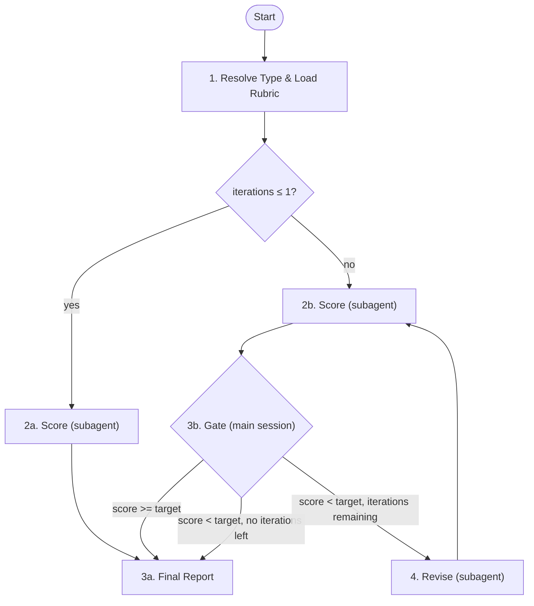

# Eval

## Prerequisites

| Type | Required Artifact |
|------|-------------------|
| `proposal` | `docs/proposals/<slug>/proposal.md` |
| `prd` | `prd/prd-spec.md` + `prd/prd-user-stories.md` |
| `design` | `design/tech-design.md` |
| `ui-web`, `ui-mobile`, `ui-tui` | `ui/ui-design.md` |
| `test-cases` | `testing/test-cases.md` |
| `ui-test-cases` | `testing/ui-test-cases.md` |
| `tui-test-cases` | `testing/tui-test-cases.md` |
| `mobile-test-cases` | `testing/mobile-test-cases.md` |
| `api-test-cases` | `testing/api-test-cases.md` |
| `cli-test-cases` | `testing/cli-test-cases.md` |
| `consistency` | `manifest.md` + `prd/prd-spec.md` + at least one other doc |
| `harness` | Project has CLAUDE.md or AGENTS.md |
| `validate-code` | PRD (`prd/prd-spec.md` + `prd/prd-user-stories.md`) + git diff against base branch |
| `validate-ux` | PRD + compilable project (binary or web server) |

If missing, tell user to create it first.

## Parameters

| Parameter | Default | Description |
|-----------|---------|-------------|
| `--type` | (required) | `proposal`, `prd`, `design`, `ui`, `ui-web`, `ui-mobile`, `ui-tui`, `test-cases`, `ui-test-cases`, `tui-test-cases`, `mobile-test-cases`, `api-test-cases`, `cli-test-cases`, `consistency`, `harness`, `validate-code`, `validate-ux` |
| `--target` | rubric frontmatter | Override target score |
| `--iterations` | rubric frontmatter | Override max iterations |
| `--scope` | `docs` | `consistency` only: `docs` or `full` |

Resolution: explicit `--type` in `<command-args>` → command name `/eval-<type>` → ask user.

### Rubric Context Frontmatter (optional)

Rubrics may declare a `context` frontmatter field to inject project reality files into the scorer prompt. See `${CLAUDE_SKILL_DIR}/rules/rubric-context.md` for the full specification. Rubrics without `context` continue to work unchanged.

## Architecture

## Orchestrator Iron Laws

<EXTREMELY-IMPORTANT>
- Main session owns the loop. NEVER delegate the full eval to a single agent.
- Per iteration: score (subagent) → gate (main session) → revise (subagent).
- Scorer and reviser are ALWAYS invoked via Agent tool, never inline.
</EXTREMELY-IMPORTANT>

## Step 1: Resolve Type, Rubric, and Locate Documents

### 1.1 Resolve Rubric Path

Load: `rubrics/<type>.md`
Exception: type `ui` → detect platform first (see 1.3), then load `ui-<platform>.md`.

Parse rubric frontmatter: `scale`, `target`, `iterations`, `context`. CLI `--target`/`--iterations` override frontmatter. Store `context` declaration for use in Step 1.4 and Step 2.

### 1.2 Locate Documents

1. User-provided path
2. `docs/features/<current-feature>/manifest.md`
3. Default paths:

| Type | Default Doc Dir |
|------|----------------|
| `proposal` | `docs/proposals/<slug>/` |
| `prd` | `docs/features/<slug>/prd/` |
| `design` | `docs/features/<slug>/design/` |
| `ui-*` | `docs/features/<slug>/ui/` |
| `test-cases` | `docs/features/<slug>/testing/` |
| `ui-test-cases` | `docs/features/<slug>/testing/` |
| `tui-test-cases` | `docs/features/<slug>/testing/` |
| `mobile-test-cases` | `docs/features/<slug>/testing/` |
| `api-test-cases` | `docs/features/<slug>/testing/` |
| `cli-test-cases` | `docs/features/<slug>/testing/` |
| `consistency` | `docs/features/<slug>/` |
| `harness` | `docs/harness-reports/` |
| `validate-code` | `docs/features/<slug>/prd/` |
| `validate-ux` | `docs/features/<slug>/prd/` |

4. Ask user if not found

### 1.3 UI Platform Detection (type `ui` only)

1. Check UI doc frontmatter for `platform` field
2. If absent, infer: ASCII mockups/terminal keybindings → `tui`; touch targets/safe areas → `mobile`; else → `web`
3. Load rubric `ui-<platform>.md`

Multi-platform: run independent score→gate→revise loops per platform.

### 1.4 Pre-Processing by Type

Apply type-specific pre-processing per `${CLAUDE_SKILL_DIR}/rules/pre-processing.md` before scoring. All types: if rubric has `context` frontmatter, load filtered context files and concatenate into `CONTEXT_CONTENT`.

## Expert Dispatch Table

Resolve eval type to scorer expert(s) per `${CLAUDE_SKILL_DIR}/rules/scorer-composition.md`.

## Iteration Initialization

Set `ITERATION = 1`, `MAX_ITERATIONS = resolved value from rubric or CLI`.

## Step 2: Invoke Scorer Subagent(s)

### 2.1 Compose Scorer Prompts

Compose scorer prompts per `${CLAUDE_SKILL_DIR}/rules/scorer-composition.md`: read scorer protocol, resolve expert(s) from dispatch table, concatenate protocol + expert + context injection. Apply context injection template from the rules file if `CONTEXT_CONTENT` was loaded in Step 1.4.

### 2.2 Spawn Scorer Agents

Spawn each composed prompt as a `general-purpose` agent via the Agent tool with `model: "sonnet"`.

- **Single-expert types**: spawn one agent.
- **Multi-expert types** (e.g., `prd` → `[pm, qa]`): spawn multiple agents **in parallel** (multiple Agent tool calls in a single message). Each agent receives its own composed prompt and writes to its own report path.

Report paths, type-specific inputs, and type-specific report path overrides per `${CLAUDE_SKILL_DIR}/rules/scorer-composition.md`.

### 2.3 Collect and Merge Results

Score extraction and multi-expert merging per `${CLAUDE_SKILL_DIR}/rules/scorer-composition.md`.

## Step 3a: Single-Pass (iterations ≤ 1)

Skip gate and reviser. Go directly to Step 5.

## Step 3b: Decision Gate (Main Session)

Use the averaged score (for multi-expert types) or single score (for single-expert types) from Step 2.3.

| Condition | Action |
|-----------|--------|
| Score >= target | Go to Step 5 |
| Score < target, iterations remaining | Go to Step 4 |
| Score < target, no iterations remaining | Go to Step 5 (report failure) |

If proceeding to Step 4, report: `Iteration {{N}}/{{MAX}}: scored {{SCORE}}/{{SCALE}} (target: {{TARGET}}). Revising...`

## Step 4: Invoke Reviser Subagent (only when Step 3b routes here)

### 4.1 Compose Reviser Prompt

Compose reviser prompt per `${CLAUDE_SKILL_DIR}/rules/reviser-composition.md`: read reviser protocol, resolve `EVAL_REPORT_PATH`, concatenate protocol + merged attacks + context injection. Apply context injection template from the rules file if `CONTEXT_CONTENT` was loaded in Step 1.4.

### 4.2 Spawn Reviser Agent

Spawn as a `general-purpose` agent via the Agent tool with `model: "sonnet"`.

Inputs: `DOC_DIR`, `EVAL_REPORT_PATH`, `ATTACK_POINTS` (merged).

Type-specific constraints per `${CLAUDE_SKILL_DIR}/rules/reviser-composition.md`.

After reviser completes: increment iteration counter, return to Step 2.

## Step 5: Final Report

Generate report per `${CLAUDE_SKILL_DIR}/rules/report-format.md`: include final score, iteration summary, score progression table, dimension breakdown, and outcome. Apply type-specific additions as defined in the rules file.

## Step 6: Next Step

Ask user via `AskUserQuestion`:

| Type | Next Skill |
|------|-----------|
| `proposal` | `/write-prd` |
| `prd` | `/ui-design` or `/tech-design` |
| `design` | `/breakdown-tasks` |
| `ui-*` | `/tech-design` |
| `test-cases` | `/gen-test-scripts` |
| `ui-test-cases`, `tui-test-cases`, `mobile-test-cases`, `api-test-cases`, `cli-test-cases` | `/gen-test-scripts` |
| `consistency` | `/run-tasks` or re-eval |
| `harness` | `/improve-harness` |
| `validate-code` | `/run-tasks` (proceed to test pipeline) |
| `validate-ux` | `/run-tasks` (feature complete) |

`ui-*` invoked as sub-step of `/ui-design`: return control to ui-design, do NOT prompt.

## Rubric Reference

All rubrics: `rubrics/<type>.md`. See `${CLAUDE_SKILL_DIR}/rules/rubric-reference.md` for the complete scale/target/iterations reference table.
