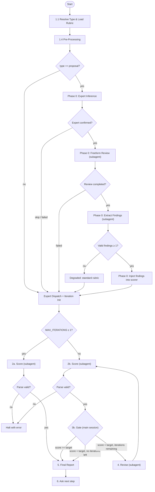

# Eval

## Prerequisites

Feature-relative paths (no prefix) resolve from `docs/features/<slug>/`. Exceptions: `proposal` uses full path `docs/proposals/<slug>/`.

| Type | Required Artifact |
|------|-------------------|
| `proposal` | `docs/proposals/<slug>/proposal.md` |
| `prd` | `prd/prd-spec.md` + `prd/prd-user-stories.md` |
| `design` | `design/tech-design.md` |
| `ui` | `ui/ui-design.md` (platform detected at runtime per Step 1.3) |
| `ui-web`, `ui-mobile`, `ui-tui` | `ui/ui-design.md` |
| `consistency` | `manifest.md` + `prd/prd-spec.md` + at least one other doc |
| `validate-code` | PRD (`prd/prd-spec.md` + `prd/prd-user-stories.md`) + git diff against base branch |
| `validate-ux` | PRD + compilable project (binary or web server); must run in git worktree or temp dir |
| `harness` | Compilable project (snapshot-based; no `DOC_DIR`) |
| `journey` | `testing/<journey>/journey.md` (generated by gen-journeys) |
| `contract` | `testing/<journey>/contracts/step-<N>-<action>.md` (generated by gen-contracts) |

If missing, tell user to create it first.

## Parameters

| Parameter | Default | Description |
|-----------|---------|-------------|
| `--type` | (required) | `proposal`, `prd`, `design`, `ui`, `ui-web`, `ui-mobile`, `ui-tui`, `consistency`, `harness`, `validate-code`, `validate-ux`, `journey`, `contract` |
| `--target` | rubric frontmatter | Override target score |
| `--iterations` | rubric frontmatter | Override max iterations |
| `--scope` | `docs` | `consistency` only: `docs` or `full` |

Resolution: explicit `--type` in `<command-args>` → command name `/eval-<type>` → ask user.

Rubrics may optionally declare `context` frontmatter (see `rules/rubric-context.md`). Parsed in Step 1.1, applied in Step 1.4.

## Architecture

## Orchestrator Iron Laws

<EXTREMELY-IMPORTANT>
- Main session owns the loop. NEVER delegate the full eval to a single agent.
- Per iteration: score (subagent) → gate (main session) → revise (subagent).
- Scorer and reviser are ALWAYS invoked via Agent tool, never inline.
</EXTREMELY-IMPORTANT>

## Step 1: Resolve Type, Rubric, and Locate Documents

### 1.1 Resolve Rubric Path

Load: `rubrics/<type>.md`
Exception: type `ui` → detect platform first (see 1.3), then load `ui-<platform>.md`.

Parse rubric frontmatter: `scale`, `target`, `iterations`, `context`. CLI `--target`/`--iterations` override frontmatter. Store `context` declaration for use in Step 1.4 and Step 2.

### 1.2 Locate Documents

1. User-provided path
2. `docs/features/<current-feature>/manifest.md`
3. Default paths:

| Type | Default Doc Dir |
|------|----------------|
| `proposal` | `docs/proposals/<slug>/` |
| `prd` | `docs/features/<slug>/prd/` |
| `design` | `docs/features/<slug>/design/` |
| `ui-*` | `docs/features/<slug>/ui/` |
| `consistency` | `docs/features/<slug>/` |
| `validate-code` | `docs/features/<slug>/prd/` |
| `validate-ux` | `docs/features/<slug>/prd/` |
| `harness` | _(no `DOC_DIR`; snapshot-based)_ |
| `journey` | `docs/features/<slug>/testing/<journey>/` |
| `contract` | `docs/features/<slug>/testing/<journey>/contracts/` |

4. Ask user if not found

### 1.3 UI Platform Detection (type `ui` only)

1. Check UI doc frontmatter for `platform` field
2. If absent, infer: ASCII mockups/terminal keybindings → `tui`; touch targets/safe areas → `mobile`; else → `web`
3. Load rubric `ui-<platform>.md`

Multi-platform: run independent score→gate→revise loops per platform.

### 1.4 Pre-Processing by Type

Apply type-specific pre-processing per `rules/pre-processing.md` before scoring. All types: if rubric has `context` frontmatter, load filtered context files and concatenate into `CONTEXT_CONTENT`.

## Phase 0: Freeform Expert Review (proposal only — two-tier sequential approval)

This phase is executed **by default** when the resolved type is `proposal`. The design follows a sequential approval model: domain expert reviews first (Phase 0), then CTO reviews via rubric (Steps 2–4). Domain-specific findings from Phase 0 are injected into the CTO rubric scorer, ensuring the CTO evaluation accounts for issues the rubric alone would miss. For all other types, skip directly to the Expert Dispatch Table. The orchestrator iron laws apply: Phase 0 delegates to subagents via Agent tool, the main session orchestrates.

### P0.1: Expert Reuse Check

Before generating a new expert, check for reusable experts in `docs/experts/`:

1. Load all `.md` files from `docs/experts/`. Filter out files with `deprecated: true` or invalid front matter.
2. Follow the reuse matching rules in `rules/freeform-expert-persistence.md`: extract domain keywords from each candidate and from the proposal, compute Jaccard overlap score.
3. If a candidate meets the threshold (Jaccard >= 0.3 or weighted score >= 5), present the match to the user via `AskUserQuestion` with two options: **Reuse** or **Generate new**.
4. If the user chooses **Reuse**, use that expert profile as `EXPERT_PROFILE` and skip to P0.3.
5. If the user chooses **Generate new**, or no candidate meets the threshold, proceed to P0.2.

### P0.2: Expert Inference

Generate a dynamic expert profile via a `general-purpose` agent using the prompt defined in `experts/freeform/expert-inference.md`:

1. Spawn agent with `model: "sonnet"`, providing `PROPOSAL_PATH` (the proposal document path) and `EXISTING_EXPERTS` (list of current expert file contents from `docs/experts/`).
2. The agent performs domain analysis and generates an expert profile using `experts/freeform/expert-template.md`. Reuse check was already completed in P0.1 — instruct the agent to skip it.
3. The agent returns the generated profile (or indicates reuse).
4. Present the expert profile to the user via `AskUserQuestion` with three options: **Accept**, **Modify**, **Regenerate**. Include the cross-reference report and self-check questions.
5. Handle the modification loop and rejection limits per `experts/freeform/expert-inference.md` (max 3 modification rounds, max 3 consecutive rejections).
6. On acceptance, save the expert profile to `docs/experts/<slug>.md` and set `EXPERT_PROFILE` to the profile content.
7. If the user skips (chooses to skip after rejection limit, or manually aborts), degrade per Phase 0 Degradation Summary table.

**Error: Expert generation failure**: If the inference agent returns incoherent output (missing domain keywords, empty background) or fails entirely, inform the user and offer two options: manually describe an expert direction, or degrade per Phase 0 Degradation Summary table.

### P0.3: Freeform Review

Conduct a freeform narrative review using a `general-purpose` agent:

1. Spawn agent with `model: "sonnet"`, providing `DOC_DIR` and `EXPERT_PROFILE` (from P0.1 reuse or P0.2 generation).
2. The agent reads `experts/freeform/freeform-reviewer.md` (which in turn references `experts/freeform/freeform-review-protocol.md`) and conducts the review.
3. The agent writes the review to `<DOC_DIR>/eval/freeform-review.md` and returns a status summary (`FREEFORM_REVIEW: completed/failed`).

**Error: Freeform review failure**: If the agent returns `FREEFORM_REVIEW: failed`, or the output file is empty/missing, degrade per Phase 0 Degradation Summary table.

### P0.4: Extract Findings

Extract structured findings from the freeform review narrative using a `general-purpose` agent:

1. Read the freeform review from `<DOC_DIR>/eval/freeform-review.md`.
2. Spawn agent with `model: "sonnet"`, providing the extraction prompt from `experts/freeform/extraction-prompt.md` with `{{FREEFORM_REVIEW}}` replaced by the review content.
3. The agent returns a JSON array of findings.
4. Validate the extraction output per `extraction-prompt.md` JSON Validation Rules.
5. Compute hit rate per `extraction-prompt.md` Hit Rate Estimation. If hit rate < 0.5, set `LOW_HIT_RATE = true`.
6. If 0 valid findings remain after validation, degrade per Phase 0 Degradation Summary table.
7. If >= 1 valid finding, set `FREEFORM_FINDINGS = <validated JSON array>` and proceed.

### P0.5: Inject Findings into Scorer

Set `FREEFORM_INJECTION = true` and store the validated findings. The actual injection into the scorer prompt occurs during Step 2.1 per `rules/freeform-injection.md`.

After the final report is generated (end of Step 5), record the expert's review history per `rules/freeform-expert-persistence.md` quality tracking section, and check auto-deprecation.

**Error: Injection ineffective**: If a baseline comparison is available and the injected run shows no substantive change (rubric delta < 15 AND attack points unchanged), annotate the eval report: "自由评审发现未影响 rubric 评分". This does not degrade — the rubric scoring still completed normally.

### Phase 0 Degradation Summary

All Phase 0 error paths converge to the standard rubric flow. No degradation path interrupts the eval pipeline:

| Error Scenario | Degradation Action | User Notification |
|----------------|-------------------|-------------------|
| Expert generation failure | Skip to standard rubric flow | "专家生成失败，已降级为标准 rubric 流程。" |
| User skips after rejection limit | Skip to standard rubric flow | (user initiated, no extra notification) |
| Freeform review failure (empty/failed) | Skip to standard rubric flow | "自由评审未产出有效发现，已降级为标准 rubric 流程。" |
| Extraction output is empty | Skip to standard rubric flow | "自由评审未产出有效结构化发现，已降级为标准 rubric 流程。" |
| Extraction JSON invalid (0 valid after filtering) | Skip to standard rubric flow | "提取产出格式异常，已降级为标准 rubric 流程。" |
| Partial extraction (hit rate < 50%) | Inject valid findings + annotate | "提取命中率低" annotation in eval report + full narrative attached |
| Injection has no effect on rubric | Continue normally + annotate | "自由评审发现未影响 rubric 评分" in eval report |

## Expert Dispatch Table

Resolve eval type to scorer expert(s) per `rules/scorer-composition.md`.

## Iteration Initialization

Set `ITERATION = 1`, `MAX_ITERATIONS = resolved value from rubric or CLI`.

## Step 2: Invoke Scorer Subagent(s) (flowchart labels: `2a` = single-pass, `2b` = multi-iteration)

### 2.1 Compose Scorer Prompts

Compose scorer prompts per `rules/scorer-composition.md`: read scorer protocol, resolve expert(s) from dispatch table, concatenate protocol + expert + context injection.

### 2.2 Spawn Scorer Agents

Spawn each composed prompt as a `general-purpose` agent via the Agent tool with `model: "sonnet"`.

- **Single-expert types**: spawn one agent.
- **Multi-expert types** (e.g., `prd` → `[pm, qa]`): spawn multiple agents **in parallel** (multiple Agent tool calls in a single message). Each agent receives its own composed prompt and writes to its own report path.

Report paths, type-specific inputs, and type-specific report path overrides per `rules/scorer-composition.md`.

### 2.3 Collect and Merge Results

Score extraction and multi-expert merging per `rules/scorer-composition.md`.

**Parse failure handling**: If the scorer subagent output cannot be parsed (no valid `SCORE: X/SCALE` pattern found in any scorer report), halt the pipeline with a clear error. This is a retryable failure — the agent should re-run eval with different input or debug the scorer prompt. Do NOT crash, do NOT proceed with zero score, do NOT continue with silent default values.

On `ITERATION == 1`: store the merged score as `INITIAL_SCORE` (used in Step 5 report Score Progression table to compute delta from first iteration).

## Step 3a: Single-Pass (MAX_ITERATIONS ≤ 1)

Skip gate and reviser. Go directly to Step 5.

## Step 3b: Decision Gate (Main Session)

Use the averaged score (for multi-expert types) or single score (for single-expert types) from Step 2.3.

Iterations remaining = `MAX_ITERATIONS - ITERATION` (current iteration consumed).

| Condition | Action |
|-----------|--------|
| Score >= target | Go to Step 5 |
| Score < target, ITERATION < MAX_ITERATIONS | Go to Step 4 |
| Score < target, ITERATION >= MAX_ITERATIONS | Go to Step 5 (report failure) |

If proceeding to Step 4, report: `Iteration {{N}}/{{MAX}}: scored {{SCORE}}/{{SCALE}} (target: {{TARGET}}). Revising...`

## Step 4: Invoke Reviser Subagent (only when Step 3b routes here)

### 4.1 Compose Reviser Prompt

Compose reviser prompt per `rules/reviser-composition.md`: read reviser protocol, resolve `EVAL_REPORT_PATH`, concatenate protocol + merged attacks + context injection.

### 4.2 Spawn Reviser Agent

Spawn as a `general-purpose` agent via the Agent tool with `model: "sonnet"`.

Inputs: `DOC_DIR`, `EVAL_REPORT_PATH`, `ATTACK_POINTS` (merged).

Type-specific constraints per `rules/reviser-composition.md`.

After reviser completes: increment iteration counter, return to Step 2.

## Step 5: Final Report

Generate report per `rules/report-format.md`: include final score, iteration summary, score progression table, dimension breakdown, and outcome. Apply type-specific additions as defined in the rules file.

## Step 6: Next Step

Ask user via `AskUserQuestion`:

| Type | Next Skill |
|------|-----------|
| `proposal` | `/write-prd` |
| `prd` | `/ui-design` or `/tech-design` |
| `design` | `/breakdown-tasks` |
| `ui-*` | `/tech-design` |
| `consistency` | `/run-tasks` or re-eval |
| `validate-code` | `/run-tasks` (proceed to test pipeline) |
| `validate-ux` | `/run-tasks` (feature complete) |
| `journey` | `/gen-contracts` (proceed to contract generation) |
| `contract` | `/gen-test-scripts` (proceed to test script generation) |

`ui-*` invoked as sub-step of `/ui-design`: return control to ui-design, do NOT prompt.

## Rubric Reference

All rubrics: `rubrics/<type>.md`. See `rules/rubric-reference.md` for the complete scale/target/iterations reference table.
