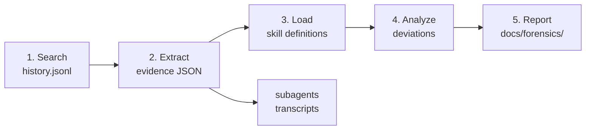

# Forensic Agent Deviation Analysis

## When to Use

**Trigger:**
- User reports a skill/agent repeatedly deviating from expected behavior
- User asks "why did the agent do X" about a past session
- User wants to compare agent behavior across sessions for a specific skill
- User provides `/forensic` command with a search term

**Skip:**
- Single-session post-mortem (use `/learn-lesson` instead)
- Current-session debugging (investigate directly)

## Parameters

| Parameter     | Default | Description                                    |
| ------------- | ------- | ---------------------------------------------- |
| `--keyword`   | —       | Search history.jsonl for sessions with keyword  |
| `--session`   | —       | Analyze a specific session ID                  |
| `--skill`     | —       | Analyze sessions that invoked a specific skill  |
| `--last`      | 10      | Limit number of sessions to search             |
| `--target`    | —       | Specific behavior to investigate (e.g. "agent ignored MAIN_SESSION flag") |

## Prerequisites

`task` CLI must be installed with forensic subcommand (v2.15.0+). Verify:

```bash
task forensic --help
```

If missing, build and install: `cd task-cli && go build -o ~/.zcode-task-cli/task ./cmd/task/`

## Architecture



## Workflow

### Step 1: Locate Target Sessions

Search `~/.claude/history.jsonl` to find relevant sessions.

```bash
task forensic search "coding-harness/forge" --keyword "<KEYWORD>" --last <N>
```

Or search by skill name:

```bash
task forensic search "coding-harness/forge" --skill "<SKILL>" --last <N>
```

From the results, identify sessions of interest. Read the `firstMsg` and `dateTime` to select relevant sessions.

Present the session list to the user and confirm which sessions to analyze.

### Step 2: Extract Evidence

For each confirmed session, extract compact evidence:

```bash
# Derive JSONL path from sessionId
# Path pattern: ~/.claude/projects/-Users-fanhuifeng-Projects-ai-coding-harness-forge/<sessionId>.jsonl

mkdir -p docs/forensics/<slug>/evidence

task forensic extract ~/.claude/projects/-Users-fanhuifeng-Projects-ai-coding-harness-forge/<SESSION_ID>.jsonl --out docs/forensics/<slug>/evidence
```

Then check for subagent transcripts:

```bash
task forensic subagents ~/.claude/projects/-Users-fanhuifeng-Projects-ai-coding-harness-forge/<SESSION_ID>
```

If subagents exist, extract their evidence too:

```bash
task forensic extract <subagent-transcript-path> --out docs/forensics/<slug>/evidence
```

<HARD-RULE>
Evidence files are intermediate artifacts. Each extract produces ~10-20KB regardless of original JSONL size. Always use `--out` to write to the evidence directory — never dump raw JSONL to terminal.
</HARD-RULE>

### Step 3: Load Expected Behavior

From the evidence's `skillsUsed` field (or user's `--skill` parameter), read the relevant skill definitions:

```
plugins/forge/skills/<skill-name>/SKILL.md
```

Extract the rules that the agent should have followed:
- `<HARD-RULE>` blocks — mandatory constraints
- `<EXTREMELY-IMPORTANT>` blocks — top-priority rules
- `<PROHIBITIONS>` blocks — forbidden actions
- Step-by-step workflow — expected behavior sequence

<HARD-RULE>
If `skillsUsed` is empty in the evidence (user messages may not always trigger skill detection), ask the user which skills were involved, or infer from the `--skill` parameter and the tool call patterns in the evidence.
</HARD-RULE>

### Step 4: Analyze Deviations

Read the extracted evidence JSON from `docs/forensics/<slug>/evidence/evidence.json`.

For each session, trace through:

1. **Thinking chain** — Read each thinking block in order. Identify where reasoning diverges from the skill definition's expected workflow.
2. **Tool call sequence** — Compare the actual tool calls against what the skill steps prescribe. Flag:
   - Tools called out of prescribed order
   - Tools called that aren't in the workflow
   - Required tools that were skipped
3. **Decision points** — Where the thinking block shows a choice was made, check if the skill definition prescribes a specific choice. Flag deviations.

<HARD-RULE>
Trace the causal chain at least 3 levels deep:
1. Symptom: What went wrong (observable behavior)
2. Direct cause: Which specific action/decision caused it
3. Root cause: Why the agent made that decision (instruction gap, context missing, wrong assumption)
</HARD-RULE>

**Deviation categories** (use these to classify each finding):

| Category | Description | Example |
|----------|-------------|---------|
| `instruction-gap` | Skill definition missing a critical rule | No instruction to handle MAIN_SESSION flag |
| `context-starvation` | Agent lacked necessary information | Agent didn't see the record.json content |
| `trust-without-verify` | Agent trusted its own output | Marked AC as met without running the artifact |
| `wrong-priority` | Agent followed wrong priority | Chose "efficiency" over "safety" |
| `scope-creep` | Agent exceeded its defined scope | Task executor claimed multiple tasks |
| `pipeline-gap` | No enforcement between stages | Dispatcher checked file existence, not content |

### Step 5: Generate Report

Write the forensic report using the template at `plugins/forge/skills/forensic/templates/report.md`.

Output to: `docs/forensics/<slug>/report.md`

Present the report to the user. Do NOT commit automatically — forensic reports are analysis artifacts that require human review.

## Common Mistakes

- **Don't read raw JSONL files** — Always use `task forensic extract` to compress the data. Raw JSONL is too large for analysis.
- **Don't analyze a single data point** — Cross-reference thinking blocks with the corresponding tool calls to understand the full decision chain.
- **Don't skip the skill definition** — You cannot identify deviations without knowing what the expected behavior was.
- **Don't confuse symptom with root cause** — "Agent recorded failed task as completed" is a symptom. "CLI validation accepts completed+testsFailed>0" is the root cause.
