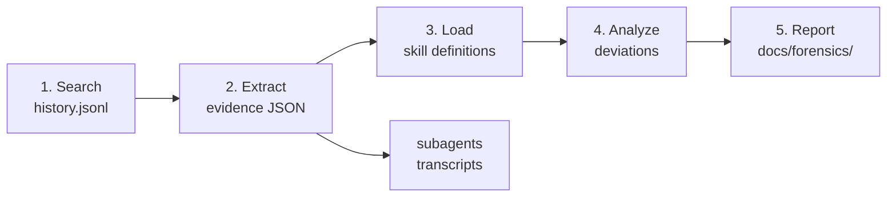

# Forensic Agent Deviation Analysis

## When to Use

**Trigger:**
- User reports a skill/agent repeatedly deviating from expected behavior
- User asks "why did the agent do X" about a past session
- User wants to compare agent behavior across sessions for a specific skill
- User provides `/forensic` command with a search term

**Skip:**
- Single-session post-mortem (use `/learn` instead)
- Current-session debugging (investigate directly)

## Parameters

| Parameter     | Default | Description                                    |
| ------------- | ------- | ---------------------------------------------- |
| `--keyword`   | —       | Search history.jsonl for sessions with keyword  |
| `--session`   | —       | Analyze a specific session ID                  |
| `--skill`     | —       | Analyze sessions that invoked a specific skill  |
| `--last`      | 20      | Limit number of sessions to search             |
| `--target`    | —       | Specific behavior to investigate (e.g. "agent ignored MAIN_SESSION flag") |

## Prerequisites

`forge` CLI must be installed with forensic subcommand (v2.15.0+). Verify:

```bash
forge forensic --help
```

If missing, build and install: `cd forge-cli && go build -o ~/.zcode-forge-cli/task ./cmd/task/`

## Architecture



## Workflow

<HARD-RULE>
After completing each workflow step, report its elapsed time in the format `[Step N: <duration>]`. This ensures the user can see progress even when analysis takes several minutes. Example output after each step:

```
[Step 1: 3.2s] Found 4 sessions matching "init-justfile"
[Step 2: 12.1s] Extracted evidence from 2 sessions (session-abc123: 8.4s, session-def456: 3.7s)
[Step 3: 0.8s] Loaded 3 skill definitions
[Step 4: 45.3s] Analyzed deviations across 2 sessions
[Step 5: 1.2s] Report written to docs/forensics/init-justfile-deviation/report.md
```
</HARD-RULE>

### Step 1: Locate Target Sessions

Search `~/.claude/history.jsonl` to find relevant sessions.

```bash
forge forensic search "coding-harness/forge" --keyword "<KEYWORD>" --last <N>
```

Or search by skill name:

```bash
forge forensic search "coding-harness/forge" --skill "<SKILL>" --last <N>
```

From the results, identify sessions of interest. Read the `firstMsg` and `dateTime` to select relevant sessions.

Present the session list to the user and confirm which sessions to analyze.

### Step 2: Extract Evidence

For each confirmed session, extract compact evidence:

```bash
# Derive JSONL path from sessionId
# Path pattern: ~/.claude/projects/<project-hash>/<sessionId>.jsonl
# Use forge forensic to discover the project path automatically, or construct it:
#   ~/.claude/projects/<project-hash>/${CLAUDE_SESSION_ID}.jsonl

mkdir -p docs/forensics/<slug>/evidence

forge forensic extract ~/.claude/projects/<project-hash>/<SESSION_ID>.jsonl --out docs/forensics/<slug>/evidence
# Or use --slug shorthand: forge forensic extract <path>.jsonl --slug <slug>
```

Then check for subagent transcripts:

```bash
forge forensic subagents ~/.claude/projects/<project-hash>/<SESSION_ID>
```

If subagents exist, extract their evidence too:

```bash
forge forensic extract <subagent-transcript-path> --out docs/forensics/<slug>/evidence
```

<HARD-RULE>
Evidence files are intermediate artifacts. Each extract produces ~10-20KB regardless of original JSONL size. Always use `--out` to write to the evidence directory — never dump raw JSONL to terminal.
</HARD-RULE>

### Step 3: Load Expected Behavior

From the evidence's `skillsUsed` field (or user's `--skill` parameter), read the relevant skill definitions:

```
${CLAUDE_SKILL_DIR}/../<skill-name>/SKILL.md
```

Extract the rules that the agent should have followed:
- `<HARD-RULE>` blocks — mandatory constraints
- `<EXTREMELY-IMPORTANT>` blocks — top-priority rules
- `<PROHIBITIONS>` blocks — forbidden actions
- Step-by-step workflow — expected behavior sequence

<HARD-RULE>
If `skillsUsed` is empty in the evidence (user messages may not always trigger skill detection), ask the user which skills were involved, or infer from the `--skill` parameter and the tool call patterns in the evidence.
</HARD-RULE>

### Step 4: Analyze Deviations

Read the extracted evidence JSON from `docs/forensics/<slug>/evidence/evidence.json`.

<EXTREMELY-IMPORTANT>
**Proactively display timing data from the evidence.** The `summary.topSlowest` and `summary.timingByTool` fields contain per-action timing. When analyzing a session where the agent appeared stuck or inactive, present the timing breakdown prominently:

```
## Timing Breakdown (session-abc123)

| Action | Duration | Detail |
|--------|----------|--------|
| Agent (doc-scorer) | 142.3s | eval-design scoring... |
| Read | 0.8s | ${CLAUDE_SKILL_DIR}/../... |
| Bash | 45.2s | go test -race -cover ./... |
| Edit | 0.3s | internal/cmd/forensic.go |

Total tool time: 188.6s / Session duration: 12.4min
```

This helps the user immediately see where the agent spent time — especially when investigating "stuck" tasks where one long-running tool call (often Agent/Bash) dominates.
</EXTREMELY-IMPORTANT>

For each session, trace through:

1. **Thinking chain** — Read each thinking block in order. Identify where reasoning diverges from the skill definition's expected workflow.
2. **Tool call sequence** — Compare the actual tool calls against what the skill steps prescribe. Flag:
   - Tools called out of prescribed order
   - Tools called that aren't in the workflow
   - Required tools that were skipped
3. **Decision points** — Where the thinking block shows a choice was made, check if the skill definition prescribes a specific choice. Flag deviations.

<HARD-RULE>
Trace the causal chain at least 3 levels deep:
1. Symptom: What went wrong (observable behavior)
2. Direct cause: Which specific action/decision caused it
3. Root cause: Why the agent made that decision (instruction gap, context missing, wrong assumption)
</HARD-RULE>

**Deviation categories** (use these to classify each finding):

| Category | Description | Example |
|----------|-------------|---------|
| `instruction-gap` | Skill definition missing a critical rule | No instruction to handle MAIN_SESSION flag |
| `context-starvation` | Agent lacked necessary information | Agent didn't see the record.json content |
| `trust-without-verify` | Agent trusted its own output | Marked AC as met without running the artifact |
| `wrong-priority` | Agent followed wrong priority | Chose "efficiency" over "safety" |
| `scope-creep` | Agent exceeded its defined scope | Task executor claimed multiple tasks |
| `pipeline-gap` | No enforcement between stages | Dispatcher checked file existence, not content |

### Step 5: Generate Report

Write the forensic report using the template at `templates/report.md`.

Output to: `docs/forensics/<slug>/report.md`

Present the report to the user. Do NOT commit automatically — forensic reports are analysis artifacts that require human review.

## Common Mistakes

- **Don't read raw JSONL files** — Always use `forge forensic extract` to compress the data. Raw JSONL is too large for analysis.
- **Don't analyze a single data point** — Cross-reference thinking blocks with the corresponding tool calls to understand the full decision chain.
- **Don't skip the skill definition** — You cannot identify deviations without knowing what the expected behavior was.
- **Don't confuse symptom with root cause** — "Agent recorded failed task as completed" is a symptom. "CLI validation accepts completed+testsFailed>0" is the root cause.
