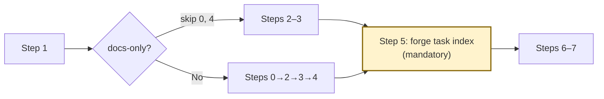

# Quick Tasks

Generate executable tasks directly from a proposal document. For features (coding tasks and doc-type tasks unlimited) that don't need PRD or tech design.

## Prerequisites

| Artifact | Missing? Run |
|----------|-------------|
| `docs/proposals/<slug>/proposal.md` | `/brainstorm` or `/quick` |

<HARD-GATE>
Maximum 6 Acceptance Criteria per task. If a task has >6 AC, its scope is too large — split further by functional boundary. No overall task count cap; task volume is bounded by proposal scope and the AC max rule.
</HARD-GATE>

## Docs-Only Fast Path

When all tasks are `type: "doc"` (non-compilable, non-runnable output), skip **Step 0** (language) and **Step 4** (test tasks). **Step 5** (`forge task index`) is always mandatory — without `index.json`, `forge task claim` fails.

**Detection**: Step 1 extracts In Scope items → if every item targets non-compilable files only, the feature is docs-only.

`doc.review` is a system-internal type (auto-generated by `forge task index`), not a user-assignable type. Do not add it to the Type Assignment table.



## Step 0: Resolve Language

1. Load Convention files from `docs/conventions/` by `domains` frontmatter (match `testing`, `go`, `typescript`, etc.). Extract language from `Framework` section.
2. Fallback: scan existing source/test files (`go.mod`, `package.json`, `*_test.go`, etc.). Also check subdirectories for monorepo.
3. On failure: ask user.

<HARD-RULE>
Do NOT silently default to any language.
</HARD-RULE>

Language info is used as context for task content (e.g., test framework selection). Test pipeline tasks are driven by the `surfaces` config field in `.forge/config.yaml`, not by language count.


## Step 1: Read Proposal

Determine the feature slug from the proposal directory name. Read `docs/proposals/<slug>/proposal.md` — the sole input document. Extract:

- **Problem** → task context and motivation
- **Proposed Solution** → task scope and boundaries
- **Scope > In Scope** → one task per bullet (split if not independently verifiable, merge if independently verifiable together)
- **Success Criteria** → acceptance criteria for each task
- **Key Risks** → implementation notes and risk mitigations

## Step 2: Derive Tasks

For each In Scope bullet: estimate effort (1-2h), derive acceptance criteria from Success Criteria, classify type (see Step 3 Template Selection), resolve surface-key/surface-type via Surface-Key/Type Inference, fill Reference Files with section-level references from proposal context.

**Split by functional steps**: multiple independently verifiable steps in one bullet → separate tasks.

**Split Rules** (applied in order of priority):

1. **Independently verifiable standard**: A bullet maps to one task if all its outcomes can be verified together in a single review pass. If outcomes require separate verification contexts (different files, different test suites, different reviewers), split into separate tasks.
2. **Multi-verb detection**: Task descriptions with connectors linking independent actions (e.g., "rename + flatten + confirm", "extract + migrate + validate") should be split by functional boundary. Each verb phrase becomes a separate task if it targets a different concern.
3. **Operational ceiling**: If a task requires modifying >8 files with the same pattern (e.g., applying identical edits across N templates/configs/modules), split by file group — group by complexity tier, feature area, or directory. Each sub-task targets ≤8 files. Detect when an In Scope bullet explicitly mentions "N files/templates/modules" and N > 8.

**Complexity判定** (assigned at task generation time):

Default heuristic based on static metrics:
- **low**: AC ≤ 3 AND no Hard Rules AND Reference Files ≤ 1
- **high**: AC ≥ 5 OR has Hard Rules
- **medium**: everything else

LLM judgment override: 如果静态指标与认知判断冲突（如 AC≤3 但涉及多文件架构变更），LLM 可根据认知判断覆盖默认 complexity 等级。Override 时须在 task Implementation Notes 中记录理由。

Set the `complexity` field in task frontmatter accordingly.

**Dependencies**: linear chain unless parallel work implied. Simple integer IDs: `1`, `2`, `3`.

**Surface-Key/Type Inference**: Use the two-layer resolution strategy:

1. **Project-level shortcut** (single-surface projects): Run `forge surfaces --json` once with no file argument. If the result is a single surface (array length 1), all tasks share that surface-key and surface-type. **Skip per-file `forge surfaces` calls entirely** — this eliminates N*M redundant CLI invocations. Set `surface-key` and `surface-type` on every task to the single surface's values.

2. **File-level query** (multi-surface projects): For each task, examine the affected file paths. Use path prefix matching against known surface directories first (from the project-level result). Only call `forge surfaces --json <file-path>` for files whose path prefix is ambiguous across surfaces. Merge results: single surface → use its key+type; mixed or no match → leave both empty.

If `forge surfaces --json` fails or returns no surfaces configured, set both fields to empty strings and continue.

**Reference Files Generation**: For each derived task, generate inline precise Reference Files instead of proposal section pointers.

1. **Inline format**: Each Reference File entry specifies a concrete file path and the specific change or requirement relevant to this task:
   ```
   - <file-path>: <specific change description or requirement excerpt>
   ```
   Example: `- quality_gate.go: tests/e2e/results/raw-output.txt 路径需替换为 GetTestResultsDir()`
2. **Source traceability**: Each inline entry should include a source trace in parentheses indicating where in the proposal this requirement originates:
   ```
   - <file-path>: <specific change description> (source: proposal.md#Section-Title)
   ```
3. **Maximum 5 entries per task**: Keep Reference Files concise. Each entry should be 1-2 lines.
4. **Coverage**: Every coding task must have ≥1 inline reference. Doc tasks follow the same standard.
5. **External documents**: If the task requires reading existing design documents (e.g., files under `docs/lessons/`, `docs/conventions/`, `docs/reference/`), include them as additional inline entries with the specific section or requirement needed.

**Example** — given a task "Add complexity field to prompt.go renderTemplate":
```markdown
## Reference Files
- forge-cli/pkg/prompt/prompt.go: renderTemplate() 需新增 {{COMPLEXITY}} 占位符替换 (source: proposal.md#Constraints-&-Dependencies)
- forge-cli/pkg/prompt/data/coding-enhancement.md: Step 1.5 段落用 <!-- IF NOT_LOW --> 标记包裹 (source: proposal.md#Proposed-Solution)
```

Replace the default Reference Files section content (`- \`docs/proposals/<slug>/proposal.md\` — Source proposal`) with the generated inline references. This is a content replacement instruction — there is no `{{REFERENCE_FILES}}` token in the template; the agent edits the `## Reference Files` section directly.

**Priority**: P0 | P1 | P2. Classified by structural role in the proposal:
- P0: implements the core mechanism (feature won't work without it) OR blocks other tasks in the dependency graph
- P1: directly maps to a core scope item or success criterion from the proposal
- P2: polish, edge cases, optional enhancements from the proposal's "Considerations" or "Future Work"

## Step 3: Create Task Files

Read the appropriate template (see Template Selection below) for the task content structure. Create one task file per derived task in `docs/features/<slug>/tasks/`.

### Task Template Placeholders

Both `templates/task.md` and `templates/task-doc.md` use the following placeholders. The agent replaces each with a value derived from the proposal context:

| Placeholder | Value Source |
|-------------|-------------|
| `{{ID}}` | Sequential integer (e.g., `1`, `2`) |
| `{{TITLE}}` | Derived from the In Scope bullet — concise imperative title |
| `{{PRIORITY}}` | P0 / P1 / P2 (see Priority below) |
| `{{ESTIMATED_TIME}}` | Effort estimate (e.g., `"1h"`, `"2h"`) |
| `{{DEPENDENCIES}}` | Comma-separated task IDs (e.g., `[1]` or `[1, 2]`); empty `[]` for first task |
| `{{SLUG}}` | Feature slug (from proposal directory name) |
| `{{DESCRIPTION}}` | Task description from Problem + Solution context |
| `{{ACCEPTANCE_CRITERIA}}` | Derived from Success Criteria as `- [ ]` checklist items |
| `{{HARD_RULES}}` | Critical constraints only; leave empty for normal tasks |
| `{{NOTES}}` | Implementation notes from Key Risks |
| `{{SURFACE_KEY}}` | Surface key from inference (coding tasks only; see Surface-Key/Type Inference below) |
| `{{SURFACE_TYPE}}` | Surface type from inference (coding tasks only) |
| `{{NEW_FILES}}` | New files to create (doc tasks only) |
| `{{MODIFIED_FILES}}` | Files to modify (doc tasks only) |
| `{{DELETED_FILES}}` | Files to delete (doc tasks only) |

<HARD-RULE>
Naming & ID conventions:
- Business task: file `<seq>-<slug>.md`, ID `<seq>` (e.g., file `1-add-command.md`, ID `1`)
- Auto-generated tasks use semantic IDs: `T-test-*`, `T-quick-doc-drift`, `T-validate-*`, `T-clean-*` (created by `forge task index`; do NOT create manually)
- No phase prefixes, no sub-IDs, no summary/gate tasks
</HARD-RULE>

For each task, fill from proposal context: Description (Problem + Solution), Acceptance Criteria (Success Criteria), Implementation Notes (Key Risks). Fill Hard Rules only for critical constraints (specific recipes, hidden env deps, scope restrictions). Set `breaking: true` for tasks modifying shared interfaces/models/APIs.

### File Scope Boundary

When a task's In Scope involves multiple files (especially batch-edit patterns), enforce write-scope boundaries to prevent directory-driven scope creep:

1. **Enumerate files explicitly**: List exact file names in Implementation Notes (e.g., "coding-feature.md, coding-enhancement.md, gate.md"). Never use vague terms like "all templates", "全部文件", "every file in the directory".
2. **Add Hard Rules for file boundaries**: When the operational ceiling rule triggers a split, add a Hard Rule to each sub-task: `仅修改以下文件：<enumerated file list>`.
3. **Rationale**: Inline Reference Files control read-scope (what the executor reads), but do not control write-scope (what the executor edits). An executor that `ls` a directory and sees all files may edit files beyond its task scope. Explicit enumeration is the only reliable write-scope boundary.

### Breaking Task Test Impact Assessment

When setting `breaking: true` on a task, the task description MUST include a test impact assessment. This ensures fix-tasks are grouped correctly by test suite (directory) rather than by problem type.

**Assessment format** (add to `## Implementation Notes`):
```
### Test Impact
- Affected test suite(s): <test directory paths>
- Expected fixture changes: <which test fixtures need updating>
- Risk level: low/medium/high
```

**Grouping rule**: fix-tasks for failures in the same test directory are merged into a single fix-task. Same directory = same task.

### Type Assignment

Every task receives a `type` field in its frontmatter. The type controls quality-gate routing.

| Type | When to assign |
|------|----------------|
| `coding.feature` | Task adds new runtime behavior, new user-facing capability, or new files |
| `coding.enhancement` | Task improves existing behavior without adding new capabilities |
| `coding.cleanup` | Task removes dead code, fixes technical debt, or improves code hygiene |
| `coding.refactor` | Task restructures code without changing behavior (rename, reorganize, extract) |
| `coding.fix` | Auto-generated for test failures via `forge task add`; do not assign manually |
| `doc` | Tasks producing only markdown, specs, or templates (non-compilable, non-runnable) |
| `doc.consolidate` | User manually creates a consolidation task for legacy projects — merging scattered spec files into `docs/business-rules/` or `docs/conventions/` |
| `doc.drift` | User manually creates a drift audit task — detecting inconsistencies between existing specs and current code |

Fallback: `coding.feature`. **Classify by output artifact, not intent.**

| Category | Types | Quality-gate |
|----------|-------|-------------|
| Code | `coding.feature`, `coding.enhancement`, `coding.cleanup`, `coding.refactor`, `coding.fix` | Run (compile + fmt + lint + test) |
| Doc | `doc`, `doc.consolidate`, `doc.drift` | Skip entirely |

How to apply:

1. Look at the **affected files** listed in the task definition.
2. If all affected files are non-compilable, non-runnable artifacts (`.md`, `.yaml`, `.json` — regardless of directory, even under `pkg/`, `src/`, `internal/`), the type **must** be `doc`.
3. If any affected file is compilable or runnable source code, use the appropriate Code type from the table above.

<HARD-RULE>
`.md` files are non-compilable regardless of directory location — even under `pkg/`, `src/`, `internal/`, or any code-style path. If a task's output is only `.md` files (e.g., prompt templates, configuration docs, skill definitions), the type **must** be `doc`, not `coding.*`. Directory path does NOT determine compilability; file extension does.
</HARD-RULE>

### Intent Propagation

If `proposal.md` frontmatter has `intent` (e.g., `intent: cleanup`), use as default type for all tasks. Individual task `type` overrides. Missing intent → per-task Type Assignment. 1:1 mapping.

### Template Selection

| Condition | Template |
|-----------|----------|
| All affected files non-compilable, non-runnable | `templates/task-doc.md` |
| Any compilable or runnable file | `templates/task.md` |

## Step 4: Test Tasks (auto-generated)

Test tasks are auto-generated by `forge task index` based on the `surfaces` field in `.forge/config.yaml`. **Do NOT create test task `.md` files manually.**

To add a fix task for a failing test: `forge task add --type coding.fix --title "Fix: <desc>" --source-task-id <TASK_ID> --block-source --var SOURCE_FILES="<paths>" --var TEST_SCRIPT="<test>" --var TEST_RESULTS="<results>" --description "<root cause>"`

## Step 5: Generate index.json via CLI

After all business task `.md` files (Step 3) are written, run:

```bash
forge task index --feature <slug>
```

This auto-generates test task `.md` files (based on `surfaces` in `.forge/config.yaml`) and `index.json` (runs validation automatically). Existing files are preserved on re-run. Quick mode uses simple integer IDs — no stage-gate files are generated.

## Step 6: Validate

```bash
forge task validate-index docs/features/<slug>/tasks/index.json
```

## Step 7: Create Manifest

Read `templates/manifest-quick.md` for the format. Write to `docs/features/<slug>/manifest.md`. Replace placeholders:

| Placeholder | Value |
|-------------|-------|
| `{{SLUG}}` | Feature slug (from proposal directory name) |
| `{{DATE}}` | Today's date in `YYYY-MM-DD` format |
| `{{TASK_ROWS}}` | One row per task: `\| <ID> \| <title> \| pending \| <ID>-<slug>.md \|` |

## Step 8: Commit Planning Artifacts

Only execute if Step 6 validation passed. If validation failed, fix issues first.

<HARD-RULE>
Stage only planning artifact paths — never use `git add -A` or `git add .`.
</HARD-RULE>

```bash
git add docs/features/<slug>/tasks/*.md docs/features/<slug>/tasks/index.json docs/features/<slug>/manifest.md
git commit -m "docs(<slug>): add quick-tasks planning artifacts"
```

Other uncommitted changes remain unstaged.

## Output Checklist

- [ ] `docs/features/<slug>/tasks/` contains task files with ≤6 AC each (coding + doc tasks unlimited)
- [ ] `index.json` valid per schema, `forge task validate-index` passes
- [ ] No stage-gate files expected (quick mode uses simple integer IDs, no `<phase>.<sub>` structure)
- [ ] Every Success Criterion covered by ≥1 task
- [ ] Dependency graph is a DAG (no cycles)
- [ ] `docs/features/<slug>/manifest.md` written with `mode: quick`
- [ ] Planning artifacts committed (task .md files, index.json, manifest.md)

## Integration

- `/brainstorm` → generate proposal before quick-tasks
- `/quick` → full pipeline: brainstorm → quick-tasks → run-tasks
- `/run-tasks` → execute generated tasks
