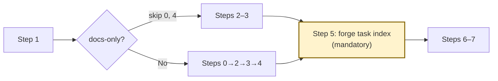

# Quick Tasks

Generate executable tasks directly from a proposal document. For features (1-10 tasks) that don't need PRD or tech design.

## Prerequisites

| Artifact | Missing? Run |
|----------|-------------|
| `docs/proposals/<slug>/proposal.md` | `/brainstorm` or `/quick` |

<HARD-GATE>
Maximum 10 business tasks. If the proposal requires more, STOP and recommend the full pipeline: `/write-prd` → `/tech-design` → `/breakdown-tasks`.
</HARD-GATE>

## Docs-Only Fast Path

When all tasks are `type: "documentation"` (non-compilable output), skip **Step 0** (language) and **Step 4** (test tasks). **Step 5** (`forge task index`) is always mandatory — without `index.json`, `forge task claim` fails.

**Detection**: Step 1 extracts In Scope items → if every item targets non-compilable files only, the feature is docs-only.



## Step 0: Resolve Language

1. **Detect language**: Run `forge test detect` to auto-detect the project's test language(s) from file signals.
2. **On failure** (no language detected): ask the user to add `languages` to `.forge/config.yaml` (e.g., `languages: [go]`).

<HARD-RULE>
Do NOT silently default to any language. If `forge test detect` returns no result and the user cannot configure `languages`, abort the skill.
</HARD-RULE>

**Language resolution outcome**:
- **Single language**: one detected language (default behavior, no per-language suffixing needed)
- **Multiple languages**: two or more detected languages (triggers per-language task suffixing in Step 4)


## Step 1: Read Proposal

Determine the feature slug from the proposal directory name. Read `docs/proposals/<slug>/proposal.md` — the sole input document. Extract:

- **Problem** → task context and motivation
- **Proposed Solution** → task scope and boundaries
- **Scope > In Scope** → one task per bullet (split if >2h, merge if <30min)
- **Success Criteria** → acceptance criteria for each task
- **Key Risks** → implementation notes and risk mitigations

<HARD-RULE>
Enforce maximum 10 business tasks. If the In Scope section implies >10 tasks, STOP and recommend the full pipeline (`/write-prd` → `/tech-design` → `/breakdown-tasks`).
</HARD-RULE>

## Step 2: Derive Tasks

For each In Scope bullet: estimate effort (1-2h), derive acceptance criteria from Success Criteria, classify type (see Step 3 Template Selection), set scope via Scope Inference, fill Reference Files with directory paths from proposal context.

**Split by functional steps**: multiple independently verifiable steps in one bullet → separate tasks (total still ≤ 10).

**Dependencies**: linear chain unless parallel work implied. Simple integer IDs: `1`, `2`, `3`.

**Scope Inference** (from task description semantics): UI/pages/components → `scope: "frontend"`, API/server/database/CLI → `scope: "backend"`, mixed/unclear → `scope: "all"`.

## Step 3: Create Task Files

Read the appropriate template (see Template Selection below) for the task content structure. Create one task file per derived task in `docs/features/<slug>/tasks/`.

<HARD-RULE>
Naming & ID conventions:
- Business task: file `<seq>-<slug>.md`, ID `<seq>` (e.g., file `1-add-command.md`, ID `1`)
- Quick test: file `quick-<name>.md`, ID `T-quick-<N>`
- No phase prefixes, no sub-IDs, no summary/gate tasks
</HARD-RULE>

For each task, fill from proposal context: Description (Problem + Solution), Acceptance Criteria (Success Criteria), Implementation Notes (Key Risks). Fill Hard Rules only for critical constraints (specific recipes, hidden env deps, scope restrictions). Set `breaking: true` for tasks modifying shared interfaces/models/APIs.

### Type Assignment

Every task receives a `type` field in its frontmatter. The type controls which executor template the dispatcher selects:

| Type | When to assign |
|------|----------------|
| `feature` | Task adds new runtime behavior, new user-facing capability, or new files |
| `enhancement` | Task improves existing behavior (performance, UX, edge-case handling) without adding new capabilities |
| `cleanup` | Task removes dead code, fixes technical debt, or improves code hygiene |
| `refactor` | Task restructures code without changing behavior (rename, reorganize, extract) |
| `documentation` | Tasks producing only markdown, specs, or templates (non-compilable, non-runnable) |
| `gate` | Quality-gate or stage-gate verification tasks |

Unrecognized or ambiguous tasks fall back to `feature`.

Test pipeline tasks are auto-generated by `forge task index`.

**Rule: classify by output artifact, not by intent.** The type determines quality-gate behavior. Quality-gate (compile, fmt, lint, test) only makes sense for compilable or runnable output. Therefore, the decisive factor is *what the task produces*, not *what the task intends to accomplish*.

| Category | Types | Quality-gate |
|----------|-------|-------------|
| Code | `feature`, `enhancement`, `cleanup`, `refactor`, `fix` | Run (compile + fmt + lint + test) |
| Doc | `documentation` | Skip entirely |
| Meta | `gate` | Special handling |

How to apply:

1. Look at the **affected files** listed in the task definition.
2. If all affected files are non-compilable, non-runnable artifacts (`.md`, `.yaml`, `.json` under `skills/`, `docs/`, etc.), the type **must** be `documentation`.
3. If any affected file is compilable or runnable source code, use the appropriate Code type from the table above.

### Intent Propagation

The proposal frontmatter may contain an `intent` field (e.g., `intent: cleanup`). When present, use it as the **default type** for all tasks in this feature:

1. Read `proposal.md` frontmatter → extract `intent` value
2. If `intent` is set and matches a valid type constant (`feature`, `enhancement`, `cleanup`, `refactor`) → use it as the default `type` for all business tasks
3. Individual task frontmatter `type` field **overrides** the proposal intent — use it when the task's primary output differs from the feature's dominant intent
4. If `intent` is empty or missing → fall back to per-task Type Assignment from the table above

The mapping is 1:1: proposal intent values use the same names as task type constants.

### Template Selection

Choose the task template based on task description:

| Condition | Template |
|-----------|----------|
| Task produces only documentation, specs, or templates (non-compilable, non-runnable) | `templates/task-doc.md` (type: `"documentation"`) |
| Task modifies or creates source code, build configs, or runtime configs | `templates/task.md` (type: `"feature"` by default, override via per-task Type Assignment) |

## Step 4: Test Tasks (auto-generated)

Test tasks are auto-generated by `forge task index` based on the languages resolved in Step 0. **Do NOT create test task `.md` files manually.**

To add a fix task for a failing test: `forge task add --template fix-task --title "Fix: <desc>" --source-task-id <id> --block-source --var SOURCE_FILES="<paths>" --var TEST_SCRIPT="<test>" --var TEST_RESULTS="<results>" --description "<root cause>"`

## Step 5: Generate index.json via CLI

After all business task `.md` files (Step 3) are written, run:

```bash
forge task index --feature <slug>
```

This auto-generates stage-gate files, test task `.md` files, and `index.json` (runs validation automatically). Existing files are preserved on re-run.

If the language was not detected in Step 0, pass it explicitly: `forge task index --feature <slug> --languages <l1>,<l2>`.

## Step 6: Create Manifest

Read `templates/manifest-quick.md` for the format. Write to `docs/features/<slug>/manifest.md`.

## Step 7: Validate

```bash
forge task validate-index docs/features/<slug>/tasks/index.json
```

## Output Checklist

- [ ] `docs/features/<slug>/tasks/` contains 1-10 business task files
- [ ] `index.json` valid per schema, `forge task validate-index` passes
- [ ] Stage-gate files (`.summary.md`, `.gate.md`) auto-generated by `forge task index` for phases with >=2 business tasks (if using `<phase>.<sub>` IDs)
- [ ] Every Success Criterion covered by ≥1 task
- [ ] Dependency graph is a DAG (no cycles)
- [ ] `docs/features/<slug>/manifest.md` written with `mode: quick`

## Integration

- `/brainstorm` → generate proposal before quick-tasks
- `/quick` → full pipeline: brainstorm → quick-tasks → run-tasks
- `/run-tasks` → execute generated tasks
