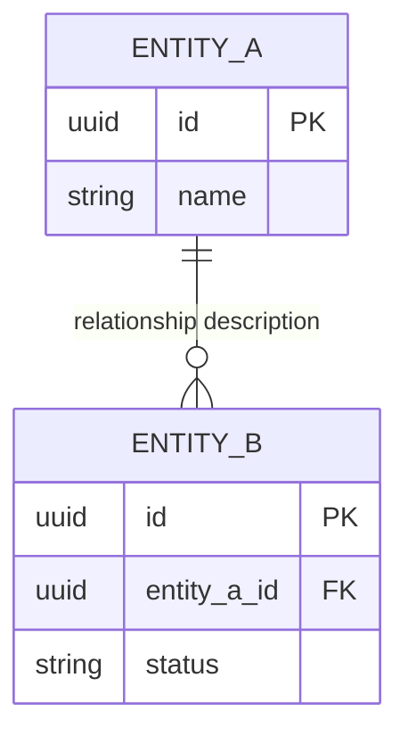

# ER Diagram: {{FEATURE_NAME}}

## Entity Relationships

<!-- Use [NEW] / [MODIFIED] labels on entity names to indicate change type. -->

## Entity Details

### ENTITY_A [NEW]

| Column | Type | Constraints | Description |
|--------|------|-------------|-------------|
| id | UUID | PK, NOT NULL, DEFAULT gen_random_uuid() | Primary key |
| name | VARCHAR(255) | NOT NULL | Display name |
| created_at | TIMESTAMPTZ | NOT NULL, DEFAULT now() | Creation timestamp |
| updated_at | TIMESTAMPTZ | NOT NULL, DEFAULT now() | Last update timestamp |

<!-- Repeat ### section for each entity. Use [NEW] for new tables, [MODIFIED] for altered tables. -->

## Index Design

| Table | Index Name | Columns | Type | Description |
|-------|------------|---------|------|-------------|
| ENTITY_B | idx_entity_b_entity_a_id | entity_a_id | B-tree | FK lookup performance |
| ENTITY_B | idx_entity_b_status | status | B-tree | Status filter queries |

## Relationships

| From | To | Cardinality | Business Meaning |
|------|----|-------------|------------------|
| ENTITY_A | ENTITY_B | one-to-many | "Entity A owns multiple Entity B records" |

## Change Impact Analysis

<!-- Required when any table is [MODIFIED]. Skip if all tables are [NEW]. -->

| Changed Table | Change Type | Affected Columns | Data Migration Needed | Backward Compatible |
|---------------|-------------|------------------|-----------------------|---------------------|
| existing_table | ADD COLUMN | new_column | No | Yes |
