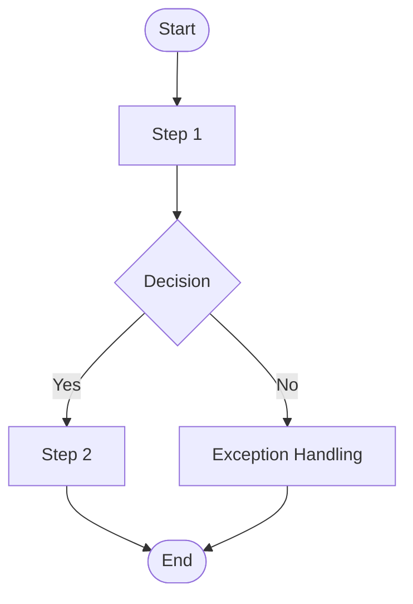

# {{FEATURE_NAME}} — PRD Spec

> PRD Spec: defines WHAT the feature is and why it exists.

## Background

### Why (Reason)
<!-- Describe the root cause that triggered this requirement -->

### What (Target)
<!-- Describe the functionality or system to be implemented -->

### Who (Users)
<!-- Describe the target user roles -->

<!-- Example: Currently, unreachable delivery areas are configured only at the courier-type level, but each business system has its own special needs — a courier service may be reachable in general, yet a business system may designate it as unreachable based on its own business scenario. Therefore, a per-business-system unreachable area configuration is needed. -->

## Goals

<!-- Goals or benefits, quantified wherever possible -->

| Goal | Metric | Notes |
|------|--------|-------|
| <!-- Goal 1 --> | <!-- e.g., efficiency improvement 10% --> | <!-- Notes --> |
| <!-- Goal 2 --> | <!-- --> | <!-- --> |

## Scope

### In Scope
- [ ] <!-- Feature point 1 -->
- [ ] <!-- Feature point 2 -->

### Out of Scope
- <!-- Excluded item 1 -->
- <!-- Excluded item 2 -->

## Flow Description

### Business Flow Description

<!-- Detailed description of each step and state transition in the business flow -->
<!-- Include: main business flow steps, key decision points and branching logic, exception handling flow, state machine transitions -->

### Business Flow Diagram

> **Required**: Use Mermaid to draw the business flow diagram. Text-only descriptions are not acceptable.

<!-- The flow diagram must include: complete main flow path, key decision points (diamond nodes), exception branches, user interaction nodes -->

### Data Flow Description

<!-- Required for multi-system interaction; remove this section for single-system scenarios -->

| Data Flow ID | Source System | Target System | Data Content | Transport | Frequency | Format | Notes |
|-----------|--------|----------|----------|----------|------|------|------|
| DF001 | <!-- --> | <!-- --> | <!-- --> | <!-- REST API / Message Queue --> | <!-- --> | <!-- JSON / XML --> | <!-- --> |

## Functional Specs

<!-- Select applicable subsections below, remove inapplicable ones -->

### 5.1 List Page

<!-- (1) List data source -->
**Data Source**: <!-- Describe where the list page data comes from -->

<!-- (2) List display scope -->
**Display Scope**: <!-- Describe whether all or partial data is shown -->

<!-- (3) List data permissions -->
**Data Permissions**: <!-- Describe whether data access is differentiated -->

<!-- (4) List sorting -->
**Sort Order**: <!-- Default sort method -->

<!-- (5) List pagination -->
**Pagination**: <!-- Pagination parameters, default page size -->

<!-- (5.5) Page type (required for prototype generation) -->
**Page Type**: List page / Detail page / Form page / Dashboard

<!-- (5.6) Sample data (required for prototype generation, 3-5 rows) -->
**Sample Data**:

| <!-- Column 1 --> | <!-- Column 2 --> | <!-- Column 3 --> | <!-- Column 4 --> |
|---------|------|------|--------|
| <!-- --> | <!-- --> | <!-- --> | <!-- --> |
| <!-- --> | <!-- --> | <!-- --> | <!-- --> |
| <!-- --> | <!-- --> | <!-- --> | <!-- --> |

<!-- (5.7) Status business description (if custom status values exist) -->
**Status Description**:

| Status Value | Display Text | Business Meaning |
|--------|----------|----------|
| <!-- --> | <!-- --> | <!-- --> |

<!-- (6) List page fields -->
**List Fields** (choose quick mode or detailed mode as needed):

<!-- Quick mode (simple fields) -->
| Field Name | Type | Description |
|---------|------|------|
| <!-- --> | <!-- string/number/datetime --> | <!-- --> |

<!-- Detailed mode (complex fields) -->
<!-- | # | Field Name | Example Value | Value Description | Notes | -->
<!-- |------|----------|----------|----------|------| -->

<!-- (7) Search criteria -->
**Search Criteria**:

| # | Search Field | Control Type | Description | Default Placeholder |
|------|--------|----------|------|----------|
| 1 | <!-- --> | <!-- Dropdown / Input / Date --> | <!-- --> | <!-- --> |

### 5.2 Button Actions

<!-- (1) Button permissions -->
**Permission Control**: <!-- Whether buttons require permission control -->

<!-- (2) Button state conditions (required for buttons dependent on preconditions) -->
**State Conditions**:

| State | Condition | Style |
|------|------|------|
| Disabled (default) | <!-- --> | Grey, non-clickable, hover shows tooltip |
| Enabled | <!-- --> | Primary button style |

<!-- (3) Button click validation -->
**Validation Rules**:

| # | Button Name | Validation Condition | Error Message | Message Style & Position |
|------|----------|----------|----------|----------------|
| 1 | <!-- --> | <!-- --> | <!-- --> | <!-- --> |

<!-- (4) Button click data logic -->
**Data Processing Logic**:

| # | Button Name | Detailed description of post-submission data processing |
|------|----------|------------------------|
| 1 | <!-- --> | <!-- --> |

### 5.3 Create/Edit Form

<!-- (1) Form field description -->
**Form Fields** (choose quick mode or detailed mode as needed):

<!-- Quick mode -->
| Field Name | Control Type | Required | Max Length | Rules |
|---------|----------|------|----------|----------|
| <!-- --> | <!-- Text / Dropdown / Date --> | Yes/No | <!-- --> | <!-- --> |

<!-- Detailed mode -->
<!-- | # | Field Name | Control Type | Required | Max Length | Default | Rules | -->

<!-- (2) Form validation rules -->
**Validation Rules**:

| # | Validation Condition | Trigger Point | Error Message | Message Style & Position |
|------|----------|----------|--------|----------------|
| 1 | <!-- --> | <!-- Blur / Submit --> | <!-- --> | <!-- --> |

### 5.4 Related Changes

<!-- Fill this section if changes affect other modules/systems -->

| # | Project | Module | Change Point | Updated Logic |
|------|----------|----------|------------|----------------|
| 1 | <!-- --> | <!-- --> | <!-- --> | <!-- --> |

## Other Notes

### Performance Requirements
- Response time: <!-- -->
- Concurrency: <!-- -->
- Data storage: <!-- -->
- Compatibility: <!-- Browsers, resolutions, mobile devices -->

### Data Requirements
- Data tracking: <!-- -->
- Data initialization: <!-- -->
- Data migration: <!-- -->

### Monitoring Requirements
- <!-- API or service monitoring, alerting mechanisms -->

### Security Requirements
- Transport encryption: <!-- -->
- Storage encryption: <!-- -->
- Display masking: <!-- -->
- Rate limiting: <!-- -->

---

## Quality Checklist

- [ ] Is the requirement title accurate and descriptive
- [ ] Does the background include all three elements: reason, target, users
- [ ] Are the goals quantified
- [ ] Is the flow description complete
- [ ] Does the business flow diagram exist (Mermaid format)
- [ ] Is the list page description complete (data source / display scope / permissions / sorting / pagination / fields / search)
- [ ] Are button actions described completely (permissions / states / validation / data logic)
- [ ] Are form descriptions complete (fields / validation rules)
- [ ] Are related changes thoroughly analyzed
- [ ] Are non-functional requirements considered (performance / data / monitoring / security)
- [ ] Are all tables filled completely
- [ ] Is there any ambiguous or vague wording
- [ ] Is the spec actionable and verifiable
