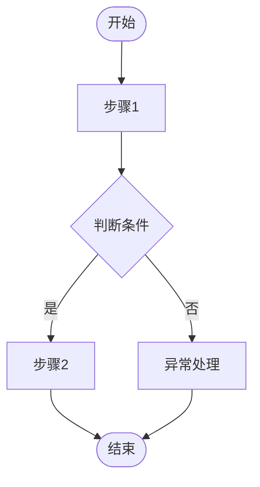

# {{FEATURE_NAME}} — PRD Spec

> PRD Spec: defines WHAT the feature is and why it exists.

## 需求背景

### 为什么做（原因）
<!-- 描述需求产生的根本原因 -->

### 要做什么（对象）
<!-- 描述需要实现的功能或系统 -->

### 用户是谁（人员）
<!-- 描述目标用户角色 -->

<!-- 示例：目前快递不可达地区仅是在快递类型维度进行统一配置，但是各业务系统存在自己的特殊需要，即快递服务本身可达，但是各业务系统会基于自己的业务场景设定不可达，因此需要增加基于业务系统维度配置不可达区域的功能。 -->

## 需求目标

<!-- 需求目标或收益，尽可能量化 -->

| 目标 | 量化指标 | 说明 |
|------|----------|------|
| <!-- 目标1 --> | <!-- 如：效率提升10% --> | <!-- 说明 --> |
| <!-- 目标2 --> | <!-- --> | <!-- --> |

## Scope

### In Scope
- [ ] <!-- 功能点 1 -->
- [ ] <!-- 功能点 2 -->

### Out of Scope
- <!-- 不包含的内容 1 -->
- <!-- 不包含的内容 2 -->

## 流程说明

### 业务流程说明

<!-- 详细描述业务流程的各个环节和状态转换 -->
<!-- 包含：主要业务流程步骤、关键决策点和分支逻辑、异常处理流程、状态机转换说明 -->

### 业务流程图

> **必填**：使用 Mermaid 绘制业务流程图，不允许仅用文字描述。

<!-- 流程图必须包含：完整主流程路径、关键决策点（菱形判断节点）、异常分支、用户交互节点 -->

### 数据流说明

<!-- 多系统交互时必填，单系统可删除此节 -->

| 数据流编号 | 源系统 | 目标系统 | 数据内容 | 传输方式 | 频率 | 格式 | 备注 |
|-----------|--------|----------|----------|----------|------|------|------|
| DF001 | <!-- --> | <!-- --> | <!-- --> | <!-- REST API/消息队列 --> | <!-- --> | <!-- JSON/XML --> | <!-- --> |

## 功能描述

<!-- 根据实际功能选择以下适用的子节，删除不适用的部分 -->

### 5.1 列表页

<!-- (1) 列表数据来源 -->
**数据来源**：<!-- 描述列表页数据的来源 -->

<!-- (2) 列表显示范围 -->
**显示范围**：<!-- 描述显示的是全部数据还是部分数据 -->

<!-- (3) 列表数据权限 -->
**数据权限**：<!-- 描述是否区分数据权限 -->

<!-- (4) 列表排序 -->
**排序方式**：<!-- 默认排序方式 -->

<!-- (5) 列表翻页 -->
**翻页设置**：<!-- 翻页参数，默认每页条数 -->

<!-- (5.5) 页面类型（面向原型生成必填） -->
**页面类型**：列表页 / 详情页 / 表单页 / 仪表盘

<!-- (5.6) 示例数据（面向原型生成必填，3-5行） -->
**示例数据**：

| <!-- 列1 --> | <!-- 列2 --> | <!-- 列3 --> | <!-- 列4 --> |
|---------|------|------|--------|
| <!-- --> | <!-- --> | <!-- --> | <!-- --> |
| <!-- --> | <!-- --> | <!-- --> | <!-- --> |
| <!-- --> | <!-- --> | <!-- --> | <!-- --> |

<!-- (5.7) 状态业务说明（如有自定义状态值） -->
**状态说明**：

| 状态值 | 显示文本 | 业务含义 |
|--------|----------|----------|
| <!-- --> | <!-- --> | <!-- --> |

<!-- (6) 列表页字段 -->
**列表字段**（快速模式 / 详细模式按需选择）：

<!-- 快速模式（简单字段） -->
| 字段名称 | 类型 | 说明 |
|---------|------|------|
| <!-- --> | <!-- string/number/datetime --> | <!-- --> |

<!-- 详细模式（复杂字段） -->
<!-- | 序号 | 字段名称 | 取值示例 | 取值说明 | 备注 | -->
<!-- |------|----------|----------|----------|------| -->

<!-- (7) 搜索条件 -->
**搜索条件**：

| 序号 | 搜索项 | 控件类型 | 说明 | 默认提示 |
|------|--------|----------|------|----------|
| 1 | <!-- --> | <!-- 下拉单选/输入框/日期 --> | <!-- --> | <!-- --> |

### 5.2 按钮操作

<!-- (1) 按钮权限 -->
**权限控制**：<!-- 按钮是否需要权限控制 -->

<!-- (2) 按钮状态条件（依赖前置条件的按钮必须填写） -->
**状态条件**：

| 状态 | 条件 | 样式 |
|------|------|------|
| 禁用（默认） | <!-- --> | 灰色不可点击，鼠标悬停显示 Tooltip |
| 启用 | <!-- --> | 主按钮样式 |

<!-- (3) 按钮点击校验 -->
**校验规则**：

| 序号 | 按钮名称 | 校验条件 | 错误提示 | 提示方式及位置 |
|------|----------|----------|----------|----------------|
| 1 | <!-- --> | <!-- --> | <!-- --> | <!-- --> |

<!-- (4) 按钮点击后数据逻辑 -->
**数据处理逻辑**：

| 序号 | 按钮名称 | 提交后的数据处理详细描述 |
|------|----------|------------------------|
| 1 | <!-- --> | <!-- --> |

### 5.3 新增/编辑表单

<!-- (1) 表单字段说明 -->
**表单字段**（快速模式 / 详细模式按需选择）：

<!-- 快速模式 -->
| 字段名称 | 控件类型 | 必填 | 字符长度 | 规则说明 |
|---------|----------|------|----------|----------|
| <!-- --> | <!-- 单行文本/下拉选择/日期 --> | 是/否 | <!-- --> | <!-- --> |

<!-- 详细模式 -->
<!-- | 序号 | 字段名称 | 控件类型 | 是否必填 | 字符长度 | 默认值 | 规则说明 | -->

<!-- (2) 表单校验规则 -->
**校验规则**：

| 序号 | 校验条件 | 触发节点 | 提示语 | 提示方式及位置 |
|------|----------|----------|--------|----------------|
| 1 | <!-- --> | <!-- 失焦/提交 --> | <!-- --> | <!-- --> |

### 5.4 关联性需求改动

<!-- 如有涉及其他模块/系统的关联改动，填写此节 -->

| 序号 | 涉及项目 | 功能模块 | 关联改动点 | 更改后逻辑说明 |
|------|----------|----------|------------|----------------|
| 1 | <!-- --> | <!-- --> | <!-- --> | <!-- --> |

## 其他说明

### 性能需求
- 响应时间：<!-- -->
- 并发量：<!-- -->
- 数据存储量：<!-- -->
- 兼容性：<!-- 浏览器、分辨率、移动设备 -->

### 数据需求
- 数据埋点：<!-- -->
- 数据初始化：<!-- -->
- 数据迁移：<!-- -->

### 监控需求
- <!-- 接口或服务监控，报警机制 -->

### 安全性需求
- 传输加密：<!-- -->
- 存储加密：<!-- -->
- 显示加密：<!-- -->
- 接口限制：<!-- -->

---

## 质量检查

- [ ] 需求标题是否概括准确
- [ ] 需求背景是否包含原因、对象、人员三要素
- [ ] 需求目标是否量化
- [ ] 流程说明是否完整
- [ ] 业务流程图是否包含（Mermaid 格式）
- [ ] 列表页描述是否完整（数据来源/显示范围/权限/排序/翻页/字段/搜索）
- [ ] 按钮描述是否完整（权限/状态/校验/数据逻辑）
- [ ] 表单描述是否完整（字段/校验规则）
- [ ] 关联性需求是否全面分析
- [ ] 非功能性需求（性能/数据/监控/安全）是否考虑
- [ ] 所有表格是否填写完整
- [ ] 是否有歧义或模糊表述
- [ ] 是否可执行、可验收
